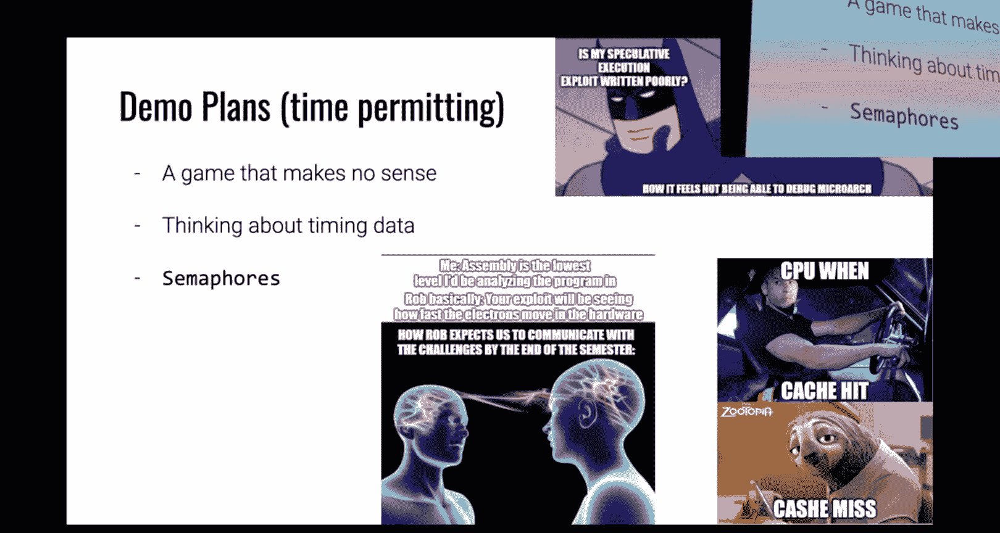
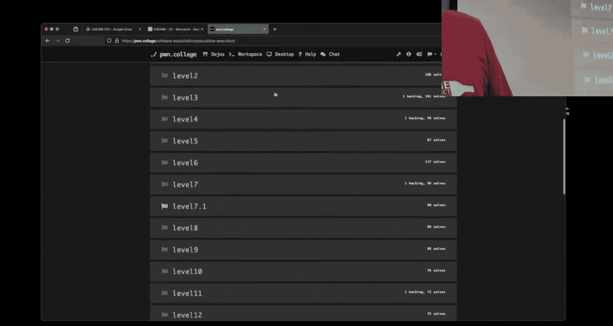

# ASU《计算机系统安全｜ASU CSE466 Computer Systems Security 2024》中英字幕deepseek p25 -26-Microarchitecture Exploitation - CSE466 - Robert - 2024.11.19.zh_en -BV1spCGYZE9D_p25-

What happens？

All right， sorry for being a little bit late here。Traffic was I left early， traffic was just crazy。

It was quite the accident on the 101 All， so today is I think it be November so November 19，2024。

 we here at CSE 466 at ASU and we are finally getting to a module that like。

A lot of people say a lot of things about and I'm curious to see what you guys say about it because this is the first time we've kind of thrown this topic at undergrads。

 so it'll be interesting to see。😡，Memes we just wrapped up criminal security there were kind of a few takeaways hopefully you guys agreedd this was like a one week module there wasn't anything like too crazy like there was some weird stuff but you were still using the same like core skills that you've used this entire semester one of the things that was definitely a trap was if you were using a buffered writer and you didn't realize what buffered writers or buffered readers are you may not get to behavior that you want because the actual bytes were not going from A to B when you thought they'd order。

😡，This one is kind of a perennial classic you got to see me do it like four or five times on stream and it happened to probably everyone here when they want to admit it or not you'll mess up and fail to connect to the VM some of the micro challenges do require the VM so you'll probably do this again in this module。

😡，But this meme is awesome All right， Oh no， and that's not the one I was thinking of。

 it's still a good meme， but it's not the meme I was thinking of。I said， oh no。Yeah。

Technology is failing in brand new way。But the kernel module could get wrapped up in like kind of summarized in one of two techniques depending upon how you wanted to go with it。

 there was an intended solution， the intended solution used a variety of techniques however if you found one and you're like I'm just going rock that for the whole module that's perfectly fine you could have either elevated permissions and can't def flag or used run command that means a good I haven't seen that one before you run command today then just kind of do whatever you wanted and since you are in the kernel when you used run command it doesn't matter what your credstruct is。

😡，I just realized something good。No random pops course schedule so we are almost done were on the far side here we got micro arch and then one more。

😡，啊。I'm pretty glad we've made it through this at this pace， you guys are awesome。

So there's only two modules left this。Yes is the awesome meme instead of commit creds prepare kernel creds we commit extra cred prepare meme cred which is an awesome meme I get it and thats that's totally fair right I think we're keeping in mind I believe both of these are three six5 mes but every once in a while they do produce a ban right out of the giant mess。

There's only two modules left okay， there's this one and one more you're almost to the other side。

Think。You know you can make it and if and this typically happens we get to the final module or you work on this one and you're just like man I got something else I want to do I got cap filled I got something else the extra credit existed for a reason I told you that beginning of the semester maybe this module the next one you just say hey man i'm good right I got this extra credit I posted by memes I'm going cash out on that and that's totally fair to I understand it as a student obviously I wish everyone would complete every challenge but you don't have to that's part of the course to something。

😡。

We are at micro architecture exploitation， so some people you know talked it up， I've talked it up。

 I've moved some the Ts have talked it up， people who have looked at it or haven't looked at it。

 you know they're like， hey， I'm not going to。Not going to go see nature here for some time。

HowOnce this launches。This one got me I don't know who pushed that one that but that one got me a good laugh。

All right， I'll come Rob， let's level seven have two challenges。This is the， I think third， third。

 maybe fourth fourth time this material has been taught originally when level seven launched。

So there there's。Well originally when level7 launched there was an unintended solution and this has to do with how。

How badly people will do like naive brute force things okay。

 and sometimes it's cool and sometimes I'm just like no that like。

Irrriitates me to no end and rather than recreating the challenge。😡，And saying， no。

 I'm going to rebuild this binary and half the class gets it and half the class doesn't。

What I did was I fixed whatever that issue was and then。Made at 7。1 so 7。

0 has something that's chable 7。1 doesn't if you tackle 7。

1 first you can solve them both and you'll use the intent same intended code。😡。

If you're trying to hyper optimize here。Just just student things I think both of these are 365 memes but they're good human brain lizard brain should I watch all of the lecture videos and figure out how things work no man just just effort we all will just ask random things on the discord and then similarly there I think they're working on binary exploitation right now。

😡，You know，Should I just repeatedly try and bash my head against the wall here figuring out what's going on or should I watch the lecture videos？

😡，For those that have seen the micro arch videos， they are exceptionally， I'll say helpful。

 like I have repeatedly now told myself I'm going to rerecord them and I haven't。😡。

So how did kernel security go？I'm pretty happy with that。Hopefully you're pretty happy with that。

Course grade。With extra credit， I remember 100% right here， so we are definitely on the。

good side of the old bell curve。This is more so for 365 students that don't watch this stream。

 but this was another banger out of 365 guys all right。

 they made their own Spotify playlist as a form of begging the instructors that's the item Conorney brokers of this iteration of 365。

To beg for extra credit if you read the titles。Are not extra， they're begging for a curve。

Functionally， it's extra credit。They're having a hard time over there。

But 3365 instructorors a bit more grateful or forgiving to me right I told you how things were going go from the outset and then stuck to it and so those of you that have survived。

 you know， you've learned a lot， but I know it has been easy。Logal things， Thanksgiving break is。

 I think next week， Thursday。I plan on unpluing from the matrix。

 which means I will not be on Discord， I will not be entering email。

 I'd love to tell myself I'm not going to look at a screen。

 but that is probably a lie I'm certainly going to try and explore all communications。😡。

If you do have anything like that you need to service about this course。

 please reach out to me via Discord email， whatever do it now the end of the semester tends to get crazy for students the end of the semester is also crazy for instructors it's crazy for research projects it's crazy for everyone if you wait until the very last minute and grades have to get posted and there's something you want to bring up or deal with and you didn't that makes pain for everyone and things do get lost in the sauce this isn't specific to me it is something that is generally good for any class now is the time to deal with anything that you are unsure of across the semester before instructors kind of get into crazy mode wrapping things up。

😡，There is going to be an additional 1% extra credit opportunity sometime between now and the end of the semester。

 sometime the next week or so I am going to send out a Google survey， this is from me not from ASU。

 you will get your own ASU on where you can say I did grade I did awesome you know that kind ofines how I did but this is I'm going to send out my own survey I do this most courses that I teach the questions that I'm focusing on in course structures like this classroom the idea of prerecorded lectures answering things like in class challenge design I what modules were hard。

 what modules were easy， what things were unclear what we could do to improve the course material as well as just me and individually how did I do I'd love to tell you that this is going to be anonymous but if I'm going to give you extra credit for filling it out I kind of have to know who you are it doesn't mean you have to say nice things right like the grade is the grade that's all automated so so feel free to be mean。

😡，But hopefully you make it constructive because I do change what I do in class every iteration based upon student feedback。

 it also helps us helps inform us of where to put forth effort to improve this material in the future。

😡，All right， demo plans， unless you guys have something in particular。

 every time that I talk about microcro arch I there's this like cool demo I like to show。

 it's this like sweet game that makes no sense when we start looking at the code。😡。

We'll see if it works。Because as I mentioned on。どうしたまんでまんで。

If you were trying to do microarch stuff on Monday you were probably going have bad time this these type of exploits are exploiting the literal hardware that is running on the dojo if the Dojo is really really busy you're going to have a very hard time getting accurate data and so this is something where。

😡，365， like being active or there being a lot of users will impact whether your ex works or not。

And then I want to talk a little bit about thinking about timing data and semaphos for whatever reason people sometimes don't know understand how semaphos work the first I believe five challenges are kind of weird as far as what they do they describe what they do but the point is for you to mess around with writing a。

😡，Micro architectureure， like side channel attack， not fighting semaphores and my amazing code。😡。

So we'll hopefully take a look at that as well。Anyone have anything in particular。

 you want to hit on micro arch or we just going to cruise？Yeah'm stuck good respect the first one。

 let's let's cruise。 I like it All right we got this in this module just something keep them mind this module two weeks so we got plenty of time to cover additional things right we've been at that one weekek pace we got two weeks here if I don't hit all this it's perfectly fine We have two weeks for me to cover everything but there are a lot of things to cover right so this is gonna be about typing data think but the cache reasoning about things Thursday will probably touch on like Specter and out of order execution how that type of stuff works And then next week we'll take a look at melt because these are related related things and the sense that they're all micro architectitectural side channels and how they can be used but they are kind of different so I'm going to approach them in the same order that the challenges present them。

😊。

All right。And Twitch gets nothing， maybe there's just no stream。We shall connect to the old Dojo。

Okay。So。If I go。Ento this respect game。There's。2。Two binaries。

 there's one that's called a game and there's one that's called a controller。😡。

I'm going to on the left hand side， run our game。It says configured cache threshold to some number and then it says connect the controller to SHM port one。

 it's just instructing me what to do over here on the controller。

 I need to specify the indicator for what shared memory to attach to。So I'm going to run。

 you probably can't see it over there， and we'll run it over here。Controller one。Okay，ug。

 it's not very interesting if you can't see there's a little O down here。Now。

 if you aren't familiar with Tmx， you'll notice that I am in the bottom right pane。

 I'm over here in controller land， that's why it's green。

I'm going to hit this this is a spicy life demo， let's see D， all right。

 I hit D on the on the controller， it says right and our little guy goes to the right right。

 we got our old。FPS， let's see if W works earlier today， W didn't work W。

WW is not a happy but all right。A， right， okay， okay， right up， down up。There up。Okay。

 so up and down are kind of kind of not working here， okay？And you might think， well。

 this is my fault， it's not my original demo says somebody else made this and I'm sure it was inspired by something that was with open source。

😡，up and down isn't working， but I got left and right。Now in this class。

 we've talked about a number of。Like IPc or ways to communicate between processes right these are two different processes。

 you all agree。😡，So what way could I be communicating here。

 like if you were to write this what would you do？想。Good。Something about a server and nethead。

 so this could be going over TCP。Okay。They could be going over the network。

It's not how else could I communicate between these two processes？Shared memory， Okay。

 I could do shared memory and it does make sense I do shared memory， the thing asked for or。

 you know， this shared memory。Co， what would you do with that shared memory？

I really ask the left guy read it right to change it Okay。

 so the stage was I that this game guy is going to read somewhere in shared memory and then the one on the right is going to be right into that shared memory。

Okay， that that's that's something I could do or there's one more thing I could be doing I'm not I was just curious if you guys know it or like we throw it at it's something else we've used in this class pretty expensively。

Next。Message， what's a message？屌。Okay， so I I'm gonna proxy that and say pipes right。

 pipes your files， right like A Aa pipe is。A queue。

 so something this guy could be writing something in， this is reading it and then acting accordingly。

😡，But I get this like weird jiggling behavior sometimes， right？

So maybe I'm just really bad at writing code， actually I am really bad at writing code。

 but that's not why it's behaving the way it is， at least today。So。

If we go into somebody else says interrupts that would be that would be interesting。

 we could probably do it， we could send signals and do some type of weird asynchronous interrupt thing to change the state。

 I hadn't thought of that。And I'm going to go in and I'm going to look at this controller doto code。

Okay。So there's a few things going on that don't necessarily matter。Um。

A lot of it has to do with displaying this like real time thing。

 you know what what direction are we doing that's what this like moveprint w is and then some of this N proc stuff。

😡，But what's happening here？Is we are storing a value， right， zero， one， two， three， all right。

 for a direction in sync。See what sync is。Sink。Is shared memory？

I think this might be a modified thing of what I'm after。Yeah。So this is writing。

 I don't like this example。 Now。 I should have looked at this code a bit more。Okay。嗯嗯。Sink。0。W this？

Sink。We're flushing。You may give me a moment to s anity check。Okay。ちち。That is。

Sync is shared memory that's being mapped。 We see that via the Mm call and then map shared。

And so that's what we're attaching to， but my claim here， and I got to find out if I'm right。

Is that this isn't actually communicating via this sync value。Between these two processes。Yeah。

if we look at this loop。What this is doing。Because it is using this sync value to determine an indentance right so you zero。

 one， two， three and so we read this。This index value， based upon that index value。

 we are going to access lines。😡，we're doing this weird flush thing。

 which I'm going to hand wave for the moment。😡，And then we are scheduled yielding。

Does everyone know what yielding is？All right， we got some negatives here， okay。

Remember how we have the kernel and the kernels running a bunch of different processes at the same time right we have the difference between parallelism and concurrency parallelism is when each process is running on its own physical CPU cool。

😡，Parallel concurrency。Is when you're going to have concurrency with one CPU goal concurrency is when the kernel is running process A and then it just decides。

 hey， no， we're going to stop， we're going to switch to process B。

 then we're going to switch to process C， then'm going to switch back to process A。

 and this happens in microseconds。😡，Happens super super fast。

 so as far as we can see these are all happening at the same point in time。

 but if you were to literally freeze the CPU at an instant。

 only one process can ever run on the CPU core at a single point in time yielding is something that a process can do to say hey。

 Colel， if somebody else wants to do some work。😡，Let them go do that work right Do y'all like I'm not super important right now。

 and so it's a hint to the kernel。😡，To say Colel， if there's anyone else who wants to do work。

 let them deput me at the bottom of the list of people to run next now that doesn't mean there's no guarantee here that that's what's happened。

But that's what yielding is， yielding is a process saying telling the kernel what？

And let somebody else go next， let somebody else run。

So we're reading from this line and then we're saying， hey， I'm done。Well。

 let's see what this lines thing is。Okay。Now。This is a little bit interesting。

Because saint may have been baked。Mines。Is accessing shared memory that is from the game？All right。

 SHM ATAT is shared memory attached， these are actually two different ways。

 which I think is kind of funny that they're both in the same program。

 but this is the moderate way of attaching to shared members and this is an old way of dealing with shared members。

I had to give a number to the controller， right？Right here is my controller getting a number。

 using that number to access shared memory from the game。😡。

And so the shared memory that we are interacting with。From this game。It's actually lines。

It's not the sink thing。😡，The same thing probably doesn't even need map shared。

So it was it was a trick， so so if the shared memory is this lines thing。All I'm doing the lines。

Where is it right there？Is where attaching to the shared memory。Let I'm reading。

I'm reading from it and I'm reading from it， at no point do I ever write。This index value。

Into shared memory。So somehow I'm communicating。From my controller to the game without ever writing anything。

😡，Does that make sense？The answer should be no right like maybe walk the the you know walk of lectures and you have an idea of what's going on。

 but at face value， this should not be able to communicate anything right the act of reading of value。

😡，Communicateates nothing。Now I said that I'm going to hand wave away this flock thing。😡，嗯。

The flush thing talks about cash lines and blah， blah， blah， blah， blah。

 the only thing that is important here is this MMmC flush。So when a CP。

 when you load something from member， this is a slow operation。

In an effort to speed that up and make things faster， that is super awesome yes you。

In an effort to make CPU access faster。When you read something from memory。

 there is a section in the CPU that is super fast called the catch。😡。

And that value is stored in a cache。You cannot access this cash you cannot。😡。

There's no virtual memory address that points to this cache。

 there's no GDP command that looks at this cache。 This is an implementation detail of the physical CPU。

This is underneath everything， the kernel can't see it， your code can't see it。

 net your assembly can't see it， nothing can actually see it。This。C function right here。

 Mm underscore C of flush。Bluushes。A memory address from the catch。So I may I be able to see it。

 but I can tell the CPU to clear something from the catch。😡，And so this flush thing is clearing。

All of these values that it's looping through。Which is probably only four addresses。From the cash。

And then I'm reading one value， which we be putting one value in the cache。And then I'm saying。

 let's somebody else run。What do you think is going on in the game？

How does the game reason about this？Does the game know what I looked at？That's4 same times I'm sorry。

 broad is the same4 things of a membrane times of the one that's positive should be Okay。

 so the the statement for Twitch was the game probably。

Accessses some those same regions of memory and then times it I'm not going to open up the game。

Because that would be too cool。Right it's too awesome there there's a lot of code shown in the speech recorded lecture videos I'm going to tell you right now if you flat out copy the code that is shown on there and just flat and just run it。

It will not work。This is intentional。There there are there are logic bugs in that codeho。

They do not impact the live demos but will impact you on these challenges what's that up works so maybe it the Yeah。

 maybe。So let's train reason about what you just said。

 I need to read a bunch of memory addresses and then time them， right？

Can we because one of the questions on the discord was like， how often does timing change。

 how often can I detect this？I they're messing around with these challenges？Well。

 that's a great question。嗯。Most of the time my answer is GDP right but I can't tell you GDP here because you can't do it。

 but what you can do and I do this all the time myself is we can scribble together some basic example to just prove out what we're thinking。

So let's see if we can do that。Now this entire module。I strongly， strongly， strongly， strongly。😡。

Encourage you to do this in sea。You cannot do this in Python。

I know there is somebody on Discord who's passionate about C++。

I'm not going to say you can't do it in C++， but there's more layers of indirection and more memory being accessed with just in how C++ works with virtual objects and virtual functions。

 and the way that the CPU cache works， literally every memory access will influence this thing that you can't observe。

😡，So much like when we had this buffered reader buffer writer thing and people oh I can't see this what's happening。

 okay， this is going to be like that， but just way crazier and way easier to make a mistake。

And so if you use C， C does exactly what it says it does。Doesn't do anything else。

 the only thing that is more clear than C is assembly。In some of these challenges。

 you will write in assembly。So。I have Maine。I said I need some region of memory。

 so let's have some region of memory。 I'm going to have char Mem。Now I'm going to choose。

For reasons that were explained in the prerecorded lecture videos， a thousand times。10 hex 1000。

 what is He1000？Why， why what is the significance of this number right。

 it's a page size you do not need。😡，To make these things a page apart from each other。However。

 the closer things are memory locations that we are interested in are to each other。

 the more likely you're going to have problems。😡，So all of these challenges in the interest of having you just practice and understand this technique。

😡，Utilize something similar to this， we just keep everything that is interesting a page apart from each other're just going to keep that consistent because that's what the challenges do。

 It isn't necessary to。😡，Okay， what is our strategy here， I want to， what do I want to do？

Got a high level。Access， I don't even want shared memory， it doesn't have to be shared memory。

 I just need to access memory。So okay， I need to access some memory， access somewhere in Mam。

 what else do I need to do？对。Okay， we need to take a timestamp， so a timestamp before。Timetamp。After。

嗯。So anything else that I need to do here， is this good to go， we're going to rock with that。

 we can rock with that。😡，All right， now to get a timestamp。What would you think you want to call？啊。

You watch pre recorded lecture videos you're ahead of the class， a lot of people would say， hey。

 I'm going to try and get like a Liby time function。😡，Don't do that。😡，Okay。Remember。

 I said like every memory access impacts what's going on here。

Calling into Lib C and getting time is going to impact what's in the cast。

 which is going to mess up what you're trying to do we want to do as little as we possibly can because every single instruction that we perform。

😡，Could potentially impact what we're trying to observe。So there is a header file called x86 in T。

And this contains a number of super， super lightweight C wrappers around assembly instructions。

So this gives us things like RDTSC。Which is a super high precision counter it's not we can treat it like a timetamp。

 but it's it's the。We know what we say like every tick of the CPU， something happens。😡，Right。😊。

This is the counter that is the tick of the CPU。😡，We can think of it as that。

And since it's literally if we were to look at how that's implemented。

 it's like one assembly instruction， there's an assembly instruction that is already TSC。

 I want to say P there may or may not be a P at the end of it that is the assembly instruction that is hacked so that this function is decodeed to like one assembly instruction so that's super lightweight it also gives us this concept which we are going to fail when we write our demo right now of offense。

😡，All right。So right now， I need。I have mem。I'm also going to have an unsigned long， long start。

 which will be1， 10 unsigned long longs and finish， which will also be10 unsigned long longs。

We said I want a timestamp before and a timestamp after， so I'm going to say。4。And I equals0。

 i is less than 10 i plus plus。Start is going to equal RD TSC。And then we are going to。

 what is our plan here， Plan of type， we're going to access the memory。 So I need somewhere to。

Put this， which will just be cha， I don't care。Because the value itself doesn't matter here。

It will say I don't care is going to equal M I。And then we'll say finish is going to equal RDTSc。

And then let's。Print some stuff out so that we can see what's actually going on here。

We'll print F index percent D。Our index percent D， and then we will give it time。Percent。

 think I want LLU。That's going to be I followed by。Finish I minus start I。All right。

 does anyone see anything horrifically wrong with this code？

Do you need finish I start finish finish I minus start I Could it just be finished minus start So I。

 the question was， could it just be finished minus start， I could， I want to hang on to。

For no good reason， I just decided that's what I'm going to do。

We may need them later if we want to try and look at them other than just what's printed out。

 but you're correct that I could have just had unsigned long long start and finish and then just reloaded that value。

😡，In this case， I'm saving and hanging on to each one of them。

any fair question stock do I need the index I。that's what you' were calling me out on Oh okay。

All right， betterella better。All right。Let's see。 where am I， I think I'm still in spec game。

Let's Gcc do dot C。I'm ready it compiled。I'm going to run this。Okay， this is some interesting。

 interesting data。So I see index index zero takes a large amount of time。

 and then everything else is super fast。Any thoughts on like。

 why this is the case because my claim was that there's this cash thing。

 I haven't even loaded anything in memory， have I Oh well yeah， so you want me， I lied。

 so to time it， I need to access it before， what number do you want to access。Pick a number。

 Pick a number， any number one through 10，7。I don't like the membership。

You could have picked any other number。 I would have been like， I like that number。

I believe all numbers are equal， so then like popular numbers are therefore overused numbers， right？

Okay， so now I get everything is the same。So that doesn't help me very much。Right。

This doesn't tell me anything。 I could run this at ajillion times。 I'm going to get the same thing。

 Now， I do think it's interesting。And hopefully you do too。That when I didn't have that access。

 we saw this。So。I mentioned that this type of exploit and measuring this type of things in such high detail。

 there's a bajillion ways to do stuff wrong and to do things that have side effects that you don't think of。

Now， what we're trying to measure is the catch。a cash line。I'm also doing something else wrong here。

How big are these let me see one， two， three， four。

 five six Okay so there's actually two things happening here because I did code something wrong I said that I needed these accesses to be far apart from each other but they're right next to each other I'm not indexing by a multiple of a page so I said that there's things that get stored in the cast these things that distort stored in the cast as 64 bytes in size on this most modern CPUU。

And so this first access takes a long time because it's not in the calf and this is eight bytes in size。

 it's a long long， it's 64 bits。😡，Then the next eight of these。Are literally in that same ca。

 that same thing that got loaded in from this first access is the next eight。Well， then you'd say。

 well， why then is eight and nine super fast？Well， the CPU has more tricks up its sleeve than just this catch。

It is something that's called there's a lot of different tricks。

 but the one that's getting here right here is something that's called the prefeture。😡。

So it turns out four loops are pretty common。And so CPUs are optimized。

For accessing and preloading things in the cache with the expectation that they will be needed later。

And so what's happening here is on this first access is slow。

 it's kept that first access loads the first 64。😡，By its。

Whi gets you through indexd seven and by the time we end up over here at index8。

 the CPU has been like oh I figured out you're at a for loop， I'm going to put this in here already。

😡，And so I've kind of。Kind of learn nothing。Yes， touch exactly to like up to what the size of the for loop is or does it percentage even be there So the the way that the CP。

 the question for for Tw was does the prefecher know like this tab？The answer is no。

 so all of these CPU hardware mechanisms are heuristic。😡。

Which means like they are properties of just like observing things running。Okay。

 an example of that is the CPU doesn't know that there's 10 accesses here right and in fact the first access。

 as I said， covers these first eight indexes because a cash load is 64 bytes。😡。

But what the CPU sees is consecutive memory accesses。😡。

There are memory accesses that are consecutive one right after the other。

 and so it's a reasonable assumption that you will need the next thing that is consecutive in memory because we are loading things from memory one after another。

😡，Now these are right next to each other and so the next question that one may ask is， well。

 what if instead of accessing eight bytes and then8 bytes in and 8 byte  and 8 bytes in I did 20 bytes in turns out the CPU can figure that up what if it's。

😡，100 bytes in turns out the CPU can figure that right so this stride distance there is a limit there to like how far that stride is before the CPU is like I don't know what you're doing like we don't predict that pattern that' part of the reason why we have this X 1000 for the page of them a page is big enough that the CPU tends to not do that。

😡，So you have an index and outside the for loop and that index4 by you have to a little slower for me hereing memory index  or the that is let's say after the 64 byte range of and will it longer your question is if I access index10 down here means the 11 index index 11 I do this but that the of  and so you want to make this go down to 7。

My prediction is that it will still load fast。we don't unit the time。Yeah咩 me me me me。ふ。Yeah。Go 9。그。

嗯。11， and then this next I is actually 9。My my prediction they there， so I'm not。

 does that satisfy what you're asking my prediction is is that it will still load fast。And it does。

And again that's because the CPU doesn't know like that this ends at7 right the CPU probably if we were to junk this up to like 20 it would probably still be fast right the CPU just identify this consecutive memory access and which is like yeah man。

 we're just going to throw the next couple of things up here in the cache and be ready for it right there is some limit to that that's going to depend on the specific CPU and how it like literally the specific CPU model and like I don't know that right if you wanted to figure that type of stuff out try it but we definitely are observing whether something was red and that was our goal。

😡，I don't know that I'm going to get December4。Oh。Okay， so we have this。

And everything's the same and this is totally totally useless。

So what was something that the controller was doing that we aren't？😡。

I think it might be writing on different pages。Okay， so the page thing。

 I called that out and I still haven't fixed that。All right， so now our timing our timing。

Data looks quite different， the first one's very fast。But not everything else is just like nope。

 and again this is why I said that I'm going to have this like arbitrary distance between them it is far enough away these memory accesses are far enough away from each other to where that heuristic that is built into the CPU is not preloading this data and so now everything after the first one is slow。

😡，Why is the first asked in exit？So the question was why is the first one fast。

 well think about what this turns into in assembly。When your grid access in array。

 you get the base address and then you add to it right and so the CPU is trying to be smart。😡。

And it's just going to say， hey， we're going to throw that in there。

And you will see this in your code where the first index is just fast。😡。

But one of the things we have to fight as this prefecture which we one way to deal with it is to have a big distance。

 another way to deal with it is to shuffle your indexes which I talk about in the pre-record lecture video because this was a very clear pattern of012 etc what if I grabbed seven then I grabbed three then I grabbed8 then I grabbed two right the CPU isn't going to be able to predict that pattern sometimes the CPU is actually pretty good at predicting patterns and so you have to introduce an element of randomness or something that the CPU cannot look ahead on I show some of that in the prerecorded lecture video in tweaking this index if you start tweaking this index and that prefeccher isn't going to fight us。

😡，And can it change7 from four leg。If we change the7 to four， will we get lower。

If I change that seven to four。Will we get lower time， my prediction is yes。不错。

Does that inform us on what got read？Yeah。😊，And if I were to run this。Many times。

We see that that's pretty consistent。Now， the， one of the problems you'll run into here that we aren't。

 which makes me sad because I didn't expect that。Quite work how it did， but you know。

Sometimes it's like that。嗯。Was this concept of。Fences， so。

It isn't necessarily relevant for a simple example like this。

But the CPU executes instructions out of order。Right and we well not right， it's not intuitive。

 we would think that this happens， then this happens， then this happens。😡。

That's not what happens on any modern CPU made in like the past decade， probably 20 plus years。

 this has been going on for a long time。😡，Because if you remember。

 oh maybe not now I'm old CPUs at one point we made the speed factor right it was higher gigahertz。

 higher hit gigahertz and then everything hit like about four gigahertz and then that was it， right？

😡，4our gigs was all the gigs that we could get out of the CPU。

 but somehow CPUs have gotten faster and the way that they've gotten faster is not by having a faster plot cycle。

 but instead by lying to us，😡，In our assembly。So we think assembly is what's actually going on in the CPU and there's somewhere I can point to that is RAX。

 that's a lot。😡，Inside your CPU， there's actually like an arbitrary number of RAxs。

The CPU uses something called a register file， and so these are we think of them like variables。😡。

The CPU has these variables like， oh you want RAX sure this is RAX for now。

 what that wants RAX sure this is RAX for now， and it just makes it up。And as long as the result。

Follows the contract that we think is going on when we' reason about assembly。

 the CPU can do whatever the heck it wants。😡，And it does。However。

 there are times when you don't want the CPU to do that。

And that is where this concept of offense comes in。😡，There's three types of fences。

There is an elephant。There is an S fence， and there is an M fence。

Now I'm sure somebody on the internet。Will correct me on anything I say about these fences。All right。

B beacons。The literal implementation details are like literally only known to Intel。Engineers。

You can read the spec from the documentation as far as what it's supposed to do。

 that doesn't mean that's what it actually does。And people have shown this too，In theory。

 an elephant blocks until all loads are done。And didn't even tell me what a load is。No。

 cool loading something from memory if I'm going out to RA。

 I'm grabbing a value and I'm putting it in a register。That is a load。

S fenceence blocks until all stores are done。Any takers on what a store is。

 it's the opposite of a load？All right， when we take something from a registered legal， put it in me。

 were writing to me。An M fence。Blocks in and this is where somebody will correct me。

 I am sure both have done。But it actually does a little bit more。

If you read the actual documentation and the implementation and talk to people who are going to know。

 Eants forces ordering of instructions as well， but for our purposes， we can think of it this way。

Now why does this matter， it didn't matter in our demo， which made me sad。But it does matter。

There's two things that matter that we haven't done。The first， and this seems silly。

 but I said that these things execute out of order or they can。

We actually had no guarantee that this timestamp happens。Before this memory access。

We could access the memory and thenamp timestamp。You're like， what？

That's actually what could happen here if we ran this a whole bunch of times and we had a busier situation going on。

Now， we can force that。To not be the case。By calling another X86 intrinsic。Which is again。

 a wrap around a single assembly instruction。The C function is MMmM fence。

That's going to force any craziness that the CPU was thinking about doing。

 anything before this must be done before we continue。Now， what kind of operation is this right here？

I am。Taking something。From memory and I' storing it in a local area。😡，你妹度明妹。Memory to memory， Lord。

So you， you could say load in store if we were to look at what the。The assembly of this。

 there would be bulk because we have to get to the stack， right？So we could say。M fans here。

Emfense is crazy， slow。Because infants， the when you execute these instructions。

 they stop everything that's happening on the CPU， this isn't like the kds the CPU say whoa。

 everything needs to get gets straight and metal。And so it can jam stuff up quite a bit。

I'm you're not wrong when you say that this is both。

I'm going to say that you can probably get away with just having an elephant here。

Because what I want to measure。The minimum is the memory access， right， that store is just noise。

Because I'm trying to figure out how long does it take to access this and if it pulls from the cache and then it stores。

 I have the overhead of that store。😡，And so the better fence to have here to force things to be linear。

 like what we think， think of when we look at this normally would be to have an elephant。😡。

And then after the second timetamp， if we want to absolutely force this。

To behave how we think we would want an M after this other timetamp because otherwise the CPU could be running stuff ahead before it jumps back and does this timetamp。

It's not what we saw in the demo， but it is something that you can see in the challenges。

 so I'm going to like just say hey， trust me。So now if we GCC this。Same thing。 And you're like， okay。

But now this is slower rubber， you made it worse。I did。But that's because。😊。

We're now forcing these operations to occur in a specific order。Right， and that。

Fored synchronization made this go from like 20 to 140。But it'll now get consistent results。Now。

 there's one other thing that we didn't do。And we can see this， this is pretty easy to show。不。

Any takers on what's going to happen？Both。Everything will be fast。How do I fix that？Flulash。

How do I flush？明明。Takegan。MM plus， it's M M。MM C L flush。 and then it wants some pointer。

So I'm going to say4 and I equals zero i is less than what do I got here， seven i plus plus。

I want Mm I times hex1000。Why is that not happy？啊。Thank you。😊，What are we mad at？ち吃。

Is this a warning warnings， that matter。warningnings do matter What do I got MMC flush oh。

I want the address of that， not the the value that is located there MMmcl flush takes a pointer and so I need to access the memory location and then turn it into a reference。

😡，So that I'm passing at the pointer to that location and not the literal value。All right。

 and now I get something that matches our understanding of the cash。

 I accessed index four our first one was fast because the CPU is smarter than us。😡。

We see four has a low number。Everything。Up to here。Is that first memory access with index6。

 when you go for our second pass， did we flushed everything and then timed everything with nothing in the cache and what do we see the first one is slow and else is fast。

😡，Everything else is fast。Why is everything else asked？No， it shouldn't it shouldn't predict。

Did I loop through it wrong。It shouldn't predict。That far out， Let's see。 ma'am I El fence。

And this is the fun that you guys will get to experience Do any fence。 I have my fences there。😊。

So so like this loop of flushing。Is guaranteed to happen because before the access because of the evidence。

Let's see that science is fine。ing a specific index let's let me try something else。

 I want to try something real quick。Instead of doing this， let's do M plus this。

It's treated as a pointer for those that are unaware ors are actually just pointers to memory。

And so you can actually index into very we good， no， they're still fast。Why CPU？ the CPU is good。

 man。But this is exactly the problem that you will run into somebody he says which module is this。

 this is micro architectitural exploitation。And so we're looking at。The cash。CPU M I， that's fine。

 I equals。Mf is fine， start I。Do you see it？DoesDoes the need any Now the question was。

 does the flush require any headers the compile were to yell at me if that was the case？

That's included in x86 intrinsic。Up there。This should。This shouldn't be necessary。

 but we're going to yolo it， man。 We're just going。Do what students do when in doubt。Yeah。Now。

 it's not that。The prefesor shouldn't go that far out。 What am I missing。But。

The CPU is smarter than me today and I'm not sure why。

But you see how we can load values into cash and how we can observe them， yeah。

Now I've got like five minutes， I will have to leave this as a mystery for all of us。

I'm sure I will recognize it when I get home and then be like， I am a silly boy。

One of the challenges with。

Teaching this stuff。Is how do you？Learn to do this without just getting the code， all right？

Because I have to like show you what's going on。😡，Then I'm like。

I' either give you the code and then you copy， you do what I do。Right。

 and that everyone writes this horrible code that I have in the prerecorded lecture video。

 I name things like pre work work and work plus work and I've seen for years now。

 I've seen my own horrible functioning names thrown back at me， which is horrible， all right。

 I wouldn't wish that upon anyone。So that's one way of doing。

 and especially since there's like intentional bugs in it。Or we say draw the rest of the owl。

 we just say here's how it works， go figure it out and the very first iteration of teaching this material the first level。

😡。

Was I want to say sex you should start from6 on this card。Yeah， and they're wrong that's fine。

 but they're wrong you are free to calculate it whatever order you want。

S has its own problems， I think I have six as the level I'm thinking of。

 but it used to start on by level six， and I added the first five levels which people either love or hate the idea behind these levels。

As you run it and it throws a whole bunch of nonsense。 I hate challenges that do this。

 but it's been helpful to students。It tells you a whole bunch of stuff about what you want to do and then the challenge does something crazy。

 no sane binary will do this okay， it says。😡，Haletets。Read up a bit。

 this challenge will inject a region of shared memory into the binary specified as ArgV1。

I am doing some really crazy stuff in this binary and it's not worth like trying to decipher what it is actually doing。

 just understand that it face value and trust what it says。All right。

 so what you need to do is you will write a binary in C that is going to perform some task。😡。

All right。And the binaryvari is going to forcefully inject because I don't want to teach shared memory in this class。

I wish people would know how to do that， but they don't。

This binary will forcecfully hijack control of your binary before main is executed and inject shared memory into it。

It tells you the shared memory will be accessible in your binary at and it gives you an address。😡。

This is a magic address that you're just like， okay， trust me， there is shared memory here。啊。Now。

 these challenges even show you the literal code that it's going to run。And so it says。

The challenges will execute the following code after launching your challenges by here。

 so it's going to inject this shared memory region into your binary。

 it's then going to let your binary run free with this magic shared memory in it。And then。

Just like when we had fork， the binary is essentially forking your binary off as a child and forcing shared memory into it and then in the parent it is doing this。

😡，And so these things are happening at the same point in time。Now， one of the challenges with this。

It in my game， I had something that was reading memory and then the。

Controller was doing timing things。Right。😊，And so these two processes need to be in sync。

And so you are allowed via this shared memory to communicate。With this challenge via a semaphore。

That shows you the code that is creating this epi in shared memory。😡。

That we were creating a cent4 at shared memory base。We're shared memory base for you。

It's what was said up here， Hex 1，3，37，0，0，0。So your code， if you want to interact with this senopho。

They're going to write some horrific， absolutely horrific C code。All right。

 you're going to say that I have a long long， we're going to call this。Ptter。

 and it is going to be Hex，1，3， three，70，00。We are then going to say cha star。

 we're going to call this add。Char star puter is going to equal。

And we're just going to cast this literal value。As a pointer。

I have a feeling that the compiler is going to give me a warning that I shouldn't do this。

But what have I done， I have now created a pointer that just points to this this address that I'm saying yes。

 it is there。😡，Now， what did the challenge say？Was that that base address？A semaphore。

 So is a char star。 It's fine that I have char star。 It's a pointer at my shared memory base。

 but I want to interact with this semaphore。 What do I need that pointer to be。

I need it to be a semaphore， so you know what？I know better than than the compiler。

 I understand how memory works。 I know how to write horrific C that should never be in production。

I'm going to have a summer four pointer and you know what that's going to be？It's a CT star of puter。

I now have a pointer to a raw memory address and I am just forcing it。

 forecasting this address to be a semapho why the question was why do I have this cha star pointer in between？

This is a me thing because I have a little bit more knowledge about the challenge。

So if the seven4 was the only thing in shared memory I needed to access， yeah， you're right。

 why have this pointer？😡，But what else is in shared memory？😡，Said， hey， there's this。Index value。

Where is it in memory？It's at wherever the semaphore is plus one bite。

 So if we think about what is the layout of memory here at 1，3，3，7， there is a semaphore。

 I don't know how big a semapho is， but however big a semaphore is is which chill in it hes 1，3，3。

7 just on the other side of the semaphore。😡，Is an integer。This integer is this index value。

The challenge sets it to be zero but remember this is in shared memory so we could touch this on both sides。

 so there's two things I can touch in this shared memory。😡，To communicate with this challenge。

I can touch this index， I can touch that semapho。By then the challenge just kind of goes free。喂。

It says waiting。Call send weight。Stて I don't know how to get there。 It stuck there。

It should be stuck there， that's what Semaphores do。

This is where all that crazy dining philosopher stuff from operating systems is going to come back to bite you。

But when in doubt， you can always consult your friendly man pages。

The way to interact with semaphores。Is via the this series of functions。

 so there's some weight which says to lock a semapho remember a semaphore is just a value that is atomically incremented or decremented。

😡，And then if the value is zero， I remember， right， then you block， right， it can't go negative。

And so send weight。Says that it decrements and tries to lock that semapho and so that makes a number go down common use of a semapho is to use it as a mut text which is kind of what's going on here it's not really a muttex it's actually used for synchronization。

 but it's still a semapho that goes from one to zero。😡，And so。

This is going to block until the74 value is one。Now the man page here doesn't say exactly how to do that。

Oh， but somebody made it to the bottom of the man page。

There is C also and the equivalent operation for the other side is se post7 post makes the semaphore increment and so what happens if we think about what we have here。

in my C code， I need to include some headers that I didn't read from the man page。

 so this will not work。Is I need to sendpost on Sam that will increment that semaphore。

Which then allows this challenge process to continue execution。So every time we send posts。😡。

It will cause the challenge to go one iteration of this loop。

And so this allows you to control what the challenge is doing or when the challenge is doing something。

😡，The way that these challenges work is the amount of work that the challenge does over five challenges will decrease and decrease and decrease。

😡，This challenge itself。Performs a timing attack against itself。And then it writes the timing data。

To the shared member。Right， what is Page here？Hey just shared memory bass。Plus， hex 1，000。

So if I run S post， we'll have one iteration of this loop。😡。

This particular challenge is going to do a full timing attack against itself and just write the numbers to a memory location。

😡，All you have to do is figure out the pointers to obtain those values and then print them out。

Now this index value probably has something to do with what it's accessing and what it's timing。

 and we have to reason about that。😡，I'm way over time。

 but that is how you interact with this thing I'm literally giving you the source without giving you the source。

😡，And so the first challenge is' going to ran a timing attack against itself。

 the first four levels are all side channel timing attacks， there's no speculation。

 there's no oh maybe I need to train something， there's none of that level five is typically where people brick wall。

And that's because suddenly we allow speculation to occur， which we'll talk about on Thursday。

 that is where we leverage this out of order access to our advantage I showed you how to control it and make it not be a pain for you。

 but you can also use that same like crazy behavior to make things happen on the CPU that never happen in code if false can be true。

😡，With that， I will let you guys go。

We got two weeks， so if you're hard stock， don't worry。

we'll get to the other side of this one。 All right， goodbye， good luck everybody。

