# ASU《计算机系统安全｜ASU CSE466 Computer Systems Security 2024》中英字幕deepseek p26 -27-Microarchitecture Exploitation - CSE466 - Robert - 2024.11.21.zh_en -BV1spCGYZE9D_p26-

， let's see what happens here with the camera。This twitch on board today。Kind of。

It's just really zoomed。All right， we're going to go with that so today is the 21st of November 2024 we're here at ASU。

 we're wrapping up our first week talking about microarchitecture exploitation and from what I've seen on the Discord。

 everybody hates it which you know is fair， right I I kind of hopefully it's lived up to the reputation。

All right， it's just it's this brutal thing that's hard to reason about。

So if people have gone through this Mar module， there's actually， I mean， three。

 I think three different。😊，Distinct concepts that kind of build up that are related that are all micro architectitural exploits。

😡，The first thing is what we talked about on Tuesday。

 which is like just this concept of measuring timing and utilizing the cache as a side channel there's actually no speculating going on。

 there's no you know something is and isn't it is literally just a side channel that is consistent。😡。

It's consistent if your code is well written， the problem is that it's hard to know if your code is well written and that's not just for you。

 but for me as well as we saw on too today。😡，And so we can exploit that cache as a side channel to learn information about the systems state。

😡，U one of the things， this was a great name， I don't know how many people are going to get that one is that that that's isn't that kind of niche？

B that particular。Sorry， but anyways， that the CPU is frequently trying to optimize。

Beyond what we would reasonably expect and so if you do write a for loop， you can get。😡。

Optimized by the prefeccher。We show on the prerecorded lectures that you can jumble the index if that is something that you're fighting。

 although historically students say they don't need to and it's all a lie。😡。

This meme is for I think level seven or eight。I remember， right？

U one of the things that I mentioned in the pre recorded lecture video is this unrelated to the cache。

 it's a completely different side chain。Is the prefetch instruction and how you can resolve a virtual memory address。

Ahead of time， you're I don't have a Gary P， but you can ask the CPU nicely to do this for you。😡。

And based upon the timing of that action， you can learn information about whether a virtual memory address is mapped or not。

😡，And so that is a completely different microarchitectural side channel that you deal with。

 I want to say in seven or eight。And then we come back to Specter。

Wwhich is doing this cash side channel except now it is happening speculatively and so now you have this invisible thing that you can't see except now you are performing a race under the hood to where it may or may not happen and you don't know if it did and so it becomes a little harder and then the last two levels of this module focus on meltdown which will be something we'll talk about probably next week。

😡。

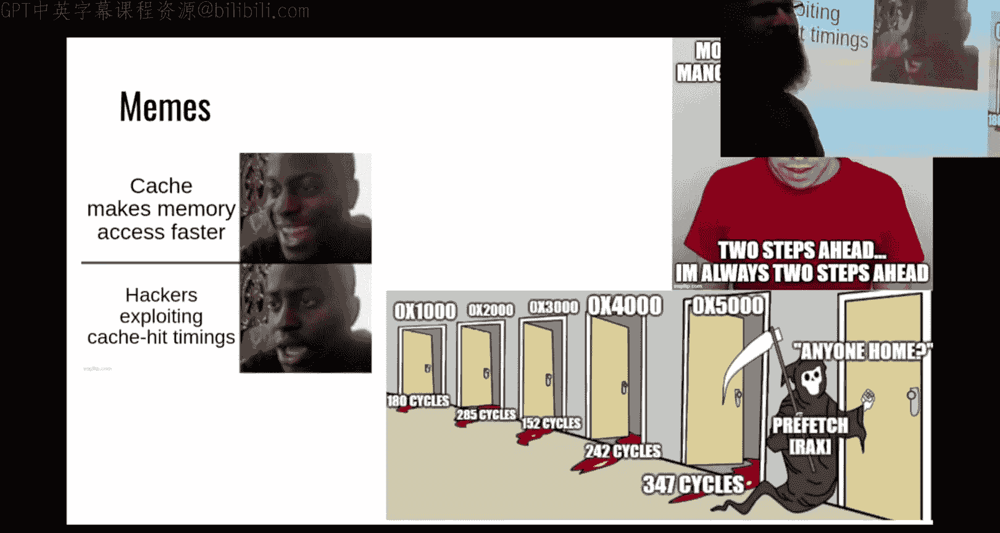

So everyone hates this， we got quite a few memes donnking on being because this is one of the few modules in this course where I am the smiling face with pre recorded lectures。

😡，In 598 I am the face of much more lectures， so if you like my style that's what you'll get if you show up for that course you can do this in two weeks。

Um， if you can't， we'll cross that bridge in two weeks on the other side of u Thanksgiving break。

Logal things somebody says here， I'm not you doing you know micro orange， ha ha。

 I just have to do system exploitation for the greenbelt technically right now that is true。However。

 at the end of this course， the D requirements are going to update to be in line with what was taught here。

 so if you are trying to race and just get that belt to say I got it and you think micro A is going to be like this giant blocker for you。

 solve everything before it straight changes。😡，That's kind of kind of the only advice I got there'll be sometime sometime in December we'll make that swap and so if you had everything done except for one thing like one challenge and then we added microarch well now you got to do microbes。

That's not just for the class， that's for anyone。That uses the site as a whole。

 so there's your warning。And as people have quickly discovered。

 this module is kind of just brick wall after brick wall after brick wall。

And there you can't throw GDP at it， you have to just stare at your code and think about the concepts that are at play This isn't just for you this is also for me I don't do microarchitectural exploitation on a daily basis。

 so when I do try and write this improve this out I run into the same problems you have this is the worst module for people to send code because the two hours that I would say you need to stare at it and change it and think about the data that you get is is the exact same two hours that I would spend if I were helping you it's very unlikely I could look at something and just be like a this is exactly what your problem is every onces in a while but pretty rare for this module。

😡，Okay， I ended Tuesday saying I wanted to talk about semaphos and I was going to skip this skip this today because I think people somebody says meltdown even harder meltdown is actually easier in my opinion。

 I think meltdown should have been earlier like whenever this skips rework meltdown will be easier。

 there's no need to like unnecessarily scare students。

Come up to it but I thought about skipping this semipho thing until I saw this mean I don't know。

Exactly what's going on there， but there's a whole lot of stuff that isn't right。Um。

So the first five levels， which some people have kind， which I consider a good sign。

 that like after they saw level one or level two， like they cruise through to level five pretty quick level five introduces the concept of speculation so it has its own headache。

 but this beamme has a whole lot of information in it that is wrong and I don't know if that's intentional or not。

And so I'm going to at least diagram what how this side channel works， the drawing works。

 we'll find out technology wants to be our crime。😡，I can't double track this pointer stuff。

 did people in class did you guys figure out how to just take an inch and turn it into a pointer and do some addition？

We got past that， yeah。All right， cool。Because that was not meant to be be the problem so then we'll talk about timing data thinking about or timing data strategies to employ and then I will probably fail to write a speculative。

😡，Exlo。But we can give it a shot。So。Before I。Go on about semaphores。Somebody says。

 I figured it out since I was hoping someone would correct me。Because I didn't get it Twitch。

 could you elaborate on what it is that you didn't get if the answer is that mean I'm right there with you。

😡，Let me see。If。Drawing wants to work。 You know， drawing worked right before I hit stream。

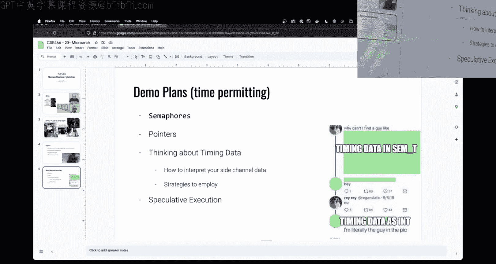

There we go。 I actually checked this。Okay， so when we write a we。

 we have like a cash side channel attack。There's a number of like memory addresses that are being used and if you didn't stare at the code or stare at the lectures。

 it can be hard to reason about。😡，What we have inside。The challenge。

We have some buffer that is a flag buff。Right， and so it has。PW and， Squiggly， whatever， squiggly。

When we are accessing some memory address and getting a timing， are we accessing this white buffer？😡。

Now。And then this is， this is kind of。Conterintuitive until you really sit down and draw it out。

So we have a data that we want to leak， right， so we want to leak。The flag。And the question is。

 how do I get these bytes of the flag？😡，Whether the challenge or the vulnerable program has to do something very specific in order for us to take advantage of this cash site channel attack。

😡，There needs to be some region of memory that I don't have a good word for it。

I'm just going to call it the access buffer， that sounds good。So we have this access buffered。

I don't care what is in the access buffer， it can be all nules。😡，Right you can just be full heroes。

Nobody cares。What the challenge has to do in order for us to perform a sight chain。😡。

Is somewhere inside of the challenge。嗯。😮，It needs to。Take a。Me a character we'll call it C， right。

 That's a letter。And that needs to equal。What we're trying to leak， so we'll say flag buff zero。哎。

This is the data that I want to leak， so this would be that key that I'm getting when I set the index to zero。

😡，It needs to use that character。To access our access buffer。And it is this。Access buffer here。

The act of touching the access buffer。All right， so I called this like nope or I don't care or something。

It is the act of touching the access buffer。😡，With the value that I'm interested in。

 that influences a specific location in the cache。Because in my exploit code。

And this doesn't matter if I'm in the current or the challenges in the kernel or we're using shared memory。

 there's some region of memory that both the challenged and my exploit，😡，Can read from。

And so this access buffer her is mapped。And accessible。From right here。And in my exploit code。

In my exploit code， I'm flushing the cache。So that's going to be that MMmC flush。

And then I'm looping through。Right， for I in。Call it 256。

This is amazing pseudocode we're going to access。Bffer。hi。

And that is where we take our timing before。And our timing after。And we can。Ittererate through this。

Oh， we have colors。 Col are cool， all right？Oh。So we can iterate。Through all of these spots。

And find the time that it takes for our exploit to touch the same region of membrane。😡。

Because the challenge touched this region of memory， it should be in the CPU cache。😡。

And so we should see a faster time。😡，When we access something a location in memoryade that has recently been accessed by the challenge。

Yes， question are plus cash before the so the question is why am I flushing the cash before the for？

So this。This relies on。An assumption that I'm making about the order of operations between these two things。

😡，系。Which may not hold true， this is going to depend on like the specific challenge scenario。😡。

What I am assuming is happening here because remember， these are running。

Like in levels one through five， these are two different processes that are running。

In theory and parallel right or at least concurrently。

 they're running at the same point in time and on levels one through five。

 you do have a semaphore that you can call semi post on to kind of set the challenge free for it to go so you have some ability to organize or synchronize the order of operations。

😡，In a perfect world， what I would be able to do。Theres flush。Before this， before the access。

So then I know the CAP is at a consistent state。😡，So。Instead of drawing an arrow。

 let's let's all right， some numbers。 So hopefully the ideal order of operations is eye flush。

The challenge accesses。Then I time。Listen to challenge access see no not characters。But oh。

 you're saying that。I did。 good， good catch。 statement was。The access is not down there。

 it is not at nope， the access is occurring。I'm sorry。

 the axis is occurring down here at Note when we are accessing this array。

 and so hopefully we know the state of the cache right， the cache is empty。😡。

We then can force or encourage our victim process or our challenge in the structure of these home college levels。

😡，We can encourage the challenge to access a known location。

 right we know that it's accessing somewhere in this buffer。😡。

And then we can observe the state of that shared resource， that shared memory。

And based upon the timing。😡，We we identified which in was accessed this is very similar to what I showed on Tuesday except on Tuesday I was just looping through like zero through 10 right one of the things that apparently was amiss here is how does that relate to characters well the challenge is using the character。

😡，As the index or as part of the index。I said what the challenges in on the site do。Is it is all。

C times。嗯。😊，Hes 1000。Everything is a multiple of a page。But even if it's a multiple of a page。

 we can still think of that as indexing into a continuous or continuous region of membrane。

 a single array。😡，Where each element is a page in size and so if it doesn't matter that the element size is a page。

 we can still deduce。😡，That isn't the prettiest， but that's just my handwriting。

 we can still deduce what C is。And so that is our strategy。

Now you'll notice here that in this diagram， I didn't have to draw the semaphore， there was no CT。

The value that is being weak is not in the semaphore。The purpose of the semaphore in these levels。

Is to synchronize。Yeah。These operations。So。If I flush and then call send post。

 that should cause this challenge to then perform the access。😡。

Now what of the things that people ran into and I recognize this is a generic kind of problem in this challenge design these are these first five challenges here。

 you can totally blame me， I am the original author。😡，Through these。Is sure。

 the S post over there lets me flush and then access。

 but I run into this synchronization problem now of。

 well am I how do I know that I'm looking at the time after this access？😡。

Because maybe the kernel didn't let me didn't yield right I called S yield， it wasn't enough。

 it circled back to here， I got my timing before the access， the data I dot was bad。😡，That's her。

That that's why on the discord， some people say I use nano sleep and I nano slept for some period of time or there were some people which is。

Clever， I hadn't seen anyone do it in the past。But it makes sense。

Some people were saying that they were using I think send get is that that right there there's but there's a function you could call I haven't use it where you can peak at the value of a7 before without incrementing or decrementing it and so what some people were doing is after their sound post is they were looping and waiting to see the7 before decrement。

😡，From the weight。Like， okay。I guess that worked。I am worried about that personally because again。

 that poor memory operations and the more stuff， not just in your processes， but on the entire CPU。

 the more stuff is going in and out of the cache。It's the opposite of race conditions。

 the race conditions module， and that when the busier it was the easier it was for you to win because things were busy。

 when we're exploiting the CPU cache， the busier it is the more things are cycling in and out。

 which means actually it's harder for you to consistently observe that access。😡。

Someone who says you always blame me for any issue on Boe College， it's a great strategy。

I highly encourage everyone to do that。So yeah there is a problem there that you can deal with it one of the things that I consider doing when I built this challenge was to do the opposite here。

 had to send post over here so that way you could synchronize on the other side of the top of your loop right you could send weight and then send post but what happened when I had that setup up in the challenge was the act of doing some weight S post was so slow from synchronization that it could mess up and make it more difficult for you to get timing day so I'd rather you fight the speed it'd be too fast。

😡，Then have horrific problems because because of the synchronization making you too slow because you're checking the access times too long after the access。

😡，But it is something I'm aware of。

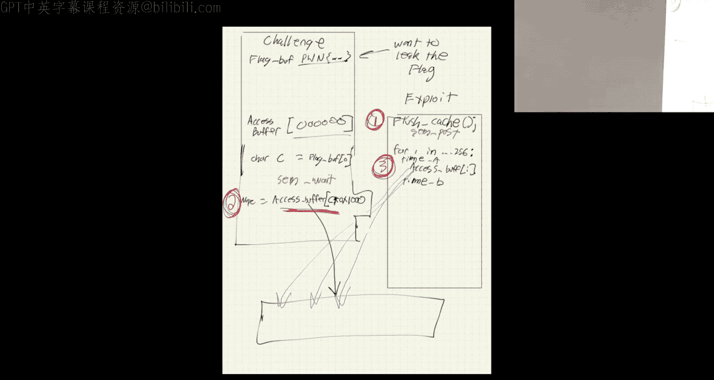

So。Is there a semapho， yes。Is the timing be in the semaphore， no。

Is the character that you're trying to leak in the se before， no。

Do you have to know how to use aM for， yes？Any questions about that？

What is the meanme about it's definitely not that thought know I don't know what it's about。

 but it scared me because I saw like 70 data in semapho I'm literally the thing that I'm looking for for the data it was the timing data is the senophore like I don't know。

 man， it scared me All right it scared me and I wanted to make sure that it didn't derail people because this module is challenging enough as it is。

One of two things tends to happen with this module people either it either like clicks and they write code that works and they're not sure why and it's like screw it and they just fire on through or you repeatedly brick wall and the hardest way and worst way to brick wall is to have a false conceptual understanding。

 it's one thing if the code just isn't right and you can tweak it。

 it's another thing if you fundamentally you thinking about the problem wrong。😡，And so I。

 that was my worry， which is why we had that little。Little tangent there。Okay。

Thinking about timing data。

Go back to our comfy terminal。And we will。We will thank Apple for letting the technology work today。

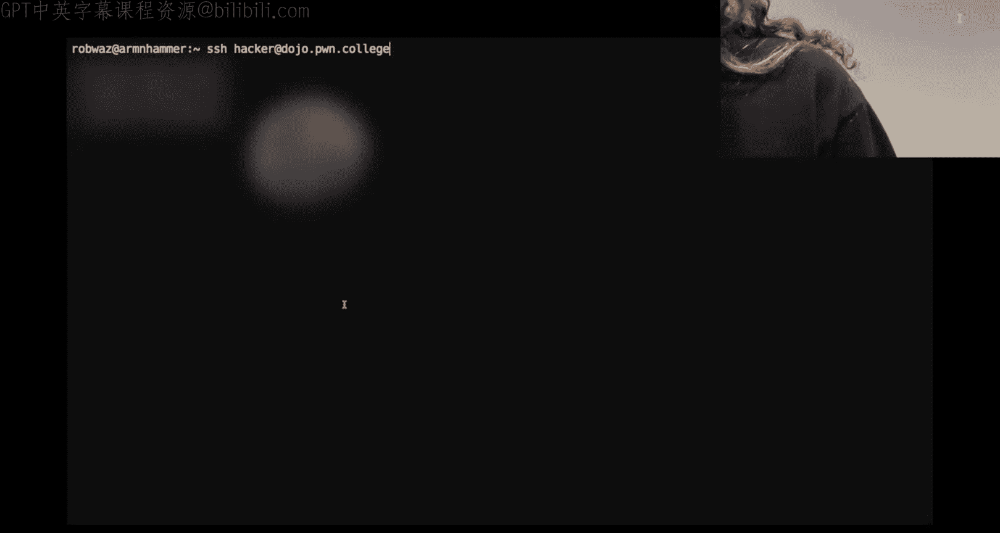

Yeah。That's silly。嗯。

嗯。And if you guys had anything in particular you wanted to talk about， let me know。Yeah。Okay。

 so I had， if I remember， right， Was it De Doy。Was it In game？What were we working on。

 There's a due dot Sea there。 Do I like the ded Sea。Yeah， this is what we were working on。Okay。

 and this was giving us our timing data。And this。Doesn't look pretty。

 so let's see what we have going on。Yeah。This has。Go a loop， I don't care we're accessing index4。

 we'll do do dot C。And we see index 4 is the lowest。Now this is just doing a。Cash。

Side channel measurement， right， I'm just measuring the timing data。When you get to level five。

Things change。Because suddenly we are speculative。And this is where we have it's a Specter V1。

 Let's see what the challenge actually says。Says it never reads the flag。ち。Okay。

 so our loop now still has。Accessing。The shared memory base。Plus a page。

 plus some multiple of what we're trying to leak。😡，What's changed here。

Is we now have this if unlikely float。Index divided by float of 257 greater than one。

 which is a really weird way to say that this value needs to be bigger than。What does it need to be。

 it needs to be bigger than 257。And the problem there is the locations that you want to leak。

Are from the flag， so you want it like if you under leak P， you want the index to be zero。

 is that right？And so leaking the 257th or 258 byte of the flag isn't very useful because there isn't one。

So at face value， this should never execute right a。

 the index cannot be simultaneously greater than 257。😡。

And simultaneously accessing a flag bite that I'm interested in。And this isn't a race condition。

Somebody says， is this example the same from last year？I don't have anything from last year。

 This is the same challenge from last year。Um。So we can't simultaneously have this value be greater than 257 and less than 257 to access a flagbyte。

😡，But we can't also can't race this。 It isn't a shared resource that。

We are flipping around like what we did in the race conditions module， right？

But there is a race condition， like it's kind of weird that we have all this float stuff in here。

Anybody have any idea why we have this weird float stuff。

 I just want to write some weird floaty code。This is so that which I like can end over and end。

We wanted to make sure total1 because of second to 58 to57。

 They're both anti when just go back to a one and one side area of the bottom。

I something like that so you so the， the thought was okay， well， maybe it's an overflow thing。 Yeah。

 right， I'm casting it to a float instead。So that it doesn't overflow from 256 or 255 a single byte overflow be 255 plus one rolls back over to zero right but that isn't what's happening that is not what's happening there I could have cast these two ins and we wouldn't have had an overflow issue。

😡，And I could have ensured that we're doing the correct kind of comparison so that that isn't what happens either。

😡，As Twitch points out。Twitch has a couple ideas here floatatstar indexs will access it and put it in the calf。

Right。Okay， so they're saying。Float star index。We'll put the。That would put the indice。

Into the cache because that is accessing the memory address that is index。

 but index isn't what I really care about right index in this example would be like zero which then gets accessed again here and if index was zero it would give me the letter P for leak and leak is what is the index in the access array this is where having a good idea from like that drawing I just did what index is accessing what array matters a to right this index is the literal integer。

😡，That is determining what bite of the flag is being used。😡。

As an index to access the shared member and the only thing that we can observe from our exploit side is the access times of this shared memory right if we could measure the access times of the flag。

😡，Well， we'd be reading the flag。So that isn't something we can do。Somebody askeds， what is unlikely？

😡，So unlikely is a。Ohh。Yes， and I don't think it's actually I've been corrected on this one over the years。

 but unlikely is something that you could write and see that I'm told it doesn't do anything anymore。

 it's actually anob。😡，But at one point in time， I am。

This is a branch right where we either take this or we don't if we were to look at the assembly of this。

 there'd be a comparison or a test， and then there'd be some type of conditional jump。😡。

At one point in time， you could use unlikely to hint to the CPU。😡。

What it should think is going to happen。😡，And so at one point in time。

 you could say this is unlikely。So then when the CPU speculates。

It's going to speculate that we don't take this path。😡，Nowadays。

 if you look at the assembly of something with unlikely and something without unlikely。

 it's identical， so I don't believe I've been reasonably convinced。That it does nothing anymore。

But hypothetically， if we were on a really， really old CPU， it would do something。

But how does assembly tells you about speculation even assembly may have speculation so the statement was how does assembly tell the CPU about speculation because it's the assembly that is speculated right well how does how do fences work？

Can you speculate around defense， no， like there are some assembly instructions that cause the CPU to say we're done with all speculation right we're going to just we're stop speculating at this point and we're going to ensure the CPU matches the intended state。

😡，And so I imagine it was something similar to offense。

But I have not seen the assembly that that used to turn into。So nowadays， it's kind of a nothing。

 it just looks scary。But it's not。Well what is the difference here when we're talking about the assembly。

 but what's the difference between me doing integer division？And me doing。This float division。

Like that does make a difference， this unlikely doesn't do much。

Was this all just chilling in Maine？let's see。Fg vow， we sign stand。There should be。Some crazy， yes。

 there's some crazy looking registers going on over here now。These these XMM registers。

 which we just haven't talked about in this class， is in general， you don't run into them。

Twitch does say F division uses XMM， which is slow。

But they're cheating because this is like their third or fourth time taking this course。

 they've been with me for a long time。So。Yes， when we do math on integers we use an ALU right so additions fast subtractions fast。

 but when we start working on floating point numbers floating point numbers can't just go to the ALU right floating point number has its own special representation and it goes to a dedicated subcomponent of the CPU。

😡，And the act of multiplying and dividing。Floating point numbers occurs in these XMM registers。

 which are used for floating point operations and they're also used for。😡，Oh。

 why am I blanking on the word？It's when you put in several small values so you can have this like a you can use like a 64 those are actually bigger。

 but you can use a 64 bit register it loaded up with8， eight。

Bit values and simultaneously do operations on all。😡。

Eight all of the individual eight bit values what someone's got to know the word that i'm looking for it's a vector operation and you can do vector operations on the CPU。

 which is like an insane performance thing that you can do with these XMM registers。😡。

So the whole reason that we're doing the floating point stuff is because it's slow。Hopefully， Cdy。

 that's one of the words that I wanted。There's another word as well。SMD operations。

So floating point operations are slow。So moving something from a。Normal register。Right like EAX。

 it's not just a move， right， it's its own weird instruction。Similar same thing with our division。

 so we have to move things into these weird registers。

 we have to move things out of these registers and we have to perform this weird floatinglo point division before we get the value back in。

😡，And so this is a very slow thing。U somebodybody it says this is their favorite challenge because it literally combined computer arch and you talked about Spec in class today。

What do you know。So this is a very slow operation。😡。

What does the CPU do when it runs into slow operations？It speculates， right， so it'll think ahead。

And so since this branch， whereas this test junk equal。

 this depends on RAX and this is actually how it works。

 it looks ahead at the assembly instructions and it builds a little dependency graph。😡，And it says。

 what things relied on this slow thing？Well， this。Conditional branch depends on the slow thing。

 so let's just pick one， we have to we'll skip it for now because we have time to wait on the result。

😡，And we're going to start processing the stuff that's ahead， but the question is is do we go？😡。

With the positive case or the negative case。And this is what we can exploit in SPter。😡。

Is because the CPU doesn't know the results， it doesn't know which way this jump instruction is going to go。

😡，And so we can train it。😡，The way that you train。Is to fix another common misconception。

You do not need。To run and train the CPU a thousand times right if you're not getting the result that you expect it's very light unlikely that your issue is I need to do more training iterations all right more than likely your issue is somewhere else because the internal state of most branch predictors needs to be ridiculously like simple because it needs to be fast if the branch predictor had a whole bunch of like complex things and it was。

😡，Really complicated and looked ahead at thejiillian operations， then it would be slow。

Most branch predictors really are this too big counter that I talk about。

 which means in the worst case。The branch predictor can think something would not be taken and you can make it taken in three executions of that branch。

You don't have to use three right like1s a reasonable number and I don't know that three is the correct number here。

 although if Twitch wants to chime in， somebody， okay， yeah。

 at one point in time some people tried to era this。😡，U。And they got it down to three。

 they confirmed。So you only need to do three executions of the branch that you're trying to train in。

Provvably on this hardware。Now。Somewhere in here， I have another amazing。

 oh maybe it's not really amazing。I remember the slide。Which is。What some people have ran into。

As a problem。Really， it's in meltdown。Almost here I here， okay。So， know。Well。

 one of the comments I've seen。Is I trained it， right， and maybe I've trained it a hundred times。

 I don't care， but I trained it enough， right， more than three。

But I'm not getting data that matches what I'm thinking about。A speculative exploit。

 a running speculative code is a race condition。Which means you can do everything correct。

 you can trade it correctly， you can pass the correct value。

 you may even get it to start to speculate because remember the way spectulative execution works is your assembly instructionsions turn into these like microOs。

😡，And these microops get batched out。And what you are era to see if I have another slide on it。😡，Yes。

 what you are racing is the time。Between these microops being batched out based upon how busy the CPU is。

And so the best thing you can do as far as training the CPU and creating the scenario is you create the scenario where hopefully the micro opt for that slow floating point。

😡，All right， that's dispatched out to the CPU and it's busy， you know， one line of microop execution。

😡，Is bats out trying to figure out this floating point stuff you have another line of micro op execution that is working ahead specul and it is the one that is trying to。

😡，Figure out what address needs to get accessed。😡。

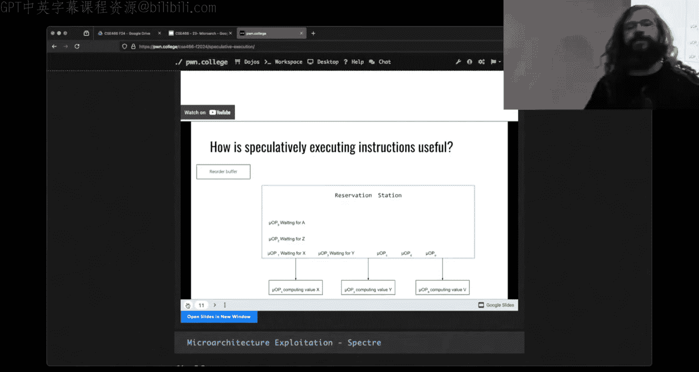

So if we've trained this right， now let's not look at the assembly， let's look at the。

Chall code one micro op or like series of microops that's batched out that's trying to compute this if we've trained it there'll be a correctly there'll be a second batch of microops or a high chance that there's a second batch of microops that's trying to do this right here what's inside our code block。

😡，And so that is the best we can do from training。

At that point， it is a race。On whether or not the floating point calculation comes back to the CPU first or the speculative stuff comes back to the CPU first just because they both got sent out doesn't mean that they both will get actually。

😡，When I say actually， that's not。Doesn't mean they both will be speculatively executed？

This one we're trying to the thing that we're trying to get the CPU to do。😡。

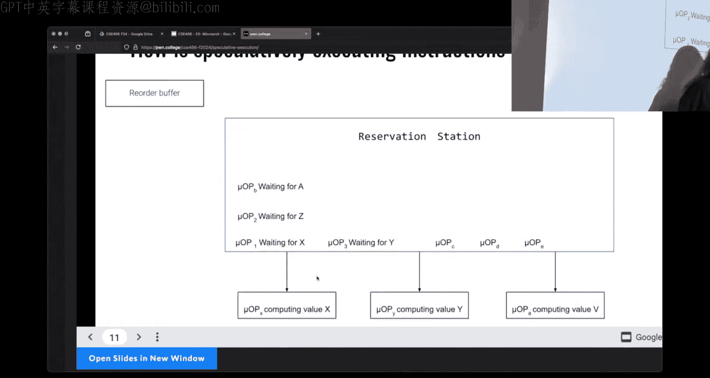

Is access a low value of the flag， a low index of the flag？

Before it knows that it shouldn't have gone down here。And so that is our race。

And we can set everything upright and it can still just not happen by virtue of just dumb luck right things didn't time outright。

 the CPU was busier， maybe nobody was doing doing much floating point operations。😡。

I did everything right， It just didn't happen right we saw that in the race conditions module we have that same type of scenario here。

😡，Now， even if。The CPU speculates this inner branch。😡，明。😊。

Performs this memory access in the microops。😡，It managed to do the floating points now first。

 and that comes back in。Eventually， and when I say eventually， this is on like super tight， you know。

 super tiny time scale， but eventually that floating point track is going to come back。

What happens when the floating point check？

Comes back and it says。Hey， we shouldn't have gone down here。

What happens to the stuff that it was working ahead on？A CPU retires and it throws it out， it says。

 I didn't need to do that work。And so we never concretely see that happen。

Because it never can happen if we take this code at face value。😡。

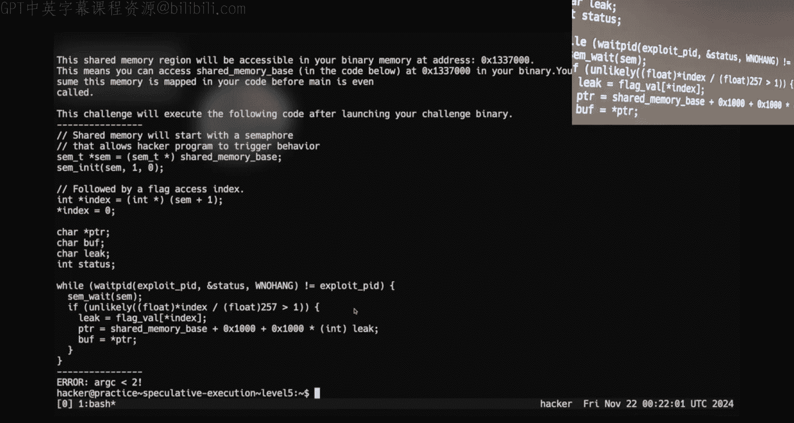

But。😡，If we won't win the race。And the floating point operation came in second。😡。

Then we did execute the micro operations on the CPU。😡。

That did this。Now。From the user land， we can't see this from the kernel， we can't see this。

 where can we see this？😡，See that this happened in the cash。

It's the only place we can see that it happened。And so。

That's why the first like four challenges are right this side channel tech。

 there's no speculation involved at all。Hopefully at that point。

 you have some idea of how to perform the timing， how to deal with synchronization。

 you have something that can measure these timings somewhat reliably。If you're like。

 I just got like lucky one time and I don't know why that's a problem because when you get to level five。

Now we have to depend on whatever it is you wrote in the first four levels being dependable。

 reliable， understandable。😡，Because this may have happened。And we should see it in the data。

Or it may have not happened。And our data is going to look like nothing happened。😡。

And we have to know， is our data bad because we lost the race or is our data bad because my timing code is bad if my timing code is bad。

 that means I can't reason about whether I'm winning or losing this race。😡。

And that's why those challenges are set up。That way。Somebody says speculating is super relevant。

 similar vs were found in new apple chips， if I remember right it was the M1 we're you're several years out of date now。

嗯。😊，I don't think that was speculative， though that had to do with the。What's the word？

They're their unified memory。And how that worked。O。😊，So the key thing in order to。

Reason about whether I was able to speculatively execute something， yes。

Is the training like why do we need training and what is it Okay。

 the question was why do we need training and what is it？

So win the CPU。

Trading matters。When we are trying to execute something that is speculative。Do you know。

 do you know what I mean when I say speculative it to predict yes。

 so this is level five right and there is a branch right here。

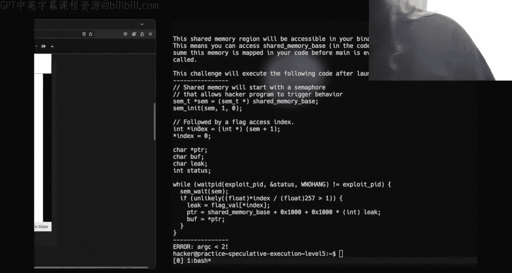

And the branch is， is this number bigger than 257 or not？😡，系。😊。

Every time the CPU runs into with this。We said floating point operations are slow。

So what is the CPU going to do while it's waiting to find out the result of that check？

It's going to speculate。Now this is a branch though， so do I speculate true or do I speculate false？

😡，it'll be better for this well true is better for us but what does the CPU do the CPU have if it's going to speculate does it just stop it's like oh oh man there's a fork in the road we're just going to wait。

Would that be a good use of CPU resources？No， the CPU is going to choose something。

So how does the CPU decide whether I guess in the positive direction or I guess in the negative direction？

That is what we want to influence。This only matters from level five honorward for Specter。

This is Specter V1 Spec V1 is taking advantage of the branch predictor。

 which is when I have a conditional jump， right I have an if if else。

。Well， for every location， well not every location， there's a limit， but we can reasonably say that。

For every virtual address that there is a branch。

That virtual address maps too。One of these two bit counters。All right。

 there is a limit that's not infinite and you have to realize that there's many virtual addresses and then simultaneous processes going on we're going to hand wave away a lot of that Okay we can think of it as if。

😡，At every single if else inside of the program there's a little state machine I don't remember what the ASU course is for state machine you do the me you do the more it's like CSU 120 then you do it again in the theoretical so so which I really liked the theoretical CS or anyone that is doing the old trifecta here the stuff does does actually matter so so we can。

😡，Predict。The branch。And be reasonably accurate with only two bits of data。

And it is just a simple state machine。The CPU thinks that that branch is in one of four states。

And then this is the complete transition of everything that happens when we run there。

 so when we execute。😡。

This if。

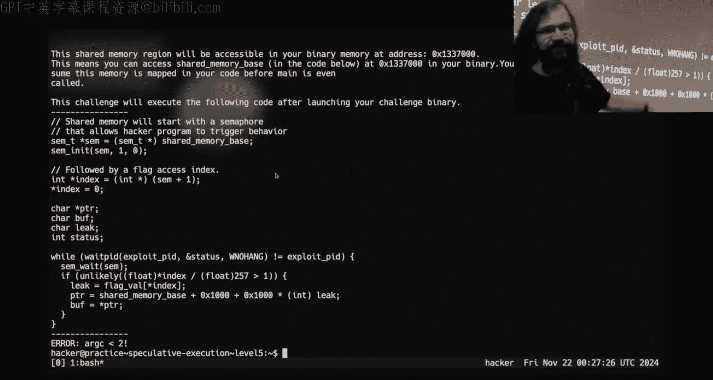

All we have to know is what state are we on？And then what did we actually do every time that we concretely know what we did。

 we're like， yeah， we took it， yeah， we took it then the next time。

I'm following the arrows backwards because they have small tips okay。

 so so we're over over here and training is making is influencing this internal state machine of the branch predictor for that specific conditional job。

So the way that we do that is by executing that line of code or that that assembly instruction here。

 we want to execute this line right here at least three times。😡。

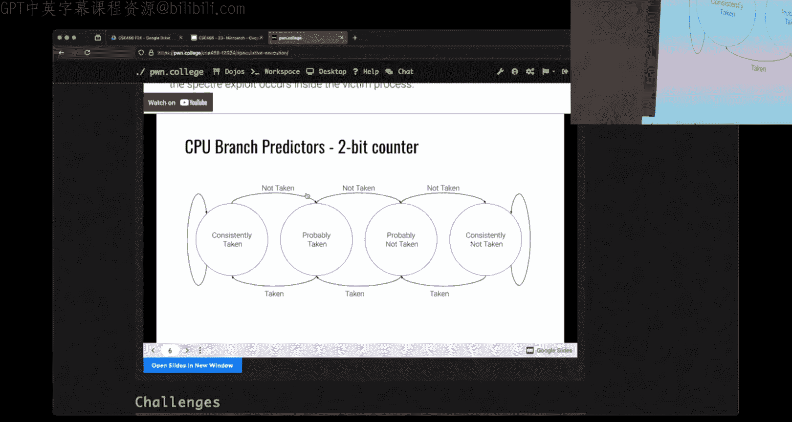

Where it does happen。Because in the worst case scenario。

The CPU is thinking there's no way this is happening， this is the worst case。

So training is executing it such that it's true， it's true， it's true。😡。

Now we have ensured that the CPU's branch predictor， the state of it is next time it guesses。

 it's going to guess yes。😡，Now it could be wrong at which point it's going to move to this state here right it may probably take it yes。

 just re it again， just fire three times and it doesn't matter if I'm already over here。😡。

If I execute this piece of code three times， I have ensured the state of the branch predictor inside of the CPUU。

 it is going to predict that this branch is taken。😡，That is what training is。

 then that's all that it is。Somebody says。They're going to try and get the time to get the flag on five as low as they could see they're racing it now guys I'm it you you're racing it I'm trying to see if I can do a three did you see what they what they got？

Okay， so Twitch is saying they got 0。07 seconds。I'm not recent at the time I'm saying I'm saying if I can do only three of her Oh for three iterations trained the branch protector yeah。

Hand waving， busy CPU， it's all magic， blah， blah， blah， but。At face value。

 this is what it is you know， maybe you needed to do it at1 a because there are a limited number of on every CPU of twobit counters and so if that particular virtual address doesn't have a conditional。

😡，Branch that is regularly executed， then the CPU is just like， yeah， we don't care about that。

 we're going to use this counter for a different location。😡。

And so it prioritizes which branches it's going to predict based upon their use。

 and that's not just for you， but like across the whole hardware。😡。

And somebody else said they reached 0。09 on level5。Yeah， I never got around， got a network。

 got around they trying to raise it。Because this is one there where there's a lot of hand waving magic。

 but this makes sense what what training is， right cool？

So if we know to go back to our bullet points here。

 I've managed to completely avoid writing a speculative exploit。

It's way better。U if we know that specative execution is a race。

 then we have to be smart about what we're doing with our timing data right and there's several strategies you can employ。

😡，What are one that you have used？So like， when I say there's a strategy did I run at once？😡。

And that it doesn't work。So how did you deal with that problem？Okay I'm running more than once。

 but what do I do with this data now is sometimes p is the best letter for index zero。

 sometimes x is the best letter， you sometimes zero。

 sometimes by my timing data says that the nubte is the correct character how do I deal with this signal tono know that the flags only going to be e。

😡，So I know the flag is only going to be asking characters and that's a fine way of doing it。Um。

 I hope that that isn't what ultimately solved it， but that that is a correct logical deduction right。

 so I don't hate on it。😡，What else， what other things might you do with this data？

I don't know if I talk about it in the pre recorded lecture。

 so I don't know or if it's something I'm just consistently rambd about live。😡，So。

One thing that you could do， and I know as we mentioned out the Discord。

 is we said I'm going to run it multiple times。How do I make sense of all of these data Yeah。

 I know I starts with Pong dot college and maybe maybe I get that， but sometimes my N is an M。

How do I know for the next 40 some odd characters？That the P isn't a minus sign or whatever we put in there。

 right， because I don't know the random bites inside the curly braces。

So what is something I can do just statistically， mathematically。

 logically that helps me feel confident about the observations that I see run running each character multiple times。

 well while you're trying to get each character to run multiple times and see how many how many different characters you get and whatever is the。

😡，Has the highest counts， most likely in the last。 Okay， so one， one strategy。

 and this is a valid strategy。 I I started off for like the first。

I think two times covering this module suggesting that it's that strategy the statement for Twitch was for every index I'm going to execute and measure my kind any data say100 times and 100 not a big number。

 but we'll go with 100 times。😡，And then I'm going to， for every one of those executions。

 keep track of whatever was the fastest or maybe the fastest three or you know， so something。

 something like that， and I'm going to just have a count for every character。

 how many times was each one the fastest in whichever one I saw the most of。😡。

That's got to be it because they was consistently fine mostly。Okay。

 there was a little bit of a s back there。 and I don't blame you。 Most likely it's probably。

 you know， it， it， it sounds good on paper。 And that's。

 that's exactly what I thought the first several times that I kind of ran through this and played around in different ways of dealing with that problem。

 I did exactly that。 I had a。啊。Aray full of ints， and then I just kept it tally and I was like。

 all right， whatever I found this has to be end。And that works for what works reasonably well for levels one through four。

Of this mouth。It's going to utterly fall apart。Doing it on level five。😡，Why？

And you're going to be like I used it great level five that I'm going to be like。

 I don't think so maybe he did， but on paper it should that approach should fail on level five。

And the reason that it will fail on level five。

It's because I said that this is a race， right， which one happens？😡。

And that means there is an implicit assumption with me taking my my best horse every time I run to the race。

Because what happens if I just lost？The situation never happened is the fastest horse even related to this right here。

No， if I lose the race， the fastest index。Has nothing to do。😡，With the flag。

It just happens to be the fastest thing that was there。

So what's another approach that I could use I know it's been。诶。You know。

 sometimes I think you're just need， with？啊。Well， what's another approach I could use here that I know has been discussed a little bit？

😡，I could set a threshold， right， you've ran these these numbers before。没病。

Then I need to give this a yes？So。I get a bunch of timing data。This is。

Some some random garbage of timing data， but whatever。What you'll notice， let's do spec game。

And then do the eight out out there。There's a clear delineator between stuff that was in the cache and stuff that was out of the cache。

Now the deelta there should be some threshold and honestly， this threshold is going to be different。

At different times， depending upon how busy the CPU is。For whatever reason。

 our little toy example that we wrote on Tuesday has a huge difference。But。In practice。

 what you'll find is the delta between something being in the cache and out of the cache can be quite small。

 right it's not going to be thousands。😡，There may be a few hundred。哎。So what you probably want to do。

😡，Is pick a number and there's several people on the disc code who have been like。

 this is my threshold number。Okay， that worked for them at that moment in time。

 that number may or may not work for you。U pick a number and only count the horse if it's that fast。

 if it's below I don't know here 200 seems like a reasonable number， right？By now if。

It's like six o'clock at night， maybe that number needs to be 300 or 400 or 280。Run it。

 look at the numbers and pick a threshold that is appropriate。😡。

Now you can write code that's going to just measure the times and then find the fastest thing and then dynamically figure out a threshold that's actually what a lot of our intended solutions do。

😡，They they had put something make sure something's in the cache。

 they measure what is the timing delta， and then it dynamically picks the threshold。

And that works reasonably well sometimes。It dynamically picks too high of a threshold and it still is wrong。

 but you can do that。Yes。😊，Comp so if we pick cut threshold short and say like。

The wrong character is the fast。 So even that is going to be in or light。

 So how did that so the statement was if how does picking a threshold fix this。

 So have you made its level5 yet， Okay， if you haven't made it level 5。

 you haven't had to deal with speculating。 Yeah， you haven't had spec speculation has not been a factor in any timing data that you've seen。

All right， and so right now， yeah， all right， maybe you don't need a threshold and you can get away with it。

What will happen is if I made this， I wrote did the same thing。

 but now there is an element of speculation to it。😡，Some runs， every number would be like 3。

000 and above。Okay the point of the threshold is not to ensure that I always get the correct one。

It's to make sure the obviously bad cases， the obvious bad runs don't influence my numbers。

Because when there is a speculative element。

I'm not going to say more often than not， but a reasonable amount of the time。😡。

You will not speculatively execute this， which means that there is obvious bad runs。😡。

And setting a threshold where the fastest thing must be， for instance， below 200。

 ensures that in these obvious bad runs， I don't even consider the data。😡。

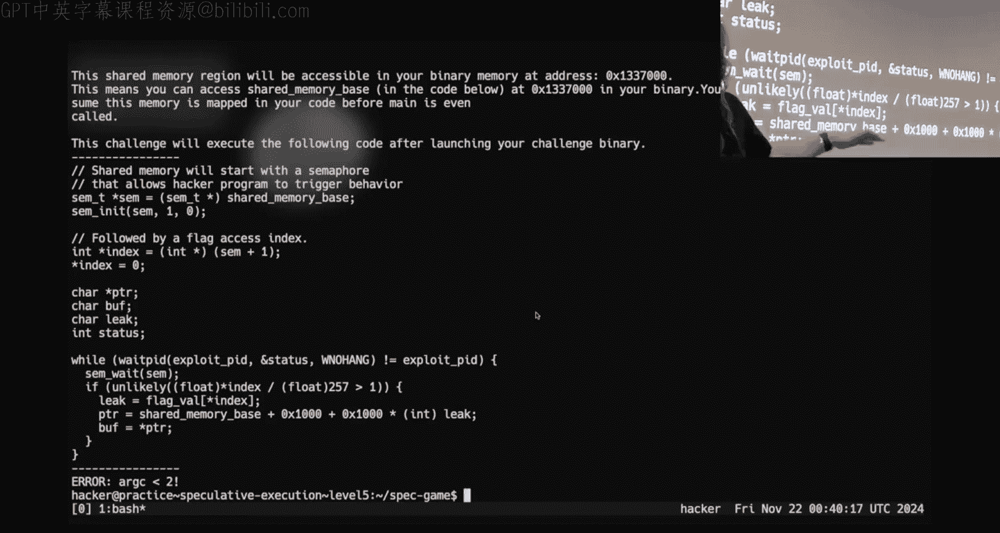

All right， because I said that when we introduce speculation。

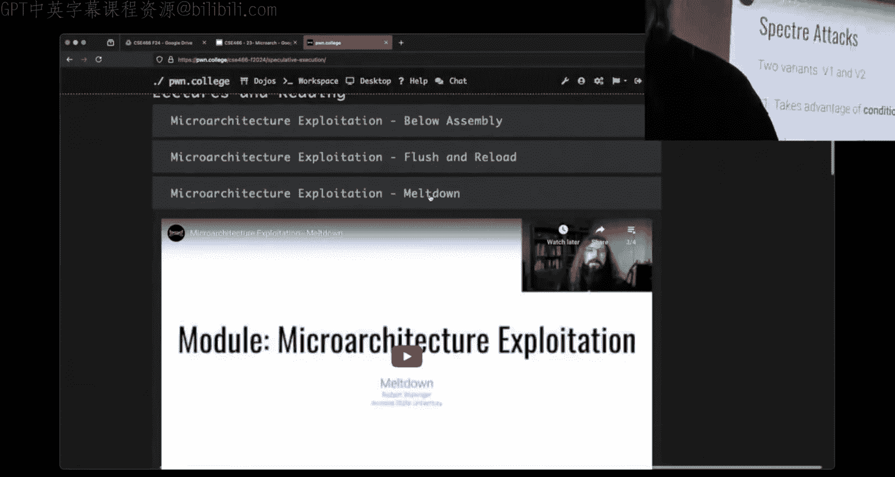

It's a race， it's a race in the microops。And so when we have speculation。

 I can do everything right and lose the race。If I lost the race condition here。

Then all of my data is bad。And so I don't even want to consider that case。Yes。😊，嗯。

If we are looking at the time data and we see we're most likely to see a bad after we train we had to have to train the how do we know what level of threshold is if we all see a uniform distribution for example all 600s all 700 how do you know 300 is a good threshold versus 400 versus 200 maybe 100 Okay so guess somewhat like I wouldn't be mad if you did the question is how do I determine where this the threshold is？

do I do I just run this like at every game all my timing data comes back around 7 to 800 do I pick 400 do I pick 600 right well the problem there when you are doing this。

 you're trying to figure out a threshold and you're measuring a speculative scenario is is the data you're looking at？

😡，Does it include a good run Well what if you never get a good run So， so the question is well。

 what if I never get a good run Oh we can write for loop right， I mean。

 how many executions are you doing before you find your fastest time Is this one and everything 7。

800 and like， okay，700 is a good number。😡，But yeah。

 like we can do thousands of executions per second。

 hopefully I don't know that that's true I haven't timed it， but。In theory。

 we can write a for loop that runs the challenge a thousand times and hopefully one in a thousand of those。

Has a clear delta， like there is a clear grouping or clustering of things that are slow and things that are fast。

All， now。You may get something like this， right where I have two things in here or three things in there。

Does what this is indicative of is a value getting into the cash？Right that I didn't intend to。

 And so there's something something wrong with with my code and I think that happened even on the prerecored demo stuff I just ignored zero because I don't I don't want zero0。

0 isn something I'm interested in。 And so I decided not to get down that road。

 but I can still figure out my threshold based on what I saw。 And so one of the。

Things that you have to do to debug this stuff。since you can't really GDP。

 and you're trying to reason about what's in the cache， what's not in the cache。

 what it iss the CPUU doing is you need to make sense of these different scenarios of what is your timing data。

 right？😡，If everything is really low， when I say low， I'm going to do it with， I don't know。

 as low as 20 and as high as like 300。If everything is in that time rank。

 you probably have stuff in the cash。That you don't want in the cash。If everything is a high number。

 when I say a high number， I'm going to arbitrarily say， and this is just a heuristic， which is。

A fancy word that means guess based upon observation。

We raned a bunch of times and this is what we see。if all of the timing data is like。

 I'm going to say 500 and above and that's， I don't care if it's 500 5000。

Then it's probably not in the cache and so if everything is 500 or above。

 then my problem is I'm not flushing the cache correctly， somewhere， whether it's the prefecher。

 whether it's one of the things that students have consistently brought up on these challenges is why don't you print stuff out？

😡，Well， it turns out in order to print something， I have to access it， that if I access it。

Of impacting the cash。If you're trying to debug your code with print statements to print values。

 think about what your code is doing to the memory， that's why the challenge doesn't print it out。😡。

But， did because you can inadvertently bring things into the cash。😡。

And forget to flush them or you could flush too much。😡，And so you need to be able to make sense of。

 well， why am I getting the data that I'm seeing？And then think about what your code is doing and yes。

 this will take。😡，An hour， two hours of staring at it， walking away， being mad， going back。

 changing something， I was scribbling together a demo that I decided not to do or not to go down that road。

And one of the things that。I was doing。In my demo。Was something like this？

Where I was setting a pointer to be the address of a。An array that was being accessed。

What does this do？This puts the value in the cash。Instead， and so inside my for loop。

 just because I was doing this notation， it wasn't this exact code。

 I'm not going to pull up that code because it has other things that I don't want people to copy。

But if I wanted to get a value like that， instead， what I would do is I would say char star pointer is going to equal M plus this value and calculate the pointer without dereferencing the memory。

😡，And it also makes sense to pre calculateculate memory addresses whenever you can before。

 in this case， my eye of now outside， this doesn't run。

 but if we hand wave away the immediate problem there。😡，Uh。

 it makes way more sense to calculate these addresses as early ahead of time because then I don't run the risk of me calculating something。

 pulling something into memory， which is what I was doing down here when I had the ampers。

And like I make that same mistake because I'm just writing C code right。

 and you really have to think about what are the implications of the C code you're writing and how does it impact memory？

😡，I do appreciate the raid there fix it 42 unfortunately this is a scheduled class that has it end time and I am like three minutes past。

Anyone have any last minute things here， one thing I don't think I mentioned。

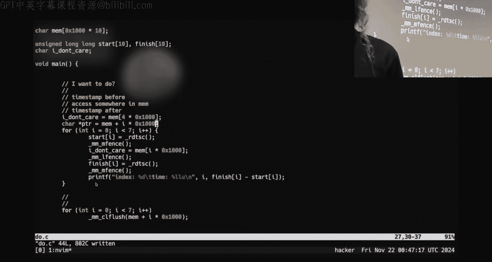

Bm。I do I I know I mentioned it after class on Tuesday because some people asked like， hey。

 this has lots of brick walls， a good place to be as far as。

Progress at the other side of this weekend is probably like level89 if you haven't looked ahead the second half of this module uses yan code so it has yawn 85 it's going to be speculative it has yawn 85 I think in the kernel。

😡。

Those later challenges can take a lot of time， so depending upon what you plan on doing over Thanksgiving。

 put in some time this weekend。With that， that's all I got， I'll let you all go， goodbye， good luck。

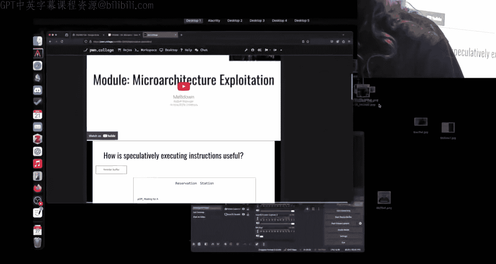

Thank you。

