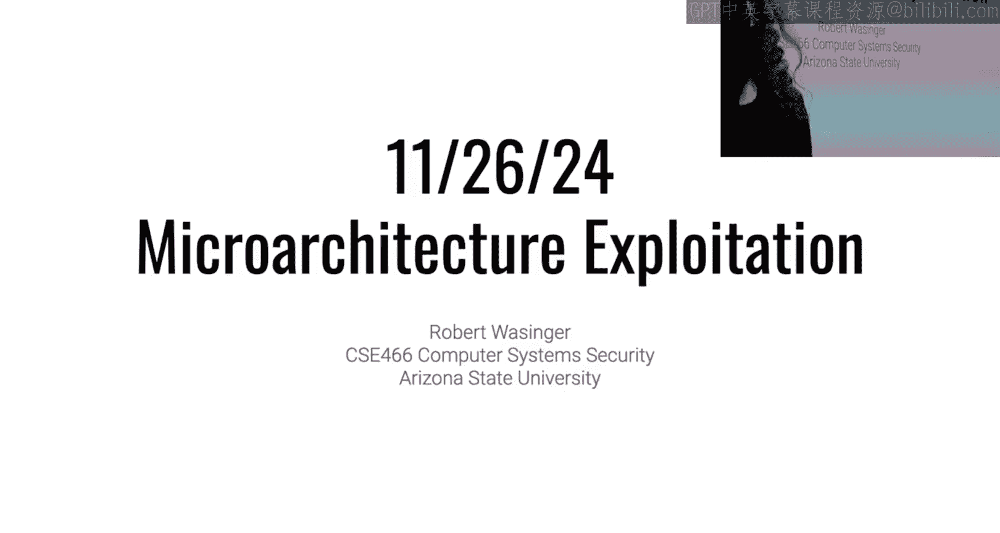
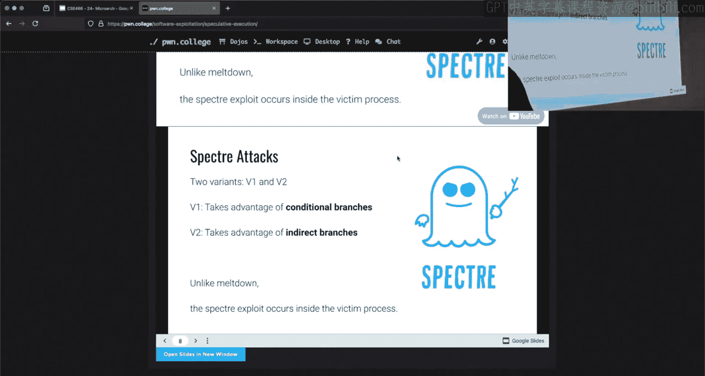
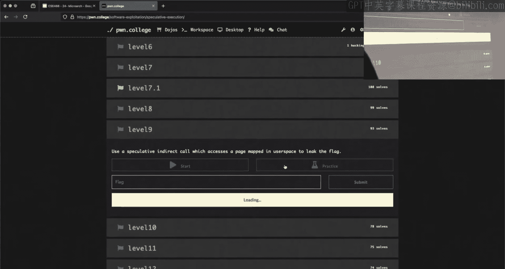
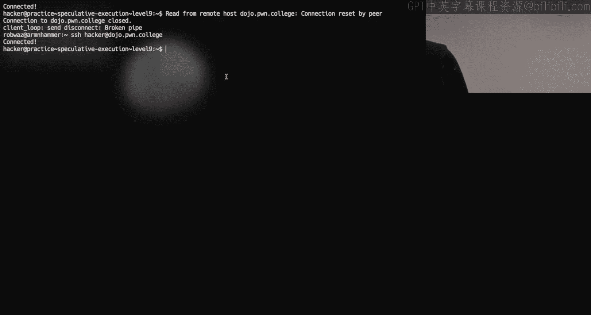
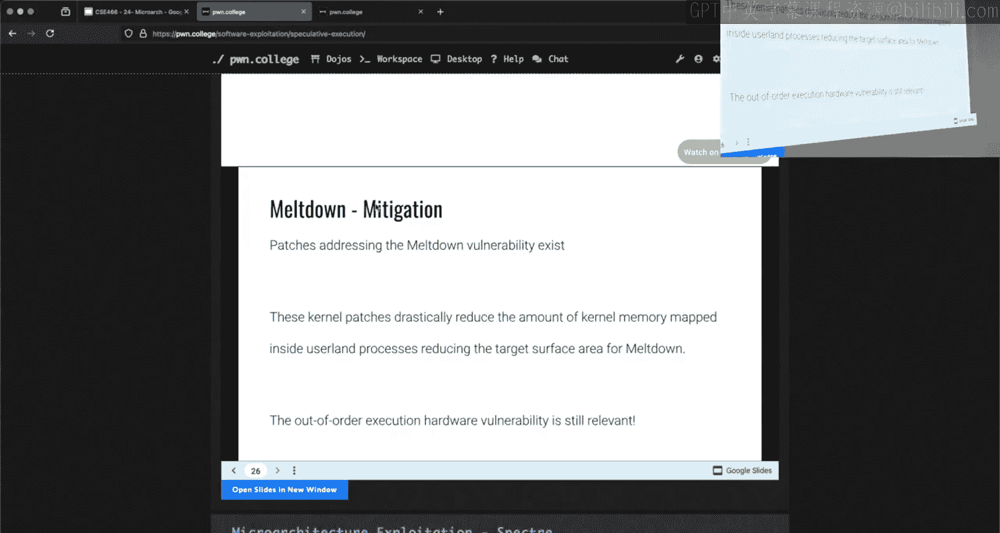
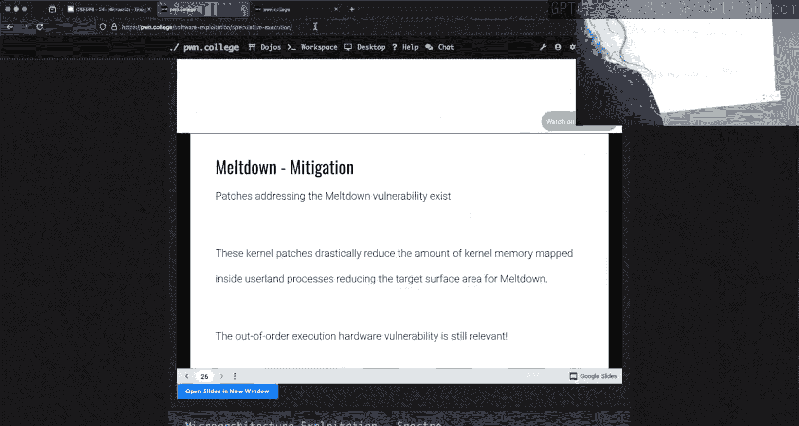
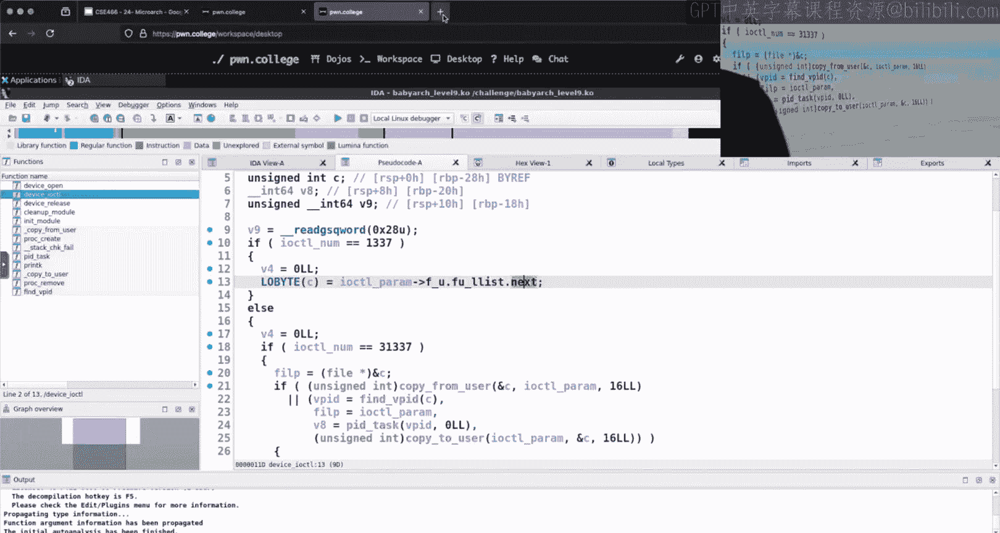

# ASU《计算机系统安全｜ASU CSE466 Computer Systems Security 2024》中英字幕deepseek p27 -28-Microarchitectural Exploitation - CSE466 - Robert - 2024.11.27.zh_en -BV1spCGYZE9D_p27-

The twitchwitch delayed。He， I believe we are alive。

Make sure I have audio， that would。I didn't check that all right， we're good。

So today is November 26， 2024 here at ASU， and we are halfway through micro architecture exploitation。

So let's see where we're at。So people got to start actually working on the microarchitectural exploitation from what I could tell it's kind of lived up to its reputation。

 yeah。People are people are enjoying it and it makes tons of sense and GDP solves everything right and I'm kind of surprised that this meeting talks about level four misbehaving typically it's actually level five that people will complain about because the first four levels actually are not spectulative at all。

 it's just a CPU cache sign channel that you have to take advantage to or level five is typically the hardest consider the hardest level out of the first half of this module。

😡，Because we can try and do speculative execution， you end up with this scenario here where you're like okay。

 I understand what I need to do I need to train this grant。

 I'm going to execute this program and we're going to bring to go this path we're going to do it three times okay。

 this CPU use screen and then we're going to do something else。😡。

And then hopefully the CPU speculatively executes what we want。

 and I try to stress on Tuesday or Thursday。😡，That this is a race so you can trade it。😡。

And then execute the thing that you want the CPU to do， and you can still miss it。😡。

 people agree that five five1 like that， and so you need to do this many times for every value or every index that you're trying to leak because you may or may not actually trigger that race inside the CPU。

😡，Now this is arguably the hardest module you're going to have in this class。

 although the next one definitely isn't easy， so all of that extra credit that you built up in that nice you 110% that a lot of people are sitting at。

 you're going to cash in on that now because now all of the hard stuff runs through the end of the semester while you've got your finals and it's time to time to cash in on the extra credit because it does get kind of doom and gloom here。

😡，So this guy here when the server is busy， you will have a much harder time falling off these micro architectitectsural exploits right now it's still really weird right and it doesn't make any sense and you can't reason about it。

 but it's at least kind of smooth。😡，Right。But when the server is busy and it's under load。

 for instance， there were some people that were trying to do some of this， I think last week Sunday。

Which is when 365 head a deadline and so there's 600 students writing stuff。

 every one of those people are executing stuff on the same CPU course that you're trying to exploit and their stuff goes into the same cache that you're putting stuff into and their memory accesses will flush out things that you are putting in the cache and so it is always better to try and pull off these exploits when the CPUs are under lower load。

😡，In general， people hold that opinion， they hate this module。😡。

But it's important that you go through it because either you pulled it off and then it was super cool or you have some idea of how hard it is and kind of the understanding of。

😡，How hard it is。Other people have realized that maybe maybe it makes more sense here to cash in on me and extra credit as someone who was like doing well and then you kind of run into these last two modules。

 if you didn't get the extra credit early， it's going to be a rough couple of weeks。😡。

But if you did post the beams， it does make it quite a bit easier to get an A in this class right that is by design。

 as I said at the beginning of the course。😡，Somebody said yeah。

 they just had to wait for less than 50 people on the server so I don't you can't take that number on the actual Dojo website as an absolute number for a few reasons who now we're multinode so the number that you see there is split across multiple hosts I don't think 50 is that many when youve split that across I think we have like three hosts right now I remember right？

😡，And so that's not that busy， but definitely when there's 300。

 400 students that are all spamning things， that'll cause you some creep。对。Now。

 I never didn't sure anyone micro sleep， but it seems to be the the prevalent way that。

People tried to synchronize levels1 through five。 I mentioned skid yield。

 and I mentioned nano sleepep。Micro sleepep is just anipy wrapper around nano sleepep。

 you're functionally doing the same thing except because it's a wrapper around a cis call。

 there's going to be more memory accesses in theory this will decrease your likelihood because there's more things in memory being touched。

😡，Which means there's more noise in the cache until you're causing yourself more problems that you don't need to have。

 but for the people that showed me they were using that， there was a way to make it work。😡。

Ultimately what you're doing is you're just looking at these timing things and trying to make sense of this data that's kind of the key of the whole concept。

😡，Level seven， I guess it may not have been clear， but level seven is a different type of side channel than the first time。

Lovels one through five， have you right。😡，A speculative side channel attack as a level five so you're essentially doing like a spec D1 attack。

Level six is just this little menu thing that everyone just kind of brute forces because。

It makes me sadt that's the reality。Thats supposed to teach you about page faulting because if you try inspect speculative of the access page that isn't actually back by physical memory。

 you'll get bad data that's the whole trap of that level as you have to cause a page fault on all of those pages otherwise the data that you'll get from your timing data will be garbage and mean nothing because you're not actually going out to physical memory physical。

 but the level seven requires you to write a prefetch timing attack。😡。

And that is very different than what you're doing in for instance levels four and level five and so if you just kind of blindly tried to apply the same technique that you had in levels four and five。

 yes， you're going to seg fault because。😡，In levels four and five。

 you are timing accesses to virtual memory addresses that are mapped within the process。

Or be a share company， but they're mapped within your process。In level seven。

 what the challenge is asking you to do is find where in virtual memory is this mapped region。😡。

And so if you try and access something that isn't mapped， you get a set fault。

 so you have to use a different technique than it is covered in the prereported budget。

Just like grace conditions， if you wrote a horribly inefficient solution。

 you are welcome to run it for I believe up to six hours as the Dojo eventually does time out。

 however， a reasonably wellre solution for all of these should dump out a flag within a minute or so。

😡，And I think other people came to that same gl。For the first cover levels。

 you could just end up with a cursed core， so levels one through five do randomly pin。

Your process to a CPU core， it pins the challenge process and then when it forks off your exploit code is pins to that same core hey the challenge just does this for you that's to make sure that all of that code is running on the same core that shares the same cache。

😡，Now four levels， I'm going to guess eight and nine，89， 10 somewhere around there， I think 89， 10。

 those are also specter based exploits。I don't believe those challenges pin the CPU for you。😡。

So if that's something you want to do。You should do that。Because otherwise。

 the challenge could run on one core， your X is going to run on another， they don't share a calf。

 measuring timing is going to be a bad time。Because you're not actually measuring that cash can。

Logal things， I mentioned this， my Discord availability over holiday break here is going to be hit and miss。

😡，Um。For Thanksgiving break。And then next week， Friday， I typically I hold office hours， I'm not。

 I am not going to hold office hours。The following week Friday I'm going to try and do like a makeup thing I'll do it on Thursday。

 I'll let you guys know next week Tuesday when I see your next。

 but I definitely am unavailable next week Friday just so you know if there is a day that you guys like。

 let me know we'll deal with it。😡，Now I recognize that some of you are in this position right next week。

 which is now this week。Is a holiday。You guys have worked really hard on this， right？So。

You can have an actual break now I did say on in office hours like， hey， if you guys gripe a lot。

 I'll move this checkpoint like we'll see but here's the problem I was a student。

And I know if I said this before break。You guys wouldn't have worked hard on it。All right。

 I know you said some mean things and you don't on me and that's fair， all right， I'll take the hit。

Well， what I'll do？😀Yeah。What I'll do is will。So only about half the students reached the checkpoint that just passed here as of last night most for half the students that are solving the challenges in the module most of the checkpoints do get completed by most of the students that are completing things like it's anomaly and I get it because it's a hard module so we'll move the deadline hopefully I type this right the deadline for the module will be the December 16th it'll be the end of the semester right the checkpoint I'll give you guys an extra week。

😡，So that does still run up against holiday or Thanksgiving weekend there。

 right because it'll be the Monday after Thanksgiving break。

But hopefully you guys worked really hard this weekend。

 so it's really like I just have to do one more challenge and it's not the end of the world right。

 and you can still get that checkboard is that is that fair for everyone。you're not happy about that。

 You， you're shakingaving your head。 You're like， no， the do date I have more time。

 I sha things as yes。 Oh， okay， all right， okay， yeah yeah yeah。

He I did like this meeting not calling out any individual users。

 but we got to it's this really tiny tiny font here， but send anit extension。

 send try weight extension and then they're reaching for it and then I am blocked on a semi board which is exactly exactly what happened there right I was going to do it versus like I know if I say it too early you guys will do it to yourself。

So hopefully't you forgive me for that little bit of deceitfulness there who is for your own good。

With that said， the system exploitation module will still launch this Friday in the middle of Thanksgiving break。

😡，I don't care if you do it or you don't， right it's due it at the end of the semester。

 but we'll keep everything exactly as scheduled。😡，As of the launch there。

 all assignments for this course should be in your gradebook。

 somebody asked on the Discord if that means that what is on the grades page is your course grade。

 as far as I where the answer is yes。😡，There's still that survey that I claim I'm going to send out for extra credit you can score。

 I think I said1% course extra credit for filling this out。

 I'd love to say it's anonymous but it can't be if I'm going to give you extra credit。

I'm just going to ask， hey， host course， would you think， what could be your group？So yes。

 final exams， final projects， Vi R， it's all spooky and hard。

 but I will try and make this as smooth as I can for you guys。😡。

Any logistical questions as far as what it looks like between now and a grid getting posted？

All right， good。It's the one thing I don't think there should be confusion about。

Demo plans so I talked about a side channel speculative attack like using the cache on Tuesday Thursday I didn't demo it。

 but we talked quite a bit about Spec， the third thing that is others the third thing that is in this module as far as a micro architectitectural side channel attack is meltdown no meltdown works very similar to spec it's still a speculative timing attack。

 but what you are kind of leaking is across a different domain。😡。

And so we can take a look at that unless you guys had something in particular you wanted to try and some path you wanted to send me down what do you got I want could talk more about Specter B2。

😡，Okay。They most that if you could just like talk in general how we could have。

What's the situation where we could use specV2？Okay， can give out any useful links。

So the question for Twitch， this is why you got to ask these things on discord be and I would have prep one I had some time earlier today and I was like。

 what do I think I'm going to talk about meltdown sounds fair？

And so I stole my own demo from my lecture videos。So the difference between Specter V1 and spec v2。

 can anyone tell me what it is？Not you， somebody else。

RightWhat's the difference from Specor V on inspector V2？

All you got to do is read the slide practice All right yes so Spec B1 takes care takes advantage of conditional branches。

 this is where we have that compare instruction and the CPU has to guess are we going to do this perform this conditional jump or are we not right and that's where this whole idea of training comes in and this is Spec B1 is like the classical example of what Spec is most of the time when people talk about Spec times Spec V。

Spectre D2， as somebody said here。Very astutely they identified the vector V2 takes advantage of indirect branches。

 what's an indirect branch？Very all right， I'， I'll give you this one like that jump that you know during run time。

 so if during' a of time。You don't know what type of which brand， which jump you're going to have。

So okay， so the the statement for Twitch was it's a jump that I know at run time that I don't know at compile time。

😡，And that's true， that is what an indirect branch or an indirect junk is。😡。

So if we think about。all jumps like indirect jumps because if you use variables。

 we don't know what variable what value thats son a hold。

So it's like you won't know if that jump is taken unless we run it with the value。

But I would have to do that one of a couple choices。

 but that's either joke can be anywhere so like if if I have assembly and it calls something right I'm going to call a function do I know where that function is yes yes。

 is that is the at that location am I ever going to call something else？No。

What if I have something where I'm dynamically computing a location that I'm jumping to？😡，Right。

 we can。

We can poke at this challenge， because I know。I could scribble something together or。We can find one。

Yes， says theres an indirect call。

So let's open this bad boy up。Somebody says they they don't now， I， I ask the tricky questions， man。

Make it real hard。We' on pull up Ia here。

Let's go down this row。So these later levels。You might think， hey。

 this is spooky because now if you paid attention， this is a kernelel module。

It should actually be easier for you to do that。😡，How like levels one through five。

 we had the shared memory in the seopho that you needed to use to trigger the challenge to execute something。

😡，It's not meant to be a big secret here， so I'm going to spoil a little bit of it。😡。

The way these kernel modules work is we have our friend Iopyl。😡。

Right and so we can perform an Iocyl on this kernel module to cause it to then execute or do something。

 and so you can write user La code that will then call Iocyl to force this kernel to execute very similar idea except instead of it all being a user lane which showed memory in a semapho。

 we are now using Iocyl to trigger this behavior running inside of the kernel。😡，All right。😊，上。

This looks kind of weird。all right。Pictim and。嗯。So what am I looking for here？

But I'm looking for an indirect call， right， I'm looking for some call that I can trigger。Have you。

 have you looked at this guy？Okay， do you have an idea of where this issue is？I don't know。

 so like I can look at it or you can guide me in the general direction。

I have a somewhere in that else block， so。It should be somewhere in the else block somewhere in the else block okay。

 just result there's this negative one but other because there's definitely some some reversing involved here right to understand how these values are being used。

If private data， we're going to call this victim function on。Say flag。Private data。Zero。

 and then the address of target where target is gadget。What is victim dear？Return junk。

 junk must be very important。And with。This。There's a dereence of target。And it's calling it on。

 this is good old Ida shenanigans here。We'recaling the pointer that is stored at RBX。

So item makes it look like a giant mess， which in my experience is what Ida does， but this target。

Is a function that is being called on these arguments， some address， shared memory and input。And so。

Specttor V2 works very similar to Specter V1 in the sense that you're training a predictor on what is going to be executed when it doesn't know something right。

 but in Spector V1， you are training the CPU what to do on that conditional jump just an if else with Specter V2。

 you're training a different part of the CPU。😡，Because this call to target。Is this an if else。

 what if targets one？😡，But it's then we're going to we're jumping to one， what are targets？1337。

 we could well jump to 1337 could it be 1338 sure why not。

 right so they had this this particular function call。

I can go to a bunch of different places and there's a different part of the CPUU that keeps track of where have we indirectly gone from here very similar to lodging it's not the nice simple state machine。

 but we still don't need to train it a bunch of times our strategy is still the same thing we execute it one way a bunch of times。

😡，And then。We change it up and what this allows us to do。Is。

Jump or call into a function that we originally weren't supposed to speculatively with these arguments。

😡，And so our， our question then becomes， well， where does this thing normally go。

 like where do we want to train it and what do we want to try and pull off？Okay， well， since this。

 this tells you that there's an in call Specor V2， does Specor V2 still involve a hash timing side channel？

You say no？So right， we're jumping through an address concretely or speculatively。

Does speculatively executing anything do anything in the concrete world？Now。

 the only thing that we can influence by speculatively executing something is the cache， right。

 is something else in the CPU， some other microarchitural element。😡。

And so if I want to leak information， I probably want to speculatively execute something。😡。

That I can then observe。Via a timing side chain。So。What can we do here？Let's see。So victim。

Chartar adder， Char star Schmm。 Schm hopefully means shared memory。 And then I have input。

We're going to see how flush。 So this is flushing。The address where that pointer is so that that pointer isn't in the cache。

That makes some sense like that we would do that because that made sure that the CPU doesn't have an idea of what's there。

 so it forces this target call to be slow。😡，And it has to be slow because that address that is stored there is not in the couch。

 we force it out as just part of the challenge design。So then it is what is target？Now here's target。

 there's target， target by default is gadget。Do I control gadget？Sad day。Okay。And what is gadget？

Okay， gadget。Is going access。Shared memory， and that's an interesting。Intering number。

 have we seen this number before？是子。Sppirit。And I told you all of the speculative like cash timings here are going to be a multiple of a page to just make life easier。

 boy， right？😡，So we can take this guy， which is a page and it is a accessing shared memory。

Times a page times the value that is at adder。😡，All right。

 we're starting to get somewhere right we're starting to see these these pieces that we saw in like Specor V1 it' just now instead of there being a branch that is executing it。

 it's going to be a function address。😡，It's going to be this call that we need to influence。

So where does？The flag。Come in memory here。Goably in a net。I think it's on the top1 it's an aette。

Right there， baby。Right， so so when we load this kernel module， we open the flag， we read the memory。

From that， file thescriptor into this flag variable。It looks like。We。嗯。We have a little typo there。哎。

If you were unaware we a while back， there was a typo on the belts that we ship out。

 there's still a couple， there's only a few left。Do collector poem。college belts。

 which this has back to。So we read into this flag， we have this safe flag here that says Po do College。

And then we create the device， so we're reading into flag worst flag and Sa flag。Bam， flag。Safe flat。

Where you， your 128 character array flags 120， where is this？Okay。

 so say Fl is just right behind flag that。That I can buy。So those are right next to each other。

 which is an interesting thing to recognize in memory。

So how do I influence the execution of this thing， you said you looked at it。

I don't want to like sit here and rev this whole thing。By why what can I control here？

I believe the private data， that's something that's has what we pass on to out。

P data so private data on the file for these kernel modules and you probably saw this back to the kernel module is just a reference to like a global that we can then touch on at different entry points if we consider like a knit module has an entry point here there's probably well no in module doesn't have anything but device open would have a file which also then has private data and so this private data member there's kind of like this universal global thing that we can access and define how we want。

It's also worth noting that this kernel module， did you have to pay this in Colel？You have to M。嗯啊。

Today， if you learn how to end so this very similar to how we could call open on something you can call Mmap on a file to map a file into your virtual memory space from userland。

Just like how some of these had in the kernelology， we had device read or device， right。

This is the functionality that would be triggered if you were to call Map on the file that is or on the file descriptor that's returned from opening this kernel model。

😡，And so one of the ways that you can add this kernel module is by emmping this file in and what it's going to return to you。

😡，Is this private data？诶。😊，And so that is another communication channel that you have so now I know that I can call Iocyl to make this thing do something I may not fully understand what's going on。

 but I see some of the pieces there。😡，And then I can endm to get access to memory that I can see in userland and the kernel is interacting with。

😡，Yes， I mean， so when we em map on a file descriptor。

So when we am on Friday we get access to the private data in our user lens is that the statement was when we em on a file descriptor。

 I get access to that in userlink the answer is yes。

That's what is it what is it That's what that kernel module is doing。

 So if we take a quick look here。

At MmAP， Mm is kind of a Swiss army knife。Function where it does a lot of different things。

And depending upon what you're doing with it， some of them may be just null or negative one to indicate。

 hey， I'm not utilizing that functionality right like what you've probably seen earlier in the course is you can set the address to be null you set a length you set some permissions like hey I want this to be a shared region of memory or region of memory that's just for me the address can be a hint so I believe we've had several challenges where we're like。

 oh， there's something at 1337 we're gonna put your shell code at X 1337 the way that the challenge is doing that it's calling an M with this first argument is 1337 which is a hint saying hey I'd like this region of memory that I'm requesting to be allocated at the virtual memory address X 13370。

00 your length is how many page how much memory you want needs to be multiple page your protections are read execute b b and then your flags are indicating where there's like private shared whether you want to prefa it there's a bunch of stuff you read page but then you get these other。

Two arguments here at the end which are kind of weird And for the most part。

 we haven't had to use them in any of the earlier stuff。

 So I believe by default file script would be negative one and then offset is zero because it doesn't matter。

 But what you can do with Mm is you can say pass a flag to say I want to map a file。😡。

And then you include the file descriptor that you've opened from that file and instead of having to open a file and then read it into a region of memory。

 what you can do is you can call MMap and just be like all of the contents of that file just，😡。

Throw it here in virtual memory。Okay， so that's like a okay。

 so if I end and file descripted it and if I change the context in the map map region。

What have we saved to the file？诶。If I。Map the contents of a file to the shared region。

Is it updating the file， I honestly don't have。I think I think the answer is no yeah because when we em map from a kernel module and change the private data。

 the kernel module should be able to see well well that's a different question Okay the first question was does it change the file that's on disk？

Right， there's a big difference between。Is changing something in memory。😡。

Reflective in getting written to disk on the file system。😡。

I'm pretty sure the answer there is by default， no。

 so someone someone wiser than me can correct me there。but for this。Colonnal module。

 we can open this thing and we get a file。😡，Does this file that is the kernel module correspond to something that's written the disk no so we're already like that first question doesn't really matter here。

 right？😡，It doesnn't matter if this is flushing into the file。Right。But when I open this file。

 we trigger device open。If I open internally inside this kernel modules。

 I don't have to know what V anL user is， we can just loosely say okay whatever。

 it's some kind of mallik function right， it's mallicking a bunch of memory and it's putting the pointer at private data。

😡，So that is the extent of what I need to know。And I think you can reasonably get that from this right here。

 if you wanted to look that up， great。Now would I call MAT on that file？It is returning。😡。

it looks like it is remapping that kernel virtual memory address。

 which is at the file pointator and then exposing that to us viaM。Now when I look at a map。

And we look at those as flags。We see that there's a number of different ways I can map memory。

 I can map memory shared where this is reflected in other processes。

 I could map this private where that memory is just me。😡，Now， if your question is。

 if I write to this memory， does the Can colon see it？😡，Sure。Chair Bmer。

But do you think this challenge just lets you like write the flag to share memory and you read it like that's what we did for you？

yeah， if it was that ease， we wouldn't be having this discussion and it wouldn't be in microarchits for exploitation。

Because then you're just like， how did shared memory work？

But if we think back to my great ramp on Thursday about。

How cacheci channels work right we take a bite of the flag， we use that to index into some array。😡。

To then read something。That is what we would get the challenge do in like level four and level five。

😡，What we needed to have and what the challenge did for you was it injected shared memory you and was like。

 oh yeah， this magic happened， okay？There's no magic here you have to claim your shared memory yourself so what do you and this is a it doesn't show there this is a pretty big。

😡，Region of memory that it's mapping， right？😡，You want to take a guess on what this is going to be used for。

😡，Like what have we use these giant regions of shared memory for in the earlier challenges？シこ whatざシ。

Oh， in this module this module in this module。We've used it as a communication medium。

 right when weve been， we will try and read from it and see how long it takes for that memory access to resolve。

😡，诶。And so we have all of these pieces here of what we've seen in other challenges。😡。

We have a region of memory that the challenge。😡，Access is somewhere I haven't found it yet。😡。

Or have I， the challenge accesses it。And then we saw that I can get this region of memory into my user land process。

😡，If I can get into my user land process， I can time the memory accesses of that same regenitive memory。

 which means I can observe or determine。😡，Which？Region of memory。The kernel is accessing。😡。

we're doing that same incrementing and tiing， right memory X time， memory X time。

 that is what this shared memory region is for。😡，That's why it's huge。So the real question is。

 how do I get this device Iocal？To then speculatively access that reach of memory。

Consider going be by calling deviceocal by deciphering some of this。

And figuring out what you can get。This to do。Can you get this？To access that region of memory。

In a way。That informs you from Use land about what it did。

So the only real difference here between Spec V1 and Spec V2 is the mechanism by which you are getting this thing to speculatively execute Inspecor v1 you this nice little。

 if the number is really big， we don't do it if the number is really small we do right or maybe it was the other way around。

 but anyways， you had this nice binary true false，😡，And so you could just say true， true， true。

 we're going to try false and it would just speculatively fired。Here。You don't have a nice clean if。

 if else binary， this is what I need to train instead you have this weird call target thing。😡。

That is an indirect call into a memory location that will or will not access something。😡。

And that is what you need to be training。Stilling the training for you。

 I it doing the training for you I do I have to actually read this code。If。F private data one。

 oh damn， we're gonna reverse engineer this whole thing。 Don't you give this thing away。 All right。

 I hand wave this thing。 All right， I don't want to go any further because we'll accidentally solve it。

But yeah there is this like if something right， and when we know something about this private data that we've talked about。

 right， a little bit of reverse engineering isn't going to kill you。Do you feel better about it？

You can do more work now， all right。

I'll take it， I'll take it。LikeI'm worried if I go too much further that it'll just fall out。

And then I have to like banish this video， right， and then that's no good。Okay， any。

 anyone that have any other questions there that doesn't involve me accidentally telling you exactly how to do this。

It all just look like spooky stuff。 That's fine。 That's why you guys have extra credit。 You know。

 you don't have to solve it， right， Post another couple good memes。

Okay， oh what I was going to ramble about though， my plan and see to switchitch have anything。

 not Tes chill。Is levels 13 and 14 if you're trying to optimize and advantage I get that you get the extra time it's not live on the dojo right now。

 but I'll change it after class here the due date what I said。😡。

If you're trying to optimize for easier solves。😡，It is worth taking a quick look at 13 and 14。Before。

I think 10，11，12。Yeah，10。Yeah， 101112 are are going to be tough。

 So like nine had this spooky looking weird ideaa off。

 but it was very straightforward code like everything that was there was there for a reason。

1011 and 12 have you do spec V1， but now you're doing that inside of the on 85 V so now you have to find the thing that you need to speculatively cause that speculative branch find the branch that you can speculate against to get it to happen it is a slightly modified beyond 85 so like if you are familiar with how theon 85 it works you should be able to identify these new pieces of code or functionality which will give you an idea of where to look。

😡，So then we have the V1 and then V2 in the Yon 85 V right。

 and so V2 is about changing the pointer of what's being executed， right， changing that address。😡。

And so you want to apply that same logic here with the YN 85 implementationage。😡。

Somewhere there is an indirect call that you can， that's not a good sign that that you can train。

To execute one way and then switch it up。So it will execute something else an important thing to keep in mind when you're thinking about。

Specttor V2 is that the arguments stay the same。 and so what that means is something that is。

 for instance， an unsigned int64 to one function could be a pointer in another function right。

 or something that is an unsigned int could be assigned int in the context of another function right because the bytes that are being passed as arguments to one function are being misinterpreted or reinterpreted by that function that you're speculatively executed。

😡，And so that's something to keep in mind。But the last thing I did want to ramble about was the meltdown challenge。

Has anyone got here yet？다른 거。So if you haven't done them。

 the meltdown challenges do require you to connect to the VM that also makes sense for the kernel module you probably need to connect to the VM right but the meltdown challenges。

It was probably， do we have a kernel module that we do？

The meltdown challenges you also need to connect with data。Now levelve 13。

 you're just trying to leak to flag from the kernel module's memory。😡。

I remember when we talked about。Or we had the， what was it the kernel module where you were going to submit？

I I don't want to commit Craig， yeah， we had that task struck thing right we had the challenge where it forks off it deletes the flag and then forks off and then it deleted the flag forked off and that thing died and you had to find it in memory。

So I'll do level 14。So you can see it， 14 is more fun than 13。Oh。Maybe。Yeah。Okay。

When we take a look at the challengell directory， we have a kernel module and we have a challenge。

SoOr a user lane binary and when we run the user lane binary， hopefully。Oh。

 it doesn't even print anything， that's way more lame。Well I'll tell you what it does。诶点个数。

Why don't I get a seat that？You want to VM connect and D message message D message says Colelmi is the kernel in a way to teach about micro architectitural exploitation。

 blah blah， blah， Pracpon College。

Meltdown mitigations are disabled for this challenge， and it tells you that there's two ocyl things。

That you can do to interact with this kernel module。

 you can touch a memory address and then get the address of a process is task struck by PI。嗯。Okay。

 well， this challenge opens up the flag and then reads it into memory。

And what meltdown oh does meltdown allow you to access other processes memory？

Nobody watch the videos they haven't gotten there yet， what's that？Yeah。

 so Specter is all about measuring that。Access。Measuring that cash timing。😡。

Based upon what you can get into the process to do， right， you need the spectralt gadget， right。

 You need that weird。😡，Flag bite is an index into an array into some shared region of memory and that region of memory is your background。

 your communication media。Meldown is violating a different security boundary。

MelDoc is violating the security boundary between userland and the code。😡。

Normally if I have a user land binary， can I access kernel memory？😡，No， what stops me？

You say permissions， okay？It's not a wrong answer can you got it what's that okay。

 so the memory is not math， that's kind of sort of true。So and it's actually the。

 it's like it's a great answer but。You probably don't know why that's a great answer。

 and that's okay。 All right， like， like at some point。

 someone will watch these amazing lecture videos of mine。😊，And is this， yeah， okay。

 if I keep plugging along here。Hopefully， oh， I don't have a cool diagram of it。I thought I did。Okay。

 so before meltdown was released right， this was a known vulnerability。

 it would actually be false to say that the kernel memory is not mapped in your user land process it would be correct to say you don't have permissions。

😡，But it was， in fact， mapped because it was a performance optimization that when we switched to kernel mode。

 we already have。Those addresses in our in our lookup table and so as a mitigation to this。

What they did。Is they made it so that there's way less kernel memory mapped into user land processes you still couldn't concretely access it right but what meltdown violates is I could never concretely access Ch memory right like that would always fail the exact reason could have been permissions nowadays it's because it's not mapped reasonable compiled kernel or reasonably configured kernel。

😡，But what we could do。With meltdown is we could speculatively access kernel addresses。

Now in Specter we needed to make the challenge do something right。

 we have to octyl the kernel module and like yeah challenge。

 go use that by to touch our shared memory， right？😡。

But in Mel then， we don't have to do any of that。So see if I can find what I was scribbling together earlier today。

 melt。Belt。There's no need to take screenshots， this is all ripped from my own video so you can watch the original where I actually explain what all this code does。

Now。B。Idea here is this secret page would be kernel memory。😡。

I'm not actually using kernel memory here because then I have to make the example way harder。

 but we could imagine that this secret page is kernel memory。😡。

And it's just chilling there I'm not going to ask the kernel to access the secret page。

 I'm not going to trigger any functionality， there's no ocal， there's no kernel module。

 this is all just my own code trying to touch itself。😡，Now。

I said at some point earlier in this class that you can actually catch a seag fault。

 and that is what I'm going to do here in this example。

So I wrote a function that is called Sefa handler， doesn't really matter the only thing that it does is it long jumps。

 which is essentially a go to。😡，It's a prettier way of writing a C go to， which you should never do。

so every time I say fault， we're just going to go to wherever Buff is。

And we see there is static jump b buff， so this is just some address every time I say Paul。

 we're just going to reset rip that's going to go somewhere that I have defined already。Now。

 what I'm doing here inside of Maine。This is if I pass an argument to this thing。

 then we'll register the Se fault handler。If I don't pass an argument。

 then we don't register the handler。😡，This word here is setting up memory。

 which is pretty not very interesting。😡，But we can show it just for completeness。It's going to Map。

And then we set up the secret， which is going to store the value secret message。

Onto that page that has been wrappedped。嗯。All right。

And I'm going to loop 14 times to call exploits all you have to do then it's done。喂。

Now this exploit is going to be doing the same kind of thing that you've seen already。

 where we are flushing the buffer， we are speculatively accessing something。😡。

And then we are getting timing data right I wrote this slightly differently。

 I rename some things because in the original video。

 I think I called it pre work and pre pre work and prein work and you should never use function names like that right I wrote it like the night before and you have regretted it for three years now。

😡，嗯。So I'm going to。Plusluush the buffer 100 times and then try and speculatively access some address here。

😡，And that I'm just summing these metrics。😡，Now one of the things that you probably want to know。

 how am I speculatively accessing because in Spector I had to Iopto I had to send post right I had to triggered the challenge to go do this memory accent。

 it was the challenge that was doing the speculative thing。😡，In meltdown。

 I'm doing my own speculating， I'm doing my own speculating over to some region of memory that I am not allowed to touch and so how do I force myself。

😡，To speculate。There's a number of ways you could do this。But I think this is a clever。

So if you haven't seen this very crazy syntax。😡，You are a luckier person。Before to。

this is known as GCC extended assembly syntax， it is a way of inlining assembly and having it relate to your C variables。

 so you can take your C code and you can link it down to assembly and then have the results pop back out into C and so you can write code that does both in one and it all compiles together。

😡，The way to interpret this is this is just assembly and that's great。

This first colon is the output variables， these are the things that are being output too。

 in my case I don't put to nothing so that works out。😡。

The second colon defines the variables that are input variables that we're going to be reading from。

 but there's also these little character codes that define how you're interacting with that variable。

 whether it's like a pointer to something or it's a literal because we have like if I don't know in this case target address as a pointer as a cha star。

 but we could have been like instead of reading it as a or treating it as a pointer I'm going to treat it as a literal I don't have that this syntt memorized but you can look it up in these characters define how that value is being interpreted。

 whether we're abstractly dereferencing it or're treating it as a literal value。😡。

Somebody says that's bonkers， it is assembled by the same assebler that assembles。

 it's a lot of assembling is it assembled by the same assebler that assembles the object code that C spits out。

 yes， it is still assembled by GCC that is why it is the GCC extended assembly syntax。

U so I'm saying that I want to read in from target address and Com buffer。

 which in this case are just to charge bars I'm just treating them as abstract appointments I don't really care this third colon defines the registers that this assembly is going to cloer。

😡，That was a face， you're not familiar with the term cloer， it's a great word。All right。

They're going to want to tell you what colbbering is。不对。

on Jan says Claer all the time this is a good old365 thing it's memory corruption we did memory corruption Claering is when you corrupt something right you change it out you mess it up and so I have to define what registers are going to be messed up by this assembly because the compiler doesn't know what I'm doing right the compiler just like yep。

 this assembly is go there but the compiler has to figure out what to do beforehand and then after to make sure this doesn't explode。

And so I'm telling the compiler I want to read in these two values。

 which are both pointers to memory addresses， and along the way I'm going to mess up the registers RCxRB X andRA。

😡，Allright。So that was some good time。Let's look at the actual assembly。I'm going to clear RX。

 and then I'm going to。Low the effective address of percent one。And RBS。

Anyone want to take a gander with this percent nonsense is we yes target address it is in fact zero index because we are rational people All right。

 we live in a society there are rules。The percent one refers to the second argument there and so we're going to load the address of the comb buffer into RBX I'm then going to move one3。

3，7 into RAX I'm going to push that value under the stack。😡，Now this is a little bit weird。

This is a floating point load from。RSP and then F。SQRT is a floating point square root。😡。

It's weird I'm doing floating point stuff again。 We sell floated me do weird floating point stuff last week。

Why did I do weird floating point stuff last week？咩不事。Am I making it busier no like Okay。

 so floating point instructions。Take longer to execute。诶。😊，And then this right here is。

A floating point store so we're this first one here is taking the value that's at RSP into this floating point。

 bringing a floating point land， we're doing a floating point square root on it。

 and then we're bringing back to kind of our same land of assembly that we know and love。😡，Now。

 is there a branch here？😡，So there's a branch。Is there an indirect call？Saing switch。

Somewhere and no， there actually isn't right where this isn't Spec V1 there Spec V2。

 I said we' were going to talk about meltdown you could have just said， no， no fool。

 well it is slow right， does the CPU only speculate at branches？No。

 does the CPU only speculate at indirect calls， no。When does the CPU speculate？

Whether it is ready for something or finish writing or something。

 so the statement for Twitch here is when it's waiting for something。It does speculate then。

 is that the only time that it speculates？Yes。本案律。RX value。

 it is dependent on the entire ca thing that you're doing in the of the instructions。

I'm assuming that at that point it town speculateulators and the our values。So sorry。

 this may have been a trap on my side， so I'll close it。The CPU is always speculating。

Normal execution of the CPU is out of order and is specd it doesn't matter if this is slow or this is fast the CPU is in just as assembly instructions come in and it's breaking it down it's building this dependency chain it doesn't matter how slower faster are we have more computational units that can run things and we're going to keep processing stuff ahead of where rip is。

😡，Regardless of whether it's slow or not， we're going to be executing stuff early and later。😡。

At the same time， why because we have the cores are not necessarily the cores but we have the CPU components to do it so the CPU speculates all the time not just at branches or not just at indirect calls and so the CPU is speculating right here。

😡，Well， I'm doing this。Now we said that floating points are slow， all right。

 so that's going to be slow。😡，We're going to pop RAX， this is going to get me the result。

All that's wherere root。너这래。Move。That value into。RX as a pointer。

 which is pretty much guaranteed to fault right because we're just like arbitrarily being like， yeah。

 this floating points where root number is going to be an address and we're just going to try and right there。

So I' have written something that guarantees a seg fault。😡，About this nonsense。

 should this ever actually execute concretely？😡，Contely， it will never execute， right。

 because I will always set fault here。Does the see you know that？No。

 and so the CPU is doing its normal regular specative execution just yeah man。

 this is what we do right cool you've got this floating point number while you're at it we're going to do this work down here。

😡，What is this work down here？😡，We're going to move the bike bit is at the target address in the C。😡。

We're then going to bit shift that。To the left by 12， why am I bit shifting it by 12？

Page yes yes12 bits is a page size so i'm doing that same thing I said every challenge here this shared memory kind of multiple that we're going to use is always going to be a multiple of a page so i'm reading in the bike that I need i'm shifting it to the to the a multiple of a page。

😡，I'm then adding that to a base address RBX， which RBX was the base address of my comm buffer that I started way up earlier because I might as well set up the comm buffer before I start speculating right let's get the work that I know I have to do that doesn't mess anything up。

 done earlier。😡，And so I'm going to add for this would be index zero。😡，Whatever my byte is。

 pages into it。😡，And then I'm going to access it。😡，And that would be a speculative access。

And I'm doing it to myself。嗯。But I'm always going to sidefall。

 so then this blows up and then it's all over， right？Don't run the compiler in the Vm。

So I wrote that。An intel syntax。Oh no。Let's see if I have it chilling in。 Maum， not March。

Someone says speculate early and often I'll take it。All right， so this is going to。最高。

Why is it say faultter？Yeah， that is what we expect because I if I didn't pass an argument。

 I didn't put the Se fault handle。 I just wanted to prove that it actually does Se fault。

 right like this It wasn't meant to be a big big trick there。Now， if I pass an argument。With thats。

Open up， melt。Melpe that see so down here at the bottom if I passed an argument then we registered the Seag fault handler so I'm still seg faulting it's just it's going to that Seg fault handler that is then jumping back and restoring things instead of just blowing up。

😡，And so that allows me if we look at。My speculative exploit here。Yeah。Where is。

My second fall handle。We said we're going to long jump to Buff。And B is getting set。Inside this loop。

 so this 10 iterations isn't actually looping around， is it？I'm se faulting 10 times。

 And then I'm jumping。 I so I go in the year， I se fault。

 I then jump back up to here to Seg fault all over again。 This is just 100 se faults really fast。

In one process。And then I'm measuring the access times across them。And what we see here。

Is I can then leap the secret value It's kind of spaced out But Se R E T underscore any as a A GE Okay。

 it's still a speculative side channel attack。 the difference with meltdown is that I don't need to trigger this behavior in some other process that is holding the secret value Okay。

 now for this example， technically it isn't meltdown， but I am using the。Very。

 very similar code to what you would do for meltdown。But in reality， I'm leaking。Yes。The secret page。

 which is still in userland that's mapped in my own process。😡，For it to be meltdown。

 Ill just need to change my target address。😡，From being this secret page to being some address that is in the current。

All right。😊，And the reason that this works is actually different。

It's slightly different than Specter。So。😊，Inside the。I don't know。 Where is this。

I'm just not going to say because I'm going to be wrong there's this thing called the supervisor bit。

That is what determines whether you are the kernel or not， it literally just as your robot。😡。

When you try and access a memory address that starts with an F there and so it's in kernel space。

 that is what it's checked as the supervisor bent。And so the reason that meltdown works is because the speculative access。

Bpasses that supervisor bit check。Which is different。

Then specter which is causing another process to speculatively access memory and then taking advantage of the side channel that can be observed they're very like similar right it's kind of a hand wavy oh yeah。

 but it all uses flush and reload right there's actually more ways to deal with the catch and flush and reload but flush and reload is the most straightforward way to take advantage of it。

😡，So it's slightly different because we're accessing kernel memory and what we're bypassing there is this supervisor bit check for accessing kernel memory。

😡，And so we're doing this all from user land to create a speculative scenario to then leak memory from the curve。

😡。

But for this level， because I said this is a cool level。Level 14。It's not very clear。

How I get the flag， right？Because it's not very helpful。

So if we take a look at this user land binary。

What we'll see。Mash tab。So it's pretty pretty interesting userlay binary here。

We're going to open the flag。We're going to read the flag。And then we're going to busy loop。

That's all this usually in process does。Does meltdown allow me to access this process's memory directly？

Now， we said meltdown violates the supervisor bit into the current。All right。

 well what do I know about the colonel from Mc colonel Bowood？😡，It can access any memory Okay。

 the kernel can access any processes memory。How should I do that？

So I not going gives me this primitive where I can like read bytes from the kernel wherever I want。

 so maybe the kernel module can create the flag from this process's memory and then we can use them all down to read from kernels。

Okay， so the thought was maybe I can get the kernel to read this process's memory。

 and I use meltdown to read it back from the kernel。That's a fair thought。It's not the answer。

But it's a fair thought we haven't taken a look at the kernel module。

 I think that'd be too easy for a level 14 for the last level of this， this legendary module。Com嘛。

So in it module， what do we got？Nothing super exciting。Device open。Looks super useful。 Okay。

 It's gonna give it， going to give a0。 I don't trust Ida to decomped kernel modules at this point。

 You don't trust what。 How do you not trust eitherda for kernel modules， I shocked。😊。

So the the D message that we looked at that's a good idea I don't remember if it's this challenge or another one。

 but there definitely is a challenge here where if you maed hand and look at the decomp and idda there'll be things that are empty what is it yeah you'll eitherda will decomp it into nothing。

But then if you look at the assembly， there's actually stuff going on that just Ia can't make sense of it。

I think somebody said， I don't know this to be true。

 but somebody said bininja does an okay job of that。

Binja and anger management way better than Ia heard here first so what we can do in this module is going to be what what it said here in the D message right we can call device Iocal on this。

Depending on the command that we pass to it， we will be able to。Let's say copy from user。

 it's going to find a P， so we get to pass a P to this thing and it is going to give us。😡。

The address of the taskstruct for the PI， so I could give it one and it's going to give me the address in the kernel of the task for PD1。

😡，Is that the flag？Okay。What else can we do to this thing？There was something else up here。

 I skipped。My O to Para F you lists next。是。What a day message call that thing？Touch a memory address。

So we have the ability to touch something。Because this is essentially just a memory access。

And then we have the ability to get the task struck。Of the arbitrary process。So what do I need。

 what do I know about past drop？Oh。They are complicated， right， I'll give you that。

 but where can we figure out how they work？Okay， GDb， GDb is one place。

 I think I went down the rabbit hole of the task struck back in the kernel module， right？

Yes， kernel documentation， although documentation document。 No， there is documentation。 Like。

 I'm sure it's documented somewhere I couldn't find。

し。I don't know how good the documentation is。But what you can find。It's the source right。

 it's the powerho source。 Here's our our task straw， hopefully I picked the right thing。Otherwise。

 someone one will for sure point it out to me on the Disc for the next year。嗯。Somewhere on here。😡。

That some offsets from the beginning of the task sh。Is going to be。If I can find it？

The first step to dereferencing virtual memory。Which I added， so somebody called me out。

 I should really point this out in my last few moments， oh't know， okay。

 I access this from Blue Belt。

If you access this from the course。

I added further reading。Back when I added this， a super useful link。For 14 is this last one here。

 which is a blog post by one of the graduate students here at the Secom La so right up on remember or Janan talked about theres CR3 then there's the page then we do this math and we go into this next page to turn virtual memory to physical memory well this is a write up that explains how that Me works。

And its you can get to this page table from the task struct。😡，So your strategy here is going to be。

To get the task struck address。To then leaf the page table， to then do some math， to un the。

 I guess page middle directory， they're all page tables to me right the PB to then get to the P to then get the PGD of that task。

 which is the challenge that holds the flag。😡，And that would allow you to translate。

The virtual address of where the flag is to a physical memory address inside the kernel to then read it from the kernel。

So you're going to have to rate melt down to take advantage of the kernel。

 but you're going to have to speculatively navigate。The page tables。

To get to the flag in the physical Fiz map， because otherwise。

 like imagine you were trying to do what you did in the kernel module where you started beginning a Fiz map and you're just like。

 yeah， where is it？😡，But now you have to do that speculatively， one bite at a time。

It is less work to actually figure out where it is on FismM。And so that's what 14 is。

 but 30 sounds like a lot， but once you get cracking on it。

 it's not that bad at all third13 and 14 are generally considered easier than。

11 and 12 and some people would say 10， so if you're trying to optimize for ease ease of solves。

 definitely give them a look。😡，All right， with that， I will。Leave you guys。Twitch。

 it was fun hanging out。I hope everyone has a good holiday， hopefully there's less。

A bit less stress here， at least for me for this week。Goodbye， good luck。

 I'll see you all on Tuesday。

