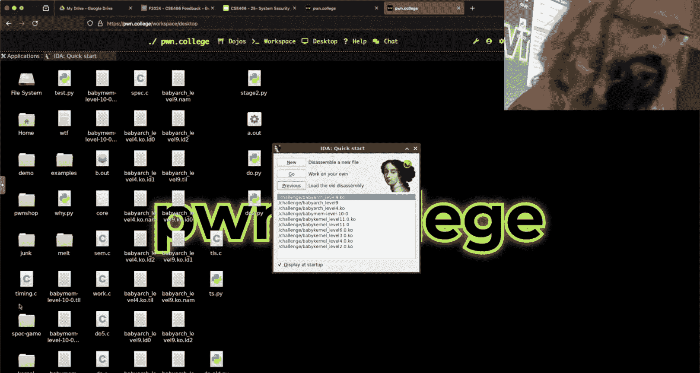
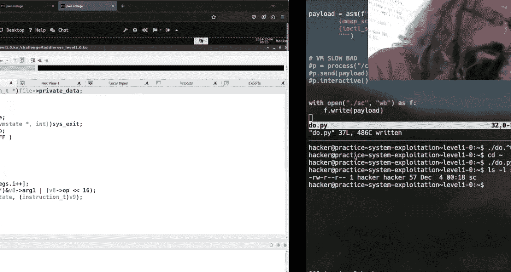
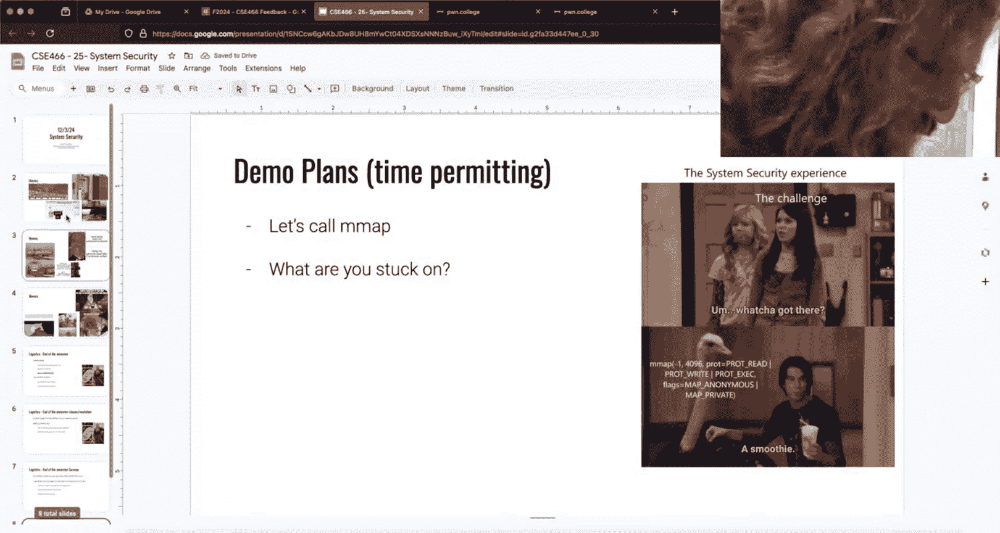

# ASU《计算机系统安全｜ASU CSE466 Computer Systems Security 2024》中英字幕deepseek p28 -29-System Exploitation - CSE466 - Robert - 2024.12.03.zh_en -BV1spCGYZE9D_p28-

Hit this guy over here。We have the slides today， which makes it a good day， right？

I think we're there Give a moment through。You'll twitch feed。It's like kind of there。系。系四点一九。Sa。

Be warned the microphone。No， no， I didn't say the answer but No， no， no， no， I okay to say an answer。

 but you're gonna be like， oh yeah， man， you know， I just come over to my place at， you know，1。

2 to 3 main like， man， don， double docs yourself， please。Right，So today's 123， I think。2024。

 we are in our last week here in the class， which is awesome。Our last module is System security。

 which launched on Black Friday here in CSE 466 at ASU。

This is a great module because of all of the pre recorded stuff you have to watch， right？

There's tons of material that you can go through there's nothing right this thing is entirely reviewed。

But how are we done So we finished micro no， we didn't finish micro， should we to go Okay。

 you guys got it got a reprieve there because everyone。😊，Always stumbles through microarch。

In particular， you run into this exact problem here of your trying。

 you're doing everything right on like level five or some of the speculative execution things and you don't get the right answer。

 you don't get the right answer， you don't get the right answer。

 it's some insanely low probability of you actually getting the information that you want。

 which leads to other way getting stuck on a level five。

 the classic you know the classic blunder of this module。😡。

I you get stuck and instead of writing good code right after four years。

 hopefully of computer science study， instead of writing code that is efficient and make sense。

 we're just going to increment a number on a for loop。

And that changes nothing because the problem is your own， yes。Well， I did this today。

 But during training， you could just have an if true and like have some arbitrary like set as to0。

 then that would train， train your branch predictor and it would work even so training training a for loop。

You can do that in a while loop I I think I know what you're asking or where you're going with this I'll rephse that you can tell me if I'm right or wrong all right so。

Some people and it's not like a secret we actually make these despite what everyone like thinks of these challenges ridiculously easy for you right there are challenges that go out of their way to train themselves there are scenarios where they。

😡，The CPU may not even require training。😡，Right。I think some of the later ones。

are solvable without actually rundoing training loops right the CPU just like just like yeah we're going to guess that way and that's just what it does and that can make you think oh this whole training and stuff is all made up right but it's actually intentional to try and make it easier for you guys to pull off the exploit is that where you're going with it kind kind of I know or at least not level five since at least for the like level 10 is ones you could instead of。

Training the actual chat left sending the like setting the index of the actual job to train it。

 You could just train it by。Have it out like a photo and then give through and just some arbitrary。

Like instruction and that would also train the branch predictor as well as if you just said the index。

 Ill catch out so。What I talked about here so I don't know what level was level 10 wasn't belt out had to be a factorter it was 11 there's 11 meltdown meltdowns 19140 okay so。

When I talk about this factor， I try and keep things straightforward as like can be。

 but in the pre recorded lecture videos like I did allude to the global branch predictor right and for the people that were racing。

 I think it was level five they were raising so far from what I've seen the person who has the best time on level five。

The thing that got them better than the second place person so far is the fact that they did exactly that they had a wild true and then just constantlyly saying yes。

 right， because while true。It depends on what happens in the。

Assembly that'd be interesting to take a look， but I'm going to envision that there is a wild true if something right this is what they had well when you say global branch predictor is there a local branch predictor？

对。So I'm thinking there's only one brand no， no， so so the the statement for twitchitch is is there what is this global thing。

 I thought there was just a one branch predictor that is the branch predictor。 And the answer is。

I'm not the right person to ask because Im not I'm not an expert in computer architecture right there are courses at ASU which I wish I would have taken computer architecture one and two that go into that specifically in detail。

 but my kind of handwaving understanding here。😡，Is that there's multiple things that can influence what gets chosen like when we talk about training in the sense of this module and kind of at face value。

 what I what we encourage you to do， which is run a for loop。😡。

Go through it correctly or true three times and then fire off with your false sea value to speculate that is dealing with I don't know that there's correct terminology but I'll go with it because you hit with it the local branch predictor right and that is what is happening at that virtual memory address right there's also a parts of the CPU that' still just simple state machines but the state is influence based upon larger patterns that are going on across the CPU as a whole。

😡，And that is kind of what we refer to when we say the global branch predictor。

because there can be higher level patterns than just what happens at this particular memory address right well imagine a scenario where we have some type of loop and then a conditional is nested inside a conditional nested inside a conditional nested inside a conditional right now if I had just a local branch predictor Sure I may be able to deduce the correct path ahead of time on some of these but what if within this entire cycle of this larger iteration there is a pattern of true false true true false true false。

 true true false right and then sometimes it's false true true false well like if you build a larger state machine on what are the patterns of yes no that are occurring on the CPU you can identify the relationships between those branches。

😡，And that isn't what the global branch predictor is able to determine。

 which does influence our bias。What will be speculated？😡。

It's not necessary to do that right so the the reason that the other person was able to。Save time。

And maybe twitch will say because they're like angry because that's the second place person， yeah。

 you're not number one， but my understanding of how they saved time is they basically did zero training in their。

Actual speculative code。So they didn't deal with the simple。

2bit state machine that we talk about in this class Instead they just had infinite loop that was like yeah。

 man we're taking it true true to just bias the global branch predictor in another process as as much as they could and a whole other process so they didn't even have the work going on inside their exploit code so that save them the CPU cycles of having to train it which is how they came out ahead which I think is super clever this class in this course as a whole isn't meant to be like an in-dth everything that you could possibly know about memory corruption or everything you could possibly know about kernel exploitation it's like hey man。

 here's something cool and it should be enough where you can reason about it if you were to read say a more modern micro architectitural exploit right you read it write up on it can you reason about what's occurring。

You're not going to be an expert on any of these things I'm not an expert on any of these things right I'm just familiar enough。

😡，To where I could take a look at probably anything related to the topics we've discussed in this class and brought it very easily right and be like okay cool I understand what's happening that's the goal here。

😡，Especially when it comes through micro architectitectural stuff， this is constantly changing。

And so。Even when I say like the local branch predict is like a two bit state machine。

That could change， in the future。So that's just CSs， right， everything is subject to change。

Good question though。Now it goes back to like there's unintends I don't think we could stop that one。

 but I don think that intended solutions are cool right I get to learn one of the things that I enjoy about teaching this class is not only when people have unintended and it's something I didn't think of but also when people ask questions like what you just get there and it's not something I'm like oh yeah man I know this inside and out because it makes me think about it like later tonight I will look deeper into that myself right it gives me an idea of things to look at and learn about myself。

So young 85 makes its return， hopefully you guys wrote that assmb because you had that in microcro arch and as people immediately realized you have that in system。

So hopefully you have that assembly， that'll pay off。Yeah。In general though。

 like grades are posted right， there's no more， there's no more assignments。

 there's nothing going on there that's what I should have done， I should have made a grade slide。

No dayss for you guys in。Prore theres。Yeah， give something for their。But yeah。

 all of the assignments that are in the course are posted between whatever the grades page says your grade is is what the grade will be if you do nothing else。

 I know this is the last week of coursework officially for ASU so hopefully you know like how things are going to go and how much effort to put in。

😡，Typically， students do not。😡，Quoting a ton of effort on the last module， they go do finals。

 I understand do do what's right for you。As you will struggle to figure out what it makes sense to spend your time on。

 whether it's this course or even modules within this course。😡。

The later ones like system exploitation is cumulative right it's going to involve reverse engineering Gwn 85 kernel。

 probably some shell coding。😡，If yous like if there was a shell coding challenge that you could two shell coding challenges you could do in half the time。

 it's equivalent to the whole struggle of one of these cumulative challenges。

 that's not probably not entirely true because the challenge count is the same。

 but it may make sense to go back and look at the edit modules instead of the stuff that's currently li。

 even though you only get half credit and doing so。😡，And as I said at the beginning of the semester。

 the meme extra credit will ultimately pay off， hopefully you feel that right now。

Because it will save your grid。Logistics so next week is finals week。

 which means that the schedule for all rooms and everything changes up。

 I cannot be here in this room。 I will try and do live streams myself on Tuesday。

 Thursday same scheduled time this may or may not beyond Titch I may do it on discord and do something that is much closer to like a office hours handson type type of thing to try to help people that are stuck on anything in the entire course not just the current material Yes you asked us to when we would have this week if we were gonna have it So okay yeah。

 a good question So it's not this slide it's on the next we about the TlDr there is I think instead of doing office hours this week and if you guys like。

Aggressively disagree here， that's fine I can't。I can't be on campus on Friday so my trade off here is like。

 okay， I'll do two live streams targeting two hours each on finals week， Tuesday。

 Thursday same slotlogs be like 430 to 630。U so you'll get you get more time and you get it spread out across the week is that is that a fair trade to you guys or you just like now man。

 it's final week I don't want to deal with anything I'm looking you you're okay with it。

I got a thumbs up there like see， it seems like a fair deal like if you' were like no。

 I really want something this week like I can try and find a place on campus on Thursday or something but this this seems cooler to me so so I may do it on Discord of undecided here if the reason I would do it on Discord is to make sure that it is unrecorded so that way we can be a bit more fast and loose with what we talk about。

It is the last week of class since next week the Fis week。

 so I will not be here for my office hours on Friday and there'll be no recitations with the TAs for final week。

 same reason， room schedules or whatever they are so they are't free some of them are they don't have files so they're like not even here anymore。

😡，UBelts， it's interesting， I think someone had to have earned some belt in this class， right？Maybe。

😊，You earned something， a yellow。Is that all you're going to earn a agree， maybe a agree。

 right I want at least one green。All right， at least one issue should earn green。

So end semester of class recitations， grade fade should occur。

 we typically do not just for this course， but for all the pun College courses。

 a live stream belting ceremony。😡，Somebody says asks what's the current bell curve skew of the class grade。

 I don't know， but it's I'm sure it looks like the left half of a bell curve if I don't count well there。

 it's going to actually you would have to look。Like it's exactly what I showed last week or the week before because technically micro arch and isn't done yet and neither assist。

Um， so whatever I include is I'll kind of wishy wash you since everything else is due at the end of the semester。

 I'll try and show something on Thursday。But I'm sure it's a perfectly fine distribution to the where it should be harder。

嗯。Bting ceremony， we try and do a live stream here on campus where if you have earned a belt and it's not just for this class but for 365 as well。

 the instructorors get together， we have a little you can come up on T if you want。

 we'll award you your physical belt， you don't have to earn all of them up to blue belt。

 just if you've earned it。I believe we've talked about doing it on Tuesday。

 I'll let you know for sure on Thursday。So it's not cumulative you can before the question was is it cumulative the answer is yes。

 so that means if you have not earned an orange belt SL for the the yellow and green but I understand especially since365 added stuff to the orange belt if you were like almost there they just constantly added stuff and piled it on top there was some poor person on the discord I saw where they were like every time every time I saw a wbble they added another。

So I understand， but there's always X master right we do at the be and Sam ceremony every time and if you are an ASu student and you don't want to be on stream like the ceremony isn't important you can always let us know and we we'll give it give a belt to be offstream you just don't get the。

😡，Doug it that preserved on the Internet forever others。And the semester group surveys。

 I believe I don't， have you guys gotten a survey from ASU。

 they usually send it out around this time where they say， hey， reveal your classes。That is BSU。

 I do eventually get to see it。But it's like months after your grades are submitted so feel free to be as brutal as you want hopefully it won't be that bad I had mentioned that I will blast out a Google form soon T I have started making it it'll probably be sent out later tonight I'll finish working on it I'll just put it in the announcements channel I originally said that it was not going to be anonymous and then I give you extra credit I was like oh that's kind of la because I want real feedback from you guys I do get to see it before I post your grades and I don't want you to be scared so so I will make it anonymous and then just everyone here gets 1% extra credit I added that right before I started the stream it's on your grades page congratulations but please still fill out the survey right。

When I do I do send it out， I would greatly appreciate it。All right， demo time。For whatever reason。

 did we talk about this？Before the holiday M map I'm hallucinated。 Yeah， just okay， so I mean。

 we didn't successfully we didn't successfully call Mm。

 but we're like Mm exists us does I colleague ethics P on Okay， that's fair。

 That's fair I don't know if it's or not we can we can give that a shot if you walk for level one。

 we can take a look at level one。And then somebody asked about level three。Oh。You know。

 the name's not the same， but you're calling me Mr。 Robert。What was the deal？The deal was。

 I'll look at level three if you don't call my Mr。All right，Somebody else asked about level two。

If their Ida skills aren't working， what's the best way to debug， do not use Ida to debug， come on。

Do you guys have anything？Yes， I just had a general question but how to send the child code in one I was talking about it over to Gilboard but I saw like various ways of doing it the way I'm doing it now and I'm getting issues with permissions is I am' mapping some memory and then I write some ya code and copy it to that memory and then Iocal to a file descriptor that is the file descriptor of the device we're supposed to write to and I open that device by opening up a separate terminal and running the challenge。

Because， well， I can't open a device without pseudo permissions。

啊。Like I not that I can't open the device， but I can't write the device right。

 but when I try to write to the already open FD， I'm not able to。youW are you okay。

 we'll take a look at level one and when we get to various points。

 let me know and we'll poke at it all right。because。Doing and map it part of the challenge。

 but it's not the crux of the challenge here。

Not much I understand yet no no no， but like we'll successfully call a map hopefully hopefully I can do that in 45 minutes and then we'll we'll try and reason about what's what's going on there so one of the things that you said that kind of worry me is I'm spinning up another terminal and I caught some of the Discord conversation but I didn't want to chime in because it gives me stuff to talk about now。

And one of the questions was， can I open up a filescripter and have it accessible in two terminals？

Right。Anyone want to answer that and say why？This isn't a correct question。

 this is like first principles we've definitely discussed it。

Can you I said it's first principles can I open up a file descriptor and have it accessible in two different terminal windows？

嗯。Second， if I don't close it， we can open two terminals using script pass through those spider scripts。

same process right so the same they are different processes right if I open a different terminal right when I launch a terminal what am I what am I calling what what programs been？

Bash， right typically there are others， but it's just been bash and so if we were to PSAuxX F。

We see here's my bash that calls bash that then called PSAuxXF， right？

If I were to open something in that parent。Bath and then spawn the child bath where we know about telesscriptpers。

They're inherited so the parent would have it the child would have right so could I it's not what I would do and I don't think it's necessary to solve level one。

 but I think it's an interesting like thing to think about here could I create a scenario where I have a parent process。

😡，That then spins off two children。That are terminals yeah I could right I could open something up for fork off a bash instance that would inherit the filescriptor。

 I could fork off like another bash and it would inherit from the parent the file descriptor。😡。

So at face value， I can do that， I type I just accidented the child bash。

 I'm back into the parent bash。Generally speaking， you don't want to nest a bunch of bastars。

 so you definitely can do that I don't think it's necessary for this challenge。

So let's take a look at it。Yeah。In Ida。We're not going to use Ida to debug。What level is this。

 this is I think 1。0。Yet， a Twitch made a few observations。

 but we have to discover it from ourselves， Twitch。

So I have a userland and I have a kernel。Glmanwell。We ma tab here。

What do I have Welcome to so and so。 You can upload some custom shell code。

It opens Proc YPU on some file descriptor。对。不。就嘢冇错。

Now the YPU is a title that they meant to copy you。Proc you then I realized they are' processing， Oh。

 you got the joke。Which once you get to level three， you get multiple YPUs too。Yeah。

 you get more than you need， but you know， better than insufficient。Then it。Calls a map。

This is calling Mpa does it use the fucking scripted？Okay。Mapped whatever bytes for She code at P。

Okay， so that's map calling Mmap to get our shell code reads our bytes of shell code。

Cool challenge about to execute our shell code。Shows us to us。Called set comp。

We're allowed to call Mmap andocyl。And then we are set free。Okay。😊。

DoesAny have any questions about what this thing does？All right， awesome it。

Creates a region memory region some shell code and it opens up the kernel device at Proc YPU。

And then we can only call M and Iopal。Let's take a look at。Colonel Lodwell here。그。

Today I learned PS has an F option， so only some Ps have an F option。On Mac OS， you can't use dashf。

Fine， in fact。All right， we got。And it module is just going to print out some stuff。

 it's going to make this YPU on device open， it's going to Map now this is not an Map call。

 but it's functional in M， I think I said this last blast where it is mapping a region of memory to the private data and that is shared across all of these various entry points。

Now， if MMAP is called on the file descriptor that is exposed by the kernel device。

 it's going to give us that regiongen of memory inside the current。😡。

And then the last thing I'd be interested in is what happens if I call Iotyl because those are the only two things I can do。

 it's called MM and then call Iotyl right based upon this challenge。When I Iocyl， it's down。

 it's down。O， ok。When I ocal。When do we get？我。The three on can。

It's going to loop through and zero out some memory。

I're going to print something is you're going to print device Iocyl， blah， blah， blah。

If the command number or the ocyl。Operation is 1，3，3，7。We call interpret， which we've seen before。

 is a yaN code interpreter。Okay。Where are？啊。The instructions here， I look at interpret instruction。

 that's going to be this V 9， V9。Is V A or1。V 8 is state code。Th of thoughts for the EU command。

Yeah the state is the address state Okay yeah， so that's my initial state what I want a reason about here there's what I'm looking for private data。

 private data okay， I was I was trying to find I was almost there I was trying to find where the ya code bytes are right from reverse engineering I obviously have some passing familiarity with these challenge。

But we've seen an interpret instruction and so I' was just like， okay。

 well where are these instructions， there's the state and then the state's code is the private data and that private data is from the file private data。

 which is that same region of memory that we get from M mapping so we can write yaon code bytes into this thing。

😡，Everyone agree？All right。So。What do I want to do？讲。Well。

 the first thing I want to do is I want to VM connect， otherwise we have a very bad time。

what a minute，'t it you know， you got to try。 You got to try。😊，嗯。Okay， let's see。

 Oh we got some engagement today， What do I got here？

Other completely unrelated to this challenge but fun thing for finalscriptors and terminals so you're familiar with the concept of like a network socket right so on Linux there's something that's known as a UniX socket which is a way of doing communication between processes as well except it's all local one of the cool things about Uni sockets。

Is you can pass file descriptors over a Uni socket from one process to another。😡，All right。

 that would be like way over engineered if you wanted to try and do that， but you could do。fun fact。

U。偶尔。Well， was that unit yeah， most people don't use unit targets the dojo inra does quite a bit though this my go on rapid this conflict like I file a script of one process points to something and some other process since another fileless script of one That's a great question。

 you know the answer is going be。Com， oh， you see。 that one thing I wanted you guys to learn。

All right， you had to learn either G or the answer is to read a man page。

 I I think most of you I got you for both。So啊。对呀。I think I might have made my life a lot harder by using Binja instead of Ida to decompel the module when I solve these。

 Ida has better info on Strs。Maybe all right， so I want to interact with。With this whole challenge。

R rack， it opened it on negative one。Good。And you all you fell into my trap。All right， it works F3。

 you're reading some stuff， we rock and roll。Now， one of the things I saw in this conversation was I'm going。

 I want to write this in see why。嗯。justsica it like easier to write out because there are M maps and it's easier to handle addresses and see that in Python。

Well， let's not。so this I want to say there's another challenge it's not this one。

 but there's a meanme that you guys didn't do that this semester and I think it's about this one and it's it's one of my favorite memes it's the I'm hiding shell code in my shell code right like like that's kind of what this one is like your dog I heard you like shell code in your shell code so I that that's what we're doing here right and we do I have a do dot pie Oh that's bad I'm gonna to be him。

All right， you get out of the Bm。All right， I don't want that do pie。We'll make a new do that。

I believe in Python。呃。I think microcro Arch is the only one that you needed to really use C。

Because ultimately all my all I have to do is pass She code into this thing right okay。

 so usually could usey to write the's all that's why okay。

 so you don' you don't want to have a process， you know I still want to have a I understand what you're saying all right。

At face value， I would want to do something like this。 and then I need to build my。

Payload is going to equal asm and I need to do these things。Now。Way back to beginning of the course。

We had this s cap thing， right， what does it do？It just shall move on like cat on a man going。

The country made processes。It all the challenges， it got me the flarehead。😊。

think there's a yawn so if only it wouldn't surprise me if there is。Um，Some says Seas love C's， yeah。

 C is great， but。Here I don't think we need that， so there is， in fact a shell craft M map。Alright。😊。

And so I may be like， okay， well， how' does this thing work？And we can。Take a quick look there。嗯。

It's going to take an address。Is it constant inside this challenge， yes it is。Find out if this works。

Length。How long is this thing？对，对。

I agree。Good okay， how do I get this， Are you say I want share， How do I get that。Excellly， too。

How do you get that？Lucking it up there's like a dictionary in poem I don't remember。 yes。

So right sir。I cant see。It says one。ButYou said 22， I can map shared in that pop that too。Okay。

Let's take a look there at this thing， it wants protection and then flags。

And then if we take a look here at MAP。What do I want for protection。

 Is that where this comes into play？That's not。So I need。So open this up for what。 read right， cool。

 So let's up here in my script， just say protection equals。Constance。Protect read。

Orard with context or constants， protect right。I guess not wrong well， I mean。

 we could keep Googling and guessing things or I could write code that's pretty explicit about what I'm doing。

 And if it doesn't work， it it's very， very clear what I am doing So read is one right is two and I yes if we or they might agree that would be three but I didn't have to know that it was three right And if I were to past this script for somebody who has never watched any of these lecture videos there's a chance that they can identify what is happening there right versus if I just said yeah。

 Prac is three make it easy make it easy for yourself I will defend myself here I did add you added okay right comments are good's a better way to do it okay。

So。But believe me， I'm not， I'm not all best practices， but I think this is a pretty good one。

 All right， so the other thing I need is that that flag value， this is where you wanted map shared。

 right。So let's put that guy there。Flags will be constants， map share， do I want anything else？

What did the meme say， let's have the meme guide us。I've been signed out all right。

 the meme says map anonymous。What， oh， you say no， I don't know about mapping。

 so I'm sure map private is not right， Im sure map privates not right。Okay。

 so you don't trust the meme。But also， it has etc rot。It also has protect read。

 protect exact okay a negative one as a file description。Yeah no。

 it's it does have negative one there， but that that isn't。

That isn't necessarily for a file descriptor right this is where the main page is our friend the first value is an address and if we were to read this。

 I used the same value that the challenge was using but what this address is is a suggestion right because if the address is old and the kernel will choose where it's going to map this stuff inside the kernel it may be 31337。

 but in userland it could be I't know 12000 right it doesn't matter both of those virtual addresses point to the same underlying region of memory。

Yeah。Just because you said this won't work。All right， said thank you， I think it will。Okay。

 and then what was the I could be wrong， I didn't drive around this it's like let's let's have some fun。

You need to follow the scripture and an offset。Okay。

 file thescriptor we saw down here in the challenge should be three offset， we'll go with。Z。

 is that a reasonable number？And别。I don't need zero Oh yeah， I'm writing C Python kind of。All right。

 what is the return value when I run this， what does this give me？No nobody knows。

 which is a good sign， it means you didn't。Let's do。That makes sense。So。Sorry， it gives me。

Instruction text。ect no， I didn't set， I didn't set the contact， but that' fine。

 right we can't we could。Reasonably guessed that if I set the context up in my script。

 I'll get 64 byte shell code when I run this thing。😡，Or we could just do it。And we see all right。

 I don't care how I had to call it， right， this is this is what happens。And so。

There is my Mmat shell code。Going to make this a up string and inside of it。

 I'm going to put my Mmap shell code。It's just going to take that attached and put it right there。

What else do I want to do？Thus， I want to pass ya85。Shall code into this thing， how do I do that？😡。

아呀对。哦 thatな。I can't Ioc Ioc let me take a quick look here。

And I。Iocyl is how weve we made the machine file。 That's how we get interpret instruction go right。

 so I probably want to do that so we can figure out the other stuff later if you want。All right。

 let's， let's do the ocyl。So what assembly do I in？Oh， we're learning。Shell craft shell。Dot iocyl。

 Okay， that exists。What do we want to pass to this thing？Find the scripture of lighting。Yeah。嗯。

Question mark， you said three the request is， is this hack？No， I no， no I not。哇 no我。

Where am I'm inside diocyl， it's command， this is an int。This one same yes one。Yes。Fimal。Okay。Memark。

いはさ。对一八三四六四。It you tell me， man。 I got this odd thing。 This odd thing， the other thing， right。

 That's my， my third argument。 I think my curs are on it。 we scroll down。 Do we see any yellow。

 we don't give on Okay， we don't， We don't use it。 So I really don't care how Hyython interprets this right。

 I really don't care about C types。It's just going to be zero。Makes sense。Now， some people。

Recognized that。If I do this。Let's not have。Some garbage in there。This is going to take a minute。

I the VM， yes， I am。Maybe it'll blow up and hopefully it works and it just takes me。

Someone says you can pass registers to She craft as strings， yes you can。And so that is kind of lame。

Oh my gosh， it looked like it worked。They didn't。And' even more， okay， we said Fton。😡，Right。

 I didn't I didn't exit right so we kept executing our show code， we got down here， we said faulted。

 doesn't mean anything bad happened。So I'm not going to be worried about that。But that took a minute。

 so let's not do that。嗯。See， I use comments too， so what do we do instead？Okay。

 we're going to write the shell code to a bin file How do I need that How do you want to do that open with open what with open testing Okay it right right by WWWB right。

😊，继度ます。Now， how many of you wrote tons of Python before this course？Oh， I'm surprised。

 I was's been like， look at you guys go。 Look how far you've come。 So now I'm outside of。the VM。

 I can run my do dot pi that makes my payload become this。Shell code file。

Which I can then pass into the challenge， how do I pass that into the challenge what？Oh you't car it。

 oh you guys are awesome。You didn you didn't， you didn't even say like cat。

 that's what I would have done。 What have been a useless cat a to open the product editor。

I would have written a C program to open it and pass it in like， okay， I appreciate the honesty。

 right， but let's let's make things as easy as we can here。😊，Okay。

 so now we have hopefully a working skeleton of what's going on。

Now to circle back to the Discord conversation。The kind of original question was。

Can I have a filescript open into terminals， right？😡。

Do you still think you need that based on what we've seen？No， but okaym。

Tryd to understand how would Pat shall cook。Like what this not so trying to pass shell code or yan code yan Okay。

 no you're good so the the statement was no， I think we can do all this in one process which is my understanding looking at this thing as well。

 but now I'm like， okay， how do I get the yan code in there it's great that I called M right and it's great that I called Iocal。

But how do I get shell code into this thing？And I came to this conclusion before and I was trying to use the IO bill in the third arc。

 but then I looked now realizing that that third arc gets never used Okay， so yeah。

 it's that's one of those like classic reverse engineering Bs is like you make an assumption about how it behaves。

 which you should do to make things quicker。When you reverse engineering， but you when things don't。

Behave how you would expect， you should rapidly reassess like abandoned prior beliefs。U。

 maybe because it's easy to be wrong， so I didn't write all this shell code right。

 pulling tools did it for me。😡，But what do I know about？Anything that's going on here？

So I know that this。I can reasonably assume this right here is my M call， Do agree okay。

 and this right here is my my Ioccal call。What else would I want to do here。

 Where do I need to get the shelf or the yawn code yaon bites into this thing？The address I am that。

Where？Is that value？Where is it， how do I get to it， how do I get that address？

drags after this great， the return values in racks。And if we were to read the main page for a map。

We search for return on success and that returns the point to the MAC area。So at that point in time。

Right here， RaX has the value that I'm interested in。

Can I easily inject myself into here between there， Yeah， I can write whatever I want right here。So。

What do we want to do， we want to put some bites there。I have to figure out what bites I want now。

 so now we have to go deep down the old yawn rabbit hole。Let's see。 Now。

 I'm just curious since this is a。0。Where how do I get the output the message？All right。

 so we do get output here and we see before I did anything。

 it's blowing up quite early with these bytes， which is just whatever happens to be there right we haven't actually written anything to that location。

😡，But just as a proof of concept。I could move into， I don't know， or Dx。Do beef。I like beef。

And we'll move。Into the address defined at RAX。RDx。And do the same thing。嗯。😮，Outside of the VM。

 we'll run our do dot Pi。Inside of the VM。We will not do a useless use of cat。All right。

 we still sg fault when we look at the D message。Yeah。

That looks the same you have the message follow up in another term so you can see what happens。Okay。

 the comment was I could have D message following in another terminal。

 my problem is is that this top window here doesn't really exist because that's my smiling face。Uh。

So on the stream， so if I had it up there， Twitch wouldn't be able to see it。So I want to know。

 did my beef make it， right？Oh， let's see。You say it did？I don't think it did。That's sad。

We't go through all the instructions because it would crash well it would still crash。

 but I should see you would see it I should see it up here as its the rest because the instructions are but it's nice all right I don't care that it's young code so I'm looking at this debug output right a young code instruction is three buts okay。

I right here， if I had beef， which is two bites， we just say B to zero。

 I should be able to see in off zero the first interpretation of where it starts interpreting right。

 I should be able to see I don't know which one of these， but I should see B EEF and I don't。😡。

So I'm doing something wrong here。We the like say。 okay， you， you， you want to。Maybe you are agree。

可 you want to share。F share。you want other else， I'll see it's not popular。Constantance。All right。

 we build it。We do it。With D message， do I get the beef？Oh， there's beef， there's beef。All right。

 where did my beef go？Okay。😊，s。I'm glad that you held your convictions。

just because I'm the clown on stage doesn me and I know a damn thing。So。😊，That did make a difference。

Now do I one of the things I also saw in this discord right so now I have like a path of interacting with this thing and I did it here in Python。

😡，I have a way of Python not being stupid slow。Yeah， I can pretty quickly iterate and debug this。

 right？😡，So this is。The setup I have crmson right now。

 this is what you have right now and it's awesome。I have a lot in place so I'm moving like three bys out a time into the address of where reX is is there a better way of doing that Well。

 that's what I'm doing right now and I think that's very tedious Okay so the statement ism I have to set up and I have complaints this is horrible right because I have to move three bikes at a time into the address and REX is there a way to just if I have。

😊，Already compiled like compiled yako through like a disassembler emmbulator or whatever。

 can I just put all of the buttes like into Rs would that work， you know？

I tried no no you tried what I tried doing something similar to that and it didn't work and I don't know if I'm I had a flataw understanding and how to get this thing ready。

So， okay。So this is where。The magic of computer science right， okay can can save here。Because you。

 if I understand。You're saying， hey， I got this。 All right， cool， I can get some bites in here。

 but the way I'm fixing this is I'm doing。Let's say zero zero beef and then I'm copying this and I have this instruction and this is。

 I don't know， one， three，3，7 and I now have to like hand do all this and it's all in in constants yeah RA or in the add RAX three yeah。

 you're doing you're doing something like this。Okay。

 what is what does it mean there must be a better way。 Yeah， yeah。

 there must be right if only computers had the ability to loop exactly if only we had the ability to write a loop in assembly right this is why this is why I told everyone at the beginning of the semester。

 you need to have some understanding of assembly was for this challenge right here where we have to discover the four loop for like the hundredth four loop loop。

 you need those newss each I need three bys each loop I'm feeding news， we got a hand。

 hopefully there's a thought store store the bys sets of readyython and then you can right okay。😊。

You could all right I don't hate it the statement was you could store the the bytes in in a row python right and then you could since this is an F string right you could。

😡，Generate the hard coded values for every item in the overlay and deal with it as a complex format trick。

😡，Yeah， right， you couldn't do that， I don't know that's where you were going， but I'm going to just。

Pretend that is because that's something that would work， but it still isn't what I do。

 I was going go to a loop， but oh you're gonna go to a loop。 Okay。

 how are we gonna to loop this like make the loop in assembly。

 but have the array be Python the index So if the loop is in the assembly right So this this string only exists in my Python right And so if the array is up here in the Python。

I can't access that in the assembly because I'm dumping it to a fire Yeah。

 you meant the upstream thing。 Yeah， yeah， I was pretty confident in thats what you meant。So。

We could do this， but there must be a better way。So。I'm going to have。Younk code。

Whathy should my young coat equal， It's going to be some bite string。嗯。I have to think。

 why am I thinking？Oh， x133， now let's do B lead。Beef eat， and then else do we want？De beef。O。Oh。

 I have to remember how that works。Now， so that is probably not 168 books if we look at。Pack。

 there is a。Word size。Can be all， that's what I want。

But then I don't have to worry about how long it is。What up。A little later。

I don't have to do anything。It knows that it's going to be little Indian because I set the context architecture to be AMD64 you saw Indian and this nu here right identity being explicit is good and so like I wouldn't say don't do that。

But it's not necessary in this case now I'm doing this just to have something that's multiple bytes right in length that is my yam code how you generate your yan code is hopefully something that you've written in Python this yan code asmbler and so now you can easily generate that yam code and just import yaon code assembler write some inline yam code here that gives you some byte string。

because you did that because I told you to do that at the beginning of the semester right the perfect world though in a perfect world。

 I live in a perfect world right， I know you guys did and so I know you guys got this so I have my yan code here。

Now my problem。I I need my yank code bytes to be in the assembly。Can I do that？See this yes。

 otherwise like why would I ask， right， so I'm going to have yan code bites。Be a label。

And then I'm going to。Ohoh， what do I want here。Let's put a map。哦。I like this。

 I did this trick before， I think。嗯。😊，So now。What's I had my payload？I'm going to concatenate。

I'm going to call it Yonkko by because that's more accurate。I can just smack that onto the end there。

And so what I have now is a hex 90 because that is a notob followed by whatever my assembly generated for ya code bys。

😡，Can I access this location in my assembly？Yes， the statement was yes， I'm going to use， where am I？

Now， I am here。This is where I wanted to do this stuff。

 so let's move into what do we want RBX RBX feels good。Except I don't want move， I want LEA。

 the comment wasRip plus yaon code bys。Okay。Can I write a for loop？All right。

 how do I write a for loop assembly and top of loop。What's my， what's my terminal condition here。

 half half half， okay， so I need some counter。We'll move into sure RCx zero。

you want to useC I' going to code it's a good question so statement was I sure I want to use RCX because RCX gets mangled when you perform cis cults？

Well， I'm doing this this call here。And then I'm doing the cis code out here do I need RCX to persist across a Cis call boundary。

 the answer is no， so it's not going to break me here。

 but it is something to think about gene right if I was performing a loop and then calling a cis call。

 then I would have troubles。😡，All right， so I have top of loop， what do I want to do， I want to move。

 do I need another address？Now， let's move into， yeah， we'll just keep this pattern RX。

Whatever is at RBx。All right， and then we're going to move into。

I'm covering myself up Can I make this。I'm just I'm just doomed to cover myself I'm sorry all right。

 so what is this move is grabbing from rip plus yank code banks and putting that value into the RDX where do I want it to go to where reX is point where REX is pointing so we can send that to where REX is pointing。

And then what do I want to do？doHow much do I increment RCX by？By three。Wai。

 R six or REs RCx is my counter， by one， but and then increment RX by three。So our6 one。

 well our you want this yeah， since if。3。开始咗。So this is how you're not your I get why you say three because the ya code instruction is three bytes。

 but I'm not moving this in chunks of three Emma well。

 what are the increments that I'm moving this by eight bytes at a time right and so I probably want to increment my pointer。

😡，B8 bytes。And then I know rex and our。BX。Or are my pointers？So， then。I ink RAX。

 what is my comparison？诶啲。RRCX。Or you can compare that RRC do you want to with FF no， then not。

by total number of bytes divided by eight right。It's 256 divided by history What is 256 divided by8？

It's one so 9696 in decimals， but we want to stop almost1 well because you have you have you have up FF instructions typically so you three bytes per instructions to 56 times three and you might up by eight。

And then divide56 by 6 is we are loading by at the time divide by divided by8 is 32。

 we agree the256 divided by8 is 32， But I think this meeting is on to something as well。

3 and then divide by3 So instructions have have FF code instructions which means that we really can write and a young code instruction is3 byte so we can really write F times 3。

Bte， but since we're rating eight at a time right， so we we can we can just let Python do the hard work All right。

 we have FF times three we divide by8。啊。Yeah， okay， what do I do I'm okay with that I'll take。

 I'll take 96。 right The problem is， what happens。😊，What happens so if I do。

Divided by a F F times three， why， why does that have a fraction this should be because if I use a bracket you want this。

It fixed everything。SpotYeah， you want double slash for integer to。

But that's that's not really where I was what I was going for there the the page that's mapped is hex 1000。

 but only so much of that is usable so one of two things we ran risk of okay either。Fff。

Times three is bigger than a page。It it's not at which point we would overwrite and we would say fault or which we have this case where F of times three is less than a page and there's just some bytes that we would write that don't matter for this context。

😡，So we're actually perfectly fine with 96。All right。So I want to compare this。96。And then what？

Jlessss。JLE。做个。呃，就找公。だナは。Yes， jump at the sixth grade we did a9 to six。But we started zero， no。

 it's just jump lessoner。ButYeah， because it's started in zero correct， so it's zero so two days out。

I'll go with this， we'll see what happened。So in theory。

 we're going to live through this starting from zero yet fourlift still worked that way。

 so it wasn't less than equal we'll go for 96 iterations of thisgra eight bytes at a time which will be just over the three times FF that we need。

That is going to load all of our memory that we then we trigger the ocyl now there's still something wrong here。

你好讲。What is it， is it x90 that gets3 though Okay， so there is that H90。

It's going to cause me some grief， isn't it？How do I fix that？And the rights。Kgan。

 you heard you saw someone said， but remove it， okay so。That's not going to work or if it does。

 like I will feel bad， oh， it does work I。That's that's kind of cool I see I seem to remember the compiler complaining that you had to have something after I labeled but。

I guess not， all right。So sometimes the simple answers that are the answer。

's that's why I had to have been up。 All right， so now we have that。All right， we still s faulted。

Take a look at the D message。Thank you。Don here be。I got B。有不团这。I instruction pointer 62。

 so it could be about something。Yes。So I think that's it actually executing， right， shouldnn't it。

 doesn't it still loop through。if it if it comes as an unknown register after unknown like opera code。

 it like just does this also it does this if it satfis more and more。

Yeah instructions like if an opera satisfiable I am Oh yeah it will do this Oh Okay。

 so she have some idea what happened by claim here I successfully wrote a for loop。 All right。

 let see， you agree four years at ASU， you can identify a for loop。

I like it so so hopefully this by using just。😊，Where where where's， where's the meme。

Where's the meme。

Come on， mame。By writing good code。By writing good code。

 we can save ourselves the painting of doing ridiculous brute forest work。Right。

 and like the skeleton， like this framework of what I have written here。

Is something that generically works for this problem of end mapping andocly right maybe in level two I have a problem that's slightly different level three there's something that's slightly different okay。

 if I need to change my account that easy to do yes right use programming as a tool to save you the pain of hard coding things。

😡，Does anyone have any questions about what I did here？😡。

Was it a good yellow demo a good yellow demo so what I was going say all right。

 and until you guys warm up to me All right I hadn't equally just like solution but you beat me all right。

 you beat me on this one。Not this not be starting what happens？If I add one。To account for that。

Right it turns out I could just like start this whole thing at the next flight and never life would have been great。

 but I totally agree that if the asmbler will let me。

Let's just keep things at nice multiples day ahead I seem to recall the the assembler so it wouldn't be when you send the payload it would be this ASM call that would give you grief so the fact that we made it there is impressive to me also audience is the address。

Yeah you want to Yes you don't wants because if you incr it's the first bike would be something that。

 So it wasn't R X。 So it's R B X this thing。 That's what I want。 yeah， there we go。 All right。

 one of them goes that one。 Maybe I make the other one go down one and then it still works。

 All right， the point is is that you can easily do that， but。😊。

Just making there be no no is the superior most straightforward answer。All right。

 are you good as far as your conversation， things you were thinking about？Yeah。

 I definitely as always like over complicatedlicated and it trying to like retrofit a method that they'll work for me to a different challenge basically like that's that's a common problem like you're like oh I did this let's just do the same thing I try and not make assumptions and just work from first principles generally speaking for years like I told people to never use shell craft but I think this you know at this point in the course。

I believe you can write assembly assembly， maybe not a for loop。

 but I believe you could set up some set up some registers and maybe type this call right and so Shellcraft can save you that that pain。

With that I'm definitely out of time， hopefully that was useful for everyone with Aivia。

 I'll see you on third， I'll show whatever the grade distribution is。Goodbye， good luck， have fun。

