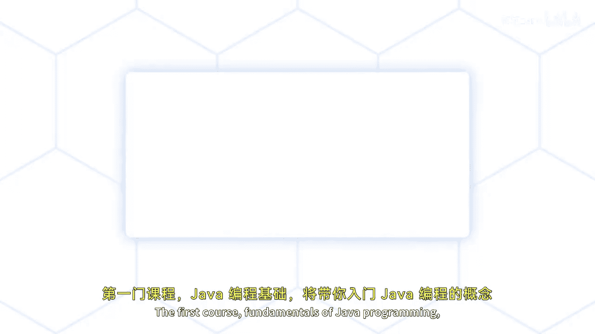
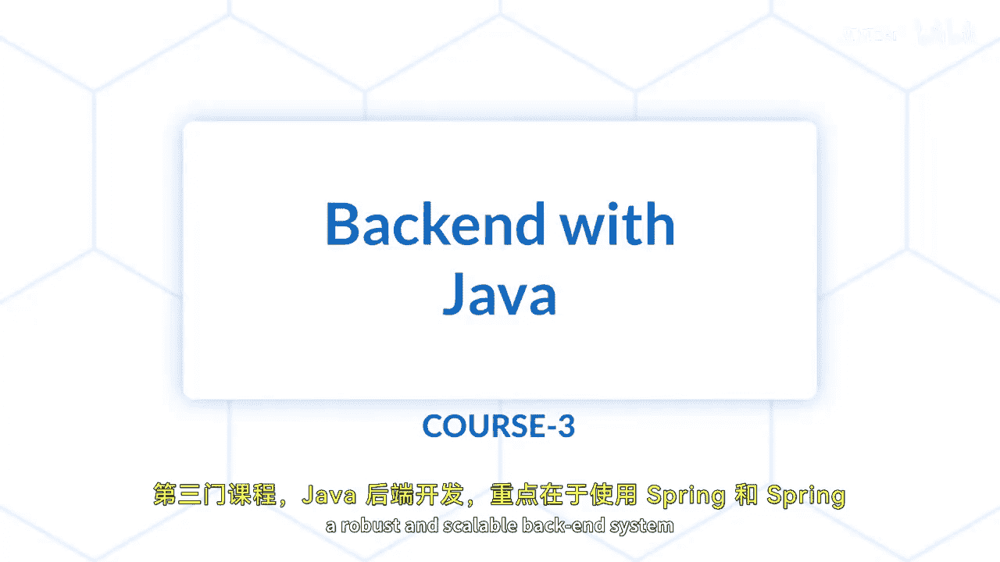

# 001：课程介绍 🚀

在本课程中，我们将学习Java全栈开发专项课程的总体结构与目标。本专项课程旨在为你提供Java编程及其在构建Web应用中的全面理解。

专项课程包含三门核心课程，它们将为你提供成为一名熟练Java开发者所需的知识与技能。

以下是三门课程的简要介绍：

*   **Java编程基础**：这门课程将向你介绍Java编程的核心概念与原则。你将学习Java编程的基础知识、核心概念以及面向对象编程原则。
*   **使用Angular进行前端开发**：这门课程专注于使用Angular框架构建和开发动态、响应式的前端Web应用。你将学习如何设计和开发能与API交互、并与后端系统集成的复杂Web应用。
*   **Java后端开发**：这门课程专注于使用Spring和Spring Boot框架构建健壮、可扩展的后端系统。你将学习如何开发RESTful Web服务、将前端应用连接到后端，并将应用部署到云平台。

在完成本专项课程后，你将牢固掌握Java编程基础，能够使用Angular开发动态响应式的前端Web应用，并使用Spring和Spring Boot构建健壮可扩展的后端系统。

本节课中，我们一起了解了Java全栈开发专项课程的整体框架与三门核心课程的主要内容。下一节视频中，我们将正式开始学习。