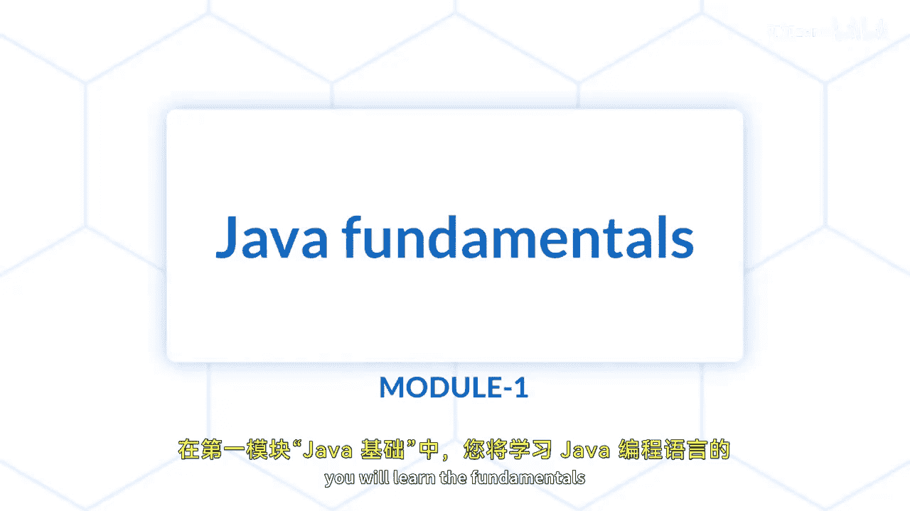
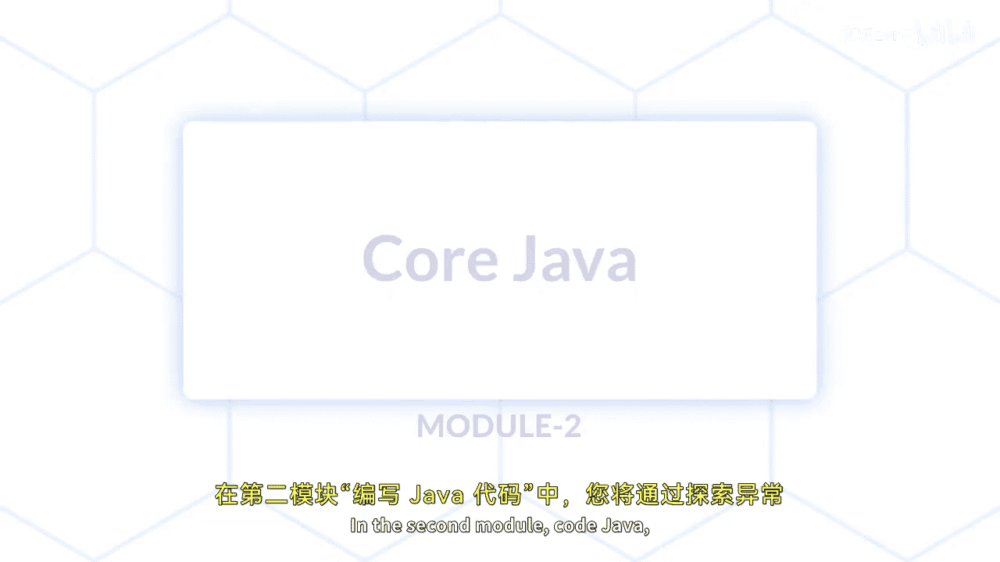
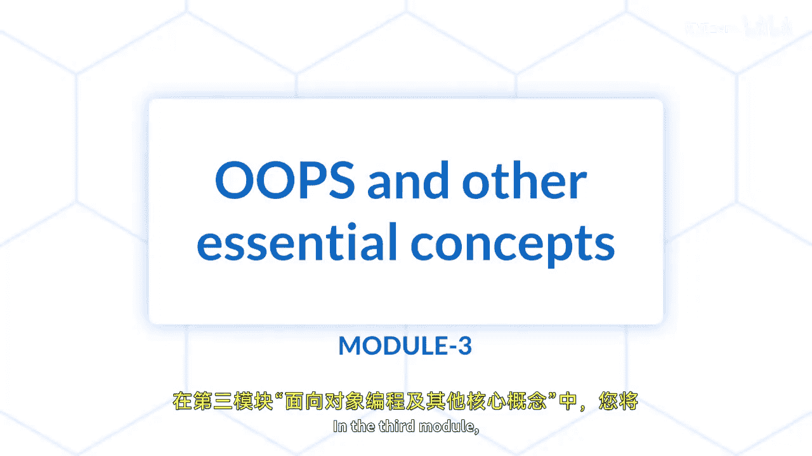
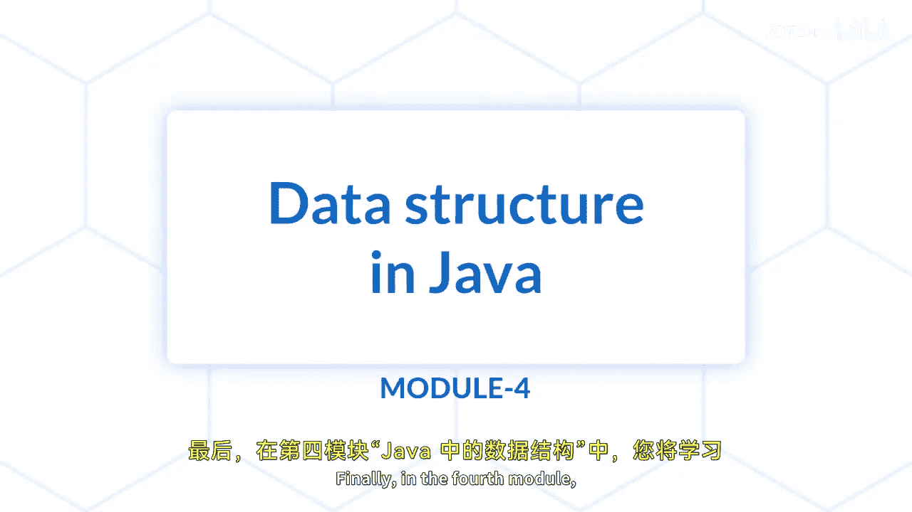

Java全栈开发：01：课程介绍

在本节课中，我们将要学习Java编程基础课程的整体结构与核心内容。本课程旨在为零基础的学员构建坚实的Java编程基础，涵盖从基础语法到数据结构的完整知识体系。

欢迎来到Java编程基础课程。

在本课程中，你将学习Java编程语言的基础知识，以及如何使用Java编写高效且有效的代码。

本课程专为Java编程的完全新手设计，旨在帮助他们建立扎实的基础。

---

### Java基础模块

上一节我们了解了课程的整体目标，本节中我们来看看第一个核心模块。

在第一个模块“Java基础”中，你将学习Java编程语言的基础知识，包括其语法、数据类型和运算符。

以下是该模块将涵盖的关键主题：
*   条件语句
*   循环
*   函数

---

### 深入Java编程

掌握了基础语法后，我们将进入更深入的Java编程世界。

在第二个模块“代码Java”中，你将通过探索异常处理、文件I/O和数组操作等主题，更深入地学习Java编程。你还将学习面向对象编程的概念，如继承、多态和抽象。

以下是该模块的核心概念：
*   **异常处理**：`try-catch-finally` 代码块。
*   **文件I/O**：使用 `File`, `FileReader`, `BufferedReader` 等类。
*   **面向对象编程**：`class`, `extends`, `@Override` 等关键字。

---

### 面向对象与其他核心概念

理解了基本的面向对象思想后，本节我们将学习更高级的概念和其他编程要点。

在第三个模块“Oops和其他核心概念”中，你将学习更高级的面向对象编程概念，如接口、抽象类和封装。

你还将探索其他核心概念，例如多线程和并发。

以下是本模块的重点：
*   **接口**：`interface` 关键字。
*   **抽象类**：`abstract class` 关键字。
*   **封装**：使用 `private` 修饰符和 `getter`/`setter` 方法。
*   **多线程**：`Thread` 类或 `Runnable` 接口。

---

### Java数据结构

具备了扎实的编程基础后，最后我们将学习如何有效地组织和管理数据。

在第四个模块“Java数据结构”中，你将学习Java中最常用的数据结构，包括数组、列表、栈和队列。

你还将学习搜索和排序算法，以及如何在Java中实现它们。

以下是本模块的主要内容：
*   **数据结构**：`Array`, `ArrayList`, `Stack`, `Queue`。
*   **算法**：例如，冒泡排序算法可以用 `for` 循环嵌套实现。

---

### 课程总结

本节课中，我们一起学习了Java编程基础课程的全貌。课程结束时，你将牢固掌握Java编程的基础知识，并能够使用Java编写高效且有效的代码。

你也将为学习更高级的Java编程主题做好准备，并进一步发展你作为Java开发人员的技能。