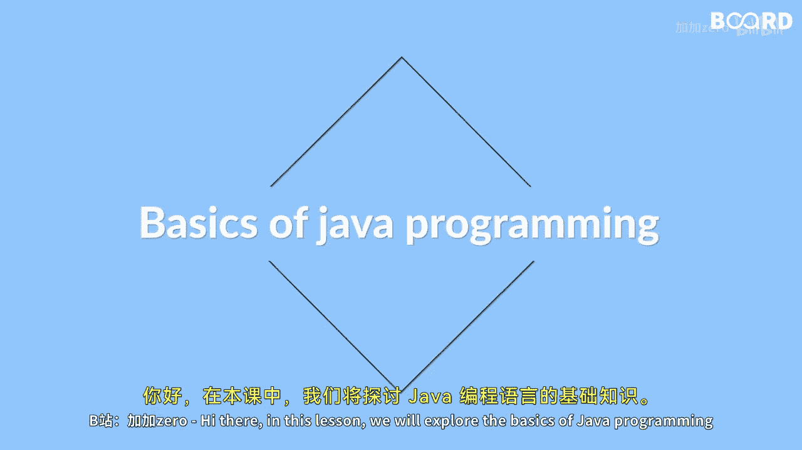

# 004：Java语言基础入门

在本节课中，我们将探索Java编程语言的基础知识。我们将了解Java的历史、核心特性、与其他语言的对比，以及如何搭建开发环境并理解代码的执行过程。

## Java简介

Java是一种广泛使用的高级编程语言，最初由Sun Microsystems公司于1995年发布。自那时起，Java的普及度不断增长，如今被应用于多种场景。

以下是Java的一些主要应用领域：
*   **Web开发**：用于构建服务器端应用程序。
*   **移动应用开发**：特别是Android平台。
*   **企业软件开发**：构建大型、分布式系统。

## Java与C++的对比

上一节我们介绍了Java的概况，本节中我们来看看Java与另一种流行语言C++的异同。虽然Java和C++都是面向对象的语言，但它们之间存在几个关键区别。

以下是两者的一些主要差异：
*   **学习与使用难度**：Java通常被认为比C++更易于学习和使用。
*   **内存管理**：Java提供了更高级的特性，如**垃圾回收（Garbage Collection）**和自动内存管理，而C++需要手动管理内存。
*   **平台依赖性**：Java遵循“一次编写，到处运行”的原则，而C++代码通常需要针对特定平台进行编译。

## 开发环境与执行过程

了解了Java的特性后，接下来我们需要知道如何开始编写Java程序。这涉及设置开发环境并理解Java代码是如何被执行的。

以下是开始Java编程的基本步骤：
1.  **安装JDK**：从Oracle官网下载并安装Java开发工具包。
2.  **配置环境变量**：设置`JAVA_HOME`和`PATH`，以便在命令行中访问Java编译器。
3.  **选择开发工具**：可以使用文本编辑器（如VS Code）或集成开发环境（如IntelliJ IDEA）。
4.  **编写与运行程序**：创建`.java`源文件，使用`javac`命令编译，再用`java`命令运行。

Java代码的执行过程可以概括为：**编写源代码 -> 编译为字节码 -> 由JVM解释执行**。

本节课中我们一起学习了Java的基础知识，包括其历史、应用、与C++的对比，以及搭建开发环境和理解代码执行流程。这些是开启Java编程之旅的重要第一步。