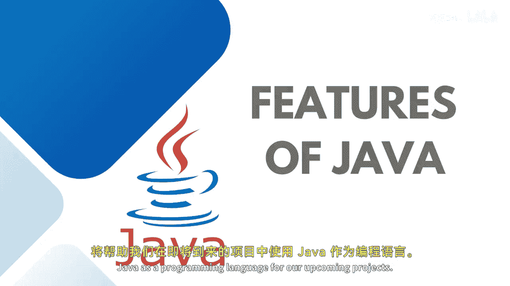
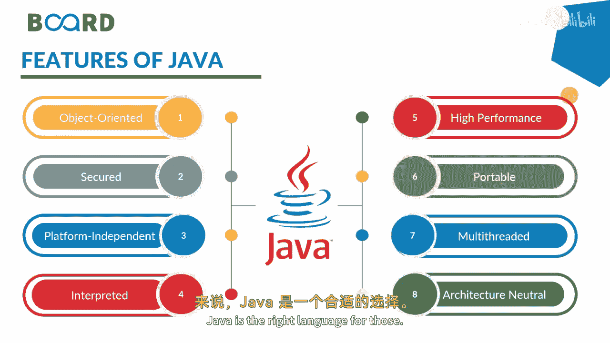
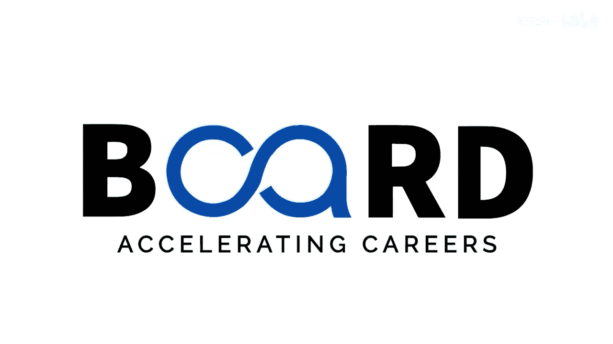

Java全栈开发：P06：Java语言的核心特性

在本节课中，我们将探讨Java编程语言的核心特性。理解这些特性将帮助我们更好地运用Java进行项目开发。

Java语言的设计目标是使其成为一种可移植、简单且安全的编程语言。除此之外，它还有一些卓越的特性，这些特性对Java的流行起到了重要作用。

上一节我们提到了Java的设计目标，本节中我们来看看这些具体的特性。以下是Java的主要特性列表：

*   **面向对象**：Java是一门纯粹的面向对象语言。即使编写主方法（程序的入口点），也必须将其包含在一个类中。例如，一个基本的程序骨架必须从定义一个类开始。
*   **安全性**：Java以安全性著称，可用于开发无病毒系统。其安全性源于没有显式指针，并且Java程序运行在虚拟机沙箱中。
*   **平台无关性**：Java遵循“一次编写，到处运行”的原则。编译后的字节码可以在任何安装了Java虚拟机（JVM）的平台上运行。
*   **解释执行**：Java代码被逐行解释执行。这使得在遇到迭代、错误或程序漏洞时，可以即时进行调试和修复。
*   **高性能**：通过即时编译器（JIT）等技术，Java能够提供接近原生代码的高性能。
*   **可移植性**：得益于其平台无关性，Java程序可以轻松地在不同操作系统间移植。
*   **多线程支持**：Java内置对多线程编程的支持。线程类似于独立执行的并发程序，通过定义多个线程，Java程序可以同时处理多项任务。
*   **体系结构中立**：Java支持类的动态加载，即类在需要时才被加载。它还支持通过Java本地接口（JNI）调用用C或C++等语言编写的函数。

对于需要将项目从旧版本或其他语言迁移到更现代编程范式的开发者而言，Java是一个理想的选择。

了解了Java的特性后，我们来看看它的实际应用领域。Java用途广泛，你可以在以下场景中使用它：

*   **控制台应用程序**
*   **Web应用程序**
*   **Android移动应用**
*   **客户端-服务器架构的服务器端应用**（尤其在金融服务行业）
*   **嵌入式系统**
*   **大数据技术**

因此，Java为开发不同类型的程序或应用提供了广泛的可能性，你可以根据自己的需求选择合适的应用方向。

本节课中，我们一起学习了Java语言的核心特性，包括面向对象、安全性、平台无关性等，并了解了Java在控制台应用、Web开发、移动应用等多个领域的实际用途。掌握这些特性是有效使用Java进行开发的基础。