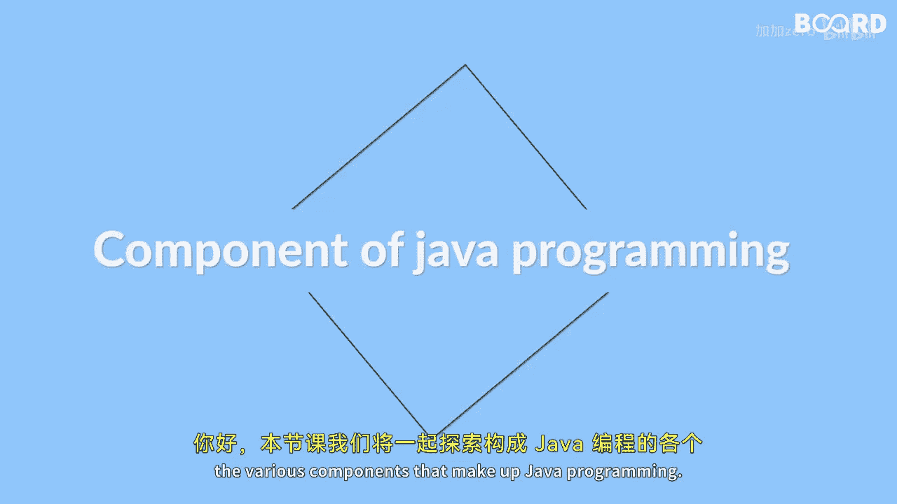

# 009：本课你将学到什么 🎯

在本节课中，我们将学习构成Java编程的各个核心组件。你将了解Java虚拟机、Java运行时环境和Java开发工具包，并理解它们如何协同工作，使Java程序能够在不同平台上运行。最后，我们将通过编写一个简单的“Hello World”程序来实践，理解Java程序的基本语法和执行流程。

---

上一段我们概述了本课的目标，接下来，我们来详细看看Java编程的几个核心组件。



## Java的核心组件

以下是构成Java生态系统的三个关键部分：

1.  **Java虚拟机**
    *   JVM是一个抽象的计算机器，它负责执行Java字节码。
    *   它的核心作用是提供平台无关性，实现“一次编写，到处运行”。

2.  **Java运行时环境**
    *   JRE是运行Java程序所需的环境集合，它包含了JVM和Java核心类库。
    *   用户只需要安装JRE，就可以运行已编译好的Java程序。

3.  **Java开发工具包**
    *   JDK是供开发者使用的工具包，它包含了JRE以及编译器、调试器等开发工具。
    *   开发者使用JDK来编写、编译和调试Java程序。

这些组件协同工作：开发者使用**JDK**编写和编译源代码（`.java`文件）为字节码（`.class`文件）。然后，**JRE**中的**JVM**加载并执行这些字节码，通过调用**JRE**中的核心类库来完成程序功能。

---

了解了理论部分后，我们将通过实践来加深理解。本节中，我们将动手编写你的第一个Java程序。

## 编写“Hello World”程序

我们将创建一个简单的程序来理解Java的基本语法和结构。

1.  **创建Java源文件**
    *   使用文本编辑器创建一个新文件，命名为 `HelloWorld.java`。
    *   在文件中输入以下代码：
        ```java
        public class HelloWorld {
            public static void main(String[] args) {
                System.out.println("Hello, World!");
            }
        }
        ```

2.  **编译程序**
    *   打开命令提示符或终端，导航到 `HelloWorld.java` 文件所在的目录。
    *   使用JDK中的 `javac` 编译器进行编译，命令为：
        ```
        javac HelloWorld.java
        ```
    *   如果编译成功，将生成一个 `HelloWorld.class` 的字节码文件。

3.  **运行程序**
    *   在同一个命令提示符中，使用 `java` 命令运行程序，命令为：
        ```
        java HelloWorld
        ```
    *   此时，JVM会加载 `HelloWorld.class` 文件，执行其中的 `main` 方法，你将在屏幕上看到输出：`Hello, World!`。

通过这个过程，你可以清晰地看到：我们使用**JDK**的 `javac` 工具编译源代码，然后由**JRE**中的 `java` 命令启动**JVM**来执行生成的字节码文件。

---

本节课中，我们一起学习了Java编程的基础架构。我们首先明确了JVM、JRE和JDK这三个核心组件的定义、区别与协作关系。随后，我们通过编写、编译并运行一个“Hello World”程序，实践了Java程序从源代码到执行的全过程，直观地理解了这些组件是如何各司其职，共同完成“一次编写，到处运行”这一目标的。掌握这些基础知识，是后续深入学习Java全栈开发的重要第一步。