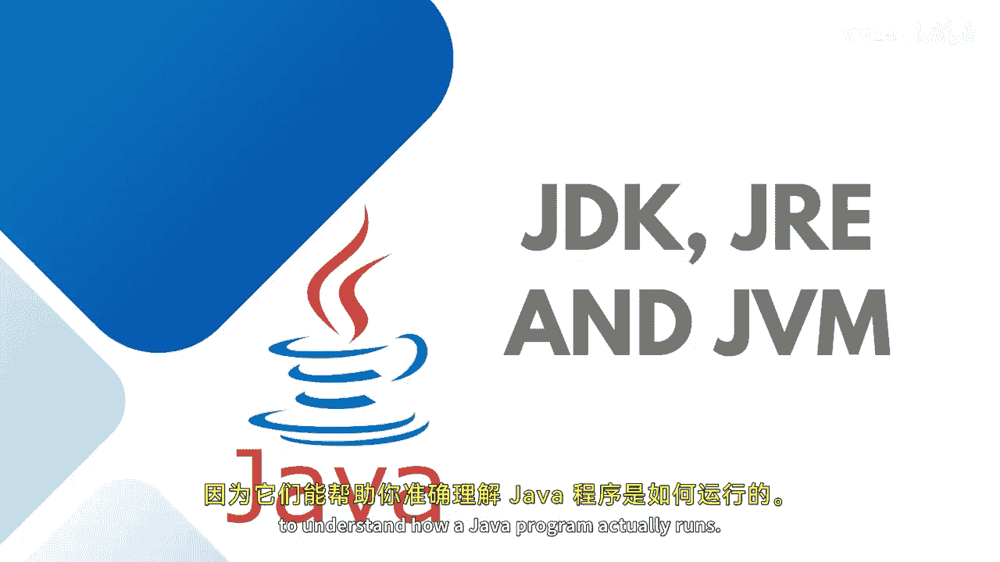
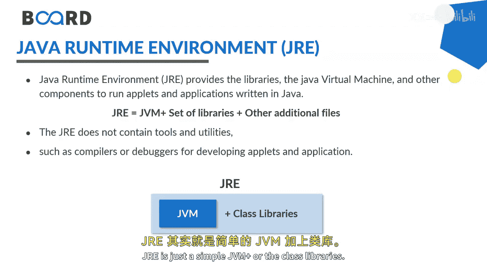
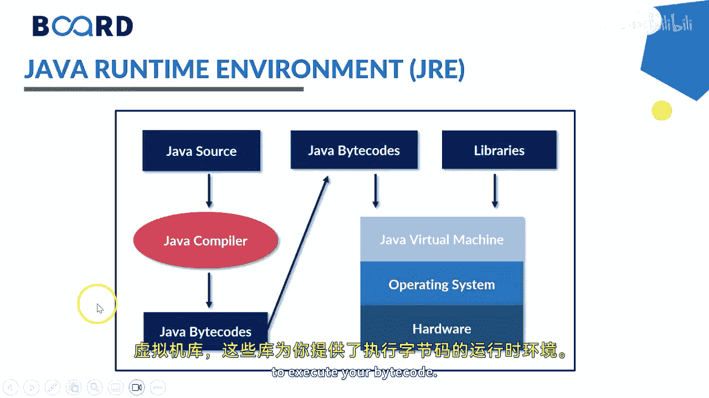
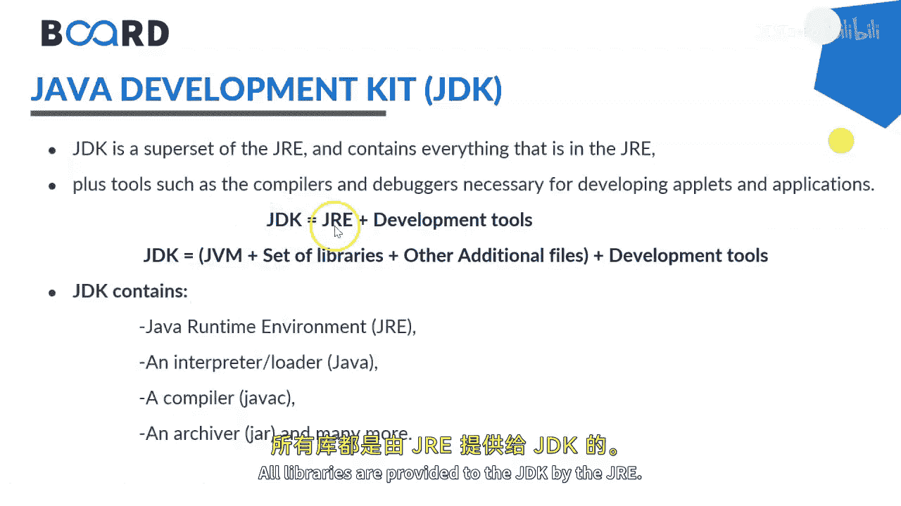
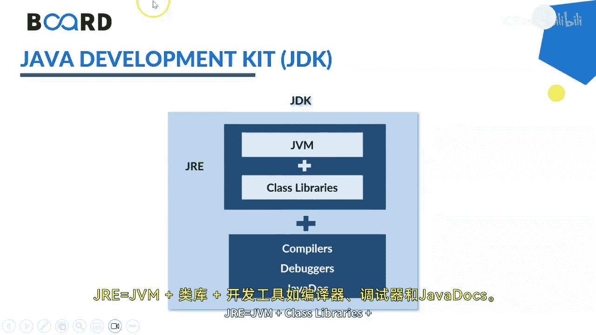

# 010：JVM、JRE与JDK详解 🚀

在本节课中，我们将学习Java平台的三个核心组件：JVM、JRE和JDK。理解它们之间的区别与联系，是掌握Java程序如何运行的关键。

---

## 概述

Java程序的运行依赖于一个完整的软件栈。我们将逐一剖析Java虚拟机（JVM）、Java运行时环境（JRE）和Java开发工具包（JDK），明确各自的职责与包含关系。

---

## JRE：Java运行时环境

上一节我们概述了Java平台，本节中我们来看看JRE。JRE是Java Runtime Environment的缩写，它为Java应用程序的运行提供了必要的环境。

JRE包含运行已编译的Java程序（即字节码）所需的所有核心库和Java虚拟机（JVM）。它不包含任何开发工具，如编译器或调试器。

其核心构成可以用一个简单的公式表示：

**JRE = JVM + 核心类库**

以下是JRE的主要组成部分：
*   **Java虚拟机（JVM）**：负责执行字节码。
*   **核心类库**：提供Java API，如`java.lang`, `java.util`, `java.io`等。

简单来说，如果你只想运行别人写好的Java程序，安装JRE就足够了。

---

## JVM：Java虚拟机

了解了运行环境后，我们深入看看其核心——JVM。JVM是Java Virtual Machine的缩写，它是实现Java“一次编写，到处运行”这一跨平台特性的基石。

当我们编写Java源代码（`.java`文件）后，编译器会将其编译成一种中间格式，称为**字节码**（`.class`文件）。字节码是平台无关的。JVM则充当了字节码与底层操作系统和硬件之间的翻译官。它在不同平台上提供统一的运行环境，负责加载、验证、解释或编译（JIT编译）并执行字节码。

其工作流程可以概括为：
1.  编写 `HelloWorld.java`
2.  编译为 `HelloWorld.class` (字节码)
3.  JVM加载并执行 `HelloWorld.class`

---

## JDK：Java开发工具包

前面我们介绍了运行环境JRE和执行引擎JVM，本节中我们来看看开发者的工具箱——JDK。JDK是Java Development Kit的缩写，它是功能最完整的Java套件。

JDK不仅包含了运行Java程序所需的JRE，还额外提供了一系列用于开发、调试、监控和文档化Java应用程序的工具。

其包含关系可以用以下公式清晰地描述：

**JDK = JRE + 开发工具**

因此，JDK的构成可以进一步展开为：
**JDK = (JVM + 核心类库) + 开发工具**

以下是JDK包含的主要开发工具：
*   **编译器 (`javac`)**：将`.java`源代码文件编译成`.class`字节码文件。
*   **调试器 (`jdb`)**：用于调试Java程序。
*   **打包工具 (`jar`)**：将类文件打包成JAR归档文件。
*   **文档生成器 (`javadoc`)**：从源代码注释生成API文档。
*   **其他工具**：如`java`（启动器）、`jps`（进程状态工具）、`jstack`（堆栈跟踪工具）等。

对于任何想要编写Java程序的人来说，安装JDK是第一步。

---

## 总结

本节课中我们一起学习了Java平台的三大核心组件：
1.  **JVM**：Java程序的执行引擎，负责解释/编译并运行字节码，是实现跨平台的关键。
2.  **JRE**：Java程序的运行环境，包含JVM和核心类库。用户只需JRE即可运行Java程序。
3.  **JDK**：Java程序的开发套件，包含JRE以及全套开发工具（如编译器、调试器）。开发者必须安装JDK。

它们三者的关系可以总结为：**JDK ⊃ JRE ⊃ JVM**。理解这个层次结构，有助于你更好地搭建开发环境和排查运行时问题。在下一课中，我们将利用JDK编写并运行我们的第一个Java程序。