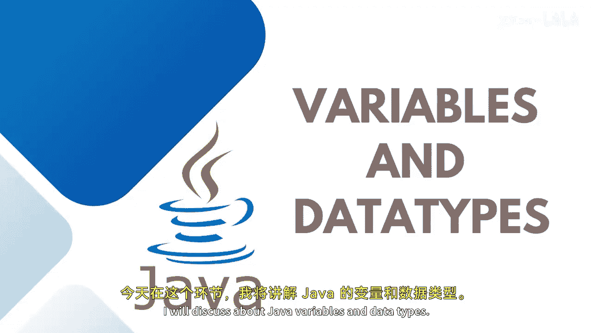

# 014：变量与数据类型




在本节课中，我们将学习Java编程语言中的两个核心概念：变量和数据类型。理解这些基础知识是编写任何Java程序的起点。

## 变量概述

变量本质上是一个用于存储值的内存位置。这些值需要在程序执行过程中被使用。为了标识这个存储区域，每个变量都必须被赋予一个唯一的名称。通过这个名称，可以在整个程序执行过程中使用该值。

在使用变量之前，必须用特定的数据类型声明它。

## 变量的类型

Java中有三种类型的变量：
*   **局部变量**：在方法、构造函数或代码块内部声明的变量。
*   **实例变量**：在类内部但在任何方法、构造函数或代码块外部声明的变量（非静态）。
*   **类变量（静态变量）**：使用 `static` 关键字声明的变量，可以通过类名直接访问。

本节课我们将主要关注局部变量。

## 变量的声明与初始化

以下是声明变量的语法：首先定义数据类型，然后是变量名，接着使用等号 `=` 为其赋值。

**语法**：
```java
数据类型 变量名 = 值;
```

例如，要存储一个整数值，可以这样写：
```java
int a = 10;
```
这里，`int` 是数据类型，`a` 是变量名，`10` 是存储的值。

你可以在一行语句中声明多个变量，用逗号分隔：
```java
int x, y, z;
```
也可以先声明变量，稍后再赋值：
```java
int age;
age = 25;
```
在声明变量的同时赋值，这个过程称为**变量的初始化**。

## 数据类型介绍

上一节我们介绍了变量的声明，本节中我们来看看数据类型的细节。数据类型指定了可以存储在变量中的数据的种类。Java中的每个变量都有一个特定的类型，它决定了需要为该变量分配多大的内存空间。

Java的数据类型主要分为两大类：**基本数据类型**和**引用数据类型**。

## 基本数据类型

基本数据类型是Java语言中预定义的。它们直接存储值，而不是存储对值的引用。基本数据类型的大小不随操作系统的改变而改变，这得益于Java的平台无关性。

Java共有8种基本数据类型，以下是它们的分类和说明：

**整型**：用于存储没有小数部分的整数值。
*   `byte`：1字节，范围从 -128 到 127。
*   `short`：2字节，范围从 -32,768 到 32,767。
*   `int`：4字节，范围从 -2^31 到 2^31-1。
*   `long`：8字节，范围从 -2^63 到 2^63-1。

**浮点型**：用于存储包含小数部分的数值。
*   `float`：4字节，单精度浮点数。
*   `double`：8字节，双精度浮点数。

**字符型**：
*   `char`：2字节，用于存储单个字符。Java基于Unicode标准，因此`char`占2字节。

**布尔型**：
*   `boolean`：1位（通常按1字节处理），只能存储 `true` 或 `false` 值。

声明基本数据类型变量时，类型关键字应使用小写字母。

## 引用数据类型

除了基本数据类型，我们还有引用数据类型。引用数据类型不是预定义的，它们通常指向对象（实例）在内存中的地址。

以下是引用数据类型的主要类别：
*   **类**：包括用户自定义的类和Java预定义的类（如 `String`）。
*   **接口**
*   **数组**

例如，`String` 是最常用的引用类型之一。它的声明方式看起来与基本类型类似，但本质上它是一个类。
```java
String name = "Java Learner";
```
引用类型没有固定的内存大小，其内存分配取决于存储的具体数据。

## 总结


本节课中我们一起学习了Java的变量和数据类型。我们了解了变量是存储数据的内存位置，以及如何声明和初始化变量。我们详细探讨了Java的8种基本数据类型（`byte`, `short`, `int`, `long`, `float`, `double`, `char`, `boolean`）及其特点，并简要介绍了引用数据类型（如 `String` 和数组）的概念。掌握这些基础知识是进行后续Java编程的关键。