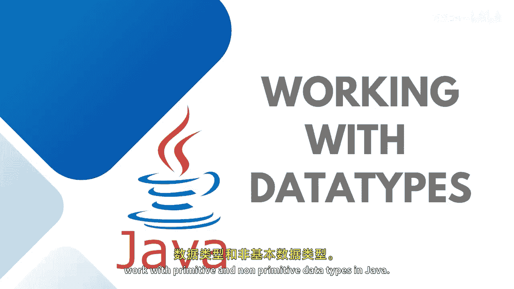
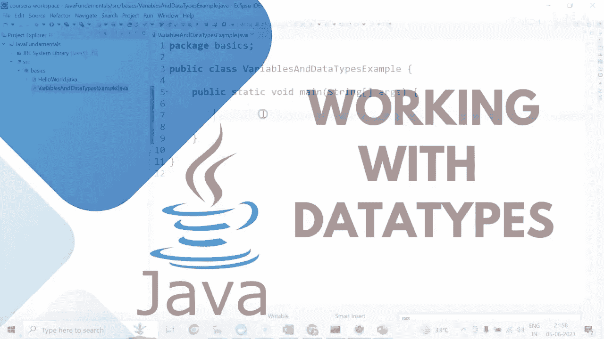
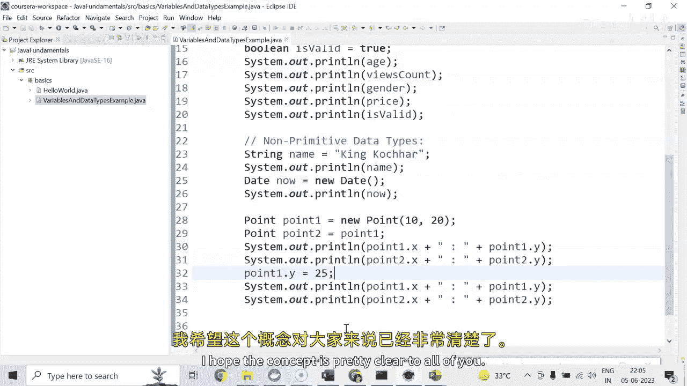

# 015：数据类型实战指南




在本节课中，我们将学习如何在Java中实际操作基本数据类型和非基本数据类型。我们将通过代码示例来理解它们的声明、赋值、使用方式以及核心区别。



## 概述

Java中的数据类型分为两大类：基本数据类型和引用数据类型。基本数据类型直接存储值，而引用数据类型存储的是对象的引用（地址）。理解这两者的区别对于编写正确的Java程序至关重要。

## 基本数据类型操作

上一节我们概述了数据类型，本节中我们来看看如何声明和使用基本数据类型。

基本数据类型包括`byte`、`int`、`long`、`float`、`double`、`char`、`boolean`。以下是声明和初始化这些类型的示例：

```java
byte age = 25; // 声明一个byte类型变量存储年龄
int viewCount = 123_456_789; // 使用下划线增强大数字的可读性
float price = 10.99F; // 声明float类型时，数字后需加‘F’
char gender = 'M'; // 声明char类型存储单个字符
boolean isValid = true; // 声明boolean类型存储真/假值
```

要打印这些变量的值，可以使用`System.out.println()`方法：

```java
System.out.println(age);
System.out.println(viewCount);
System.out.println(gender);
System.out.println(price);
System.out.println(isValid);
```

运行上述代码，控制台将成功输出所有基本数据类型的值。

## 非基本数据类型操作

上一节我们操作了基本数据类型，本节中我们来看看非基本数据类型，它们也被称为引用类型。

`String`是最常见的非基本数据类型，它用于存储一串字符。虽然其语法看起来简单，但它属于引用类型。

```java
String name = "John Doe";
System.out.println(name);
```

除了`String`，Java中还有许多预定义的类（如`Date`）和我们自定义的类，它们都属于非基本数据类型。

以下是使用`java.util.Date`类的示例：

```java
import java.util.Date; // 首先需要导入Date类

Date currentDate = new Date(); // 创建Date对象
System.out.println(currentDate); // 打印当前日期
```

## 基本类型与引用类型的核心区别

理解了各自的操作后，现在我们来探讨它们最根本的区别：**值传递**与**引用传递**。

对于基本数据类型，变量直接存储值。将一个基本类型变量赋值给另一个变量时，传递的是值的副本。

对于引用数据类型，变量存储的是对象在内存中的地址（引用）。将一个引用类型变量赋值给另一个变量时，传递的是引用的副本，这意味着两个变量指向内存中的同一个对象。

以下是一个演示区别的示例，使用`java.awt.Point`类：

```java
import java.awt.Point;

Point point1 = new Point(10, 20); // 创建第一个Point对象
Point point2 = point1; // 将point1的引用赋值给point2

// 打印两个点的坐标，此时它们相同
System.out.println(point1.x + " " + point1.y); // 输出：10 20
System.out.println(point2.x + " " + point2.y); // 输出：10 20

// 通过point1修改y坐标
point1.y = 25;

// 再次打印，两个点的y坐标都变成了25
System.out.println(point1.x + " " + point1.y); // 输出：10 25
System.out.println(point2.x + " " + point2.y); // 输出：10 25
```

**关键点**：当修改`point1.y`时，`point2.y`也随之改变，因为`point1`和`point2`持有的是同一个`Point`对象的引用。如果这是基本数据类型，改变一个变量的值不会影响另一个变量。

## 总结



本节课中我们一起学习了：
1.  **基本数据类型**：包括`byte`、`int`、`float`、`char`、`boolean`等，直接存储数据值。
2.  **非基本（引用）数据类型**：如`String`、`Date`和自定义类，变量存储的是对象的引用。
3.  **核心区别**：基本类型赋值是**复制值**，引用类型赋值是**复制引用**。因此，通过一个引用修改对象会影响到所有指向该对象的其他引用。


理解这一区别是避免程序中潜在错误的关键。在接下来的课程中，我们将继续探索更多Java的实际应用概念。