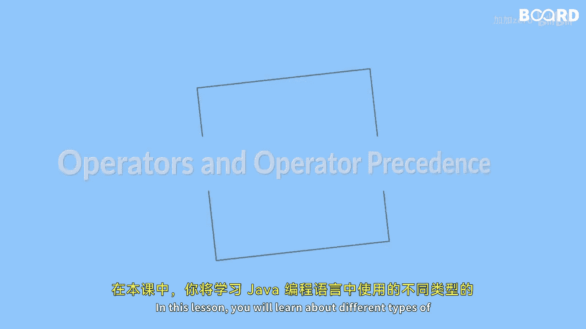

Java全栈开发：第18课：Java运算符详解

在本节课中，我们将学习Java编程语言中不同类型的运算符。运算符是用于对操作数执行各种操作的特殊符号。我们将涵盖算术运算符、赋值运算符、关系运算符、逻辑运算符以及三元运算符。同时，我们也将学习运算符的优先级，即运算符被求值的顺序。掌握这些知识对于编写有效的Java程序至关重要。

---

### 算术运算符

上一节我们介绍了运算符的基本概念，本节中我们来看看最基础的算术运算符。算术运算符用于执行数学运算，例如加法、减法、乘法和除法。

以下是Java中主要的算术运算符：

*   `+`：加法
*   `-`：减法
*   `*`：乘法
*   `/`：除法
*   `%`：取模（求余数）

**代码示例：**
```java
int a = 10;
int b = 3;
int sum = a + b; // 结果为 13
int difference = a - b; // 结果为 7
int product = a * b; // 结果为 30
int quotient = a / b; // 结果为 3
int remainder = a % b; // 结果为 1
```

---

### 算术赋值运算符

了解了基本的算术运算后，我们来看一种更简洁的写法。算术赋值运算符用于一步完成算术运算并将结果赋值给变量。



以下是常见的算术赋值运算符：

*   `+=`：加后赋值
*   `-=`：减后赋值
*   `*=`：乘后赋值
*   `/=`：除后赋值
*   `%=`：取模后赋值

**代码示例：**
```java
int x = 5;
x += 3; // 等同于 x = x + 3; 现在 x 的值为 8
x *= 2; // 等同于 x = x * 2; 现在 x 的值为 16
```

---

### 关系运算符

接下来，我们将学习如何比较值。关系运算符用于比较两个值，并返回一个布尔结果（`true` 或 `false`）。

以下是主要的关系运算符：

*   `==`：等于
*   `!=`：不等于
*   `>`：大于
*   `<`：小于
*   `>=`：大于或等于
*   `<=`：小于或等于

**代码示例：**
```java
int p = 7;
int q = 5;
boolean isEqual = (p == q); // false
boolean isGreater = (p > q); // true
boolean isNotEqual = (p != q); // true
```

---

### 逻辑运算符

当我们有多个条件需要判断时，就需要逻辑运算符。逻辑运算符用于组合多个布尔表达式，并返回一个布尔结果。

以下是核心的逻辑运算符：

*   `&&`：逻辑与（AND），当两边都为真时结果为真。
*   `||`：逻辑或（OR），当至少一边为真时结果为真。
*   `!`：逻辑非（NOT），用于反转布尔值。

**公式/规则：**
*   `true && true` 结果为 `true`
*   `true && false` 结果为 `false`
*   `false || true` 结果为 `true`
*   `!true` 结果为 `false`

**代码示例：**
```java
boolean a = true;
boolean b = false;
boolean resultAnd = a && b; // false
boolean resultOr = a || b; // true
boolean resultNot = !a; // false
```

---

### 三元运算符

最后，我们来学习一种简洁的条件赋值方法。三元运算符是编写 `if-else` 语句的一种简写方式。

它的语法结构如下：
```java
variable = (condition) ? expressionIfTrue : expressionIfFalse;
```

**代码示例：**
```java
int score = 75;
String result = (score >= 60) ? "及格" : "不及格";
// 因为 score >= 60 为 true，所以 result 的值为 "及格"
```

---

### 运算符优先级

在包含多种运算符的表达式中，运算顺序由运算符优先级决定。优先级高的运算符先被计算。

常见的优先级顺序（从高到低）为：
1.  括号 `()`
2.  一元运算符（如 `!`, `++`）
3.  算术运算符（`*`, `/`, `%` 高于 `+`, `-`）
4.  关系运算符（`>`, `<`, `>=`, `<=`）
5.  相等运算符（`==`, `!=`）
6.  逻辑与 `&&`
7.  逻辑或 `||`
8.  三元运算符 `? :`
9.  赋值运算符（`=`, `+=` 等）

当不确定时，使用括号可以明确指定运算顺序。

---

### 总结

本节课中我们一起学习了Java编程中的核心运算符。
我们首先介绍了用于基本数学计算的**算术运算符**，然后学习了简化运算和赋值过程的**算术赋值运算符**。
接着，我们探讨了用于比较值的**关系运算符**和组合多个条件的**逻辑运算符**。
最后，我们掌握了简洁的**三元运算符**以及决定运算执行顺序的**运算符优先级**规则。
理解并熟练运用这些运算符，是构建程序逻辑和实现复杂计算的基础。