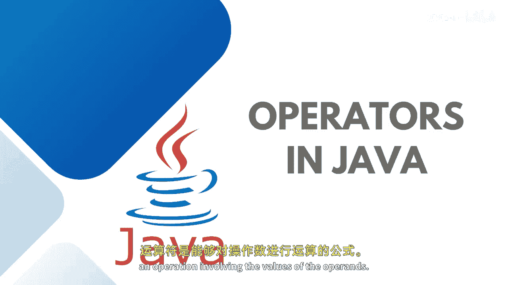

Java全栈开发：19：Java中的运算符

在本节课中，我们将学习Java中的运算符。运算符是编程语言的基础，用于执行各种计算和逻辑判断。理解运算符是掌握Java编程的关键一步。

运算符是一种能够对操作数的值执行特定操作的符号。这些符号用于执行比较、计算或运算等操作，并返回一个结果。Java中的运算符大多借鉴自其他编程语言，其行为符合普遍预期。大多数编程语言或脚本语言都包含这些通用的运算符。

Java中的运算符可以根据其功能分为多个大类。以下是主要的运算符类别：

*   **算术运算符**：用于执行基本的数学运算。
*   **赋值运算符**：用于为变量赋值。
*   **关系运算符**：用于比较两个值。
*   **位运算符**：用于对整数类型的数据位进行操作。
*   **逻辑运算符**：用于连接布尔表达式。
*   **三元（条件）运算符**：一种简洁的条件判断表达式。
*   **`instanceof`运算符**：用于检查对象是否属于特定类。

此外，运算符还可以根据所需操作数的数量进行分类：

*   **一元运算符**：只需要一个操作数，例如 `-a`（取负）或 `++i`（自增）。
*   **二元运算符**：需要两个操作数，这是最常见的类型，例如 `a + b`（加法）或 `x > y`（大于比较）。

运算符在进行任何计算、比较或运算时都扮演着至关重要的角色。

本节课我们一起学习了Java运算符的基本概念、主要分类（包括算术、赋值、关系、位、逻辑、三元和`instanceof`运算符）以及根据操作数数量划分的一元和二元运算符。理解这些运算符是编写有效Java代码的基础。在接下来的课程中，我们将深入探讨每一类运算符的具体用法和示例。