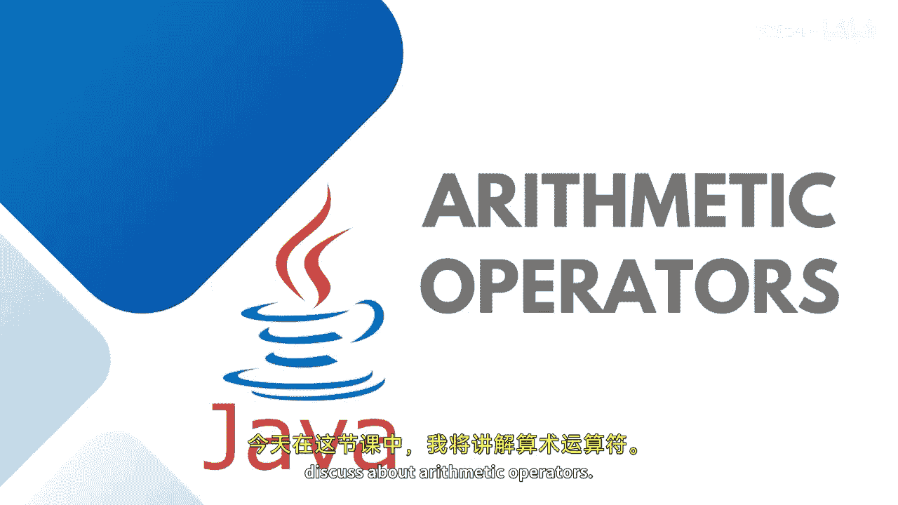

# 020：算术运算符 🧮




在本节课中，我们将要学习Java中的算术运算符。算术运算符用于对基本数据类型执行简单的数学运算和计算。

上一节我们介绍了Java的基础概念，本节中我们来看看如何使用这些运算符进行数学运算。

## 算术运算符概述

算术运算符用于执行加法、减法、乘法和除法等基本运算。此外，还有一个取余运算符，用于获取除法运算后的余数。虽然递增（`++`）和递减（`--`）运算符在分类上属于一元运算符，但由于其常见性，通常也放在算术运算符中讨论。

以下是主要的算术运算符及其功能：

*   **加法运算符 (`+`)**： 将两个数值相加。
*   **减法运算符 (`-`)**： 将两个数值相减。
*   **乘法运算符 (`*`)**： 将两个数值相乘。
*   **除法运算符 (`/`)**： 将两个数值相除。
*   **取余运算符 (`%`)**： 返回除法运算后的余数。
*   **递增运算符 (`++`)**： 将变量的值增加1。
*   **递减运算符 (`--`)**： 将变量的值减少1。

## 运算符的代码实现

让我们通过具体的代码示例来理解这些运算符的用法。假设我们有两个变量：
```java
int number1 = 100;
int number2 = 50;
```

以下是使用这些运算符的示例：

*   **加法**： `int sum = number1 + number2;` // 结果为150
*   **减法**： `int difference = number1 - number2;` // 结果为50
*   **乘法**： `int product = number1 * number2;` // 结果为5000
*   **除法**： `int quotient = number1 / number2;` // 结果为2
*   **取余**： `int remainder = number1 % number2;` // 结果为0

运算可以直接在输出语句中进行，也可以先存储到变量中再打印。例如：
```java
System.out.println("加法结果: " + (number1 + number2));
// 或者
int result = number1 + number2;
System.out.println("加法结果: " + result);
```

运行上述代码，我们可以得到预期的计算结果：加法得150，减法得50，乘法得5000，除法得2，取余得0。

## 递增与递减运算符详解

递增和递减运算符有前置和后置之分，它们对变量值的改变和使用的时机有所不同。

以下是关于递增和递减运算符的要点：

*   **后置递增 (`number++`)**： 先使用变量当前的值，然后再将其值增加1。
*   **前置递增 (`++number`)**： 先将变量的值增加1，然后再使用这个新值。
*   **后置递减 (`number--`)**： 先使用变量当前的值，然后再将其值减少1。
*   **前置递减 (`--number`)**： 先将变量的值减少1，然后再使用这个新值。

让我们通过一个例子来理解。假设 `number1` 的初始值为100：
```java
// 后置递增
System.out.println(number1++); // 输出100，然后number1变为101
// 前置递增
System.out.println(++number1); // number1先变为102，然后输出102

// 后置递减
System.out.println(number1--); // 输出102，然后number1变为101
// 前置递减
System.out.println(--number1); // number1先变为100，然后输出100
```

运行这段代码，可以清晰地看到前置与后置操作在输出顺序上的区别。

## 总结


本节课中我们一起学习了Java中的算术运算符。我们了解了用于基本数学计算的加（`+`）、减（`-`）、乘（`*`）、除（`/`）、取余（`%`）运算符，并重点探讨了递增（`++`）和递减（`--`）运算符的前置与后置区别及其执行顺序。这些运算符是构建更复杂程序逻辑的基础。在实际编程中，你可以根据需求让用户输入数据，然后灵活运用这些运算符进行计算。