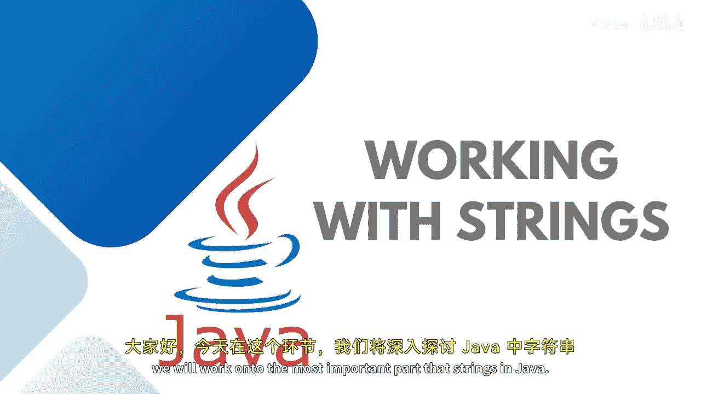

# 030：字符串处理





在本节课中，我们将学习Java编程中最重要的部分之一：字符串。字符串是编程不可或缺的组成部分，Java提供了String类来创建和操作字符串。

## 什么是字符串？

字符串是一个表示字符序列的对象。虽然字符串在内部由字符数组实现，但它是使用最频繁的数据类型。它的语法看起来像基本类型，但它实际上是一个引用类型。

String类是核心库的一部分，提供了多种处理字符串的方法。

## 字符串的特性：不可变性

字符串是不可变的。这意味着一旦为字符串创建了对象，其值就无法更改。当你试图改变其值时，系统会为你创建一个新的字符串对象。

你可以通过对现有字符串执行各种操作，或使用字符串方法来创建新的字符串。

字符串的初始化方式如下：
```java
String myString = "Hello";
```
在内部，它会将字符串创建为一个字符数组，例如第一个字符是`H`，第二个是`e`，依此类推。

## 创建字符串的两种方式

在Java中，有两种定义字符串的方式。

**1. 使用字符串字面量**
字符串字面量是一种用于表示值的符号。你可以直接将一个值赋给字符串变量。

**2. 使用`new`关键字**
使用`new`关键字时，你实例化或创建了一个String对象，并将字符串作为参数传递给String类的构造函数，从而初始化字符串。

我们也可以通过复制的方式来创建字符串，这将在后面讨论。

所有使用`new`关键字创建的字符串对象都会在堆内存中分配空间，无论堆内存中是否已存在相同值的字符串，因为其内存地址不同。

## 字符串的类型：不可变与可变

字符串有两种类型：不可变字符串和可变字符串。

*   **不可变字符串**：无法更改。这是使用`new`关键字或字符串字面量创建的普通字符串。
*   **可变字符串**：可以使用`StringBuilder`类。如果你不希望每次需要频繁修改时都创建新的字符串对象，可以选择`StringBuilder`类。

在接下来的实践演示中，我将向你展示这两种类型。

## 总结


本节课我们一起学习了Java中字符串的基础知识。我们了解了字符串的本质是一个对象，它有两种创建方式，并且具有不可变的特性。我们还简单介绍了可变字符串`StringBuilder`的概念，它适用于需要频繁修改字符串的场景。在下一节中，我们将进行实际操作来巩固这些概念。