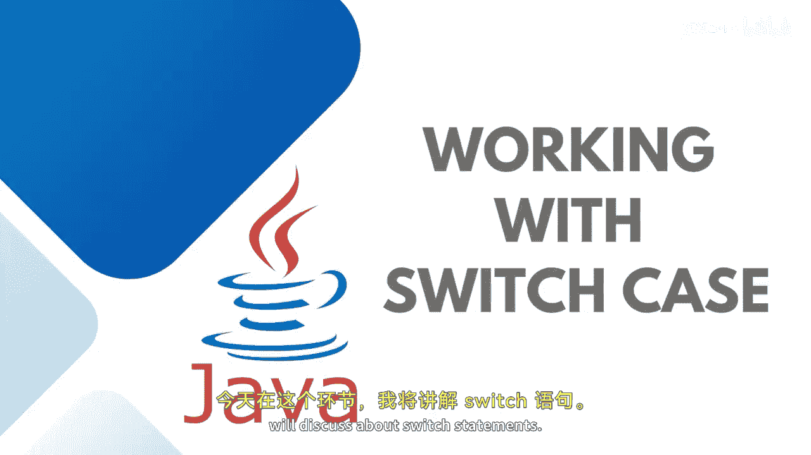

Java全栈开发：P36：Switch-Case语句详解 🔄




在本节课中，我们将学习Java中的`switch-case`语句。与`if-else`语句不同，`switch-case`提供了多条执行路径，它根据表达式的值来匹配不同的情况，非常适合处理多选一的场景。

---

### 概述

`switch`语句会评估一个表达式，并根据其值执行相应的代码块。它支持多种数据类型，包括`byte`、`char`、`short`、`int`以及`String`类。当有多个条件分支时，使用`switch`可以使代码结构更清晰。

---

### Switch语句的基本结构

一个典型的`switch`语句包含一个表达式、多个`case`分支、可选的`break`语句以及一个可选的`default`分支。其基本语法如下：

```java
switch (expression) {
    case value1:
        // 代码块1
        break;
    case value2:
        // 代码块2
        break;
    ...
    default:
        // 默认代码块
}
```

当`expression`的值与某个`case`的值匹配时，程序会执行该`case`下的代码，直到遇到`break`语句或`switch`语句结束。如果没有任何`case`匹配，则执行`default`分支的代码。

---

### 实践示例：用户权限管理

为了更好地理解`switch-case`的工作原理，我们来看一个具体的例子。假设我们有一个系统，根据用户类型（如管理员、子管理员、测试员、普通用户）来分配不同的访问权限。

以下是实现此功能的代码：

```java
import java.util.Scanner;

public class UserAccess {
    public static void main(String[] args) {
        Scanner scanner = new Scanner(System.in);
        
        System.out.println("1. Admin");
        System.out.println("2. SubAdmin");
        System.out.println("3. TestPrep");
        System.out.println("4. User");
        System.out.print("Enter your choice: ");
        
        String userType = scanner.nextLine();
        
        switch (userType) {
            case "Admin":
                System.out.println("Gets Full access.");
                break;
            case "SubAdmin":
                System.out.println("Gets access to create or delete the courses.");
                break;
            case "TestPrep":
                System.out.println("Gets access to create or delete the test.");
                break;
            case "User":
                System.out.println("You can only get access to consume the content.");
                break;
            default:
                System.out.println("You cannot access any content. You are a trial user.");
        }
        
        scanner.close();
    }
}
```

在这个示例中，程序首先提示用户输入选择。然后，根据输入的`userType`，`switch`语句会匹配相应的`case`并执行对应的代码块。如果输入不匹配任何`case`，则执行`default`分支。

---

### 关键点说明

1.  **表达式类型**：`switch`的表达式可以是`byte`、`char`、`short`、`int`、`String`或枚举类型。
2.  **`break`语句**：`break`用于终止当前`case`的执行，防止代码“穿透”到下一个`case`。如果省略`break`，程序会继续执行后续`case`的代码，直到遇到`break`或`switch`结束。
3.  **`default`分支**：`default`分支是可选的，用于处理所有`case`都不匹配的情况，类似于`if-else`中的`else`。

---

### 总结


本节课我们一起学习了Java中`switch-case`语句的用法。我们了解到，`switch`语句通过匹配表达式的值来选择执行路径，适用于多条件选择的场景。通过一个用户权限管理的示例，我们实践了如何编写和运行`switch-case`代码。记住合理使用`break`和`default`分支，可以使你的程序逻辑更清晰、更健壮。