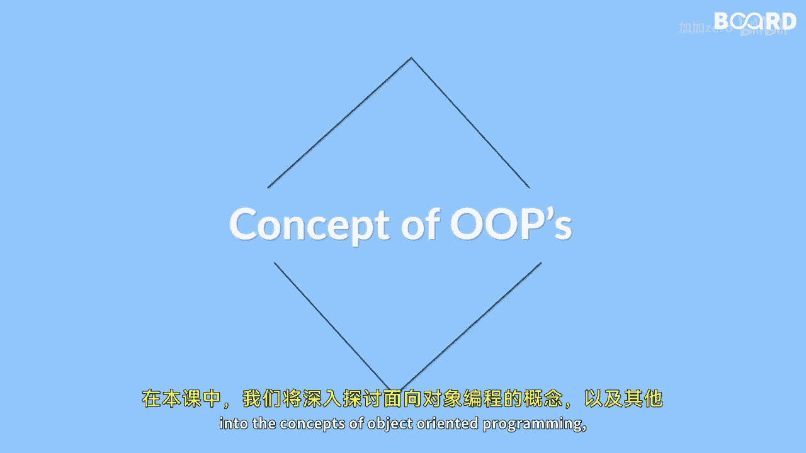

# 042：本课你将学到什么

在本节课中，我们将深入学习面向对象编程的核心概念以及Java中的其他重要主题。我们将从基础开始，逐步构建对Java高级特性的理解，最终目标是让你能够编写更高效、可复用且可扩展的代码。

## 🧱 面向对象编程基础

上一段我们介绍了本课的整体目标，本节中我们来看看面向对象编程的基石。面向对象编程是一种围绕“对象”组织代码的范式，每个对象都包含数据和操作数据的方法。

以下是其核心原则：

*   **封装**：将数据（属性）和操作数据的方法（行为）捆绑在一个单元（即类）中，并限制对对象内部数据的直接访问。这通常通过使用`private`访问修饰符和提供公共的`getter`/`setter`方法来实现。
    ```java
    public class BankAccount {
        private double balance; // 数据被封装，设为私有

        public double getBalance() { // 提供公共方法访问数据
            return balance;
        }
        public void deposit(double amount) {
            if (amount > 0) {
                balance += amount;
            }
        }
    }
    ```
*   **继承**：允许一个类（子类）基于另一个类（父类）来构建，继承其属性和方法，从而实现代码复用和建立层次关系。
    ```java
    public class Vehicle { // 父类
        String brand;
        void honk() {
            System.out.println("Beep!");
        }
    }
    public class Car extends Vehicle { // 子类继承Vehicle
        int wheels = 4;
    }
    ```
*   **多态**：指同一个接口或方法在不同的对象中具有不同的行为。这允许我们使用父类引用来指向子类对象，并在运行时决定调用哪个方法。
    ```java
    Vehicle myVehicle = new Car(); // 多态：父类引用指向子类对象
    myVehicle.honk(); // 调用的是Car类继承或重写的方法
    ```



我们将学习如何在Java中定义**类**和创建**对象**，以及如何构建符合业务逻辑的自定义类。

## 🏗️ 抽象类与接口

理解了面向对象的基本支柱后，我们进一步探讨用于实现更高层次抽象的两种工具：抽象类和接口。

*   **抽象类**：使用`abstract`关键字声明，不能直接实例化。它可以包含抽象方法（只有声明，没有实现）和具体方法。抽象类用于定义子类的通用模板。
    ```java
    public abstract class Animal {
        public abstract void makeSound(); // 抽象方法
        public void sleep() { // 具体方法
            System.out.println("Zzz");
        }
    }
    ```
*   **接口**：使用`interface`关键字声明，定义了一组方法契约（在Java 8之前全部是抽象方法）。一个类可以实现多个接口，从而获得多重“行为”继承的能力。
    ```java
    public interface Drawable {
        void draw(); // 接口方法（隐式为 public abstract）
    }
    public class Circle implements Drawable {
        public void draw() {
            System.out.println("Drawing a circle");
        }
    }
    ```

## ⚠️ 异常处理与文件操作

掌握了代码的结构设计后，我们需要学习如何让程序更健壮地处理运行时错误和与外部系统交互。本节将介绍异常处理和文件操作。

我们将学习如何使用`try-catch`块来捕获和处理程序执行中可能出现的**异常**，防止程序意外崩溃。同时，你也会了解如何创建自定义的异常类来表示特定的错误情况。

```java
try {
    int result = 10 / 0; // 可能抛出 ArithmeticException
} catch (ArithmeticException e) {
    System.out.println("Cannot divide by zero!");
}
```

此外，我们将学习Java中**文件处理**的基础知识，即如何使用`java.io`包中的类来从文件中读取数据以及将数据写入文件。

## 🔄 泛型

最后，我们将深入探讨**泛型**这一强大概念。泛型允许我们在定义类、接口或方法时使用类型参数，从而创建可处理多种数据类型的通用代码，同时保证编译时的类型安全。

我们将学习如何创建泛型类和泛型方法，这能极大地提高代码的**可复用性**和**灵活性**。

```java
// 一个简单的泛型类
public class Box<T> {
    private T content;
    public void setContent(T content) { this.content = content; }
    public T getContent() { return content; }
}
// 使用
Box<String> stringBox = new Box<>();
stringBox.setContent("Hello");
```

我们还将了解泛型的一些高级特性，例如：
*   **有界类型参数**：限制泛型参数可以接受的类型范围，例如`<T extends Number>`。
*   **通配符**：使用`?`表示未知类型，增加泛型使用的灵活性，例如`List<?>`。
*   **类型擦除**：理解Java泛型在编译后的实现机制。

---

本节课中我们一起学习了Java面向对象编程的核心原则（封装、继承、多态）、抽象类与接口的使用、异常处理与文件操作的基础，以及泛型编程的概念与高级特性。掌握这些知识将为你构建复杂、健壮且易于维护的Java应用程序打下坚实的基础。