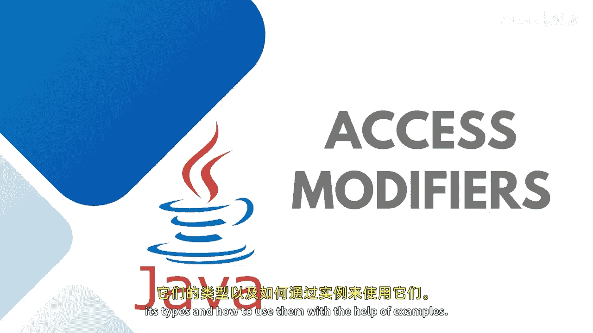
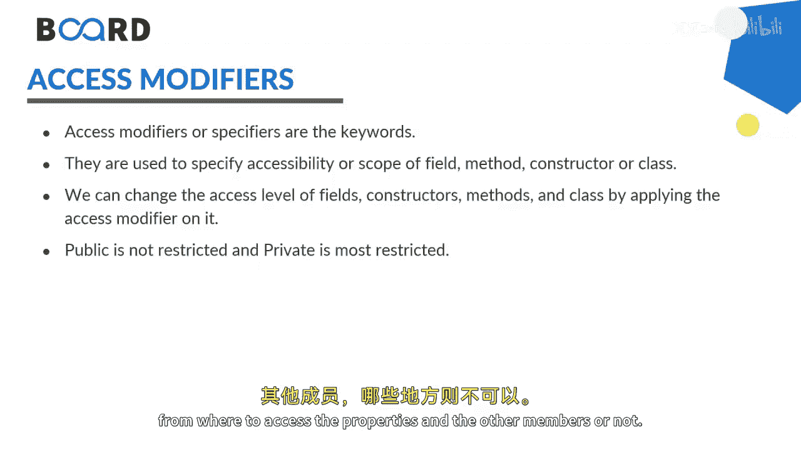
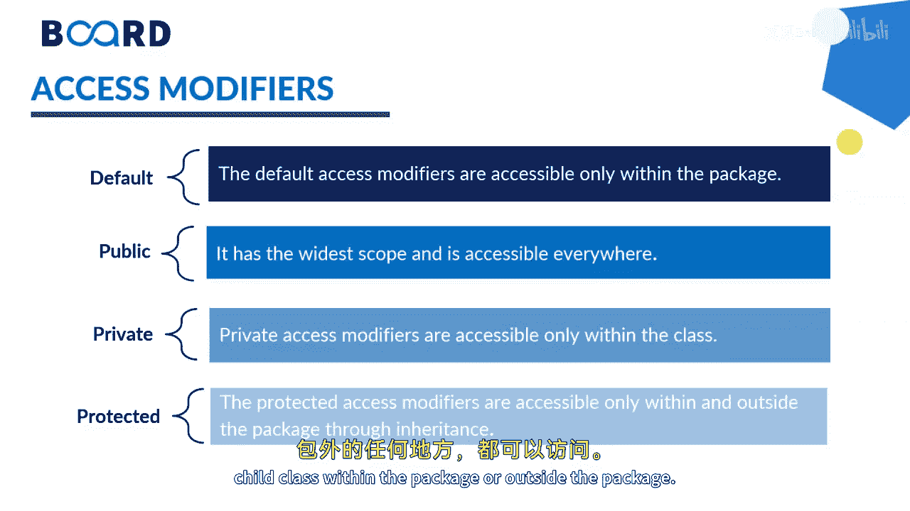

Java全栈开发：第46课：Java访问修饰符详解 🔒

在本节课中，我们将学习Java中的访问修饰符。我们将了解其类型、作用范围，并通过概念讲解来理解如何在不同场景下使用它们。

访问修饰符用于设置类、接口、变量、方法、构造函数和数据成员的可访问性。通过改变访问级别，我们可以控制程序中的哪些部分能够访问特定的属性和成员。

上一节我们介绍了访问修饰符的基本概念，本节中我们来看看Java中四种主要的访问修饰符及其具体区别。

Java中有四种主要的访问修饰符：
1.  **默认** (Default，即不写任何修饰符)
2.  **公共** (Public)
3.  **私有** (Private)
4.  **受保护** (Protected)

以下是每种修饰符的详细说明：
*   **默认**：声明仅在同一个包（或特定文件夹）内可见。
*   **私有**：仅在定义它的类内部可访问。
*   **受保护**：在继承的情况下，用于子类中访问。
*   **公共**：具有最广的作用域，可以从任何地方访问，无论是类内、类外、父类、子类、包内还是包外。

为了更清晰地理解它们的访问范围，我们可以参考以下对比：

| 修饰符 | 同类内 | 同包内 | 不同包子类 | 不同包非子类 |
| :--- | :--- | :--- | :--- | :--- |
| **`private`** | ✔️ | ❌ | ❌ | ❌ |
| **`default`** | ✔️ | ✔️ | ❌ | ❌ |
| **`protected`** | ✔️ | ✔️ | ✔️ | ❌ |
| **`public`** | ✔️ | ✔️ | ✔️ | ✔️ |

如上表所示，所有修饰符都允许在定义它们的类内部访问。但`private`成员即使在同一个包内也不可用。在涉及子类（即子类）的情况下，`public`和`protected`成员可以被访问。而只有`public`修饰符允许在包外的任何地方被访问。

这就是访问修饰符如何定义数据访问范围的方式。正如前面提到的，你可以将这些访问修饰符放在类、方法、变量、构造函数和接口等前面。

本节课中我们一起学习了Java的四种访问修饰符：`public`、`protected`、`default`和`private`。我们了解了它们各自的作用域，以及如何通过它们来控制类成员的可见性，这是封装这一面向对象核心原则的重要体现。