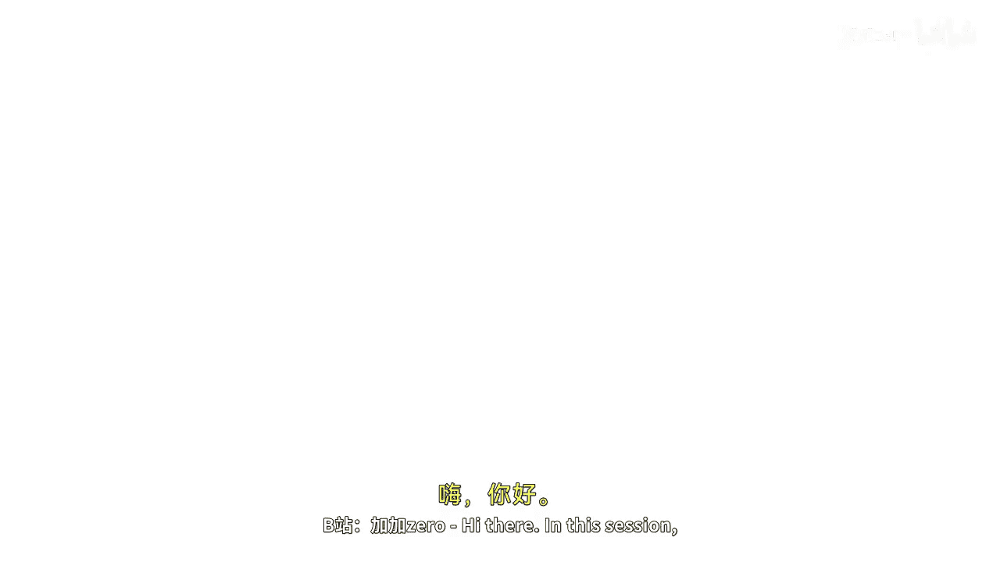
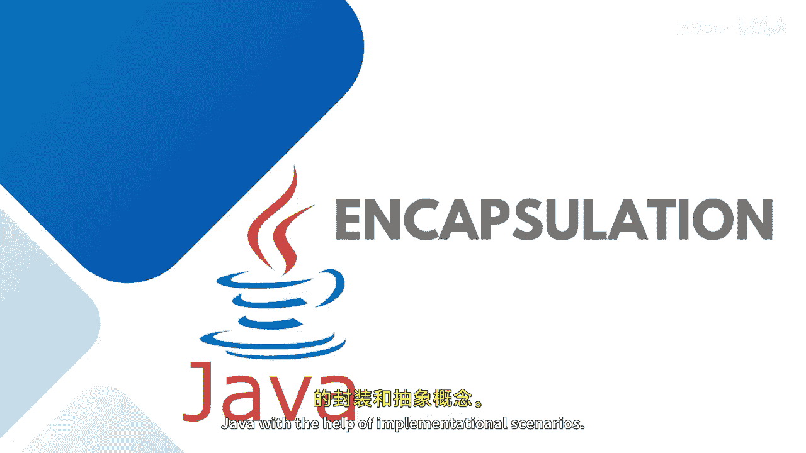

# 048：封装与抽象

在本节课中，我们将讨论Java中的封装与抽象这两个核心概念，并通过实现场景来理解它们。

## 概述

封装与抽象是面向对象编程的两大支柱。封装关注于数据的隐藏和保护，而抽象则关注于向用户展示必要的细节，隐藏复杂的内部实现。理解它们对于编写安全、清晰和可维护的代码至关重要。

## 封装：数据隐藏 🛡️

上一节我们介绍了面向对象的基础，本节中我们来看看封装。封装被定义为数据隐藏或将数据包装在一个单元内。用一句话概括，封装就是**数据隐藏**。

它防止外部类访问和修改一个类的字段和方法。我们使用**访问修饰符**来实现数据的封装。

例如，如果我们有一个类，并将其成员设为`public`，那么这些成员可以在类外部被访问。但如果你想隐藏数据，可以将其设为限制性最强的`private`。之后，你可以根据需要将其扩展为`default`或`protected`。如果你不希望隐藏数据，则可以将其保持为`public`。

在Java中，封装帮助我们将相关的字段和方法保持在一起，这使得我们的代码更清晰、更易于阅读。

考虑一个`Student`类的例子，它包含以下成员：

以下是`Student`类的数据成员和方法：
*   **数据成员**：`firstName`, `middleName`, `lastName`, `fullName`, `courses`
*   **方法**：`save()`, `describe()`, `subscribe()`, `getSubscribedCourses()`

如果你希望这些数据成员仅在类内部的方法中使用，可以将它们设为`private`，从而将其隐藏在类定义之外，防止外部访问。

## 抽象：隐藏实现细节 🎭

理解了如何隐藏数据后，我们再来看看抽象。抽象是指抽象出类的成员，只向用户展示必要的细节。

抽象可以通过**抽象类**或**接口**来实现，同样也可以借助访问修饰符。

*   **抽象类**是一个受限的类，不能用于直接创建对象。
*   子类必须通过自己的对象来访问需要从父类继承的数据成员或成员函数。
*   **抽象方法**是没有方法体的方法。子类必须实现（重写）父类中的抽象方法，并提供方法体。

考虑一个现实世界的例子：ATM机。用户只知道操作步骤：首先插入银行卡，然后输入密码，接着输入想要提取的金额，最后就能拿到钱。用户并不知道ATM内部的工作机制。用户只知道如何操作ATM，但不知道其内部如何运作，这就是**抽象**。

## 总结

本节课中我们一起学习了Java封装与抽象的核心概念。封装通过访问修饰符（如`private`）将数据和行为捆绑在一起并隐藏内部细节，从而保护数据并提高代码内聚性。抽象则通过抽象类、接口和访问修饰符，向外部世界只暴露必要的功能，隐藏复杂的实现逻辑。两者共同作用，帮助我们构建出更加健壮、安全和易于理解的面向对象程序。

在接下来的演示中，我们将探讨**Getter和Setter方法**如何帮助封装数据，以及如何从类外部访问这些被封装的数据。敬请关注。