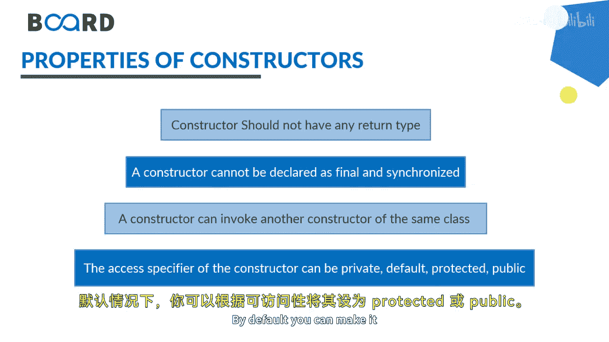

# 051：Java中的构造函数

在本节课中，我们将要学习Java中一个非常重要的概念——构造函数。我们将了解什么是构造函数，它的特点，以及它与普通方法的区别。

## 概述

构造函数是Java中用于创建对象并初始化其数据成员的一种特殊方法。它在对象创建时被自动调用，无需手动触发。

## 什么是构造函数？

构造函数是一种特殊的代码块，用于在创建对象时初始化该对象的状态。它看起来像一个方法，但其行为和目的与普通方法不同。

## 构造函数的特点

以下是构造函数的一些核心特点：

1.  **自动调用**：构造函数在对象创建时被隐式调用。你不需要手动调用它。
    *   `Student s = new Student(); // 此时构造函数被自动调用`
2.  **默认构造函数**：如果一个类没有定义任何构造函数，Java编译器会提供一个默认的无参构造函数。这个默认构造函数来自Java的根类 `Object`，用于为数据成员设置默认值（如数字为0，对象引用为null）。
3.  **命名规则**：构造函数的名称必须与它所在的类名完全相同。
    *   例如，如果类名是 `Student`，那么构造函数名也必须是 `Student`。
4.  **无返回类型**：构造函数不能有任何返回类型，包括 `void`。
    *   正确：`public Student() { ... }`
    *   错误：`public void Student() { ... }` 或 `public Student Student() { ... }`
5.  **访问修饰符**：构造函数的访问修饰符可以是 `private`、`default`（包私有）、`protected` 或 `public`。
    *   `private` 构造函数可以限制外部创建该类的实例，常用于单例模式。
6.  **不能被声明为 final 或 synchronized**：构造函数不能被 `final` 或 `synchronized` 修饰。
7.  **构造函数链**：一个构造函数可以调用同一个类中的另一个构造函数，这被称为构造函数链，通常使用 `this()` 关键字实现。

## 构造函数与方法的区别

上一节我们介绍了构造函数的特点，本节中我们来看看构造函数与普通方法的主要区别。

以下是构造函数与方法的对比列表：

*   **返回类型**：构造函数不能有返回类型。方法必须有返回类型（`void` 也是一种返回类型）。
*   **名称**：构造函数的名称必须与类名相同。方法的名称可以是任何有意义的标识符，不能与类名相同（除非是构造函数）。
*   **用途**：构造函数用于初始化对象的数据成员。方法用于暴露对象的行为，例如进行计算、获取详情或显示信息。
*   **调用方式**：构造函数在对象创建时被隐式调用。方法必须根据需求被显式调用，例如从 `main` 方法或其他方法中调用。

## 构造函数如何工作？

为了更好地理解，让我们回顾一下对象创建的过程。当我们写下 `Student s = new Student();` 这行代码时，具体发生了什么？

1.  **`new` 关键字**：`new` 关键字在堆内存中为 `Student` 类的数据成员分配内存空间。
2.  **调用构造函数**：在分配内存的同时，与 `Student` 类匹配的构造函数被自动调用，以初始化这些新分配的内存空间（即设置对象的初始状态）。

正如之前强调的，你不需要主动去“调用”构造函数，这个过程由Java运行时自动完成。

## 总结

本节课中我们一起学习了Java构造函数的核心知识。我们了解到构造函数是一种在创建对象时自动执行的特殊方法，用于初始化对象。它的名称必须与类名相同且没有返回类型。我们还对比了构造函数与普通方法的区别，并理解了 `new` 关键字如何触发构造函数的执行。掌握构造函数是理解Java对象生命周期和面向对象编程的基础。