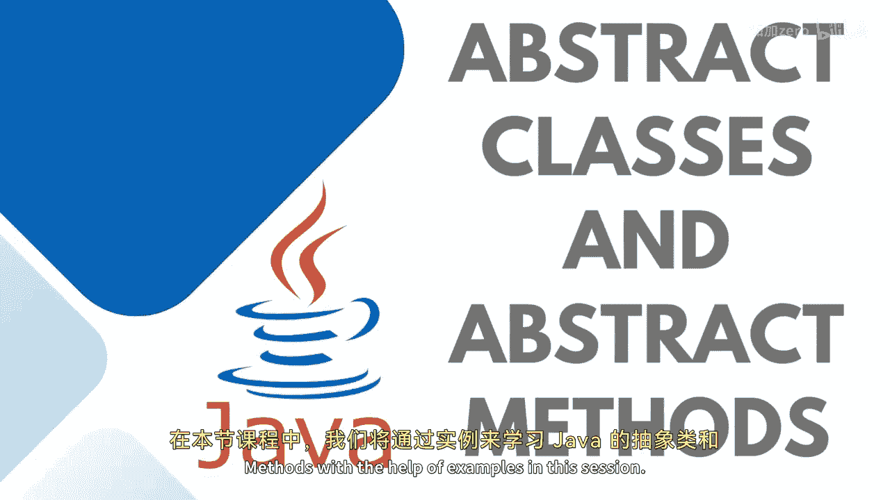
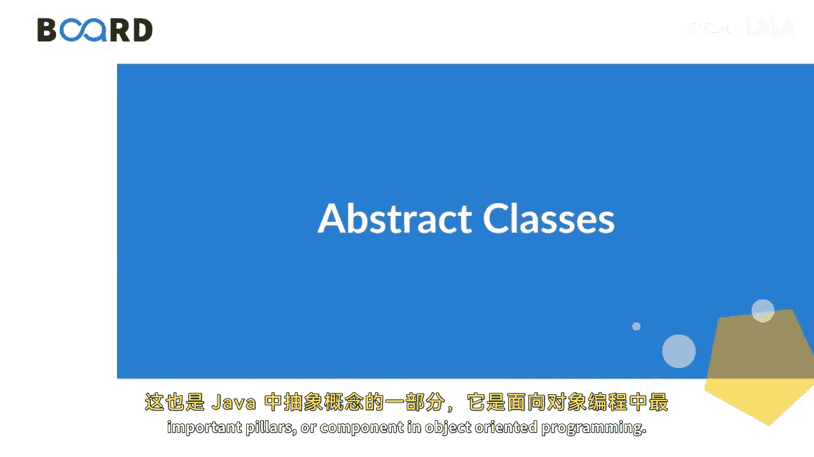

# 067：抽象类与抽象方法 🧩

在本节课中，我们将通过示例学习Java中的抽象类和抽象方法。这也是Java中**抽象**的概念，它是面向对象编程中最重要的支柱或组成部分之一。

## 什么是抽象类？

上一节我们提到了面向对象编程的支柱，本节中我们来看看其中一个核心概念——抽象类。

抽象类是一个**不能直接实例化**的类。使用 `abstract` 关键字声明的类被称为抽象类。😊

我们使用抽象类来创建一个**契约**。之所以称之为契约，是因为我没有为写在抽象类内部的抽象方法提供具体定义，这些方法**必须**在子类中被重写或实现。

“抽象”一词意味着一个简短的描述，它能让你对概念有一个想象性的理解，就像一个摘要。😊 就像一小段文字能给你整本书的简要描述或解释一样。同样地，Java中的抽象类只是声明了那些需要由**继承该抽象类的类**来实现的方法。

## 为什么需要抽象类？

那么，为什么要把一个类设为抽象类呢？实际上，如果任何一个特定的类中包含了任何抽象方法，那么这个类**必须**被声明为抽象类。这就是原因。它完全持有着契约，同时它也可以包含非抽象方法。但我们将其视为契约，因此我们不允许创建它的对象。

考虑一个现实生活中的例子：我们需要一个项目中所需功能的蓝图，比如加法、减法、乘法和除法。所有这些方法都将被视为抽象方法，因为我们尚未考虑它们的实现。我们只是在收集我们认为创建计算器应用程序所需的基本功能。无论你创建哪种类型的计算器，我们都可以在这些子类中重新定义它们的行为。

## 抽象类的特性

在深入之前，你需要理解为什么我们需要抽象类。如前所述，抽象类有助于创建契约或模板，有助于实现**低耦合、代码复用和抽象**。

以下是抽象类的一些关键特性：

*   抽象类**不能被实例化**。
*   抽象类**至少包含一个纯虚函数**（即抽象方法）。
*   抽象类可以同时包含**抽象方法**和**非抽象方法**。
*   如果需要，抽象类也可以有**构造函数和析构函数**。
*   抽象类也可以有**成员变量**。
*   抽象类可以被用作**基类**。

## 总结

本节课中，我们一起学习了Java抽象类与抽象方法。我们了解到抽象类是一种不能被直接实例化的类，它通过声明抽象方法来定义一个必须由子类实现的“契约”。这有助于实现代码的抽象、复用和低耦合。抽象类可以包含抽象方法和具体方法，也可以拥有构造器和成员变量。

在下一节中，我们将继续学习如何在实践中实现这种契约，敬请关注。