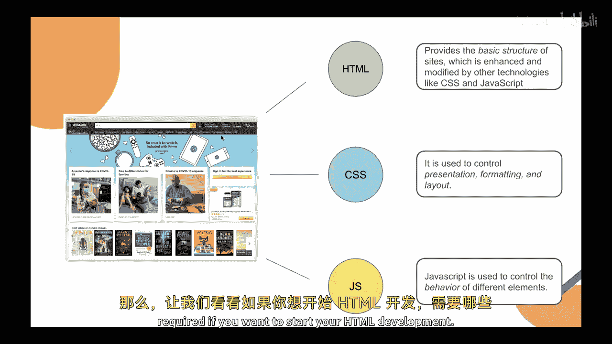
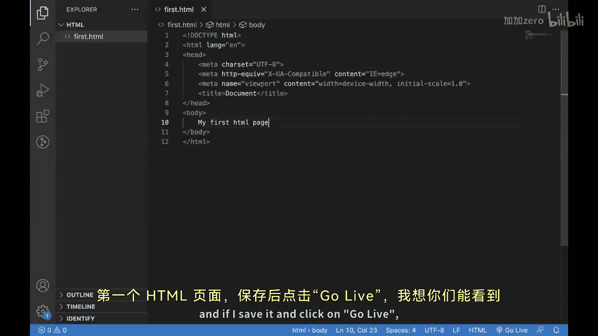
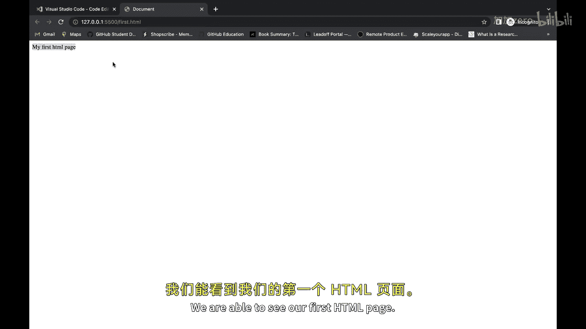
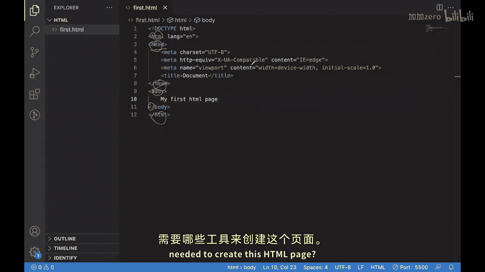
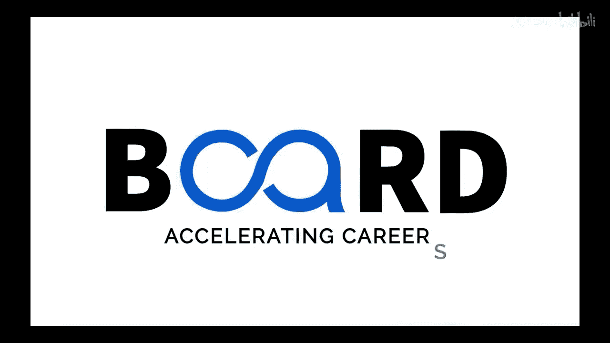

# 075：什么是HTML？ 🌐

在本节课中，我们将要学习前端开发的基础构建块之一：HTML。我们将了解HTML的定义、历史、作用，以及它与CSS和JavaScript的关系。最后，我们将动手创建一个简单的HTML页面，并了解所需的开发工具。

上一节我们介绍了Web开发，本节中我们来看看前端开发。

对于前端开发，我们首先需要了解其一些基础构建块，其中之一就是HTML。

如今，我们看到的任何现代网站都直接或间接地使用HTML。进一步了解HTML，我们知道HTML代表超文本标记语言，由蒂姆·伯纳斯-李于1993年创建。

可以说，HTML与互联网本身一样古老。

它是随着互联网一同发展起来的初始语言之一，用于在互联网上提供可供消费的内容。它是一种标准的标记语言，用于设计在Web浏览器中显示的文档。

HTML是一种标记语言，而不是编程语言。

这意味着它用于管理文档的内容，规定其应如何结构化以及应如何呈现。当我们的Web浏览器消费这些HTML文档时，它就能知道应如何在屏幕上呈现文档中的项目。

关于HTML的版本，我们目前使用的是HTML5。

从HTML1到HTML5，我们看到了巨大的进步。为了举例说明，让我展示一些内容。

如果我们查看这个页面，这是亚马逊早期的页面之一。你可以看到它的样子。如果将其与当前的亚马逊网站进行比较，变化是巨大的。你可以看到这里技术的进步及其发展，以及它如何帮助一个特定的网站改变自身。

谈到任何现代网站，我们可以说它主要由三种技术构成。

以下是构成现代网站的三种核心技术：
*   **HTML**：用于管理结构。
*   **CSS**：用于设计。
*   **JavaScript**：通常用于为网站提供额外的功能。

因此，可以说HTML提供了基本结构，而CSS和JavaScript等技术则对其进行增强和修改。CSS主要控制呈现、格式和布局，即事物在网页上应如何显示。而JavaScript则提供不同元素的行为。

如果你想举个例子，假设你将鼠标悬停在某个菜单项上，它会默认显示该菜单项下可用的特定项目列表。这之所以发生，是因为JavaScript。因为你触发了一个称为“悬停”的事件，而JavaScript为该事件提供了某种输出。

现在我们已经了解了很多关于普通网页的知识，接下来看看需要哪些工具。

如果你想开始HTML开发，最初需要的工具之一是一个简单的文本编辑器。

我使用的是Visual Studio Code，它是互联网上可用的主流集成开发环境之一，你也可以用它进行开发。但使用它并非必需，这取决于你。

HTML开发所需的第二样东西是一个Web浏览器。我使用的是Chrome，你可以选择任何你喜欢的浏览器。

这是一个典型的VS Code屏幕界面。我建议你也下载一个特定的插件，因为它会很有帮助。

这个插件或扩展叫做“Live Server”。我已经安装了它，安装后在这里的侧边栏会显示。现在，你可以返回并为自己创建一个新的HTML页面。

我将使用 `Ctrl + N`，然后选择语言为HTML。接着，我使用一个快捷方式来为我生成一个模板。

这就是我的初始HTML模板。让我保存它。我可以将其命名为 `first.html`。让我在这里写点东西：“我的第一个HTML页面”。

保存后，点击“Go Live”。我想你们可以看到这个。我们能够看到我们的第一个HTML页面。

如果我们进一步讨论这个特定的屏幕，你们可以看到这个页面主要由多个项目或HTML标签构成。

它们大多数都有开始和结束标签。你可以看到这是一个特定的标签，它在这里结束。这是另一个标签，它在这里结束。这些标签被称为HTML标签。

通常，总有一个开始标签和一个结束标签。你可以在它们内部放置内容或项目。你也可以有嵌套的标签。

不同的标签有不同的含义。我们今天不会深入讨论标签，如果这对你来说听起来很混乱，不用担心，我们将在后续课程中深入讨论它们。

目前，请专注于我们如何创建一个普通的HTML页面，以及创建这个HTML页面需要哪些工具。

本节课中我们一起学习了HTML的基础知识。我们了解到HTML是用于构建网页结构的标记语言，它与CSS和JavaScript共同构成了现代网页开发的三大核心技术。我们还实践了使用VS Code编辑器和浏览器创建并查看了一个简单的HTML页面。在接下来的课程中，我们将深入学习HTML的具体标签和语法。