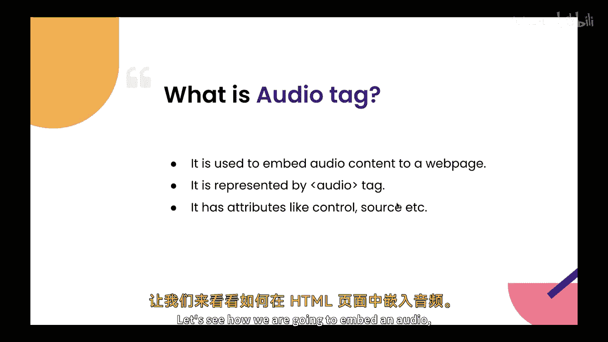
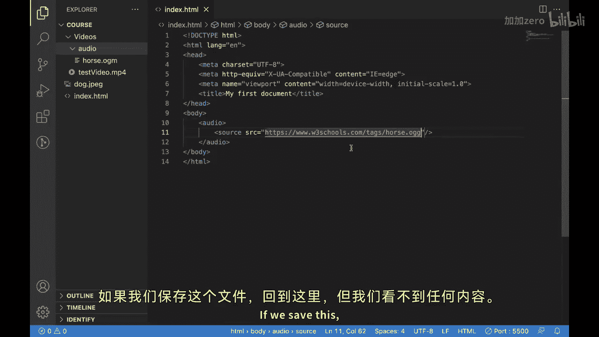
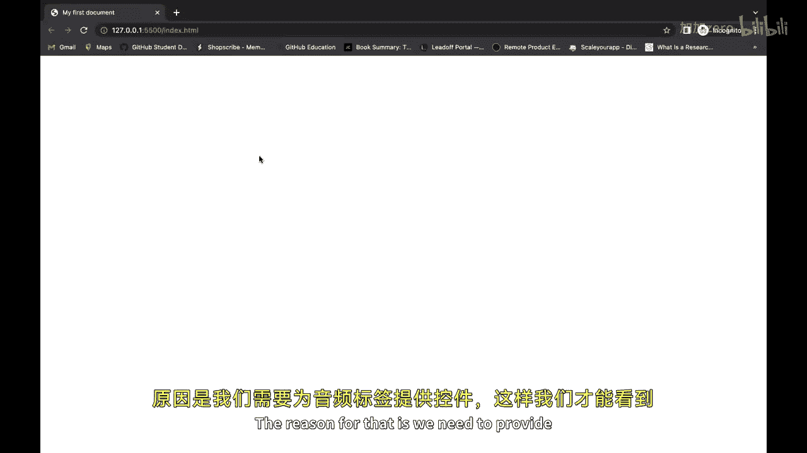
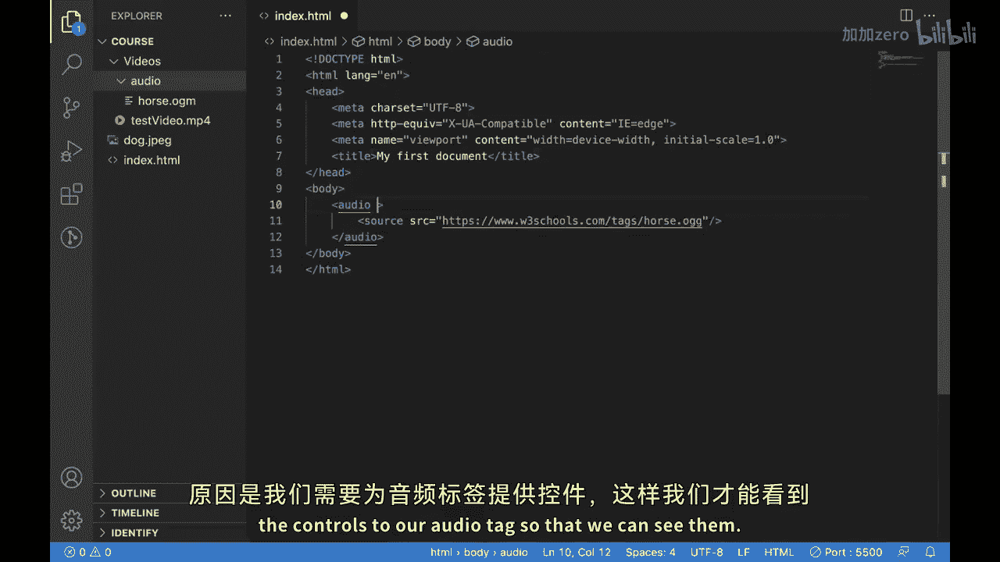
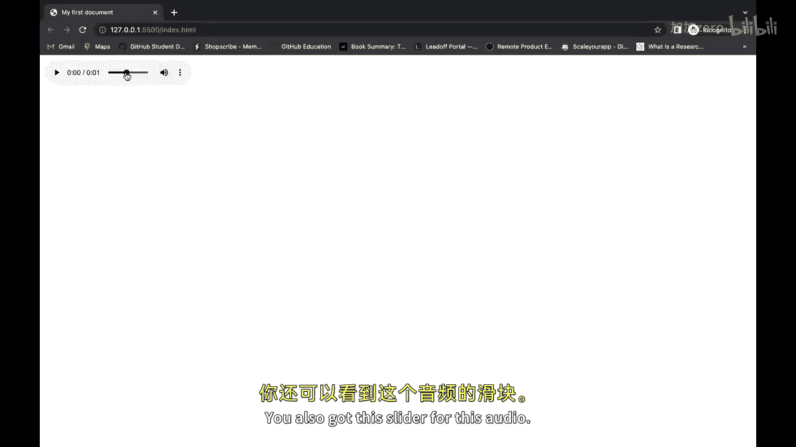
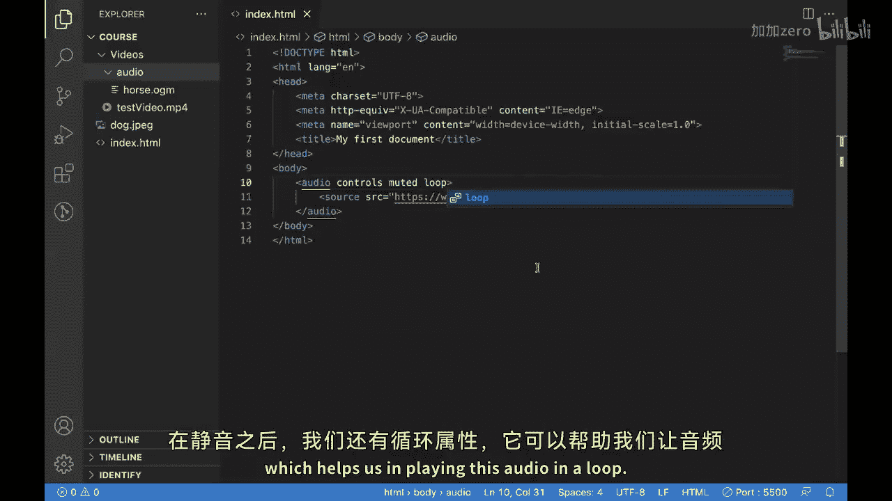
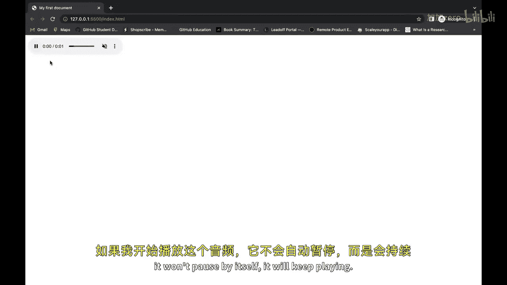
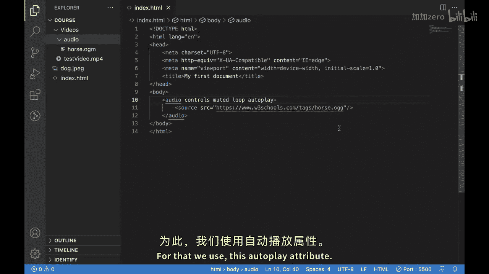
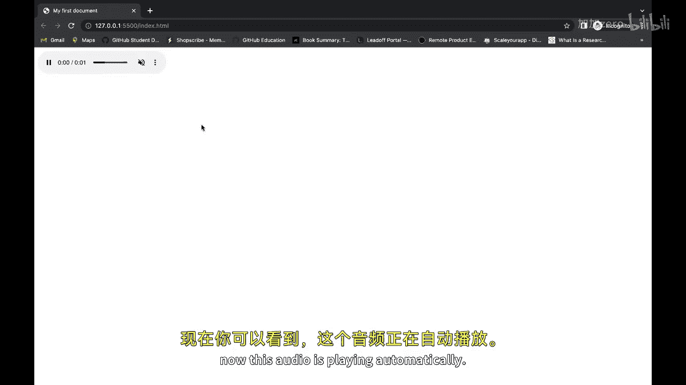
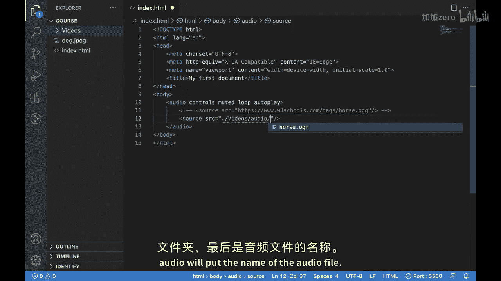

# 081：HTML音频标签详解 🎵

在本节课中，我们将要学习HTML中的`<audio>`标签。这个标签允许你在网页中嵌入音频内容，就像上一节我们介绍的`<video>`标签用于嵌入视频一样。本节中我们来看看如何使用`<audio>`标签及其相关属性来增强网站的多媒体体验。

## 什么是音频标签？ 🎧

`<audio>`标签，也称为音频元素，用于将音频内容嵌入到网页中。它是一个强大的工具，可以为你的网站添加背景音乐、音效或音频描述，从而提升用户体验和参与度。

## 音频标签的用途

以下是`<audio>`标签的主要用途：



*   **播放音乐或音频内容**：你可以轻松地为网站添加背景音乐或音频片段。
*   **提供音频描述**：为视频或其他多媒体内容提供音频描述，这能使你的内容对视障用户更友好，并改善整体用户体验。

## 如何嵌入音频



现在，让我们看看如何在HTML页面中嵌入音频。核心方法是使用`<audio>`标签，并在其中嵌套`<source>`标签来指定音频文件的来源。





以下是基本的HTML代码结构：

```html
<audio controls>
  <source src="音频文件的URL" type="audio/文件格式">
</audio>
```



*   `<audio>`：定义音频播放器。
*   `controls`：此属性用于显示播放控件，如播放、暂停和音量调节。
*   `<source>`：此标签用于指定音频源。
*   `src`：此属性包含你想要嵌入网页的音频文件的URL或路径。



## 音频标签的关键属性





上一节我们介绍了基本结构，本节中我们来看看`<audio>`标签支持的一些重要属性，它们能实现不同的功能。



以下是`<audio>`标签的主要属性：

*   **`controls`**：显示播放器的控制面板（播放/暂停按钮、进度条、音量控制等）。这是最常用的属性。
*   **`muted`**：设置音频初始状态为静音。
*   **`loop`**：设置音频播放结束后自动重新开始，实现循环播放。
*   **`autoplay`**：设置页面加载后自动开始播放音频（注意：许多现代浏览器出于用户体验考虑，会阻止带声音的自动播放）。

## 加载本地音频文件

除了从网络URL加载音频，你还可以从本地文件系统加载音频。



以下是加载本地音频文件的步骤：

1.  在`<source>`标签的`src`属性中，使用相对路径或绝对路径指向你的音频文件。
2.  例如，如果你的HTML文件、视频文件夹、音频文件夹和音频文件的结构如下，路径可以这样写：
    ```
    当前目录/
    ├── 你的HTML文件.html
    └── video/
        └── audio/
            └── your-audio-file.mp3
    ```
3.  对应的`src`属性值应为：`src="./video/audio/your-audio-file.mp3"`。这里的`./`表示当前HTML文件所在的目录。

## 总结


本节课中我们一起学习了HTML的`<audio>`标签。它是一个功能强大的工具，允许你将音频内容嵌入网站，为用户创造更具沉浸感的体验。通过有效使用`<audio>`标签及其属性（如`controls`、`loop`、`autoplay`），你可以创建更具吸引力和表现力的网页。希望你现在已经理解了如何将音频标签应用到自己的HTML页面中。