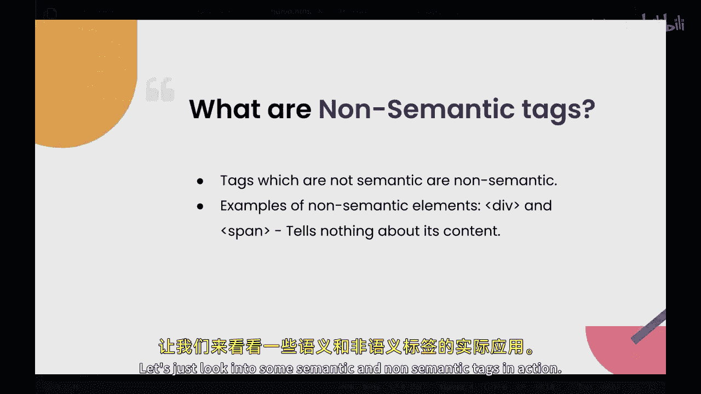
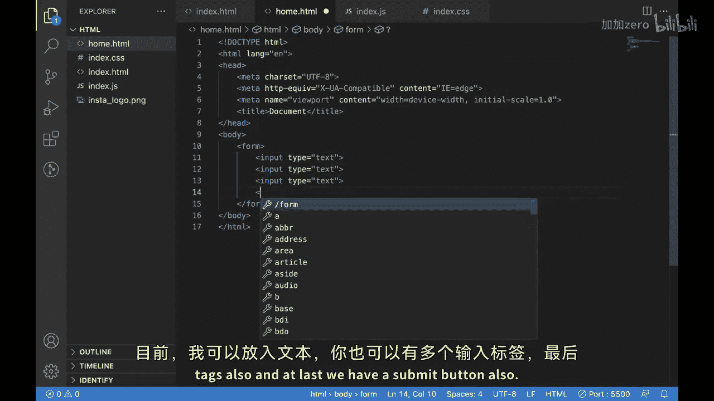
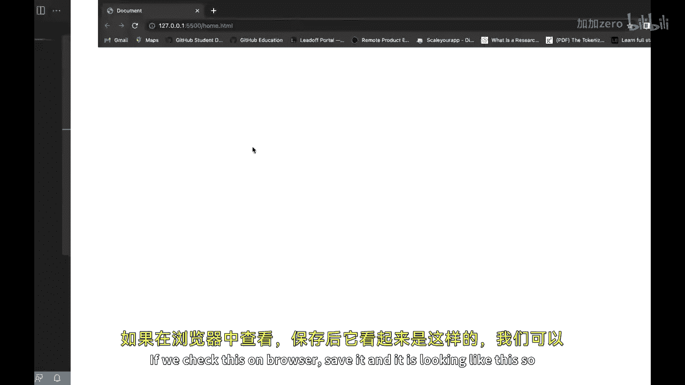
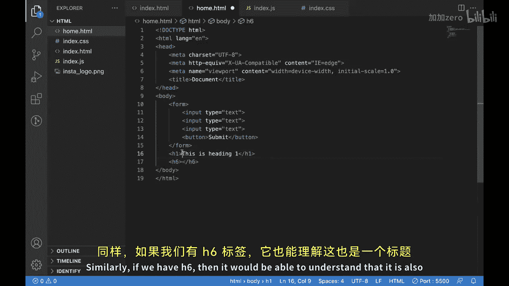
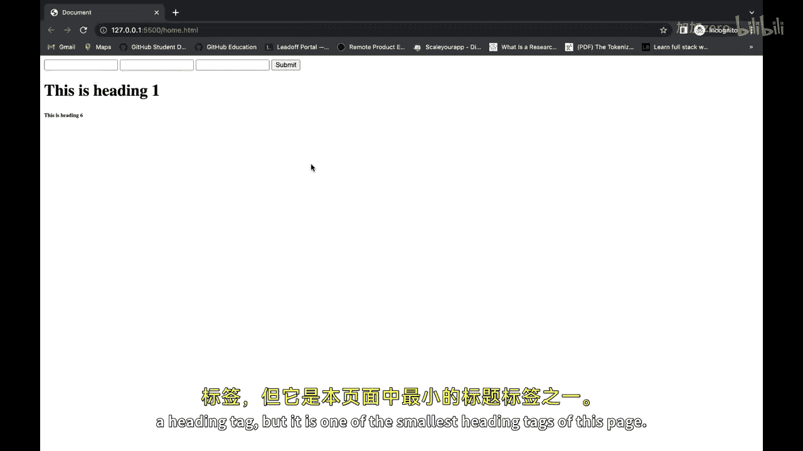
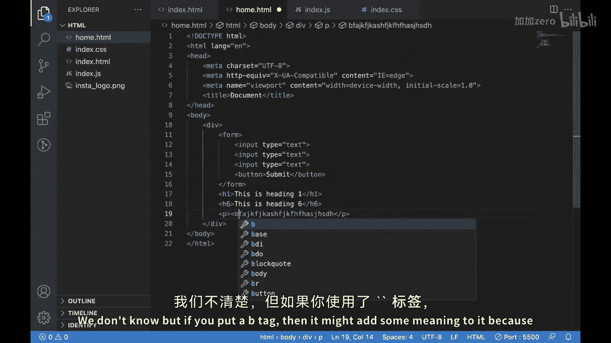

# 085：语义化与非语义化标签 🏷️

在本节课中，我们将学习HTML中的语义化标签与非语义化标签。我们将探讨它们各自的定义、用途、区别以及在实际开发中的重要性。

## 概述

在HTML中，我们见过不同类型的标签，也了解了它们各自的用例。本节我们将从讨论在网页开发中使用语义化标签的重要性及其优势开始。我们也将探讨非语义化标签的概念，并区分两者。最后，我们将提供一些语义化和非语义化标签的常见示例。

## 语义化标签

语义化标签旨在为其包含的内容提供意义和上下文。它们帮助搜索引擎和辅助技术理解内容的结构和目的，从而提升网站的可访问性和搜索引擎优化。

以下是一些常用的语义化标签：
*   **`<header>`**： 定义文档或区域的页眉。
*   **`<nav>`**： 定义导航链接部分。
*   **`<main>`**： 定义文档的主要内容。
*   **`<article>`**： 定义独立、完整的内容块。
*   **`<section>`**： 定义文档中的节或段。

这些标签传达了其所包含内容的**目的和角色**，使得开发者、浏览器和用户更容易理解和与网页交互。



## 非语义化标签

上一节我们介绍了语义化标签，本节中我们来看看非语义化标签。非语义化标签不传达任何特定的含义或上下文。它们通常用于样式设计或作为通用容器。

以下是一些常见的非语义化标签示例：
*   **`<div>`**： 通用块级容器。
*   **`<span>`**： 通用行内容器。
*   **`<p>`**： 段落标签。





虽然它们在组织和格式化内容方面有其用途，但它们缺乏语义化标签所提供的**内在含义和结构**。

## 标签实例解析

现在，让我们通过一些实例来看看语义化和非语义化标签的实际应用。

### 语义化标签示例：`<form>`

`<form>` 标签用于在HTML页面中创建表单。它内部通常包含特定的输入标签。

```html
<form>
  <input type="text" placeholder="用户名">
  <input type="password" placeholder="密码">
  <button type="submit">提交</button>
</form>
```





当浏览器或搜索引擎的爬虫程序访问这个页面时，`<form>` 标签能明确告知它们：“这是一个表单区域”。这有助于技术理解页面结构。同理，`<h1>` 到 `<h6>` 等标题标签能清晰地标示内容的层级关系。

### 非语义化标签示例：`<div>` 与 `<span>`

`<div>` 是一个通用的容器标签，其内部可以包含任何内容，如图片、文本甚至整个表单。

```html
<div>
  
  <p>这是一段文字。</p>
</div>
```

`<div>` 标签本身不提供任何关于其内部内容的语义信息，它仅仅表示“这是代码的一个区块”。类似地，`<span>` 是一个行内容器。即使是 `<p>` 标签，也主要表示这是一个段落，但段落的具体重要性或内容类型需要借助其他标签（如 `<strong>` 或 `<em>`）来进一步明确。

```html
<p>这是一个非常重要的<strong>概念</strong>。</p>
```



## 总结


本节课中，我们一起学习了HTML中语义化标签与非语义化标签的核心区别。语义化标签（如 `<header>`、`<nav>`、`<form>`）为内容赋予明确含义，有助于SEO和可访问性。而非语义化标签（如 `<div>`、`<span>`）主要用作通用容器，用于布局和样式控制。理解并恰当地使用这两类标签，将使你的网页结构更清晰，更易于维护和被机器理解。希望你能在下一个项目中合理地运用它们。