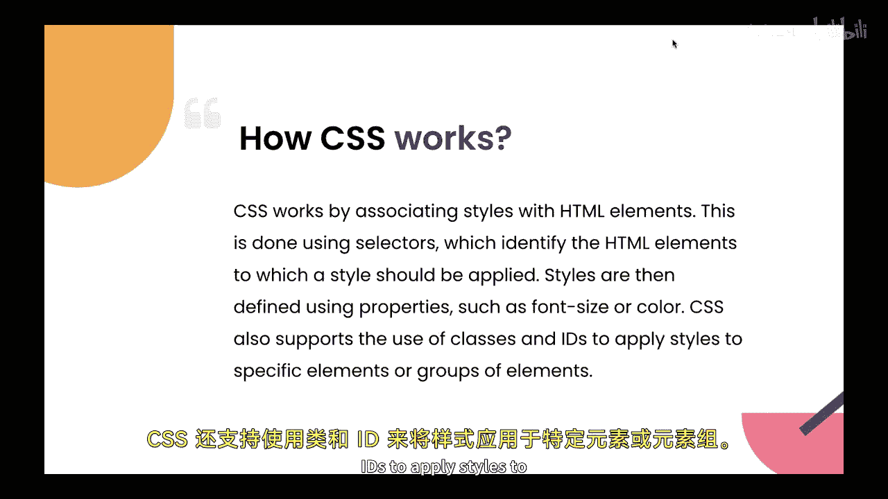
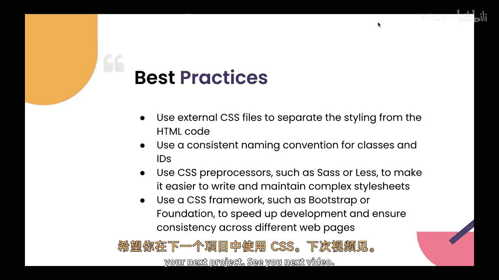

Java全栈开发：P15-02：什么是CSS 🎨

在本节课中，我们将学习CSS（层叠样式表）的基础知识，包括其定义、重要性、工作原理以及最佳实践。CSS是网页开发中用于控制网页视觉表现的核心技术。

---

在上一节中，我们介绍了HTML及其在网页开发中的重要性。本节中，我们将探讨网页开发的另一个关键元素——CSS。

CSS，全称层叠样式表，是一种样式表语言，用于描述HTML或XML文档的呈现方式。它定义了网页的视觉布局、格式和设计，例如字体、大小、颜色、边距和整体布局。CSS是网页开发的关键部分，因为它允许开发者将网页的内容和结构与它的表现形式分离开来。

这意味着你可以改变网站的布局和样式，而无需改动其底层的HTML结构。这使得网站的维护和更新变得更加容易，同时也提升了其可访问性和用户体验。

CSS的工作原理是通过选择器将样式与HTML元素关联起来。选择器用于识别应应用样式的HTML元素。样式则通过属性来定义，例如 `font-size` 或 `color`。

**示例代码：**
```css
p {
  color: blue;
  font-size: 16px;
}
```



CSS也支持使用类和ID来为特定元素或元素组应用样式。

**示例代码：**
```css
.highlight {
  background-color: yellow;
}
#header {
  font-weight: bold;
}
```

---

了解了CSS的基本概念后，以下是使用CSS时可以遵循的一些最佳实践。

*   **使用外部CSS文件**：将样式与HTML代码分离。这将改善你的文件管理。
*   **使用一致的命名规范**：为类和ID使用一致的命名约定。这将帮助你在整个HTML/CSS项目中保持标准。
*   **使用CSS预处理器**：例如SASS或LESS，以使编写和维护复杂的样式表变得更加容易。
*   **使用CSS框架**：例如Bootstrap或Foundation，以加速开发并确保不同网页间的一致性，因为它们能让你在短时间内轻松开发复杂功能。

---

本节课中，我们一起学习了CSS。CSS是网页开发的关键部分，它允许开发者定义网页的视觉布局和设计。通过将内容和结构与表现形式分离，CSS使网站的维护和更新更加容易，同时也提升了其可访问性和用户体验。通过遵循最佳实践并使用CSS框架和预处理器，开发者可以高效地创建美观且功能强大的网页。




希望你能在你的下一个项目中使用CSS。我们下一个视频再见。