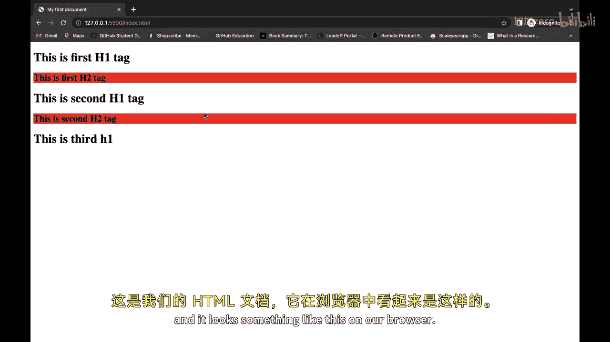
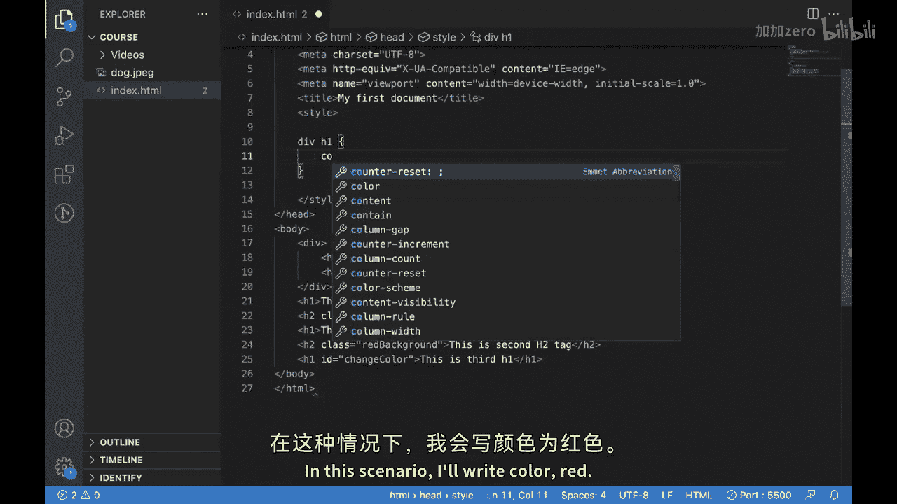
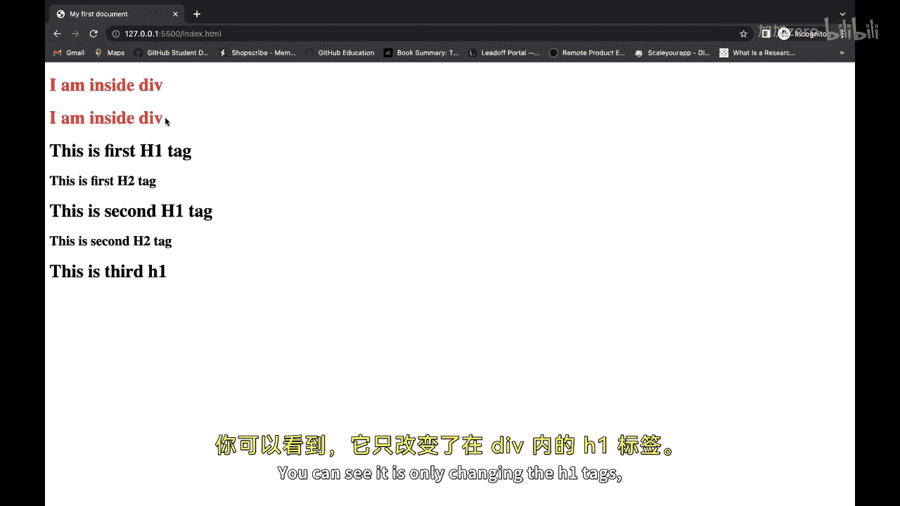
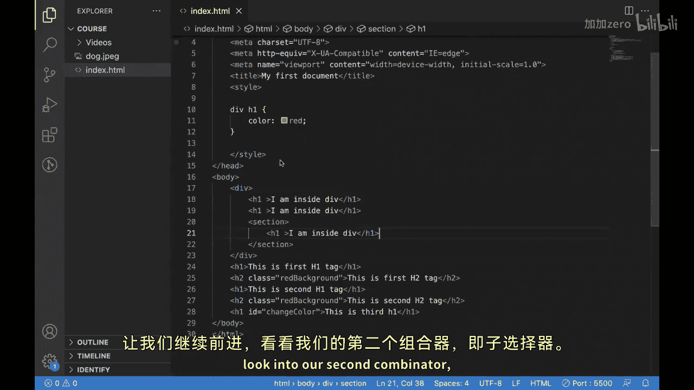
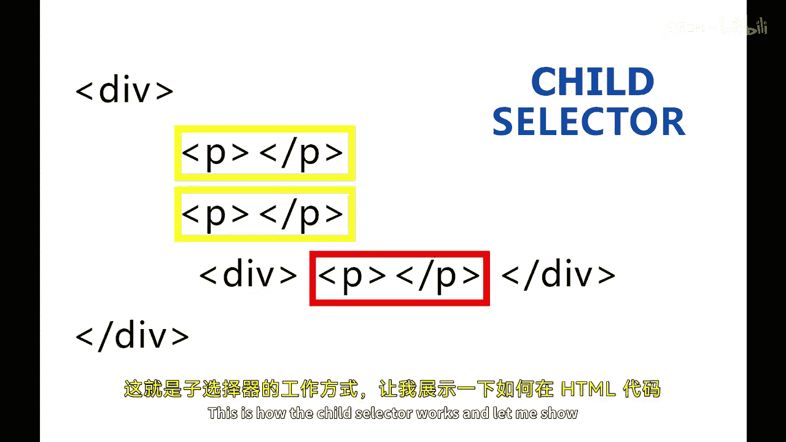
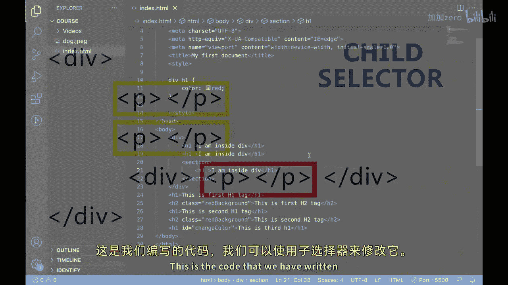
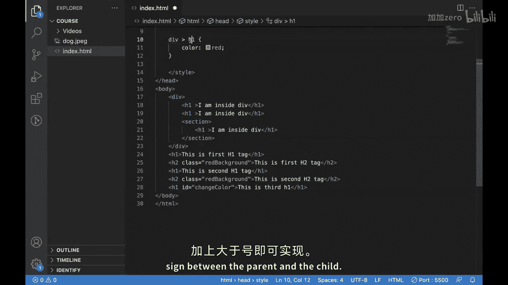
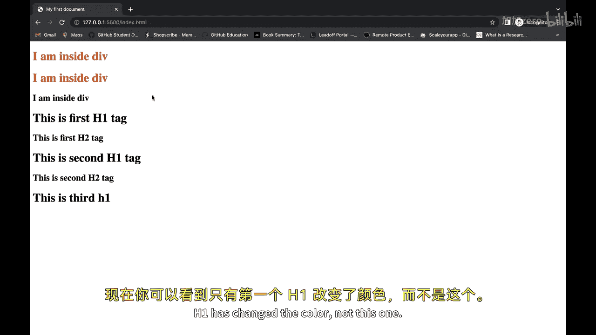
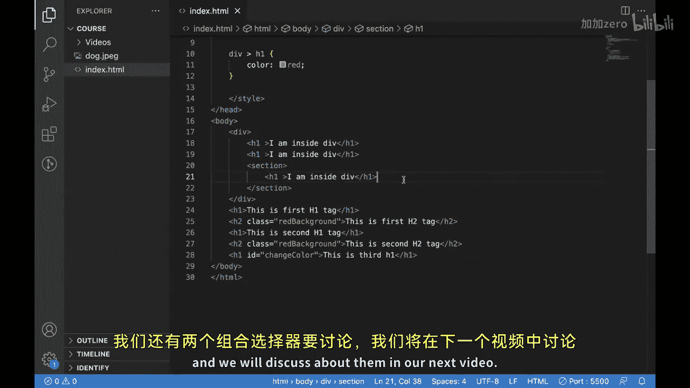

# 090：CSS组合选择器（第一部分）🎨

## 概述

在本节课中，我们将要学习CSS中的组合选择器。组合选择器是一种通过组合多个简单选择器来更精确地定位网页元素的方法，它允许开发者创建更具体、更有针对性的样式。

## 从简单选择器到组合选择器

上一节我们介绍了CSS中的简单选择器。本节中，我们来看看如何组合它们以创建更强大的选择规则。

组合选择器，也称为关系选择器，通过描述元素之间的层级或相邻关系来定位目标元素。当单个选择器无法轻松选中所需元素时，组合选择器就非常有用。



以下是几种主要的组合选择器类型，我们将逐一探讨。

## 后代选择器

后代选择器用于匹配作为另一个元素后代的元素。这意味着，只要目标元素嵌套在指定的祖先元素内部，无论嵌套多深，都会被选中。

**语法公式：**
```
祖先元素 后代元素 {
    样式声明;
}
```





让我们通过代码示例来理解。假设我们有以下HTML结构：
```html
<div>
    <a href="#">我是div内的链接1</a>
    <section>
        <a href="#">我是div内的链接2（嵌套更深）</a>
    </section>
</div>
<a href="#">我是div外的链接</a>
```

如果我们只想改变`<div>`内部所有`<a>`标签的颜色，而不影响外部的链接，可以使用后代选择器。

**CSS代码示例：**
```css
div a {
    color: red;
}
```



应用此规则后，只有位于`<div>`内部的两个链接会变成红色，而外部的链接保持不变。这证明了后代选择器会选择所有层级的后代元素。

## 子选择器

子选择器与后代选择器类似，但更为严格。它只匹配作为另一个元素**直接子元素**的元素。



**语法公式：**
```
父元素 > 子元素 {
    样式声明;
}
```



为了理解区别，让我们修改之前的例子。考虑以下结构：
```html
<div>
    <a href="#">直接子链接1</a>
    <a href="#">直接子链接2</a>
    <section>
        <a href="#">孙子链接（非直接子元素）</a>
    </section>
</div>
```

如果我们使用子选择器：
```css
div > a {
    color: blue;
}
```

应用此规则后，只有前两个作为`<div>`直接子元素的`<a>`标签会变成蓝色。嵌套在`<section>`内的第三个链接不会被选中，因为它不是`<div>`的直接子元素。



## 本节总结



本节课中我们一起学习了CSS组合选择器的前两种类型：**后代选择器**和**子选择器**。
*   **后代选择器（空格）**：选择指定祖先元素内的所有后代元素，无论嵌套深度。
*   **子选择器（`>`）**：仅选择指定父元素的直接子元素。




理解这两种选择器的区别对于编写精确的CSS规则至关重要。在下一节视频中，我们将继续探讨另外两种组合选择器。