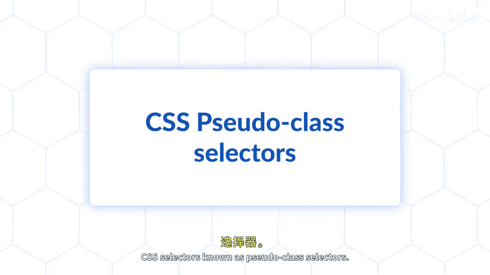

# 092：伪类与伪元素选择器

在本节课中，我们将学习CSS中两种强大的选择器：伪类选择器和伪元素选择器。伪类选择器允许你根据元素的特定状态（如悬停、点击或获得焦点）来应用样式。伪元素选择器则让你能够选择和样式化元素的特定部分，例如段落的首字母或在元素前后插入内容。掌握这些选择器将极大地提升你网页的用户界面和功能。

## 伪类选择器

上一节我们介绍了CSS选择器的基本概念，本节中我们来看看伪类选择器。伪类选择器用于定义元素的特殊状态。它们通常以冒号（`:`）开头。

以下是常见的伪类选择器及其应用场景：

*   **`:hover`**：当用户将鼠标指针悬停在元素上时应用样式。
    *   代码示例：`a:hover { color: red; }`
*   **`:active`**：当元素（如链接或按钮）被激活（例如被点击）时应用样式。
    *   代码示例：`button:active { background-color: blue; }`
*   **`:focus`**：当元素获得焦点（例如通过键盘Tab键选中或鼠标点击输入框）时应用样式。
    *   代码示例：`input:focus { border-color: green; }`
*   **`:first-child`**：选择作为其父元素第一个子元素的元素。
    *   代码示例：`li:first-child { font-weight: bold; }`
*   **`:nth-child(n)`**：选择作为其父元素第n个子元素的元素。
    *   公式示例：`tr:nth-child(2n) { background-color: #f2f2f2; }` （选中所有偶数行）

通过组合使用这些选择器，你可以创建出响应式的、交互性强的用户界面。

## 伪元素选择器

了解了如何根据状态选择元素后，我们再来看看如何选择元素的某个部分。伪元素选择器用于样式化元素的特定部分。它们以双冒号（`::`）开头，但单冒号（`:`）也被广泛支持用于向后兼容。

以下是核心的伪元素选择器及其功能：

*   **`::before`**：在选定元素的内容之前插入生成的内容。
    *   代码示例：`p::before { content: "“"; color: gray; }`
*   **`::after`**：在选定元素的内容之后插入生成的内容。
    *   代码示例：`.note::after { content: " (重要)"; font-size: smaller; }`
*   **`::first-letter`**：选择块级元素（如段落）文本内容的第一个字母进行样式化。
    *   代码示例：`p::first-letter { font-size: 200%; float: left; }`
*   **`::first-line`**：选择块级元素文本内容的第一行进行样式化。
    *   代码示例：`p::first-line { font-weight: bold; }`
*   **`::selection`**：改变用户用鼠标选中的文本的样式。
    *   代码示例：`::selection { background-color: yellow; color: black; }`

伪元素选择器 `::before` 和 `::after` 必须与 `content` 属性一起使用，即使 `content` 的值为空字符串（`content: "";`）。

## 总结

本节课中我们一起学习了CSS伪类与伪元素选择器。伪类选择器（如 `:hover`, `:focus`）让你能根据用户交互或元素在文档树中的位置来应用样式。伪元素选择器（如 `::before`, `::first-letter`）则让你能够深入到元素内部，对其特定部分进行精细的样式控制。将这些概念应用到你的网页项目中，你将能充分利用CSS强大的样式化能力，创造出更具动态感和视觉吸引力的用户体验。