# 096：属性选择器

## 概述

在本节课中，我们将要学习CSS属性选择器。属性选择器是一种强大的工具，它允许我们根据HTML元素的属性或其属性值来精确地选择并应用样式。

## 课程内容

### 回顾与引入

在之前的视频中，我们已经学习了不同类型的CSS选择器，例如简单选择器、组合器、伪类和伪元素，并在我们的项目中使用了它们。

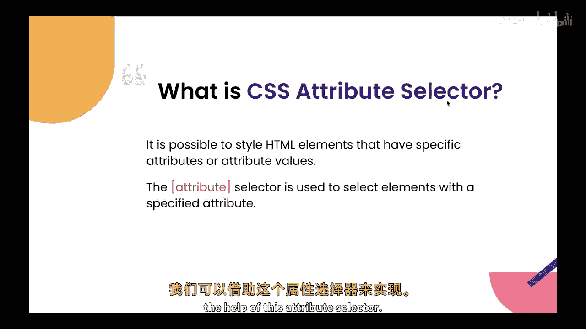

本节中，我们来看看属性选择器。属性选择器用于根据元素属性的存在或其值来选择元素。它们由方括号 `[]` 表示，并且可以与其他选择器结合使用，以创建更具体的样式规则。

### 属性选择器示例一：链接样式

以下是属性选择器的一个典型应用场景。假设我们有一个网站，其中包含多个链接。其中一些链接指向外部网站，而另一些则指向内部页面。我们希望将指向外部网站的链接显示为不同的颜色。我们可以借助属性选择器来实现这一点。

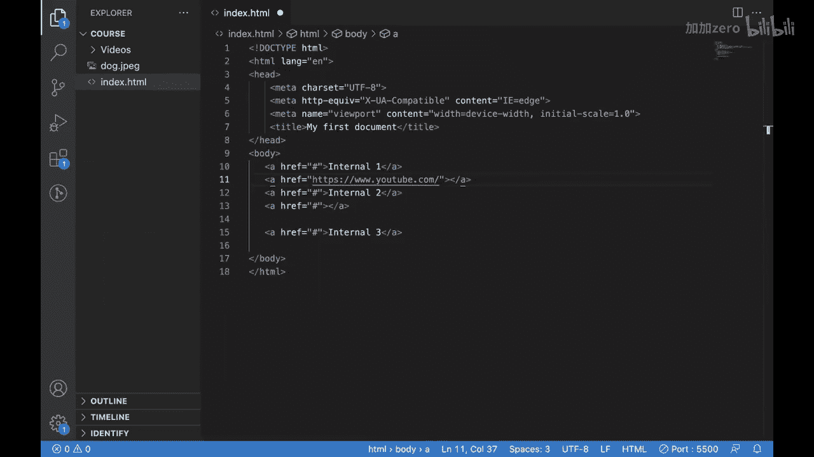

让我们看看如何实现。这是我们的HTML页面：

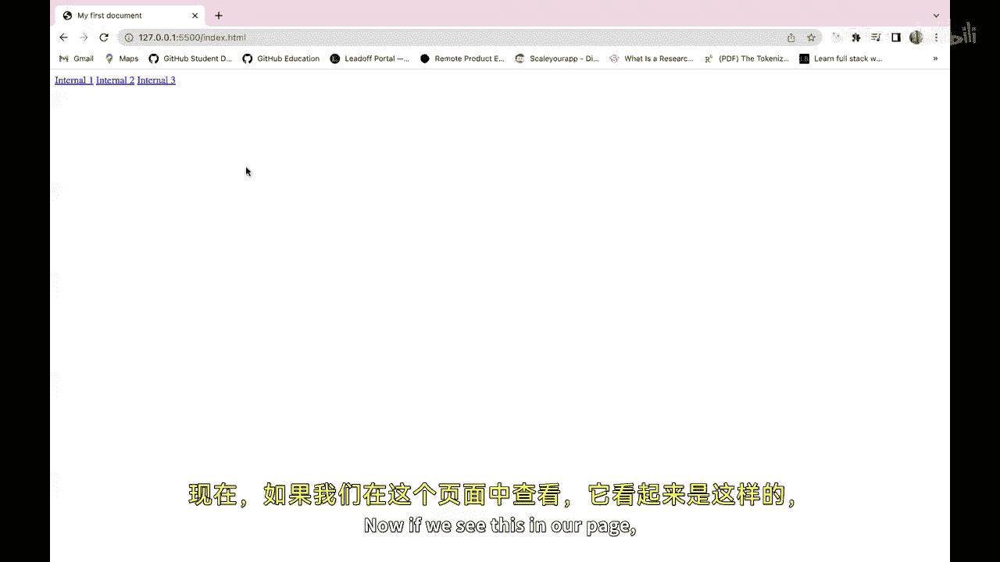

```html
<a href="internal1.html">内部链接1</a>
<a href="internal2.html">内部链接2</a>
<a href="internal3.html">内部链接3</a>
<a href="https://youtube.com">YouTube</a>
<a href="https://google.com">Google</a>
```

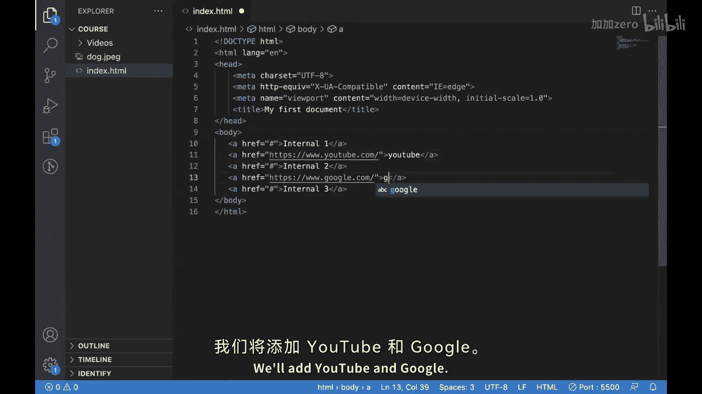

页面上显示如下：

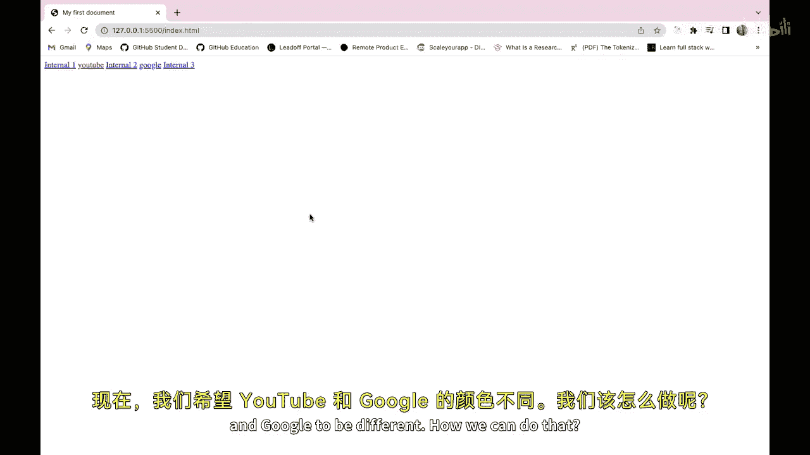

```
内部链接1 内部链接2 内部链接3 YouTube Google
```

我们希望YouTube和Google链接的颜色与众不同。为了实现这个效果，我们首先添加 `<style>` 标签，并在其中编写CSS。这次我们将使用属性选择器。

我们将首先写入选择器，即锚点标签 `a`，然后使用方括号 `[]` 来指定属性条件。我们知道这些链接的地址属性是 `href`。

```css
a[href^="https://"] {
  background-color: red;
}
```


这段CSS代码的意思是：选择所有 `href` 属性值以 `"https://"` 开头的 `<a>` 元素，并将它们的背景色设置为红色。保存后，我们可以看到YouTube和Google链接的背景色发生了变化。

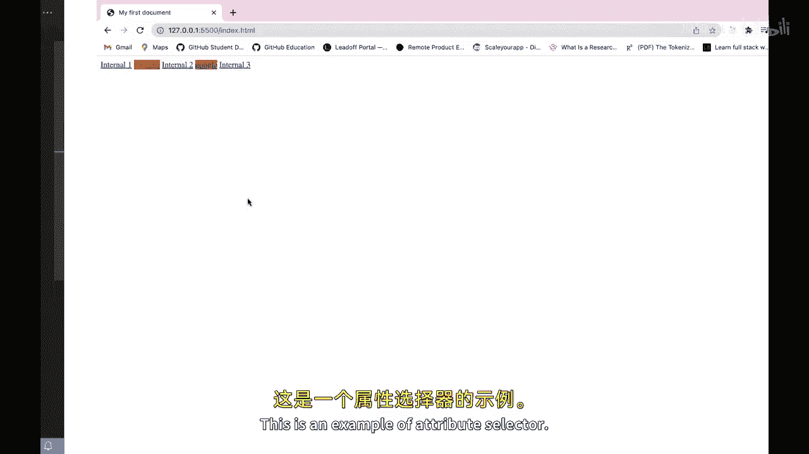

这是一个属性选择器的应用示例。

### 属性选择器示例二：表单输入样式

属性选择器还可以用于根据特定属性的值来选择元素。让我们看另一个例子。

假设我们有一些输入框：

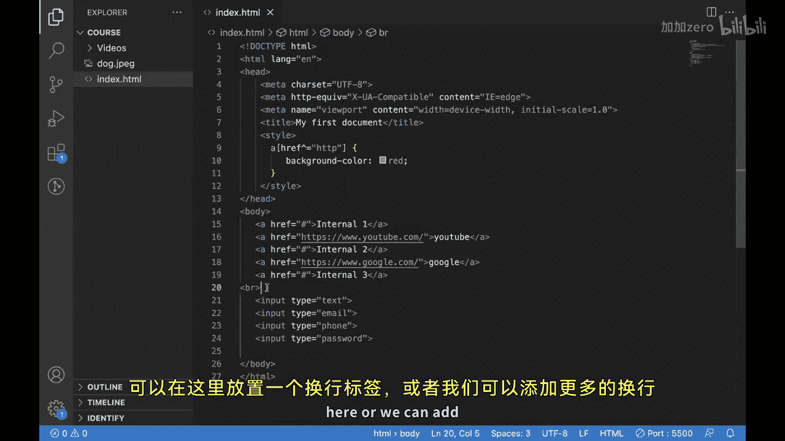

```html
<input type="text">
<input type="number">
<input type="email">
<input type="password">
```

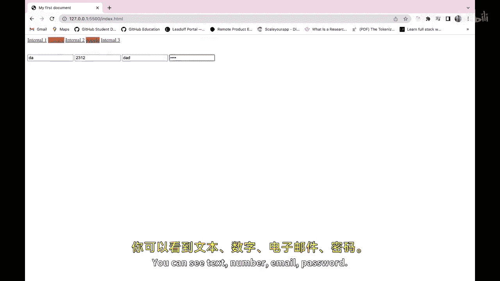

页面上显示为：

```
文本输入框 数字输入框 邮箱输入框 密码输入框
```

我们希望邮箱输入框看起来与众不同。我们不想将这个样式应用于所有输入框，而只应用于邮箱输入框。当然，我们可以给它添加一个不同的ID或类，但这不是我们本节要讨论的方法。我们希望使用属性选择器。

我们可以这样写CSS：

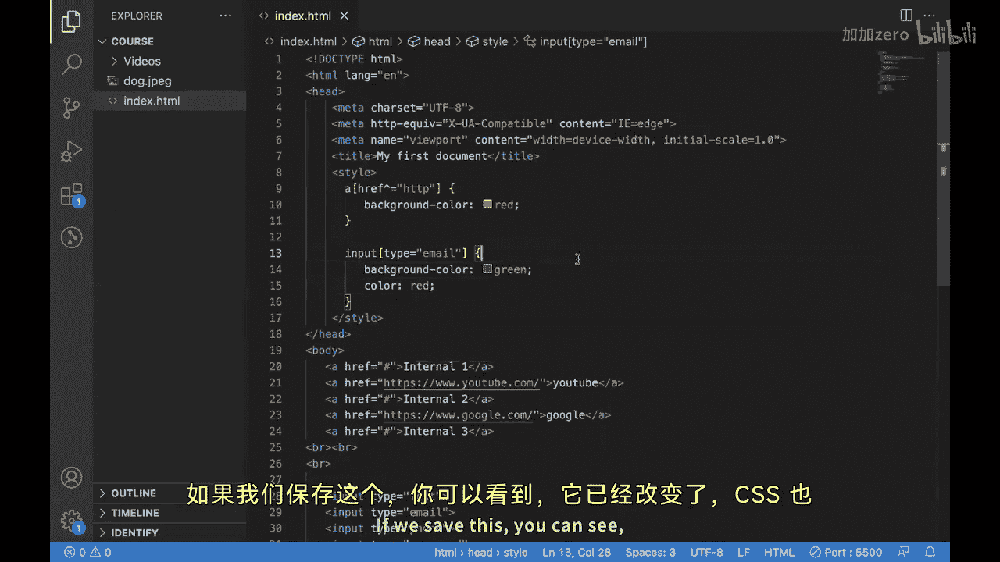

```css
input[type="email"] {
  background-color: yellow;
  color: red;
}
```

这段代码选择了所有 `type` 属性值等于 `"email"` 的 `<input>` 元素，并为它们应用了黄色背景和红色文字样式。保存后，可以看到只有邮箱输入框的样式发生了变化。

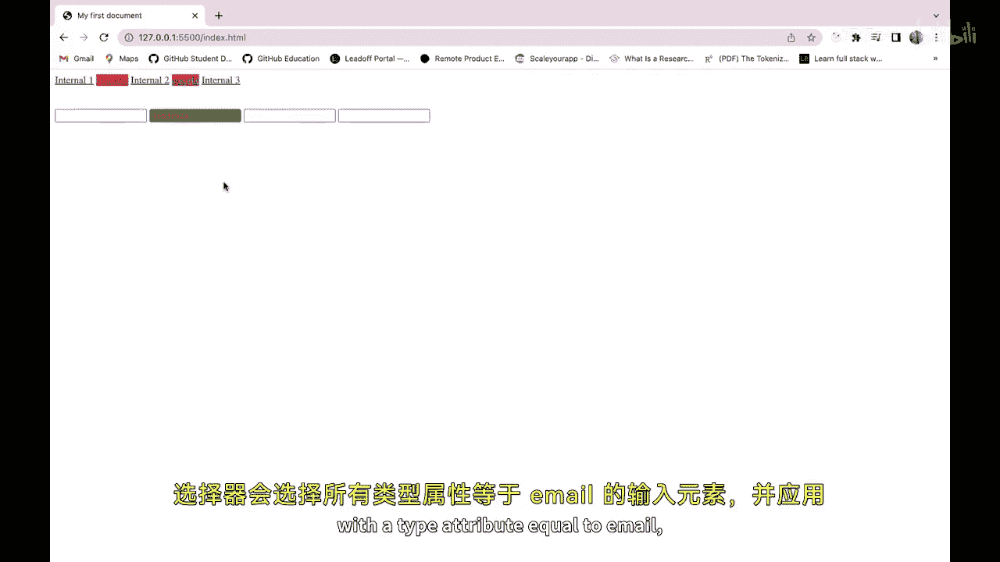

这个选择器选中了所有类型为邮箱的输入元素，并对其应用了样式。

## 总结

本节课中，我们一起学习了CSS属性选择器。属性选择器用于根据元素属性的存在或其值来选择元素，由方括号 `[]` 表示。它们可以与其他选择器结合，以创建更精确的样式规则，对于定位页面上的特定元素非常有用。

希望你已经学会了如何在你的项目中使用它们，并且一定会尝试借助属性选择器来实现各种不同的功能。

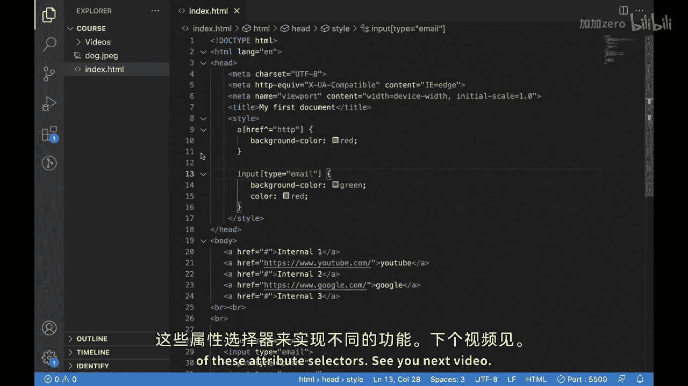


我们下个视频再见。