# 097：CSS字体属性 🎨


在本节课中，我们将要学习CSS字体属性。文本是任何网页上的重要元素，使用CSS字体属性可以增强文本的设计感和可读性。通过恰当地使用字体，你可以使内容更具吸引力、更易于阅读，从而帮助用户在你的页面上停留更长时间。学完本视频后，你将很好地理解如何使用这些属性来提升文本的视觉效果。

上一节我们介绍了CSS定位，本节中我们来看看如何为HTML文档中的文本应用样式。

## 字体大小

首先，我们可以调整字体的大小。这通过 `font-size` 属性实现。

以下是可用的不同值：

*   `smaller`：使字体变小。
*   `large`：使字体变大。
*   `x-large`：使字体变得更大。

除了这些关键词，你还可以使用具体的单位，例如 `50px` 表示50像素。我们将在本系列课程后续部分详细讨论这些单位。

**代码示例：**
```css
p {
  font-size: large; /* 使用关键词 */
  font-size: 20px; /* 使用像素单位 */
}
```

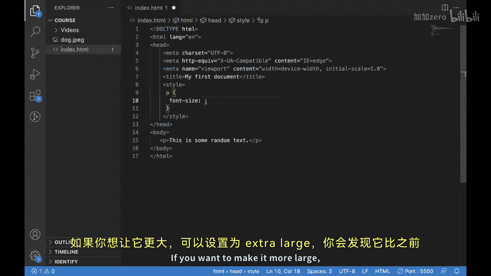

## 字体样式

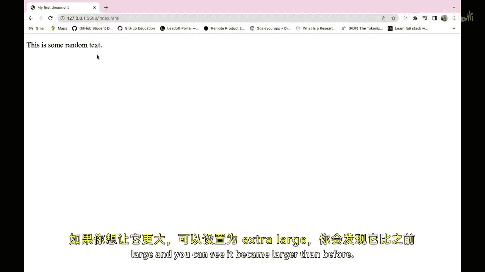

接下来，我们看看如何调整字体样式。`font-style` 属性允许你指定文本是否应以斜体显示。

**代码示例：**
```css
p {
  font-style: italic; /* 将文本设置为斜体 */
}
```

## 字体粗细

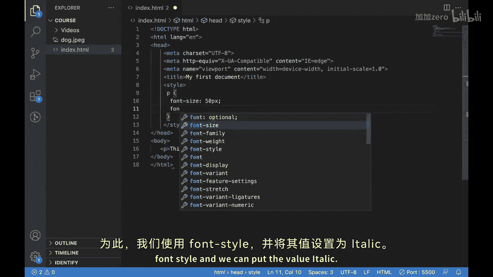

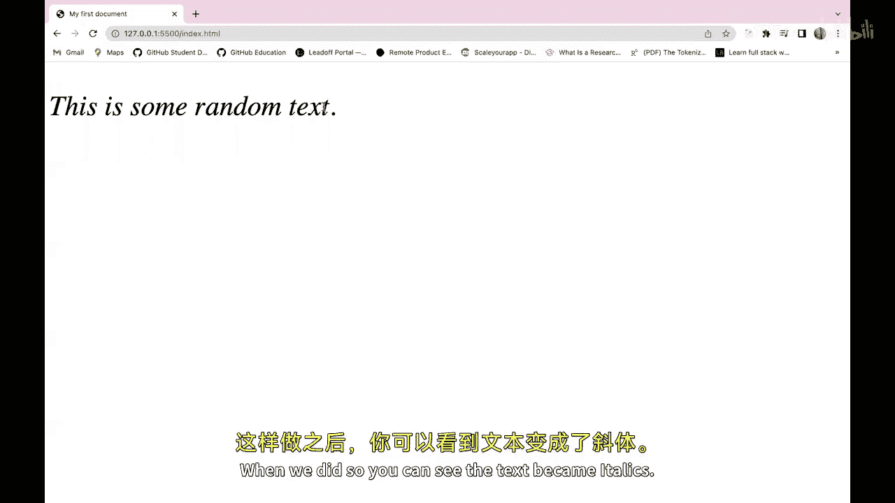

调整字体粗细也很重要。`font-weight` 属性决定文本是以粗体还是正常粗细显示。

以下是可用的不同值：

*   `400`：正常粗细。
*   `700` 或 `bold`：粗体。
*   `900` 或 `bolder`：更粗的字体。

**代码示例：**
```css
p {
  font-weight: bold; /* 设置为粗体 */
  font-weight: 900; /* 设置为更粗的字体 */
}
```

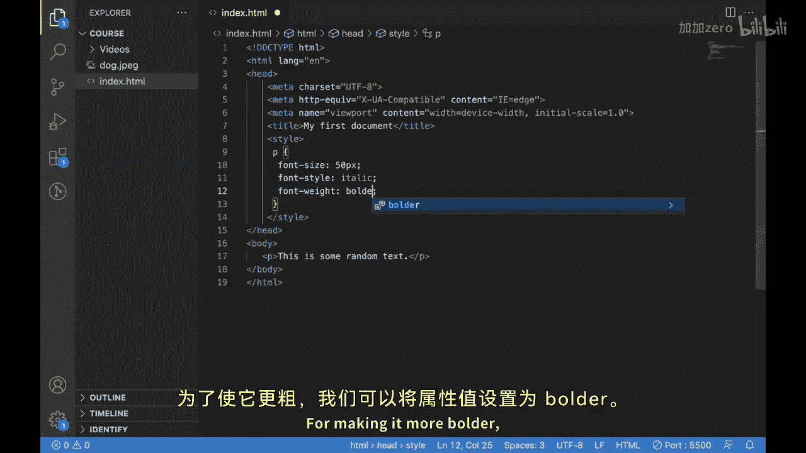

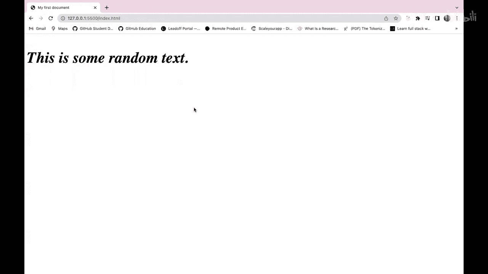

## 文本转换

我们还可以控制文本的大小写显示。`text-transform` 属性可以实现这一点。

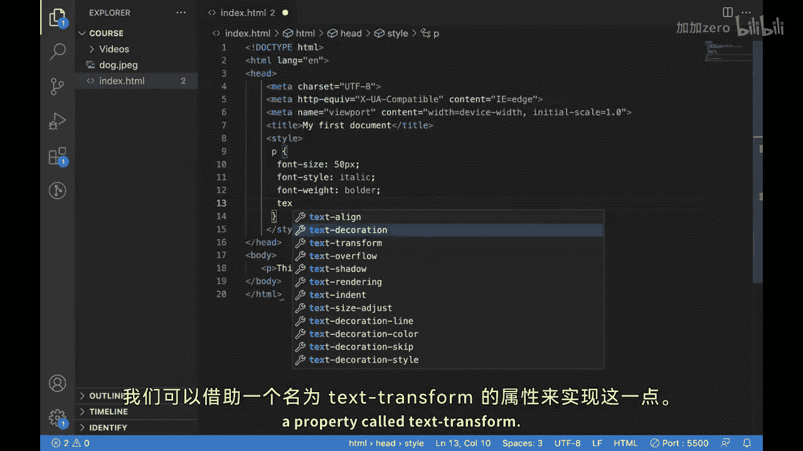

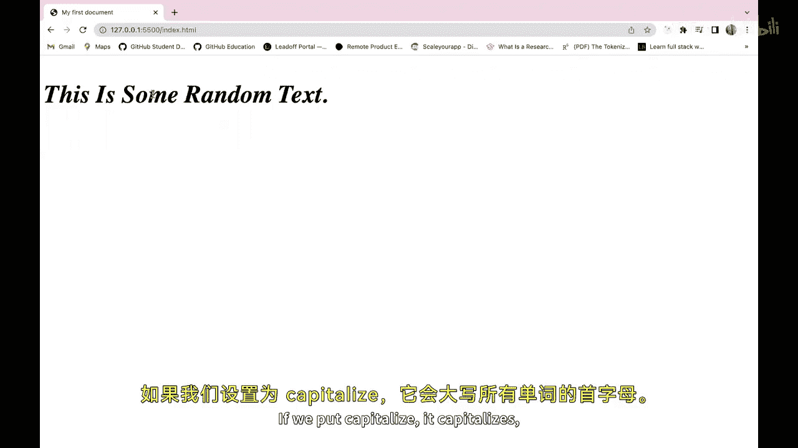

以下是可用的不同值：

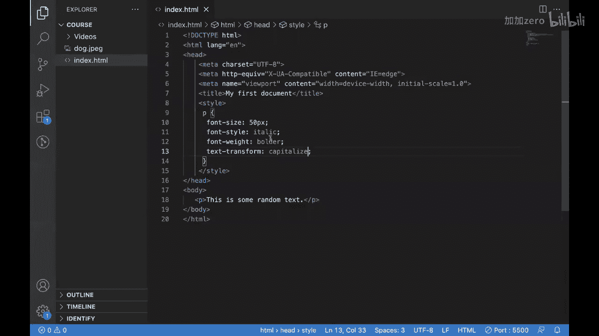

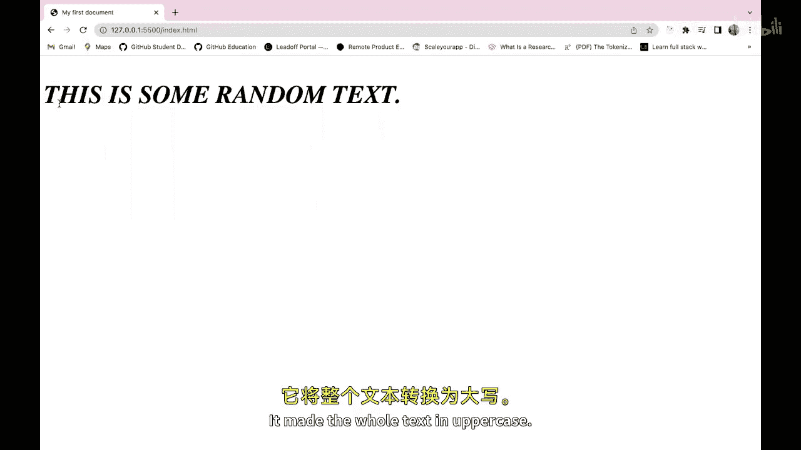

*   `capitalize`：将每个单词的首字母大写。
*   `uppercase`：将所有字母转换为大写。
*   `lowercase`：将所有字母转换为小写。

**代码示例：**
```css
p {
  text-transform: capitalize; /* 首字母大写 */
  text-transform: uppercase; /* 全部大写 */
}
```

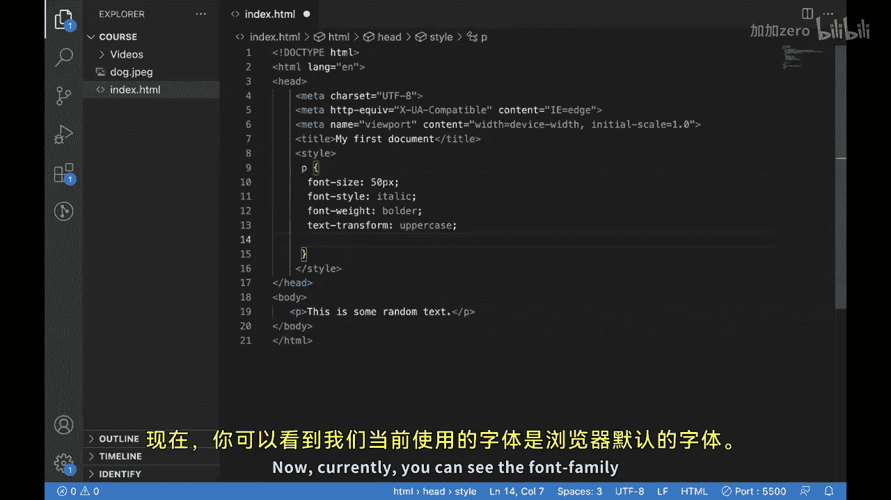

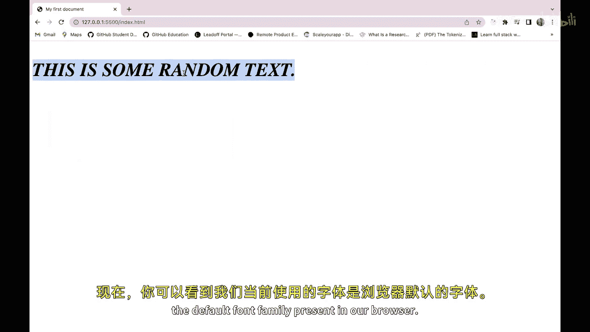

## 字体系列

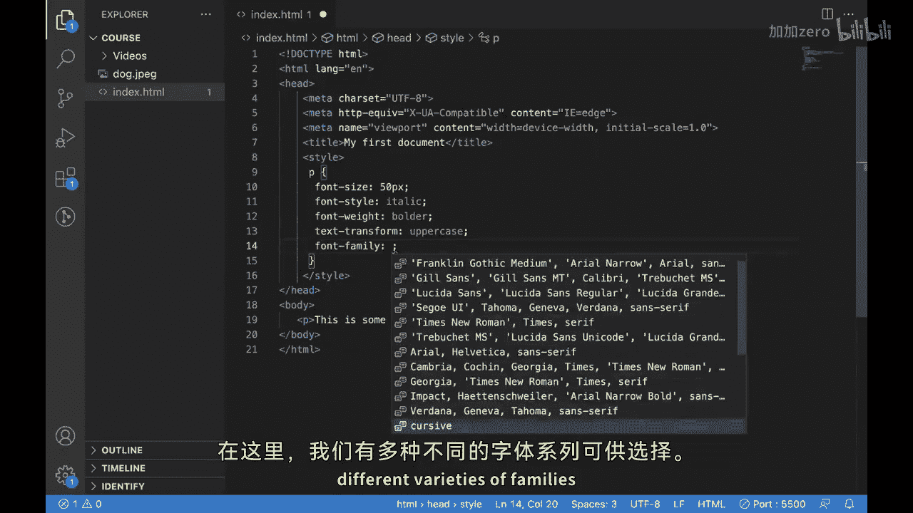

最后，我们可以更改文本的字体系列。默认情况下，浏览器使用其预设字体。通过 `font-family` 属性，我们可以指定其他字体。

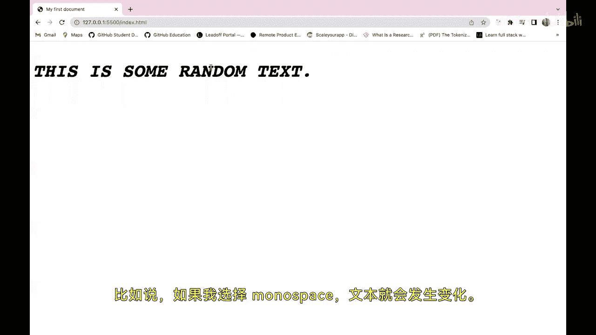

例如，设置为 `monospace`（等宽字体）会改变文本的外观。你可以尝试多种字体，如 `Arial`、`Georgia`、`"Times New Roman"` 等，以找到最适合你设计的字体。

**代码示例：**
```css
p {
  font-family: monospace; /* 使用等宽字体 */
  font-family: Arial, sans-serif; /* 指定首选和备用字体 */
}
```

本节课中我们一起学习了如何使用 `font-family`、`font-size`、`font-style`、`font-weight` 和 `text-transform` 等CSS属性来控制网页上文本的外观，使其最符合你的需求。尝试不同的字体样式和大小，看看哪种最适合你的设计。

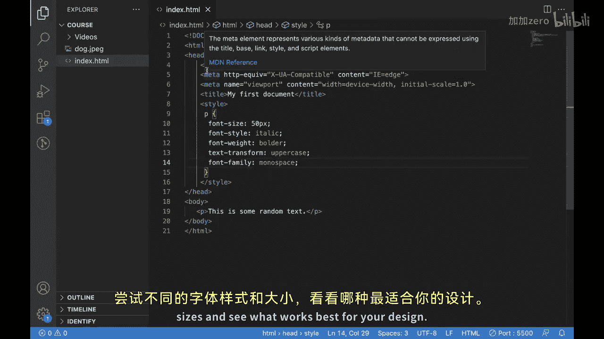


我们下个视频再见。🎼