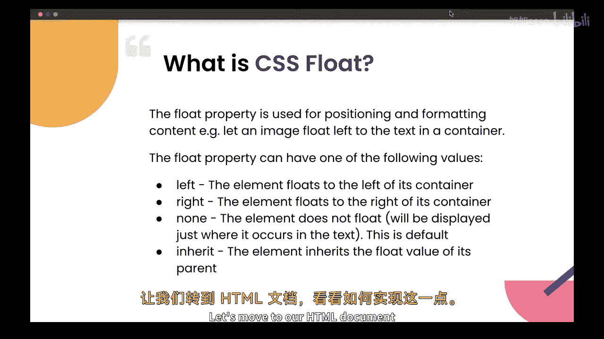
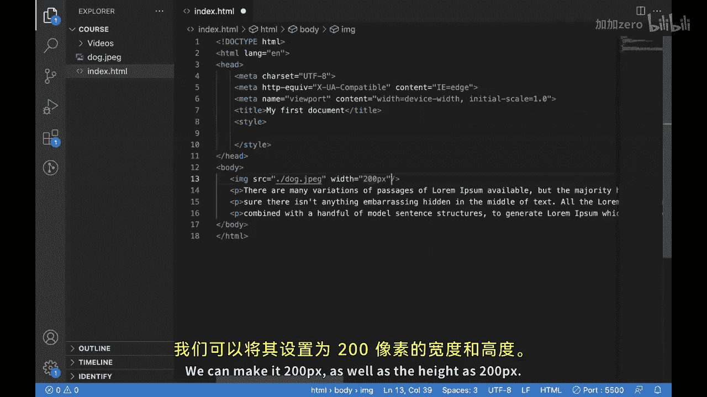
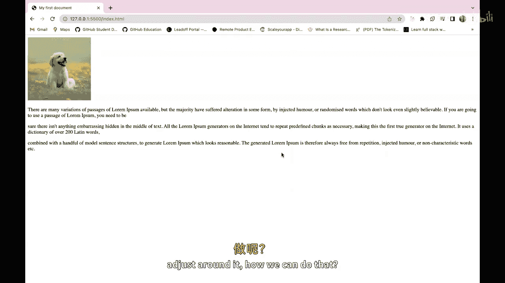
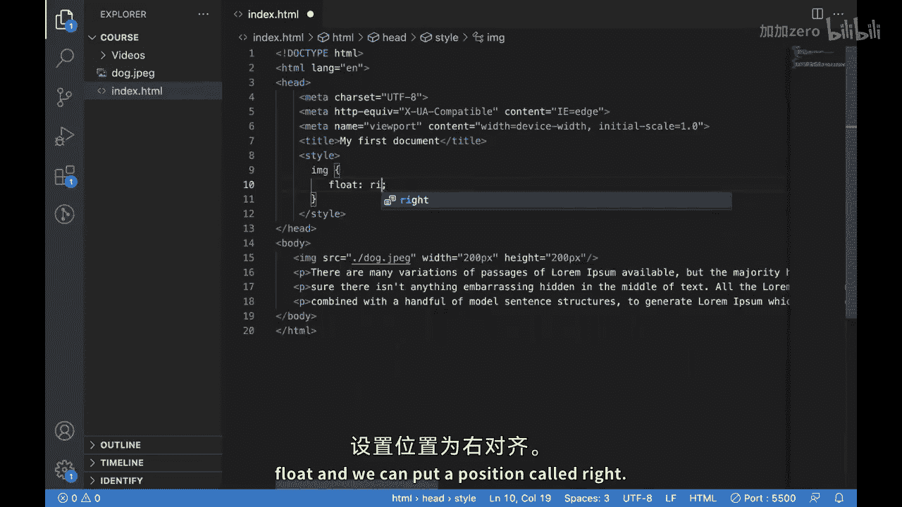
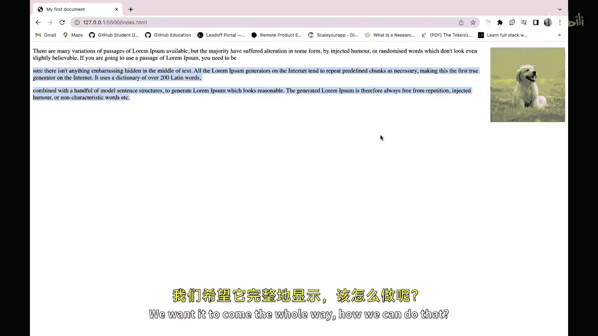
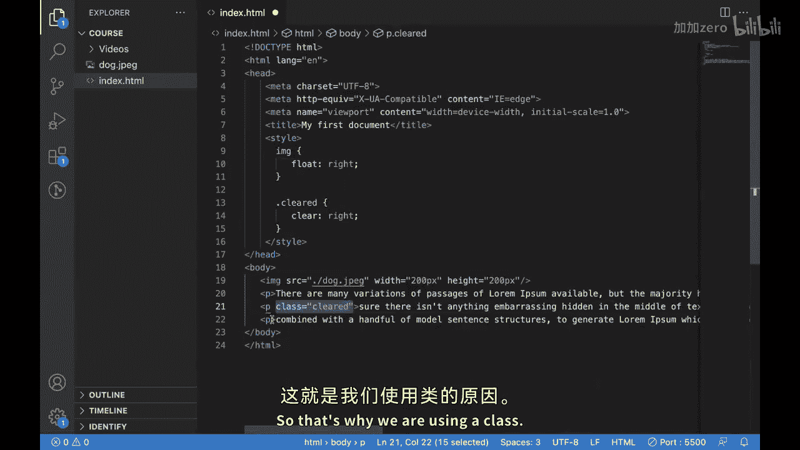
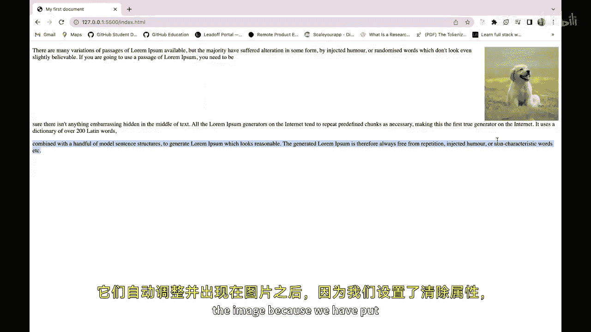
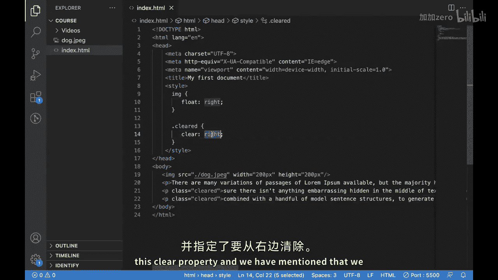

# 099：CSS浮动（Float）属性详解 🎨

在本节课中，我们将要学习CSS中的`float`属性。这是一个非常强大且灵活的工具，它允许我们创建多列布局，并实现文字环绕图片或其他元素的效果。

上一节我们介绍了如何使用不同的CSS字体属性来美化HTML文档中的文字。本节中我们来看看如何使用`float`属性来控制元素的排列方式。

## 概述：什么是CSS浮动？

`float`是一个CSS属性，它允许你将一个元素定位在其容器的左侧或右侧。这会为其他内容在其周围流动创造空间，这对于创建多列布局或将图片与文字并排非常有用。

`float`属性通常与`clear`属性结合使用，后者用于控制浮动元素之后其他元素的行为。

## 核心概念与属性

以下是本节课将涵盖的核心内容：

*   **`float`属性**：用于设置元素的浮动方向。
    *   **代码**：`float: left;` 或 `float: right;`
*   **`clear`属性**：用于清除浮动，防止后续元素受到前面浮动元素的影响。
    *   **代码**：`clear: left;`, `clear: right;`, 或 `clear: both;`

## 实践：创建文字环绕效果

让我们通过一个HTML文档示例来学习如何实现浮动效果。



首先，我们有一个包含多个段落的简单HTML页面。

```html
<p>这是第一个段落，包含一些示例文字。</p>
<p>这是第二个段落，包含更多示例文字。</p>
```

现在，我们在段落之间添加一张图片。

```html

<p>这是第一个段落，包含一些示例文字。</p>
<p>这是第二个段落，包含更多示例文字。</p>
```



默认情况下，图片会作为一个块级元素显示，文字会出现在它的下方。

为了让图片浮动到右侧，并使文字环绕它，我们为图片添加CSS样式。



```css
img {
    float: right;
    width: 200px;
    height: 200px;
}
```

应用此样式后，图片会移动到容器的右侧，周围的文字会自动调整并环绕在图片的左侧。



## 控制浮动：使用Clear属性

有时，我们可能希望某些内容不受前面浮动元素的影响。例如，我们希望第二个段落不从图片右侧开始，而是从新的一行开始。

这时，我们可以使用`clear`属性。



首先，我们为不希望被浮动影响的段落创建一个CSS类。

```css
.clear-right {
    clear: right;
}
```

然后，将这个类应用到对应的HTML段落标签上。

```html

<p>这是第一个段落，包含一些示例文字。</p>
<p class="clear-right">这是第二个段落，它将从新的一行开始，不会环绕图片。</p>
```



应用`clear: right;`后，第二个段落将清除右侧的浮动，因此它会从图片下方开始显示，而不会环绕图片。



## 最佳实践与注意事项



在使用`float`时，需要注意以下几点：

1.  **父元素高度塌陷**：当一个父元素内部的所有子元素都浮动时，父元素的高度可能会变为0，因为它不再包含任何常规流中的内容。解决方法是使用“清除浮动”技术，例如在父元素末尾添加一个带有`clear: both;`的空元素，或者使用`overflow: hidden;`等现代方法。
2.  **响应式布局**：虽然`float`可以用于创建布局，但对于复杂的响应式设计，现代CSS技术如Flexbox和Grid通常是更好的选择。`float`更适合于实现简单的文字环绕效果。
3.  **谨慎使用Clear**：确保只在需要阻止元素与浮动元素相邻时才使用`clear`属性。

## 总结

本节课中我们一起学习了CSS的`float`和`clear`属性。我们了解了`float`如何让元素向左或向右浮动，并让其他内容环绕它。我们还学习了如何使用`clear`属性来精确控制哪些元素应该避开浮动元素。

掌握这些知识后，你应该能够在网页中创建灵活的文字环绕布局。请记住谨慎使用`clear`属性，并始终在不同设备上测试你的布局，以确保它们在所有屏幕上都能良好显示。


希望本教程对你有帮助，我们下节课再见！