# 101：CSS单位 📏

在本节课中，我们将要学习CSS单位。它们是网页设计中用于定义元素尺寸（如字体大小、边距、内边距和边框）的关键工具。理解不同的CSS单位及其适用场景，对于创建响应式、跨设备兼容的网页至关重要。

上一节我们介绍了CSS的`display`属性及其不同取值。本节中，我们来看看如何精确控制元素的尺寸，这就要用到CSS单位。

## 什么是CSS单位？🤔

在网页开发中，CSS单位对于设计视觉吸引人且用户友好的网站至关重要。它们允许你指定元素的尺寸，例如字体、边距、内边距和边框。它们确保你的设计在不同浏览器和设备上看起来保持一致。

CSS单位主要分为两大类：**绝对单位**和**相对单位**。

## 绝对单位与相对单位

*   **绝对单位**是固定的，例如厘米（cm）、毫米（mm）、英寸（in）、像素（px）。这意味着无论屏幕如何变化，我们定义的尺寸将保持不变。
*   **相对单位**则与绝对单位非常不同。相对单位的长度**取决于屏幕尺寸**。当屏幕尺寸改变时，这些长度也会随之改变。

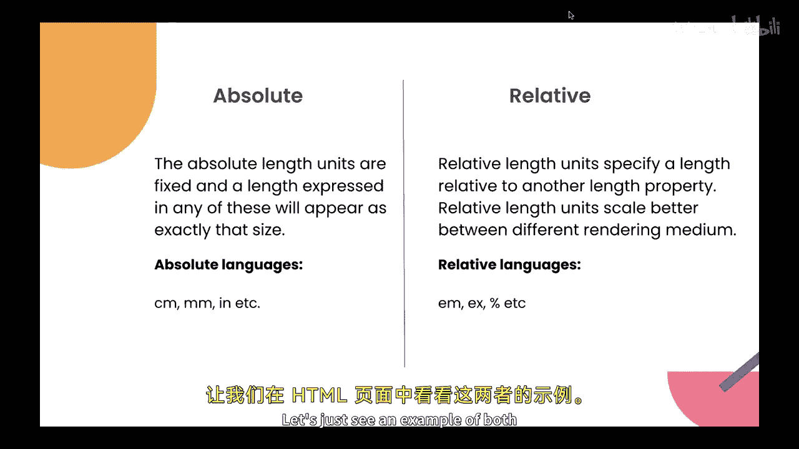

让我们通过一个HTML页面来查看这两种单位的例子。

## 实践示例：像素（px）、视口单位（vw/vh）和百分比（%）

假设我们有一个简单的HTML文档，其中包含一个`<div>`元素。

```html
<div>这是一些文本。</div>
```

现在，让我们使用像素（px）来改变字体大小。像素是CSS中最常用的单位之一。

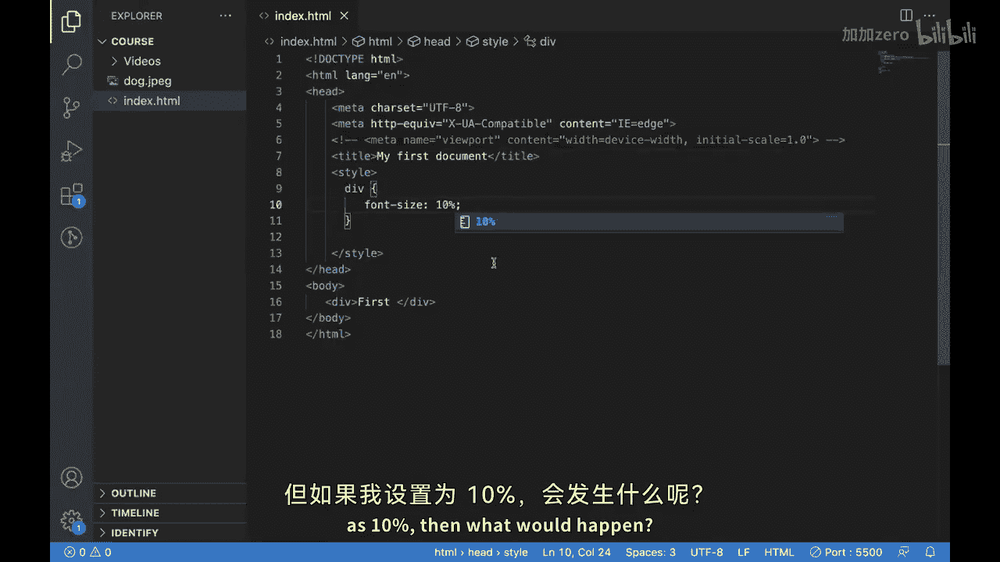

```css
div {
  font-size: 100px;
}
```

使用像素单位时，即使我们改变屏幕尺寸，字体大小也始终保持为100像素。


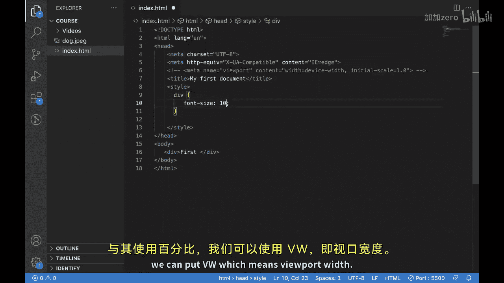

接下来，我们看看相对单位。首先是百分比（%）。

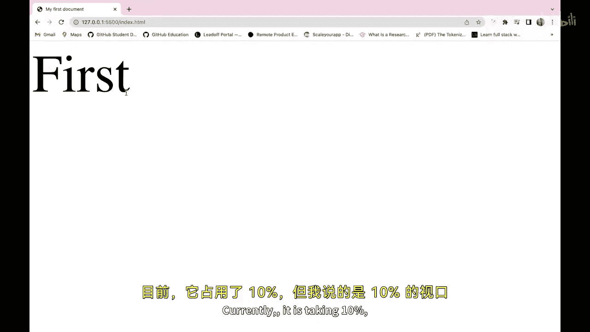

```css
div {
  font-size: 10%;
}
```

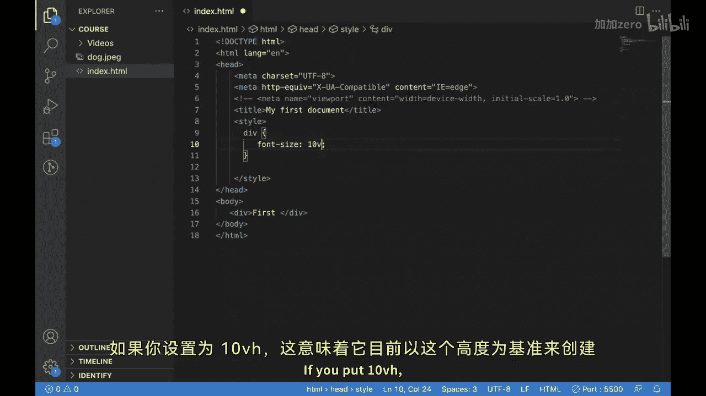

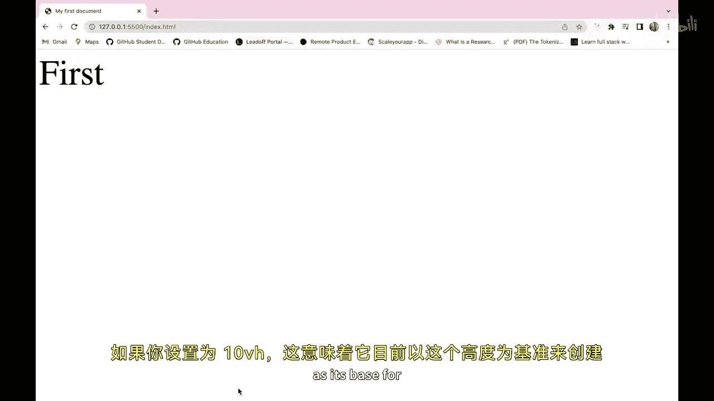

百分比单位会基于其父元素的尺寸进行计算。但有时我们更希望基于视口（浏览器窗口）的尺寸。这时可以使用视口宽度单位（`vw`）和视口高度单位（`vh`）。

```css
div {
  font-size: 10vw; /* 字体大小为视口宽度的10% */
}
```

```css
div {
  font-size: 10vh; /* 字体大小为视口高度的10% */
}
```

`10vw`意味着字体大小是当前视口宽度的10%，`10vh`则是视口高度的10%。当调整浏览器窗口大小时，字体大小会动态变化。

## 深入理解：em 与 rem 单位

`em`和`rem`是另外两个非常重要的相对单位。为了更好地演示，我们创建几个段落。

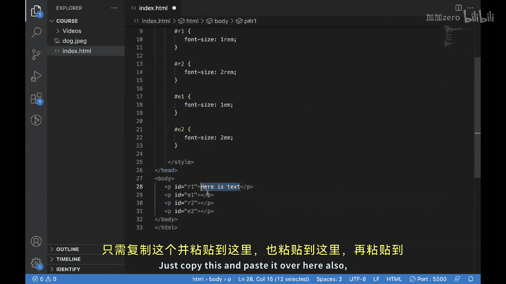

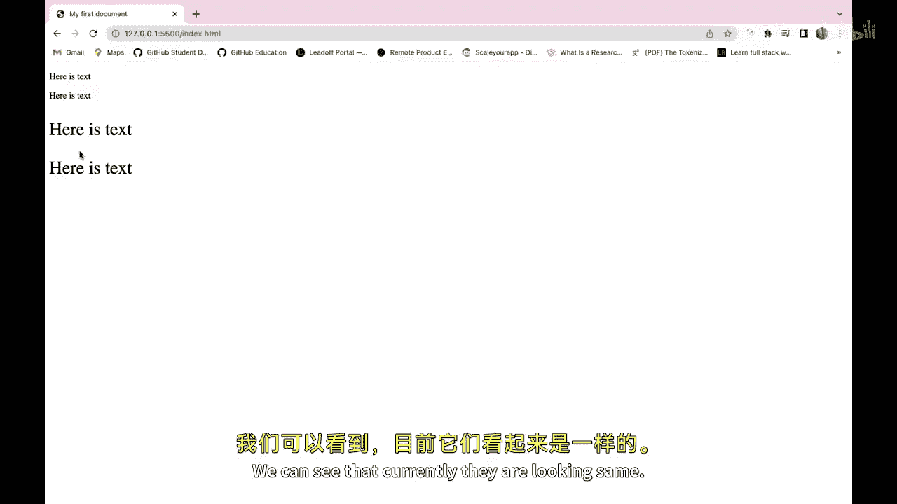

```html
<p id="r1">这是 rem 示例文本。</p>
<p id="r2">这是另一个 rem 示例文本。</p>
<p id="e1">这是 em 示例文本。</p>
<p id="e2">这是另一个 em 示例文本。</p>
```

然后为它们应用样式：

```css
#r1 { font-size: 1rem; }
#r2 { font-size: 2rem; }
#e1 { font-size: 1em; }
#e2 { font-size: 2em; }
```

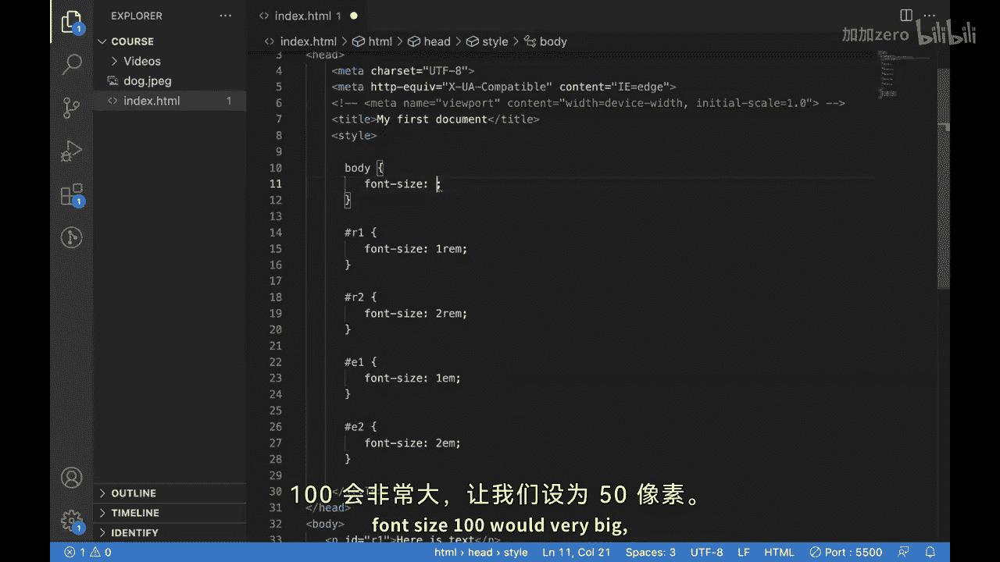

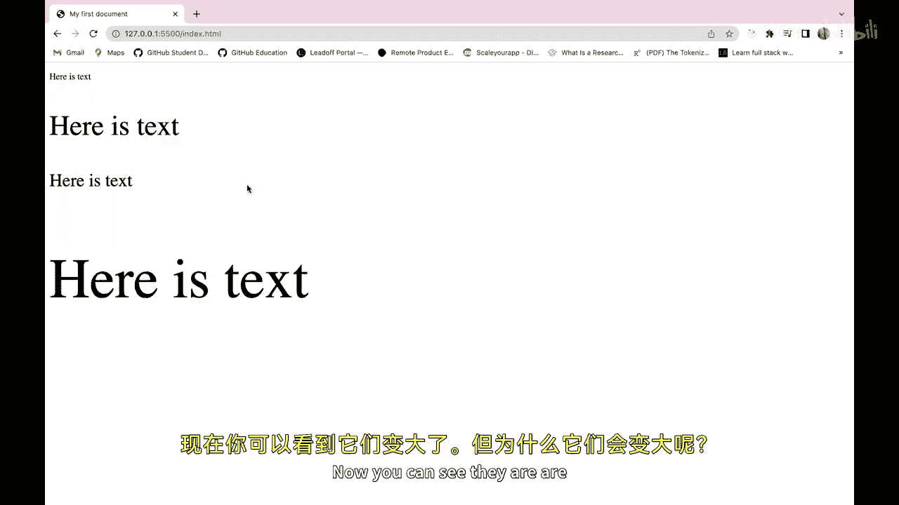

初始状态下，`1rem`和`1em`看起来大小相同。它们的区别在于参考基准不同：

*   **`rem`** 单位基于**根元素**（通常是`<html>`）的字体大小。
*   **`em`** 单位基于其**直接父元素**的字体大小。

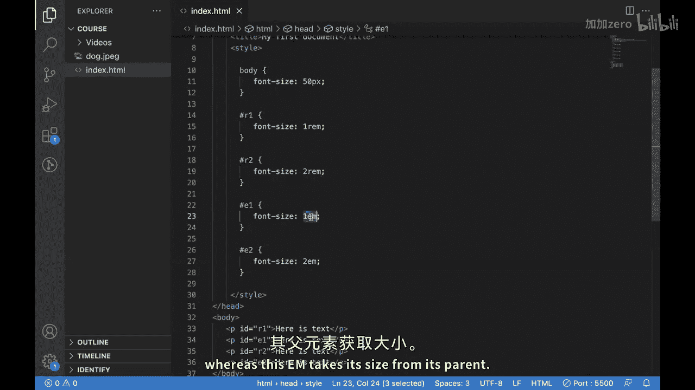

让我们通过设置`<body>`的字体大小来观察区别：

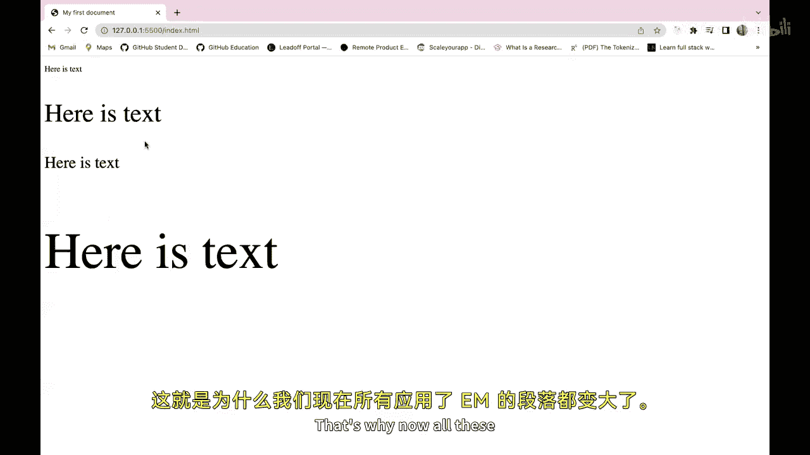

```css
body {
  font-size: 50px;
}
```

应用此规则后，你会发现使用`em`单位的段落（`#e1`, `#e2`）字体变得非常大，因为它们继承了父元素`<body>`的`50px`大小（`1em = 50px`, `2em = 100px`）。而使用`rem`单位的段落大小可能变化不大（除非根元素`<html>`的字体大小被改变），因为它们始终参考根元素的默认字体大小（通常是`16px`）。

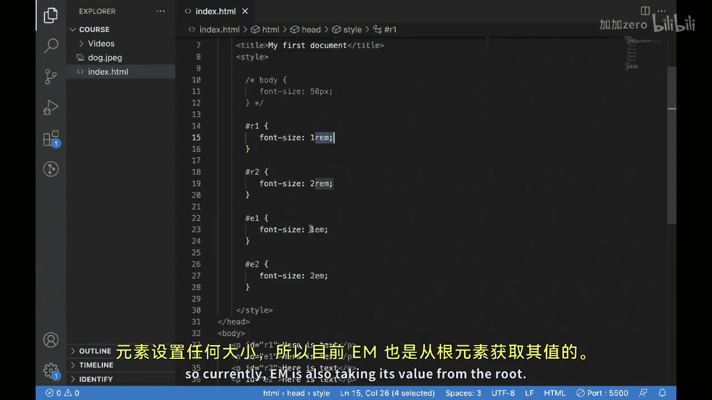

如果注释掉`body`的样式，`em`单位也会回退到参考根元素的大小，因此`1rem`和`1em`又会看起来相同。

## 总结与最佳实践 🎯

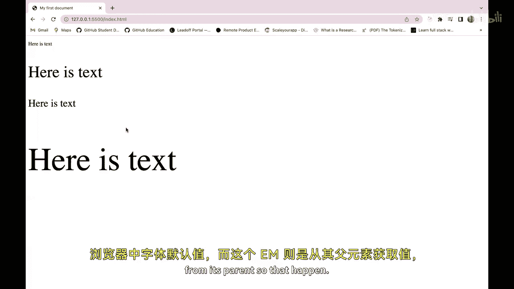

本节课中我们一起学习了CSS的核心单位。

*   我们了解了**绝对单位**（如`px`）的固定特性。
*   我们探索了**相对单位**，包括基于视口的`vw`/`vh`，基于父元素的`em`，以及基于根元素的`rem`。
*   我们通过实例看到了`em`和`rem`在继承关系上的关键区别。

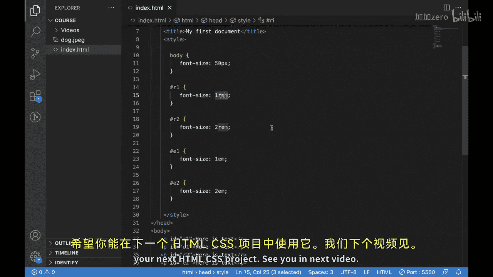


通过理解不同类型的单位并有效地使用它们，你可以创建在所有设备上都看起来很棒且加载快速的设计。请记住，务必在不同的屏幕尺寸上测试你的设计，以确保它们能为所有用户提供良好的体验。希望你能在下一个HTML/CSS项目中运用这些知识。