# 103：CSS颜色

## 概述
在本节课中，我们将要学习CSS中颜色的使用方法。颜色是网页设计的基础，能极大地影响网站的整体观感。我们将探讨在CSS中指定颜色的多种方式，包括颜色名称、RGB值和十六进制代码等。

## 从单位到颜色
上一节我们介绍了CSS单位，学习了如何为HTML文本选择字体大小。本节中，我们来看看CSS颜色。

在CSS中，有许多不同的方式来指定颜色，从基本的命名颜色到更高级的技术，如渐变和透明度。本视频将探讨在CSS中指定颜色的各种方法，包括命名颜色、RGB值等。

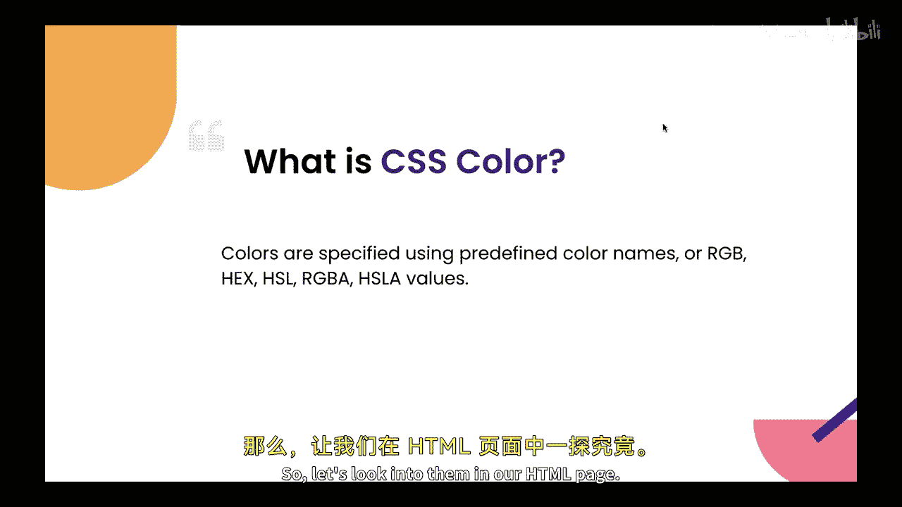

## 应用颜色到HTML页面
以下是应用颜色的基本步骤。我们有一个包含四个段落标签的HTML页面。

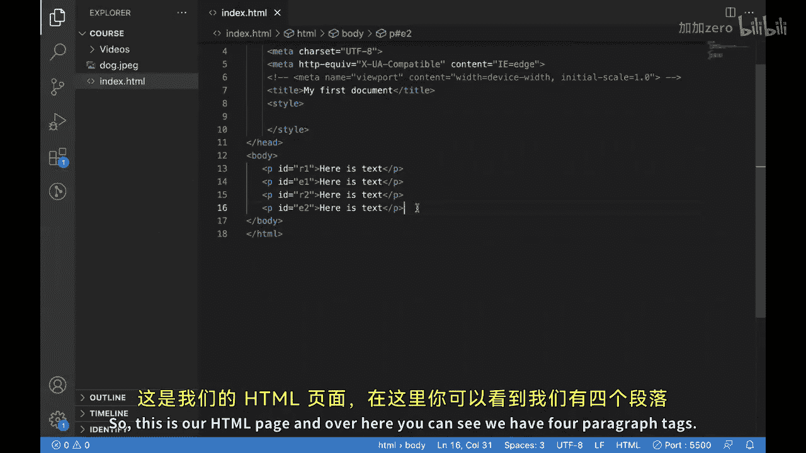

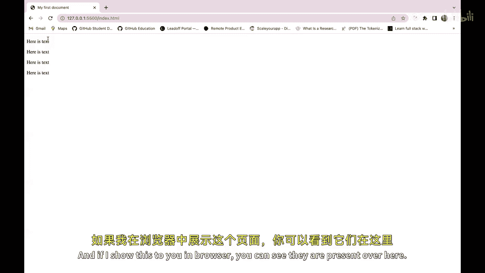

在浏览器中显示如下：

现在，让我们看看如何为它们应用颜色。

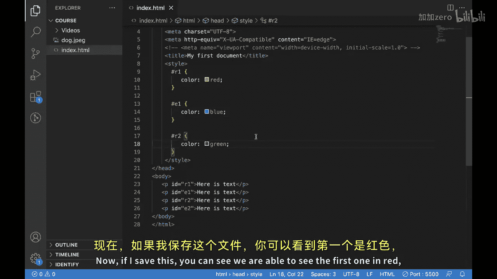

我们可以看到，不同的段落标签有不同的ID。我们可以借助ID选择其中一个，并使用名为 `color` 的属性。我们可以放入颜色名称，例如，为第一个放入红色，为下一个放入蓝色，然后为第三个放入绿色。

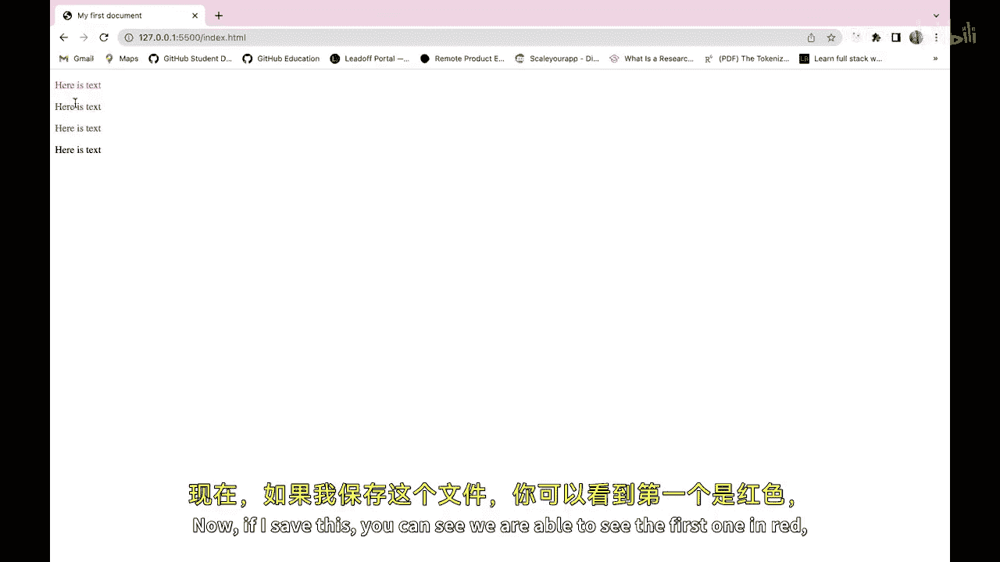

保存后，效果如下：

第一个显示为红色，第二个为蓝色，第三个为绿色。

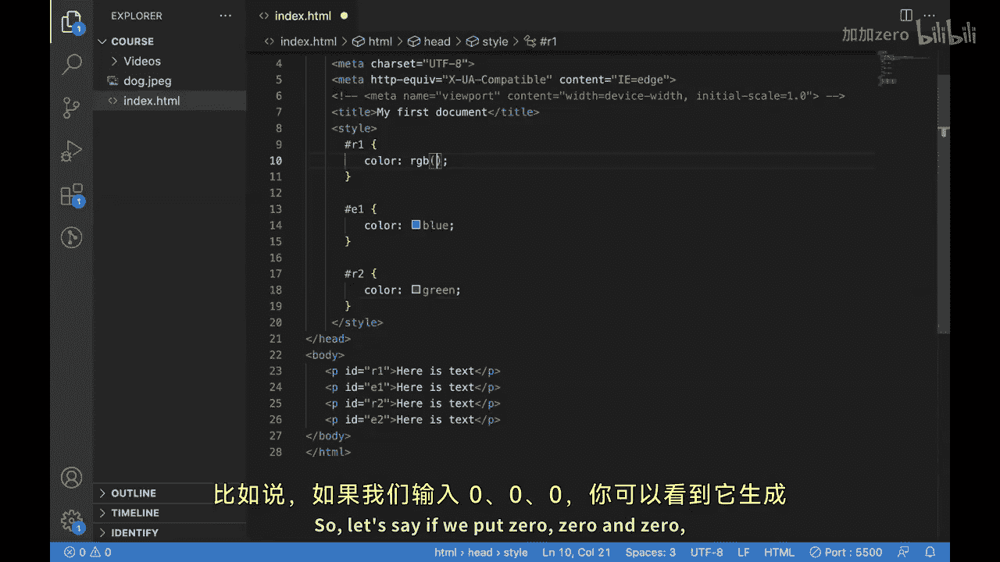

## 使用命名颜色的限制
当我们使用这些颜色的名称时，我们限制了自己只能使用有限数量的颜色。因为每种颜色都有多种色调，例如红色有多种色调。但我们称所有这些状态为红色。如果我们想使用那些多种色调，可以借助RGB来实现。

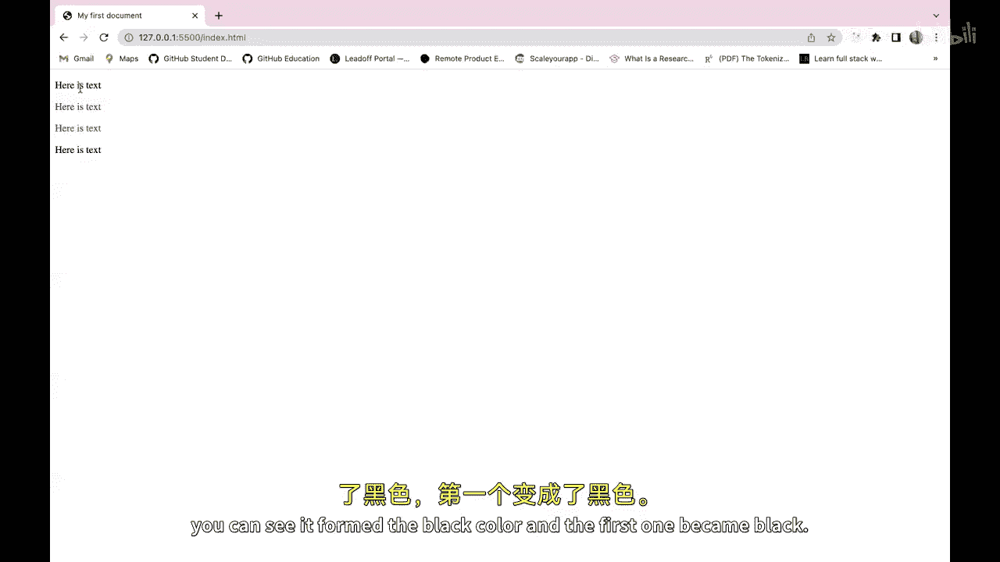

## 使用RGB值
RGB代表红色、绿色和蓝色。我们可以在其中放入这些颜色的值，它将为我们形成颜色。例如，如果我们放入 `rgb(0, 0, 0)`，它将形成黑色。

第一个段落变成了黑色。

要改变它，例如使用 `rgb(255, 35, 10)`，颜色可能会改变。我们可以从这里选择RGB值。

当我们增加这些值时，颜色发生了变化。这为我们打开了一个广阔的视野，现在我们可以选择任何颜色。通过放入这些不同的值，我们可以创建不同的颜色。

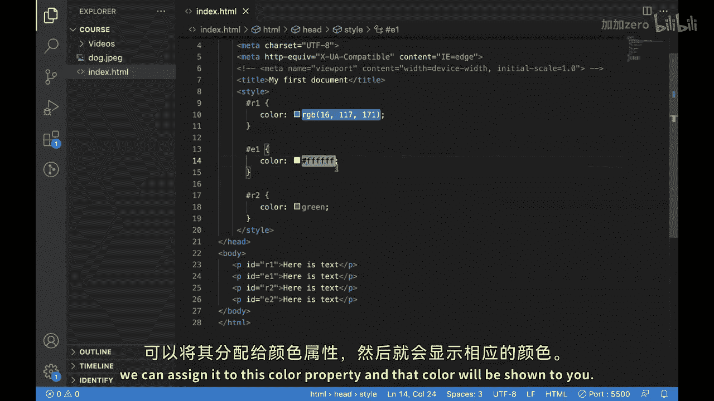

## 使用十六进制代码
与RGB类似，我们还有另一种放置颜色的方式。例如，代替蓝色，我们放入 `#FFFFFF`。

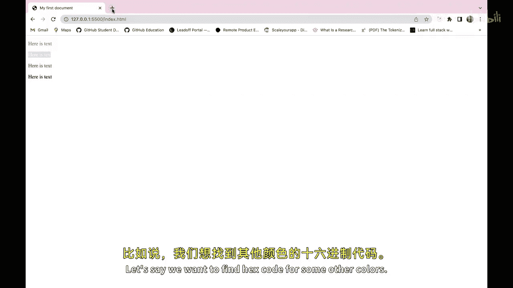

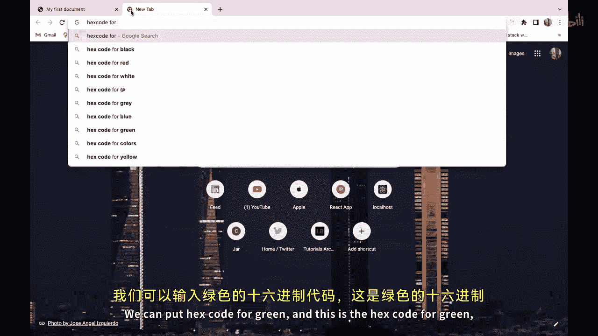

现在文本变成了白色。这就是我们所说的十六进制代码。

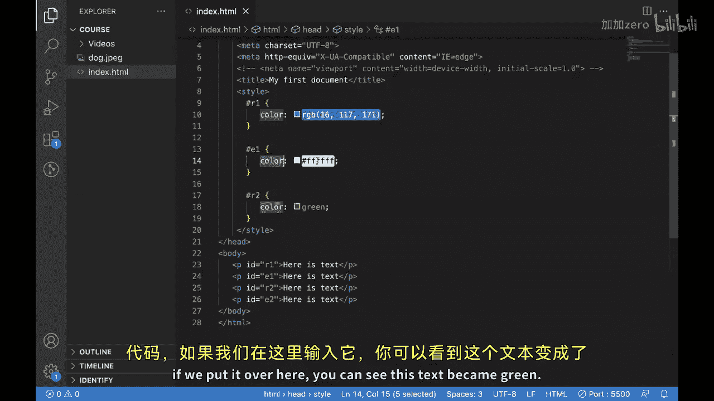

十六进制代码是HTML中颜色的十六进制表示，我们可以将其分配给 `color` 属性，该颜色将显示给你。

例如，如果我们想找到其他颜色的十六进制代码，我们可以放入 `#00FF00` 代表绿色。

如果我们把它放在这里，文本变成了绿色。

我们可以点击这个网站，找到不同颜色的不同十六进制代码。

你可以看到所有这些颜色都是绿色，但它们有不同的十六进制代码和不同的RGB值。这是使用命名颜色无法实现的。

## 总结
本节课中，我们一起学习了CSS颜色的来龙去脉。通过使用这些技术，你将能够创建具有美观和影响力设计的网站，同时确保它们对所有用户都可访问。请记住，颜色只是网页设计的一个方面，但它可以在整体用户体验中产生巨大差异。希望你在下一个HTML CSS项目中使用这些颜色属性。下个视频见。

