# 112：CSS下拉菜单教程 🎨

在本节课中，我们将学习如何使用HTML和CSS创建一个基础的下拉菜单。下拉菜单是网页设计中常见的交互元素，当用户点击或悬停在特定区域时，会显示一个选项列表供用户选择。

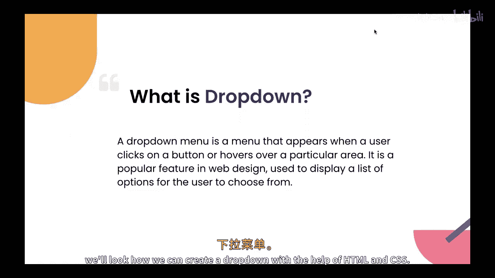

上一节我们介绍了如何使用CSS创建导航栏，本节中我们来看看如何为其添加一个下拉菜单功能。

## 什么是下拉菜单？

下拉菜单是一种当用户点击按钮或将鼠标悬停在特定区域时出现的菜单。它常用于展示一系列选项供用户选择。

## 创建基础HTML结构

首先，我们需要构建下拉菜单的HTML骨架。以下是创建基础下拉菜单所需的HTML代码：

```html
<div class="dropdown">
  <button class="dropdown-btn">下拉菜单</button>
  <div class="dropdown-content">
    <a href="#">选项一</a>
    <a href="#">选项二</a>
    <a href="#">选项三</a>
  </div>
</div>
```

## 添加基础CSS样式

有了HTML结构后，我们需要用CSS来控制其外观和行为。初始时，下拉内容应该是隐藏的。

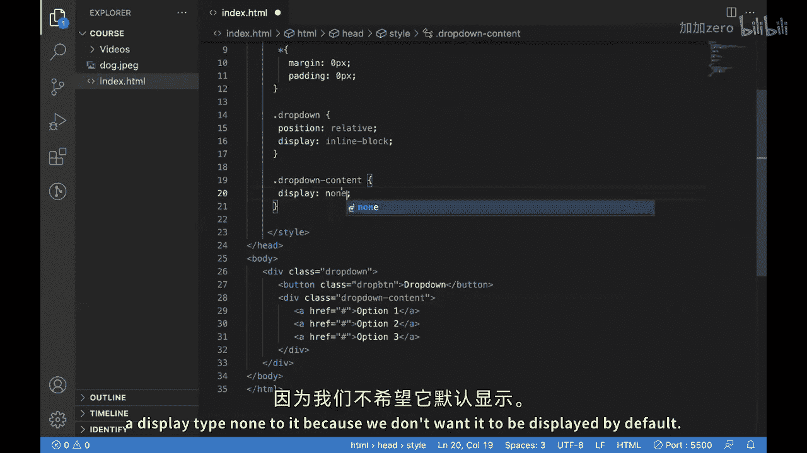

以下是初始的CSS样式，用于设置下拉容器和隐藏下拉内容：

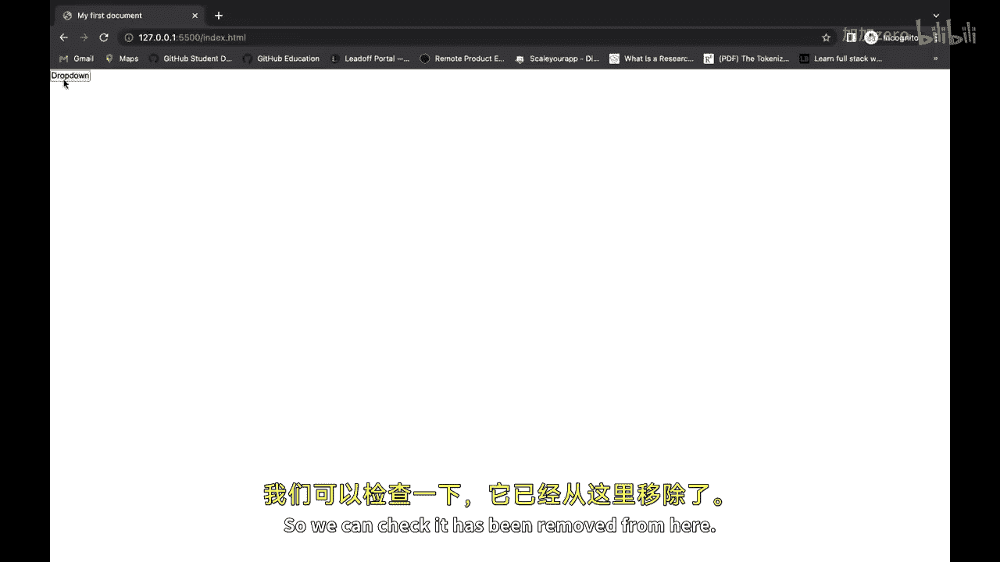

```css
.dropdown {
  position: relative;
  display: inline-block;
}

.dropdown-content {
  display: none;
  position: absolute;
  z-index: 1;
}
```

**代码解释**：
*   `position: relative;` 为下拉容器建立定位上下文。
*   `display: none;` 确保下拉内容默认是隐藏的。
*   `position: absolute;` 使下拉内容脱离文档流，可以精确定位。
*   `z-index: 1;` 确保下拉菜单显示在其他元素之上。

## 实现悬停显示功能

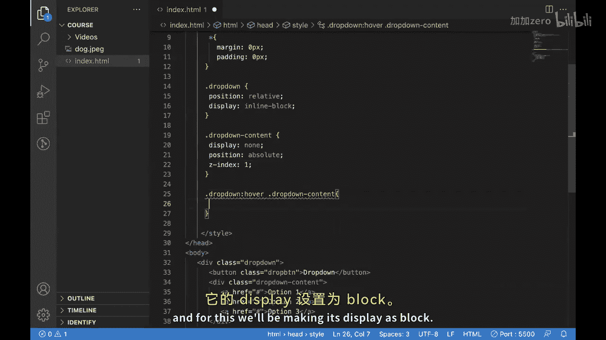

接下来，我们需要实现核心交互：当鼠标悬停在下拉按钮上时，显示隐藏的菜单选项。

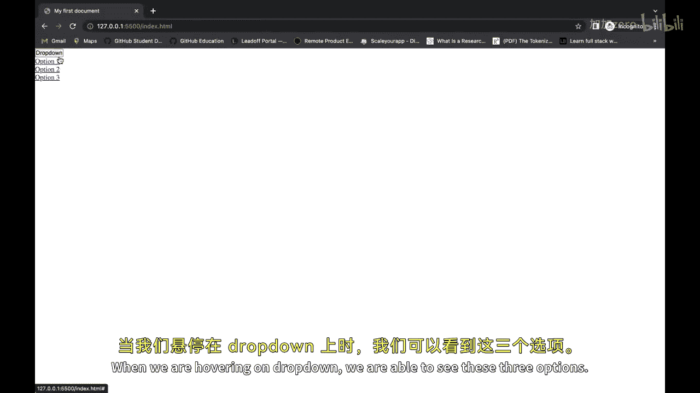

这可以通过CSS的 `:hover` 伪类选择器来实现：

```css
.dropdown:hover .dropdown-content {
  display: block;
}
```

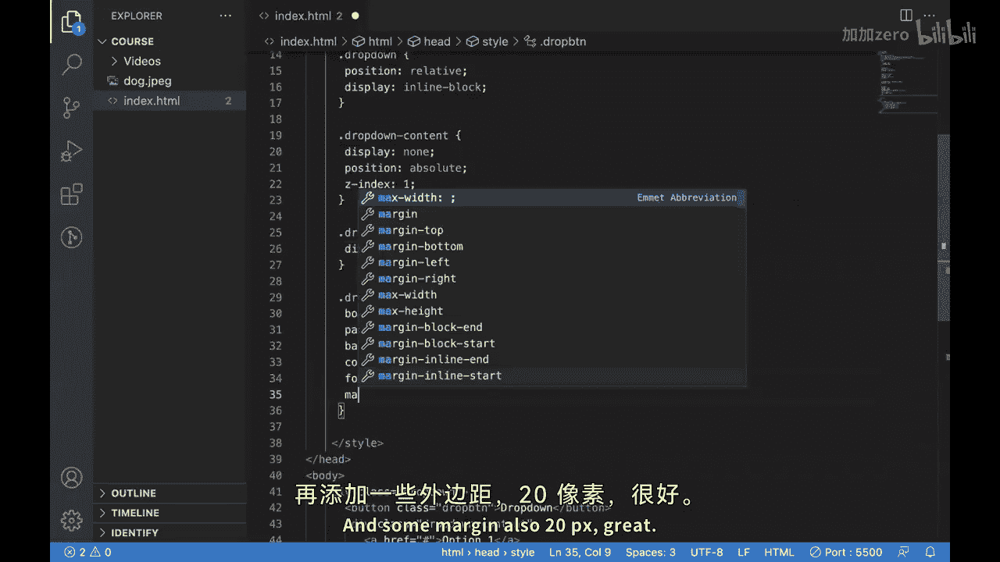

**公式解释**：`父元素:hover 子元素 { 样式 }`
这条规则意味着：当鼠标悬停在 `.dropdown` 元素上时，将其子元素 `.dropdown-content` 的显示方式改为 `block`，从而使其可见。

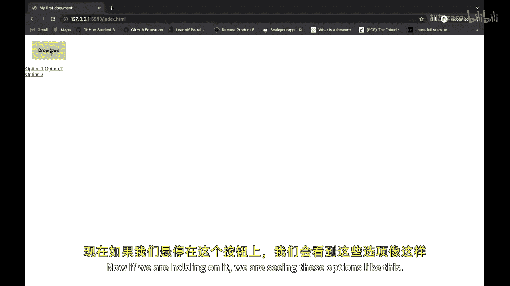

## 美化下拉菜单

功能实现后，我们可以添加更多样式来美化按钮和下拉选项框，使其更美观。

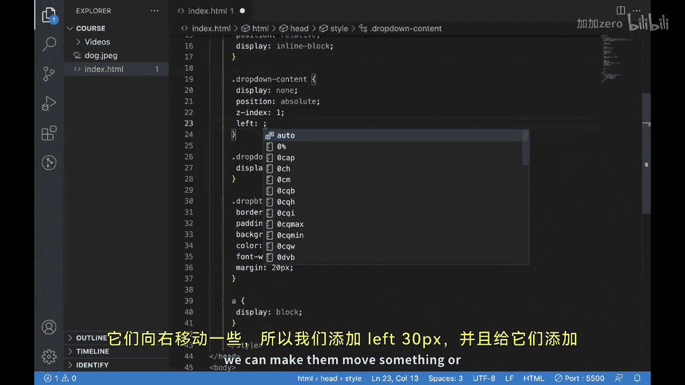

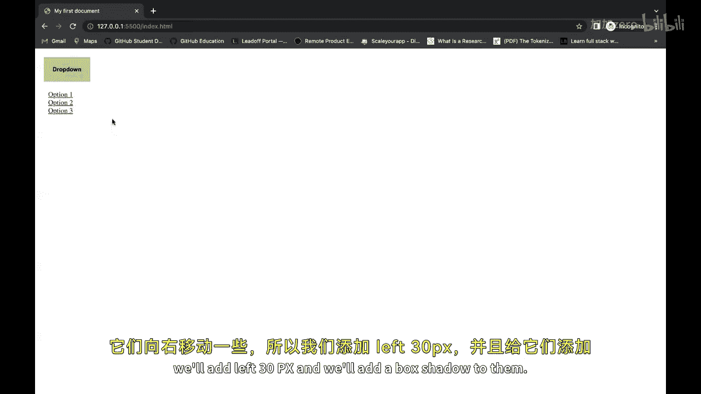

以下是用于美化按钮和下拉内容框的CSS样式：

```css
/* 美化按钮 */
.dropdown-btn {
  border: none;
  padding: 20px;
  background-color: #3498db;
  color: black;
  font-weight: 900;
  margin: 20px;
}

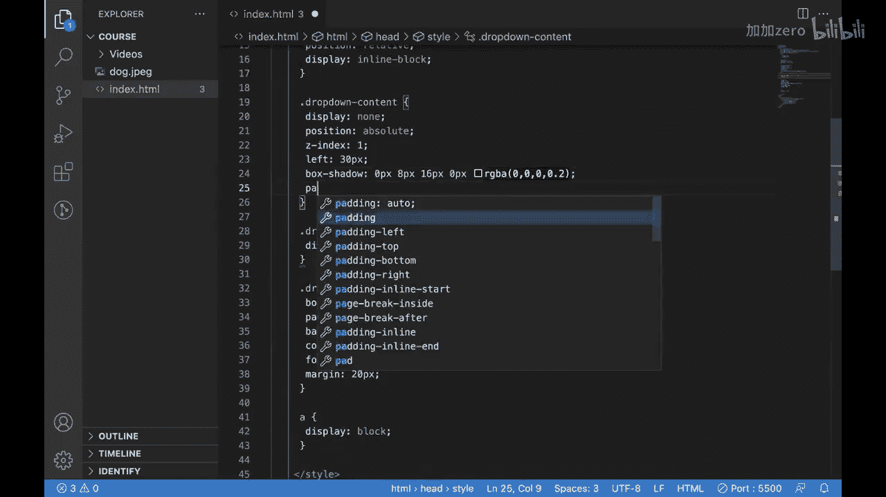

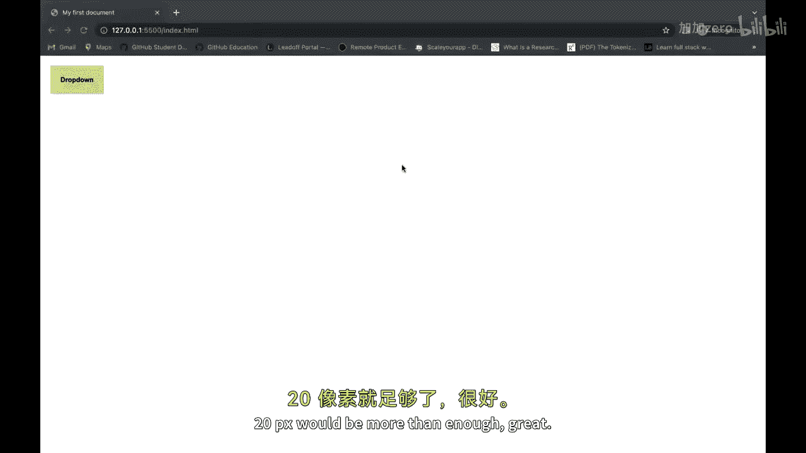

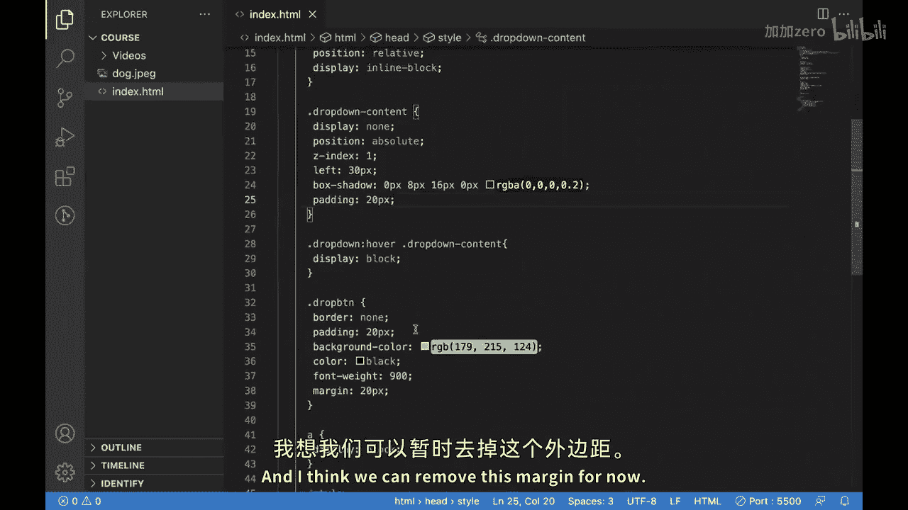

/* 美化下拉选项框 */
.dropdown-content {
  /* 之前的样式保持不变 */
  left: 30px; /* 微调位置 */
  box-shadow: 0px 8px 16px 0px rgba(0,0,0,0.2); /* 添加阴影 */
  padding: 20px;
  width: 200px; /* 设置宽度 */
  background-color: #f9f9f9; /* 设置背景色 */
}
```

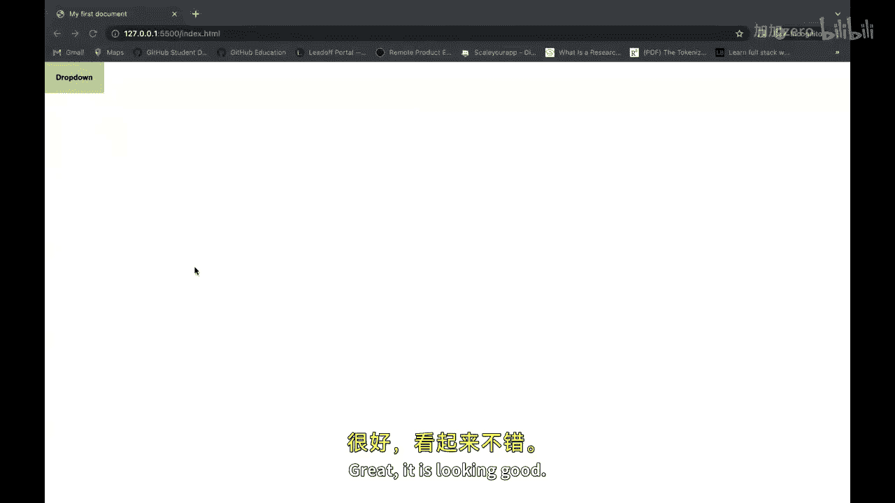

## 最终效果与总结

本节课中我们一起学习了如何使用HTML和CSS创建一个完整的下拉菜单。我们首先构建了HTML结构，然后通过CSS设置了其基本布局和隐藏状态，接着使用 `:hover` 选择器实现了鼠标悬停显示菜单的交互逻辑，最后对按钮和菜单进行了视觉上的美化。

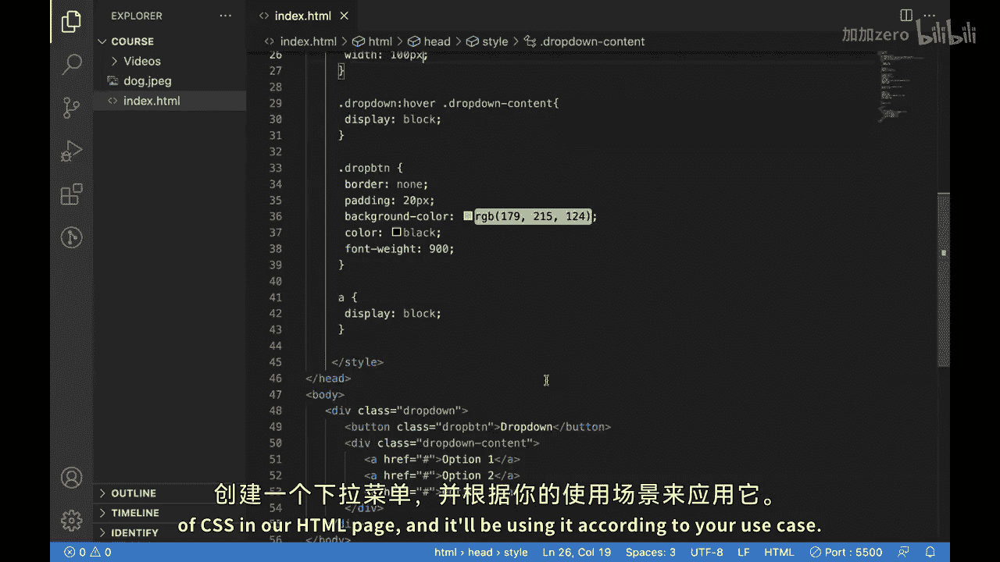


你可以根据实际项目需求，调整颜色、尺寸、阴影等样式属性，并将菜单链接（`#`）替换为真实的URL，从而将这个基础的下拉菜单应用到你的网站导航栏或其他交互组件中。