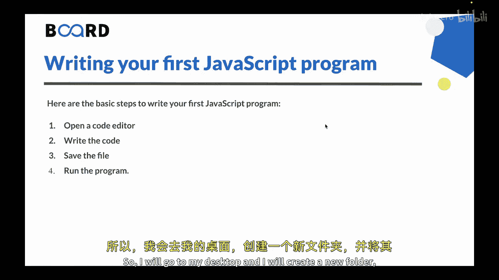
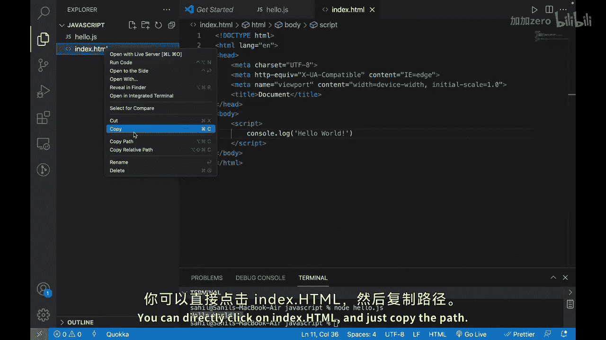
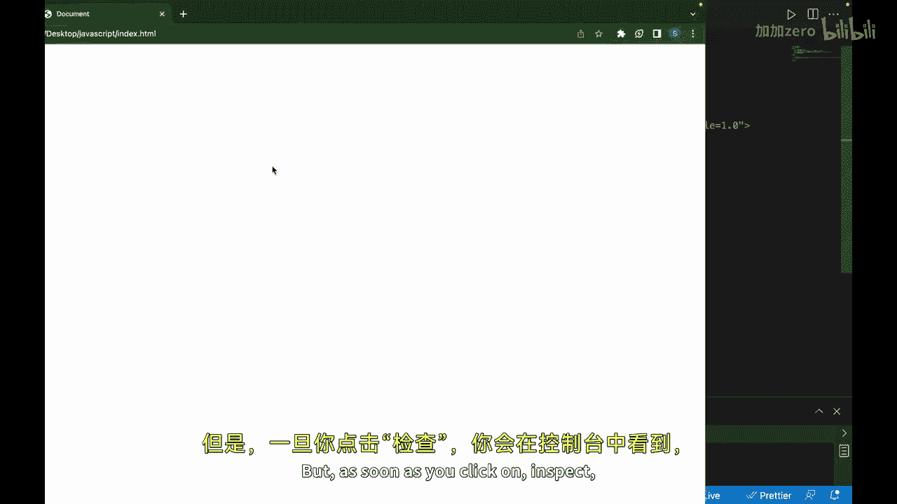
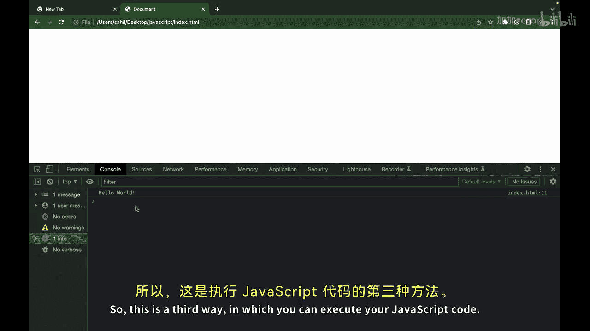

# 121：编写你的第一个JavaScript程序 🚀

在本节课中，我们将学习如何编写并运行你的第一个JavaScript程序。我们将从打开代码编辑器开始，逐步完成编写代码、保存文件以及运行程序的完整流程。

上一节我们介绍了如何搭建开发环境。本节中，我们来看看如何实际编写并执行一段JavaScript代码。

以下是编写第一个JavaScript程序的基本步骤：

1.  **打开代码编辑器**：选择一个你喜欢的代码编辑器，例如Visual Studio Code、Sublime Text或Atom。创建一个新文件，并使用`.js`作为文件扩展名。
2.  **编写代码**：在新文件中，你可以编写你的第一个JavaScript程序。例如，你可以写一个简单的“Hello World”程序。
3.  **保存文件**：为你的文件起一个有意义的名称，并确保扩展名为`.js`。例如，`hello.js`。
4.  **运行程序**：打开终端或命令提示符，导航到保存程序文件的目录。然后输入`node hello.js`来运行你的程序。你应该能在控制台中看到输出的结果。

现在，让我们实际跟随这些步骤来编写我们的第一个JavaScript程序。

我将前往桌面，创建一个新文件夹并将其重命名为`JavaScript`。





现在，我们可以打开Visual Studio Code。你也可以使用任何其他代码编辑器。然后，我将打开这个`JavaScript`文件夹。

目前这个`JavaScript`文件夹是空的。所以，我们需要创建一个文件，让我们将其命名为`hello.js`，这是JavaScript文件的扩展名。

接下来，让我们编写我们的第一个程序。在这里，你可以简单地输入：
```javascript
console.log("Hello World");
```
这段代码的作用是在控制台中打印“Hello World”。就这么简单，这就是第一段JavaScript代码。

关于如何运行它，有几种方法：

第一种方法是使用Node.js。你可以在VS Code中打开终端。确保你当前所在的目录是正确的，你可以看到这里的目录是这个`JavaScript`文件夹。然后我可以输入`node hello.js`。一旦我按下回车，你将在控制台中看到输出结果：`Hello World`。这是一种方法。

第二种方法是，你可以直接打开Google Chrome浏览器，右键点击并选择“检查”，这会打开Chrome开发者工具。在这里，你可以直接粘贴或输入代码。例如，输入`console.log("Hello World");`，一旦我按下回车，它就会运行代码，并将输出打印在这里。

第三种方法是使用一个HTML文件。我们可以创建一个新的`index.html`文件。你需要使用一个基础模板。你可以使用感叹号`!`作为快捷方式，它会生成一个基础的HTML模板代码。

我们需要做的是，要么通过`<script>`标签将`hello.js`文件链接到这个`index.html`文件中，要么直接在`<script>`标签内编写JavaScript代码。例如，输入`console.log("Hello World");`。

如何在浏览器中检查它呢？你可以直接点击`index.html`文件，复制其路径。将路径粘贴到浏览器的地址栏中。这是一个空白屏幕，因为此时没有任何HTML标签内容。但只要你点击“检查”，你将在控制台中看到打印出的“Hello World”。











恭喜你！你已经编写并执行了你的第一个JavaScript程序。这是一个简单的例子，但它演示了JavaScript程序的基本结构和语法。

本节课中，我们一起学习了编写第一个JavaScript程序的完整步骤，包括在代码编辑器中创建`.js`文件、使用`console.log()`函数输出信息，以及通过Node.js、浏览器控制台和HTML文件三种方式来运行JavaScript代码。掌握这些基础是开启JavaScript编程之旅的关键。


