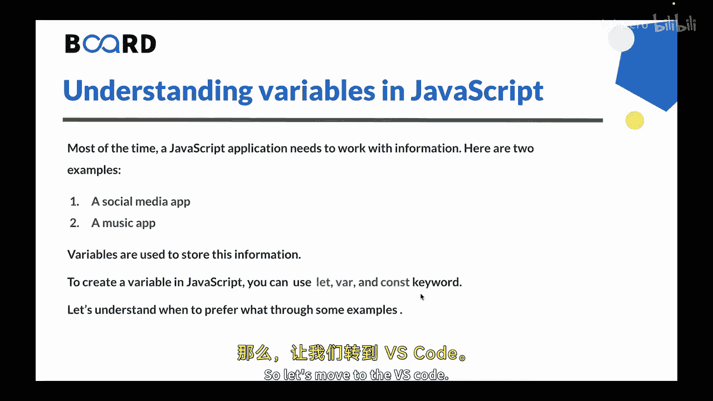
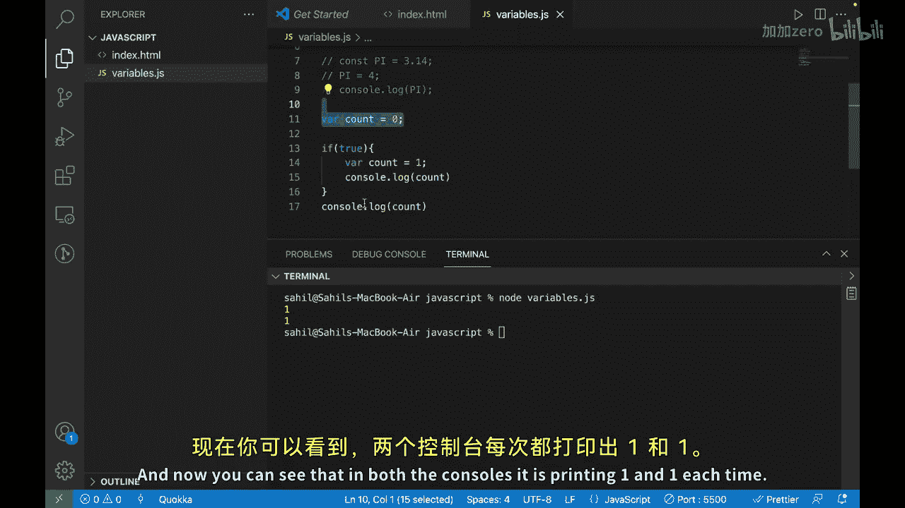

# 123：理解变量 📦

在本节课中，我们将学习JavaScript中的变量。变量是编程中存储和管理数据的基础工具，理解它们对于编写任何程序都至关重要。

## 概述

想象你有一盒蜡笔，并希望按颜色整理它们。你可以使用盒子里的不同隔间来分别存放每种颜色。每个隔间就像一个变量，而蜡笔就是存储在这些变量中的数据。例如，可以有一个隔间放红色蜡笔，另一个放蓝色蜡笔。每个隔间里的蜡笔数量会根据你拥有的每种颜色的数量而变化。

在JavaScript中，变量的工作方式与此类似。你可以将变量视为一个容器，它保存着一份数据，就像蜡笔一样。变量有一个你可以选择的名称，就像蜡笔盒隔间上的标签，标明它存放的蜡笔颜色。然后，你可以使用这些变量进行计算或操作其中存储的数据，就像你可以将蜡笔从一个隔间移到另一个隔间一样。大多数时候，JavaScript应用程序都需要处理一些信息。

以下是几个例子：
*   **社交媒体应用**：信息可能包括用户的姓名、年龄和粉丝数量。
*   **音乐应用**：信息可能包括用户喜欢的歌曲、播放列表和艺术家。

变量就是用来存储这些信息的。

## 创建变量



在JavaScript中，你可以使用 `let`、`var` 和 `const` 关键字来创建变量。让我们通过一些例子来理解何时该使用哪一个。

上一节我们介绍了变量的基本概念，本节中我们来看看如何在代码中实际创建和使用它们。

### 使用 `let` 声明变量

`let` 是声明一个在代码后续可以被重新赋值的变量的首选方式。它是块级作用域的，这意味着它只存在于定义它的代码块内部。

以下是创建变量的两个步骤：
1.  **声明变量**：例如 `let name;`
2.  **初始化变量**：例如 `name = “John”;`

你也可以在同一行完成声明和初始化：

```javascript
let name = “John”;
```

让我们看一个 `let` 的例子：

```javascript
let count = 0;
count = 1;
console.log(count); // 输出：1
```

### 使用 `const` 声明常量

`const` 是声明一个不能被重新赋值的变量的首选方式。它也是块级作用域的，通常用于存储常量值。

```javascript
const PI = 3.14;
console.log(PI); // 输出：3.14
// PI = 3.14159; // 这行代码会报错：Assignment to constant variable.
```

### 使用 `var` 声明变量（传统方式）

`var` 是JavaScript中声明变量的较旧关键字。虽然在现代JavaScript中仍可使用，但通常被认为是过时的，因为它不是块级作用域的。这意味着用 `var` 声明的变量在整个函数或全局作用域内都可用，这可能使代码更难理解和避免错误。

```javascript
var count = 0;
if (true) {
    var count = 1;
    console.log(count); // 输出：1
}
console.log(count); // 输出：1 (注意：外部的count也被修改了)
```



## 总结

本节课中我们一起学习了JavaScript中的变量。变量是在代码中存储和管理数据的一种方式。它们允许你通过名称来引用数据，这使你的代码更有组织性且更易于阅读。

在JavaScript中创建变量，可以使用 `let`、`var` 和 `const` 关键字。`let` 和 `const` 是现代JavaScript中声明变量的首选关键字，因为它们是块级作用域的，并且能更好地控制变量赋值。虽然 `var` 仍然可以使用，但通常被认为是过时的，在新代码中应尽可能避免使用。


下一节视频中，我们将学习JavaScript中的数据类型。下节课见。