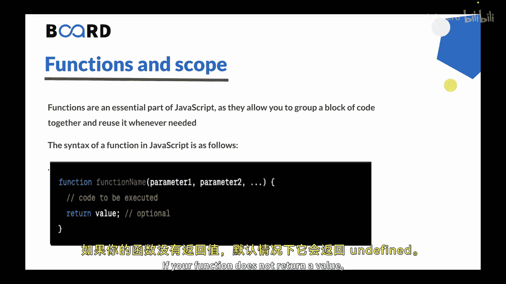
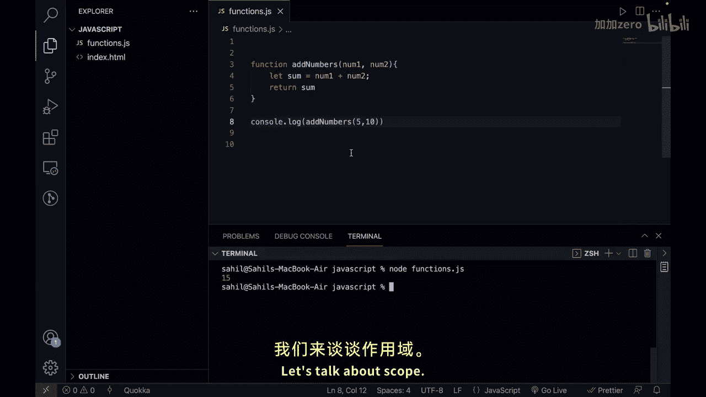
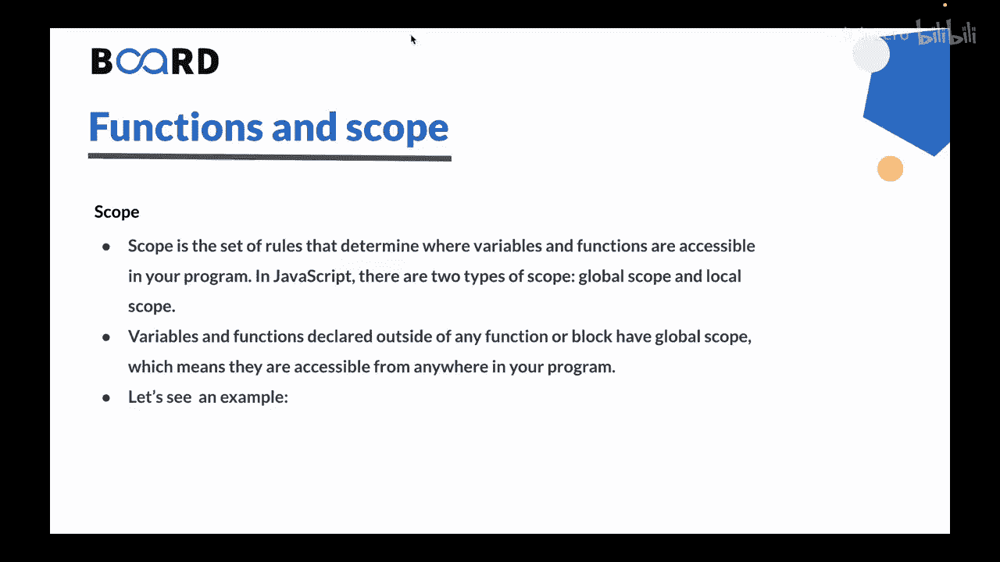
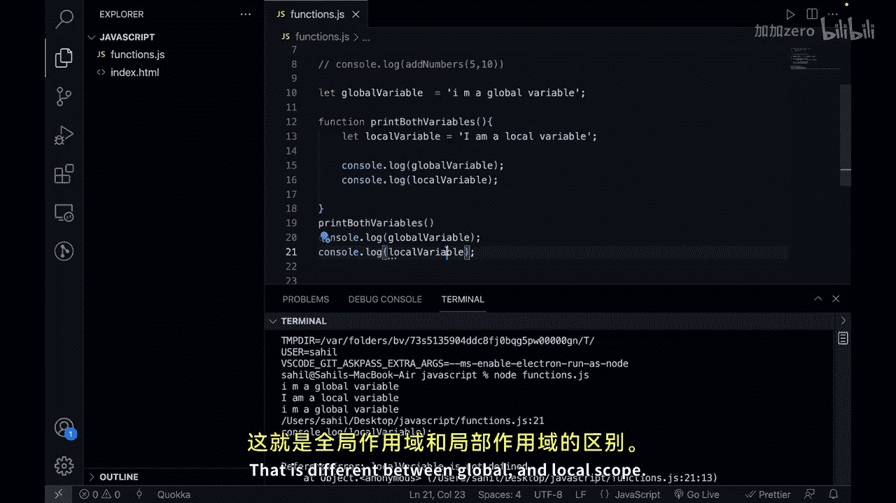

# 131：函数与作用域 🧩

在本节课中，我们将学习 JavaScript 中的两个核心概念：**函数**和**作用域**。函数是组织代码、实现复用的关键，而作用域则决定了变量在程序中的可访问性。理解它们对于编写清晰、高效的代码至关重要。

---

## 函数的定义与语法

上一节我们介绍了循环结构，本节中我们来看看如何通过函数来封装和复用代码。

函数是 JavaScript 的基本组成部分。它是一个执行特定任务的代码块。你可以使用函数将代码组织成可重用的片段，这些片段可以在程序的不同部分被调用。

在 JavaScript 中，你可以使用 `function` 关键字来定义函数。让我们看一下函数的语法：

```javascript
function functionName(parameter1, parameter2) {
    // 要执行的代码块
    return value;
}
```



以下是语法的组成部分：
*   **`function` 关键字**：用于在 JavaScript 中定义函数。
*   **函数名**：你为函数起的名字。它应具有描述性，能表明函数的功能。
*   **参数**：函数接受的输入值。参数是可选的，你可以根据需要定义任意数量，它们之间用逗号分隔。
*   **代码块**：包含需要执行的 JavaScript 代码。当你调用函数时，这部分代码会执行。它可以包含任何有效的 JavaScript 代码，包括其他函数、循环和条件语句。
*   **返回值**：`return` 语句用于从函数返回一个值。如果函数没有返回值，则默认返回 `undefined`。

---

## 函数示例

让我们通过一个例子来具体理解。以下是一个简单的加法函数：

```javascript
function addNumbers(number1, number2) {
    let sum = number1 + number2;
    return sum;
}

let result = addNumbers(5, 10); // 函数调用
console.log(result); // 输出：15
```

在这个例子中：
*   `number1` 和 `number2` 是函数的**参数**。
*   `5` 和 `10` 是调用函数时传递的**实参**。
*   函数计算两数之和并通过 `return` 语句返回结果。
*   `addNumbers(5, 10)` 是**函数调用**（或函数调用），它执行函数内的代码。

---



## 作用域的概念

理解了如何创建和使用函数后，我们需要了解变量在何处可以被访问，这就是作用域。

作用域是决定变量和函数在程序中可访问性的一组规则。在 JavaScript 中，主要有两种作用域：**全局作用域**和**局部作用域**。



以下是两种作用域的区别：
*   **全局作用域**：在任何函数或代码块之外声明的变量。它们可以在程序的任何地方被访问。
*   **局部作用域**：在函数或代码块内部声明的变量。它们只能在其被声明的函数或代码块内部被访问。

---

## 作用域示例

让我们通过代码来观察全局变量和局部变量的不同行为：

```javascript
// 全局作用域
let globalVariable = “我是全局变量”;

function demonstrateScope() {
    // 局部作用域
    let localVariable = “我是局部变量”;
    console.log(globalVariable); // 可以访问全局变量
    console.log(localVariable);  // 可以访问局部变量
}

demonstrateScope(); // 调用函数

console.log(globalVariable); // 可以访问全局变量
console.log(localVariable);  // 报错：ReferenceError: localVariable is not defined
```

运行这段代码，你会看到：
1.  在函数 `demonstrateScope` 内部，可以成功打印全局变量和局部变量。
2.  在函数外部，可以打印全局变量。
3.  在函数外部尝试打印局部变量 `localVariable` 会导致 `ReferenceError` 错误，因为它只在函数内部的局部作用域中有效。

这个例子清晰地展示了局部变量的“封装”特性：它在函数内部创建和使用，外部代码无法直接访问它。



---

## 课程总结

本节课中我们一起学习了 JavaScript 的函数与作用域。

*   **函数**是可调用和执行的代码块，它们可以接收参数并返回值，是实现代码复用的核心工具。
*   **作用域**决定了变量在程序中的可访问位置。
    *   **全局作用域**的变量在任何函数或代码块外声明，可在程序任何地方访问。
    *   **局部作用域**的变量在函数或代码块内声明，仅在其内部可访问。

理解作用域对于编写整洁、高效且无错误的代码非常重要。通过合理使用函数和作用域，你可以更好地组织代码结构，避免变量冲突。


本节内容到此结束，我们下节课再见。