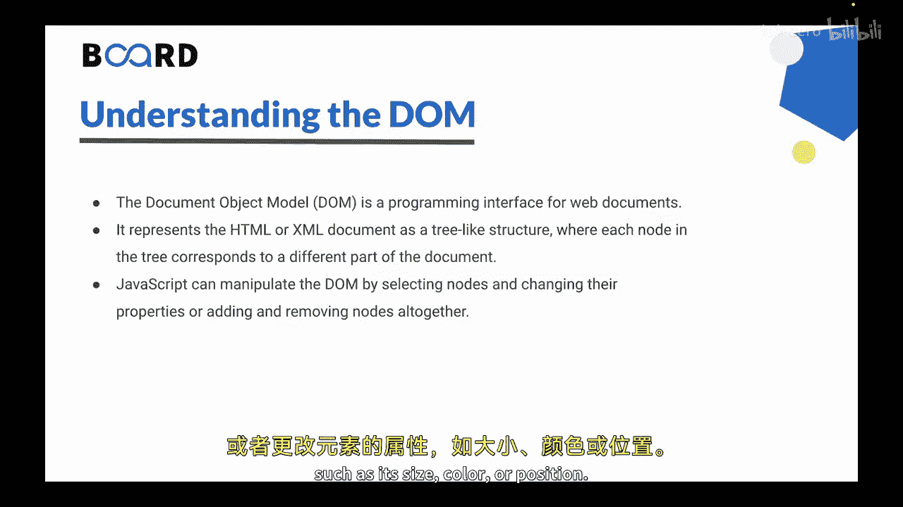
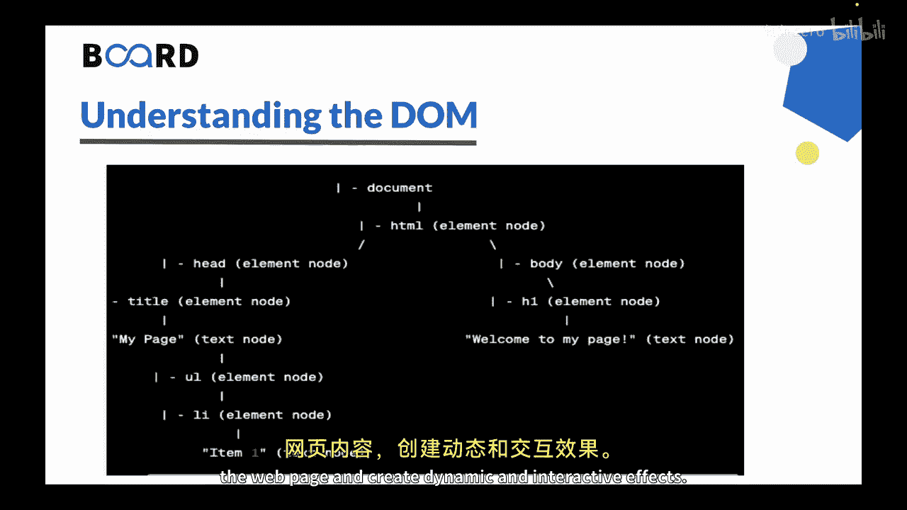

# 133：理解文档对象模型（DOM）

在本节课中，我们将学习文档对象模型（DOM）及其与HTML的关系。DOM是Web开发中用于动态操作网页内容的核心技术。

## 概述

DOM代表文档对象模型。它是一个用于Web文档的编程接口。DOM将HTML或XML文档表示为一个树状结构，树中的每个节点对应文档的不同部分。DOM是Web开发者使用JavaScript与网页内容交互的一种方式，允许他们动态地添加、移除或修改元素。

## 什么是DOM？

你可以将网页想象成一棵树，其中每个分支代表网页中的一个元素（如段落或图像），每个叶子代表该元素的属性或特性（如段落内的文本或图像的源URL）。这本质上就是DOM。

JavaScript可以通过选择节点并更改其属性，或完全添加和移除节点来操作DOM。

例如，你可以使用JavaScript来：
*   更改段落标签内的文本。
*   向页面添加新的段落或图像。
*   从页面完全移除一个元素。
*   更改元素的属性，如大小、颜色或位置。

## DOM的树状结构

以下是一个树状结构的示例，它代表了给定网页DOM的层次结构。

树中的每个节点对应一个HTML元素或该元素内的一段文本。节点以父子关系排列，父节点位于树的上层，子节点从其父节点下方分支出来。

例如，`document` 是 `HTML` 的父节点，`HTML` 是 `document` 的子节点。

在这个特定的图中：
*   根节点是 `document` 对象，它代表整个网页。
*   第一级子节点对应顶层的HTML元素，如 `HTML`，然后我们有 `head` 和 `body`。
*   这些节点中的每一个都有一个或多个子节点，具体取决于网页的结构。`head` 有进一步的子节点，`body` 也有进一步的子节点。

例如，`body` 节点可能具有对应于标题部分、主要内容区域和页脚部分的子节点。这些子节点中的每一个可能还有进一步的子节点，如段落、图像或其他元素。

例如，这里我们在 `body` 中有一个 `H1`，而这个 `H1` 有一个进一步的子节点，即文本“welcome to my page”。

这个树状图有助于可视化网页的结构，并理解不同元素之间是如何相互关联的。通过遍历树并选择不同的节点，开发者可以使用JavaScript修改网页内容，并创建动态和交互式的效果。

## 如何操作DOM？

上一节我们介绍了DOM的树状结构，本节中我们来看看JavaScript如何与之交互。开发者通过访问和操作这些节点来实现动态效果。

以下是操作DOM的基本思路：
*   **选择节点**：使用JavaScript方法（如 `document.getElementById`）找到树中的特定元素。
*   **修改属性**：更改选中节点的属性，例如 `element.textContent` 或 `element.style.color`。
*   **改变结构**：添加新节点（`document.createElement`, `appendChild`）或移除现有节点（`removeChild`）。

## 总结

本节课中我们一起学习了文档对象模型（DOM）。DOM是一个用于Web文档的编程接口，它以节点树的形式表示HTML或XML文档。树中的每个节点对应文档的不同部分。JavaScript可以通过选择节点并更改其属性，或完全添加和移除节点来操作DOM。DOM是Web开发中的一个强大工具，它使开发者能够创建动态、交互式的网页。

在下一个视频中，我们将学习如何使用JavaScript访问和实际操作DOM。下个视频见。谢谢。

