# 136：使用JavaScript修改样式与属性 🎨

## 概述
在本节课中，我们将学习如何使用JavaScript动态修改网页元素的样式和属性。通过掌握这些方法，你可以让网页元素根据用户交互或程序逻辑实时改变外观和行为。

在上一节中，我们学习了如何使用JavaScript操作DOM元素。本节中，我们来看看如何具体修改这些元素的样式和属性。

## 修改样式与属性的基本概念
使用JavaScript修改样式和属性，可以让你动态地改变网页元素的外观和行为。

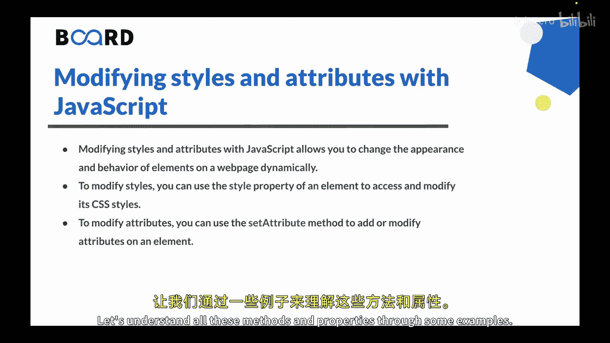

若要修改样式，可以使用元素的 **`style`** 属性来访问和修改其CSS样式。

若要修改属性，可以使用 **`setAttribute`** 方法来添加或修改元素上的属性。

让我们通过一些示例来理解这些方法和属性。

## 实践示例
以下是一个HTML模板，其中包含一个`<div>`和两个`<span>`元素，我们将在其基础上编写JavaScript代码。

```html
<!DOCTYPE html>
<html lang="en">
<head>
    <meta charset="UTF-8">
    <meta name="viewport" content="width=device-width, initial-scale=1.0">
    <title>修改样式与属性</title>
</head>
<body>
    <div>
        <span id="one" name="first">这是第一个span。这是一些文本。</span>
        <span id="two" name="second">第二个span。</span>
    </div>

    <script>
        // 使用DOM选择器选中元素
        const div = document.querySelector('div');
        const span1 = document.getElementById('one');
        const span2 = document.getElementById('two');
    </script>
</body>
</html>
```

### 操作属性
以下是操作元素属性的几种方法。

首先，使用 **`getAttribute`** 方法获取属性值。

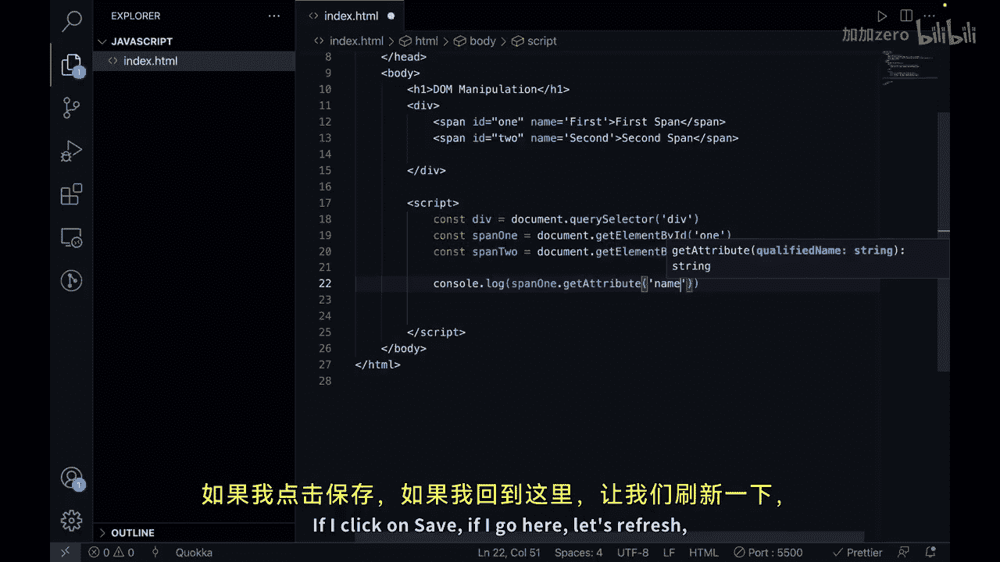

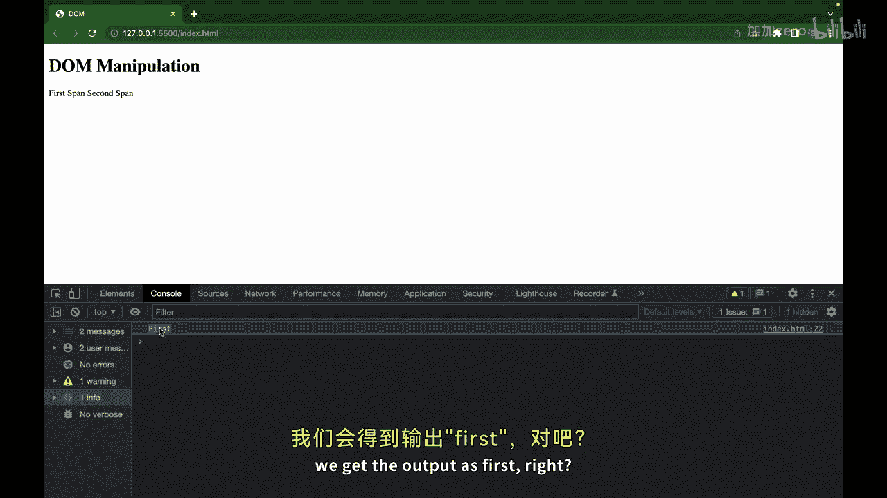

```javascript
console.log(span1.getAttribute('name')); // 输出：first
```

其次，使用 **`setAttribute`** 方法设置或修改属性。

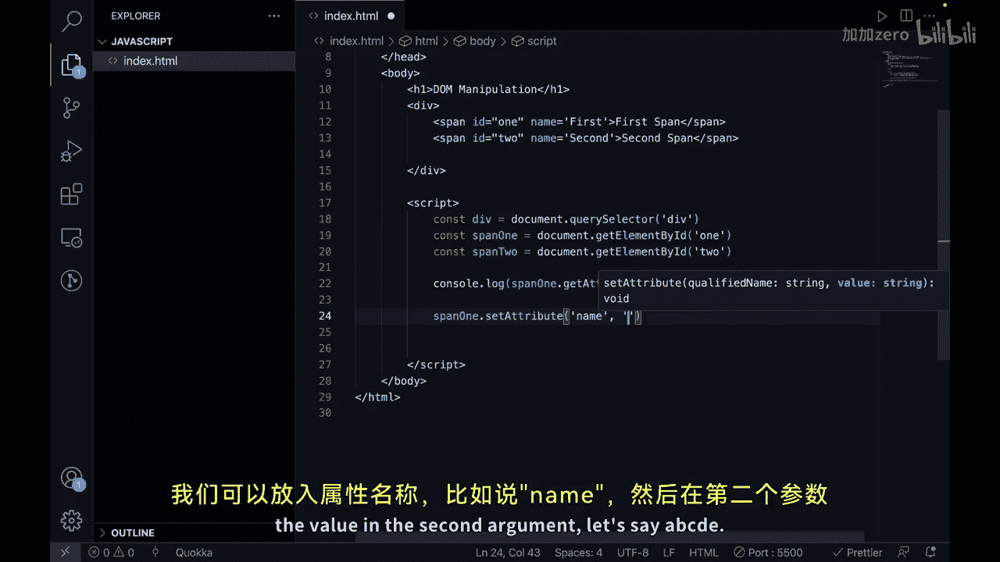

```javascript
span1.setAttribute('name', 'ABCDE');
// 执行后，span1的name属性值从“first”变为“ABCDE”
```

第三，使用 **`removeAttribute`** 方法移除属性。

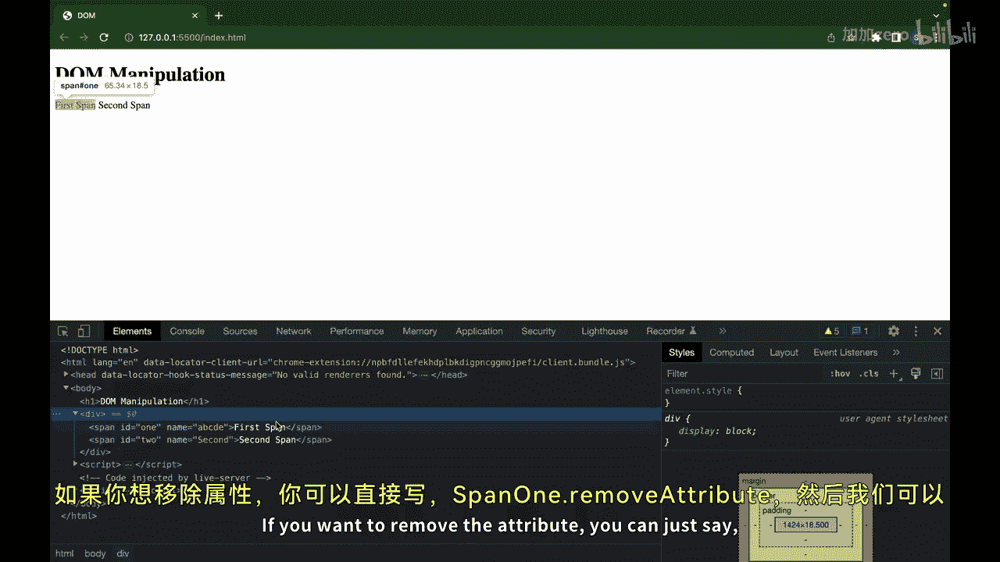

```javascript
span1.removeAttribute('name');
// 执行后，span1的name属性被移除
```

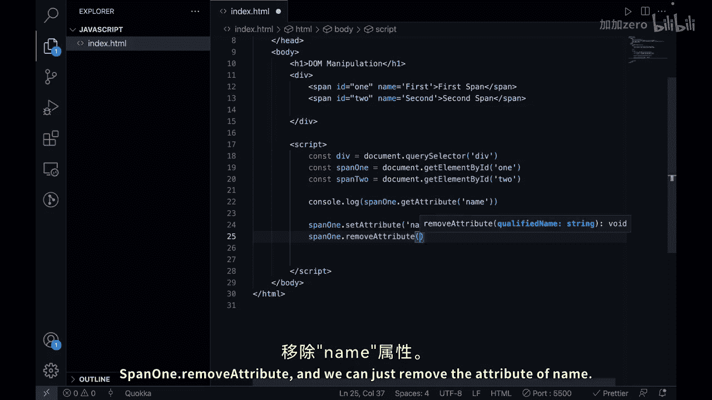

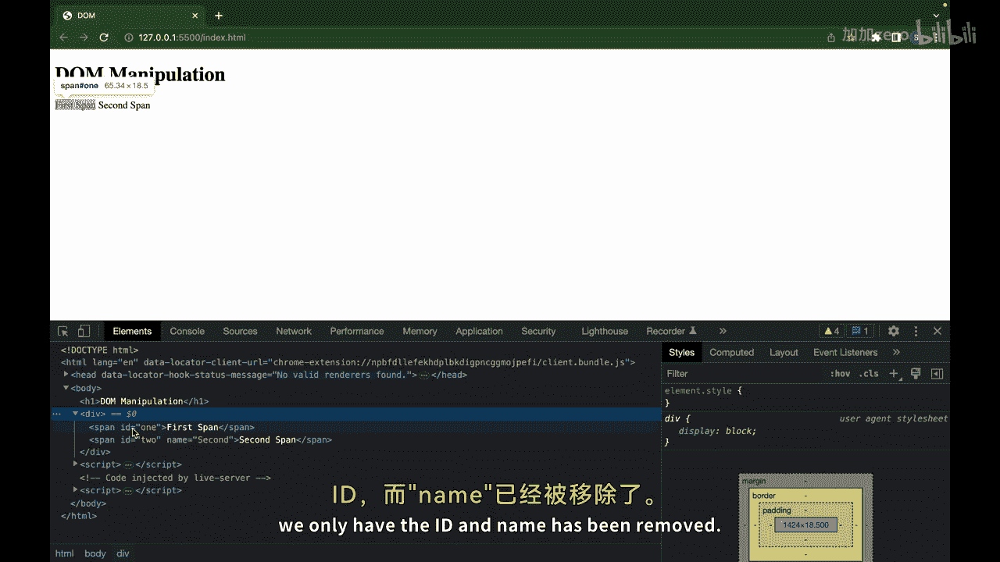

此外，对于某些标准属性（如`id`），可以直接通过元素对象进行赋值。

```javascript
span1.id = 'newUniqueId';
// 直接修改了span1的id属性
```

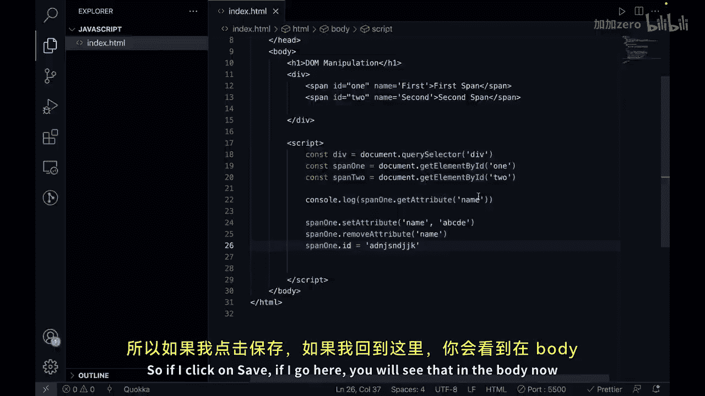

### 操作类名
使用 **`classList`** 属性可以方便地添加或移除CSS类。

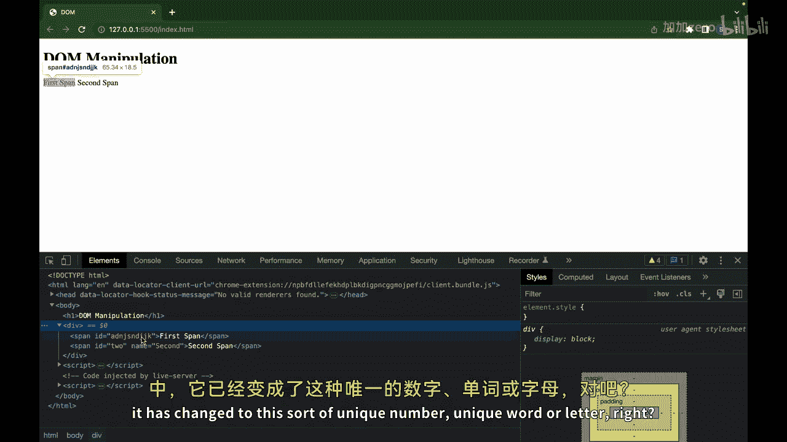

以下是添加和移除类的方法。

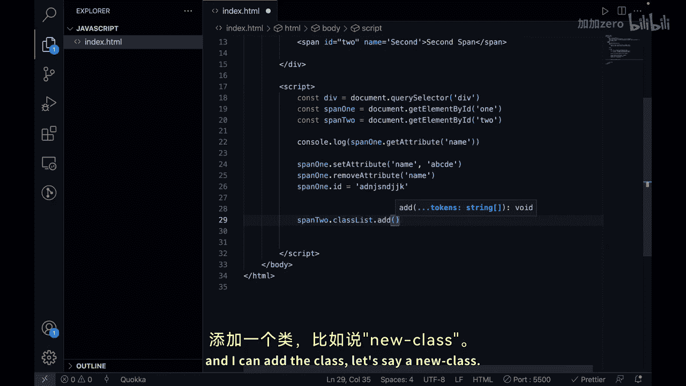

```javascript
// 添加类
span2.classList.add('new-class');
// 执行后，span2会拥有一个名为“new-class”的CSS类

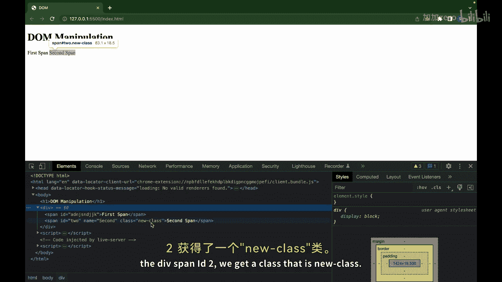

// 移除类
span2.classList.remove('new-class');
// 执行后，“new-class”类被从span2上移除
```

### 操作样式
使用元素的 **`style`** 属性可以直接修改其内联样式。

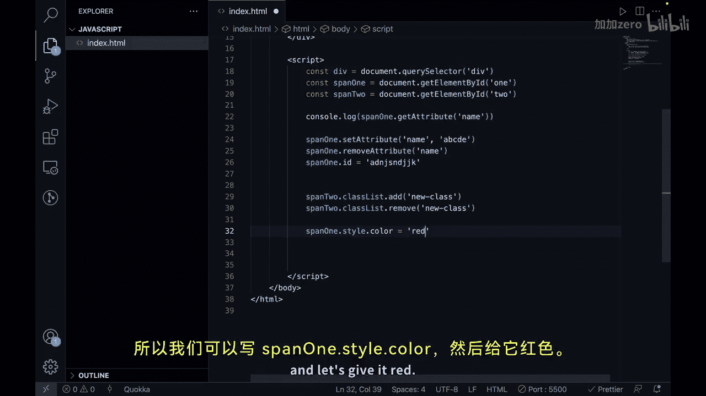

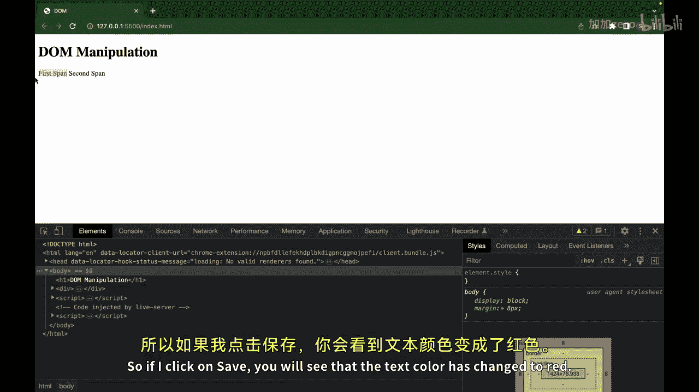

以下是修改颜色和背景色的示例。

```javascript
// 修改文本颜色
span1.style.color = 'red';
// 执行后，span1的文本颜色变为红色

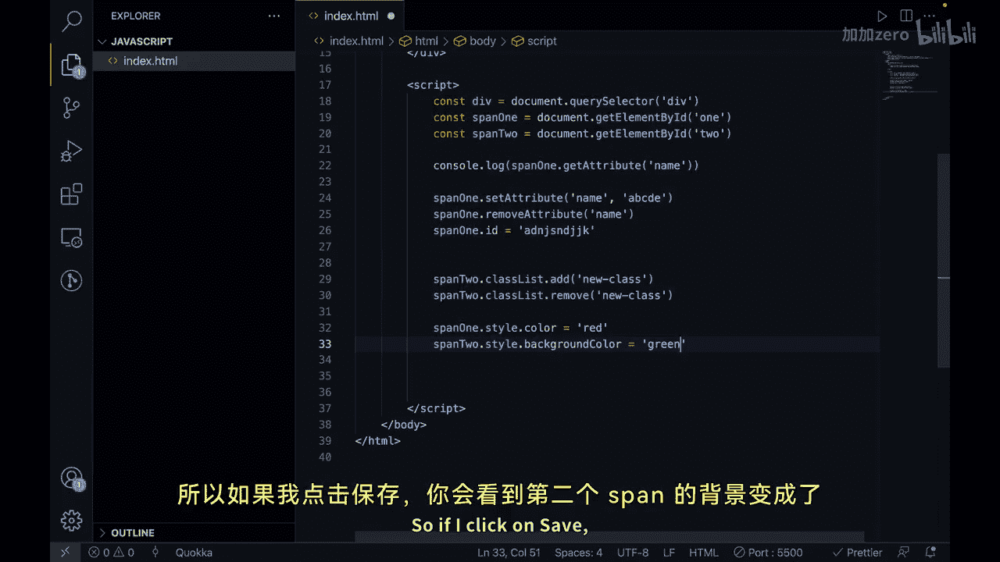

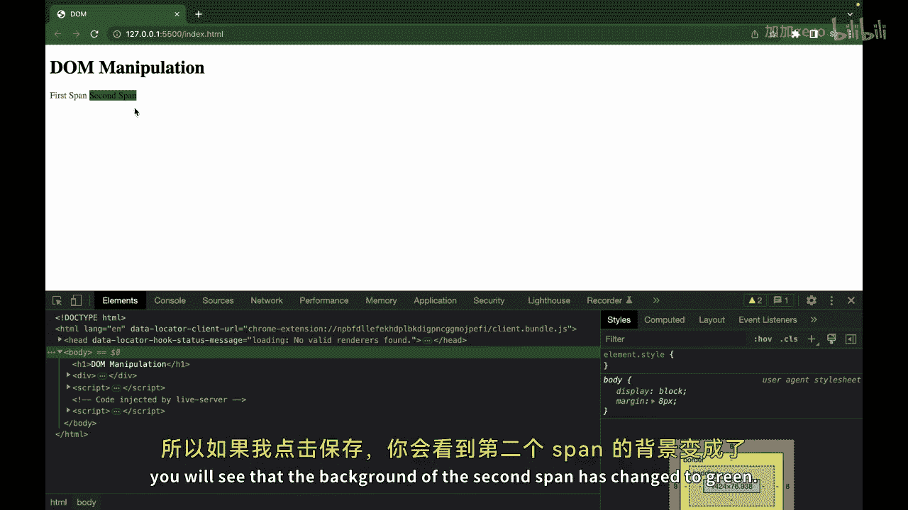

// 修改背景颜色
span2.style.backgroundColor = 'green';
// 执行后，span2的背景颜色变为绿色
```

## 总结
本节课中我们一起学习了如何使用JavaScript动态修改网页元素的样式和属性。

*   **`style`** 属性可用于访问和修改元素的CSS样式。
*   **`classList`** 属性可以添加或移除CSS类，从而应用预定义的样式。
*   **`setAttribute`** 方法可以添加或更改元素的属性。
*   **`getAttribute`** 方法可以获取属性的值。
*   **`removeAttribute`** 方法可以从元素上移除指定的属性。

这些功能使开发者能够创建可以响应用户输入并实时变化的交互式网页。


在下一节视频中，我们将学习JavaScript中的事件与事件监听器。