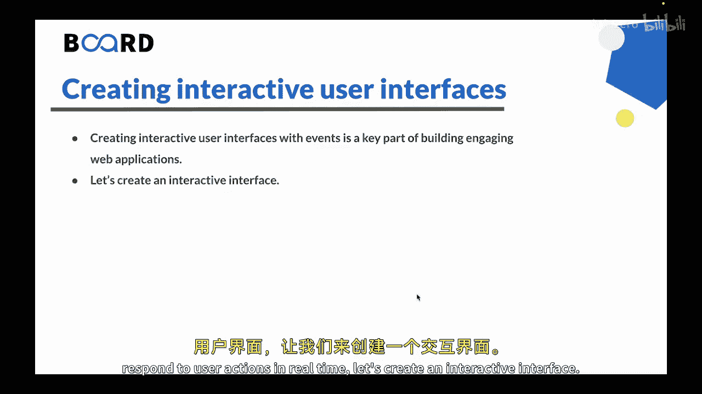
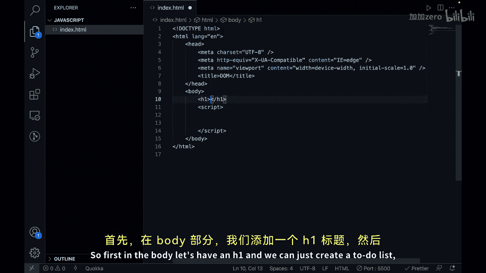
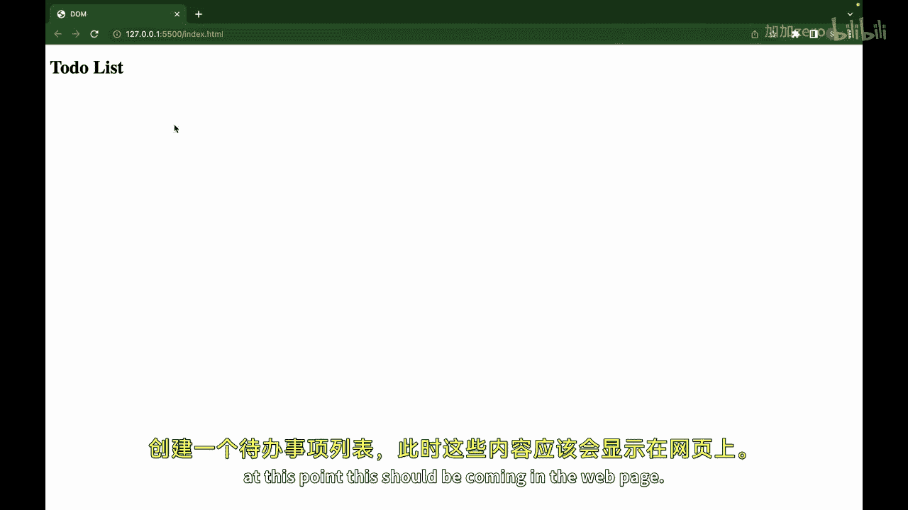
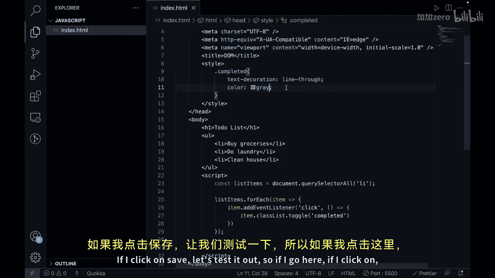
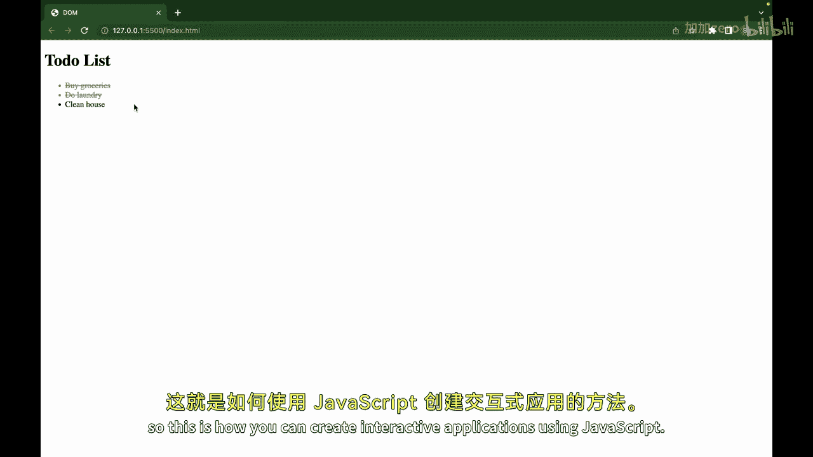
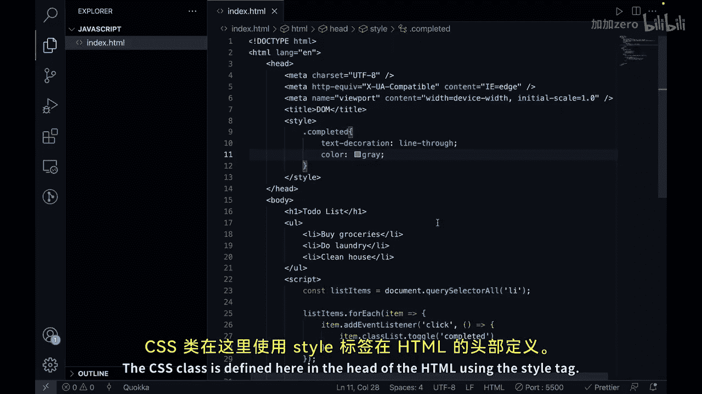

# 139：使用事件创建交互式用户界面

在本节课中，我们将学习如何使用JavaScript事件来创建交互式的用户界面。我们将通过构建一个简单的待办事项列表应用，来演示如何响应用户的点击操作，并动态改变页面元素的样式。

---

## 概述



在上一节视频中，我们学习了如何响应用户输入，例如点击和按键事件。本节中，我们将利用事件来创建一个交互式的用户界面。事件是浏览器中发生的动作，例如用户点击按钮或滚动页面，它们可以用来触发应用程序中的特定功能。通过事件，我们可以创建能够实时响应用户操作的交互式界面。

## 创建交互式界面

现在，让我们开始创建一个交互式界面。假设你正在构建一个待办事项列表应用，并希望允许用户通过点击项目来将其标记为已完成。



首先，我们需要一个基本的HTML结构。在`<body>`标签内，我们创建一个标题和一个无序列表，其中包含几个待办事项。



```html
<!DOCTYPE html>
<html lang="en">
<head>
    <meta charset="UTF-8">
    <meta name="viewport" content="width=device-width, initial-scale=1.0">
    <title>交互式待办列表</title>
    <style>
        .completed {
            text-decoration: line-through;
            color: gray;
        }
    </style>
</head>
<body>
    <h1>待办事项列表</h1>
    <ul>
        <li>购买杂货</li>
        <li>洗衣服</li>
        <li>打扫房间</li>
    </ul>

    <script>
        // JavaScript 代码将写在这里
    </script>
</body>
</html>
```

## 添加JavaScript交互逻辑

接下来，我们将在`<script>`标签内编写JavaScript代码，为列表项添加点击事件监听器。

以下是实现步骤：

1.  使用`document.querySelectorAll`选择所有的列表项（`<li>`元素）。
2.  遍历这些列表项。
3.  为每个列表项添加一个`click`事件监听器。
4.  在事件处理函数中，切换一个名为`completed`的CSS类。

```javascript
const listItems = document.querySelectorAll('li');

listItems.forEach(item => {
    item.addEventListener('click', () => {
        item.classList.toggle('completed');
    });
});
```

**代码解释**：
*   `document.querySelectorAll('li')`：获取页面中所有的`<li>`元素。
*   `.forEach()`：遍历每一个获取到的列表项。
*   `addEventListener('click', ...)`：为每个列表项添加点击事件监听。
*   `classList.toggle('completed')`：在点击时，切换`completed`类的状态（如果存在则移除，不存在则添加）。

## 定义样式

我们在`<style>`标签中定义了`.completed`类的样式，它会给文本添加删除线并将颜色变为灰色，以直观地表示任务已完成。



```css
.completed {
    text-decoration: line-through;
    color: gray;
}
```

## 效果演示



保存文件并在浏览器中打开。当你点击“购买杂货”这个列表项时，它会立即被划掉并变成灰色。再次点击，样式会被移除，表示任务未完成。

这个简单的例子展示了如何将HTML、CSS和JavaScript结合起来，通过事件驱动的方式创建出交互式的用户体验。



---

## 总结

本节课中，我们一起学习了使用事件创建交互式用户界面的核心方法。事件是Web应用实现交互性的关键，它可以用来检测用户的点击、按键等操作，并触发相应的功能来响应。

通过为待办列表项添加点击事件监听器，并在回调函数中切换CSS类，我们实现了一个动态标记任务完成状态的功能。这体现了如何利用事件监听器处理用户输入，从而构建出吸引人且动态的应用程序，提供流畅的用户体验。


我们通过一个现实中的应用示例（待办列表应用）具体展示了事件的用法。掌握事件处理是成为前端开发者的重要一步。