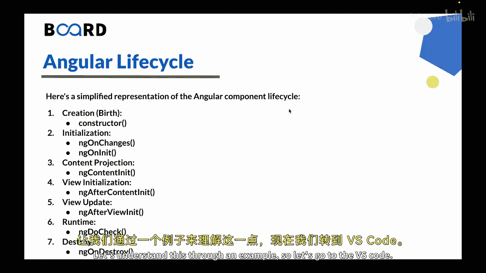
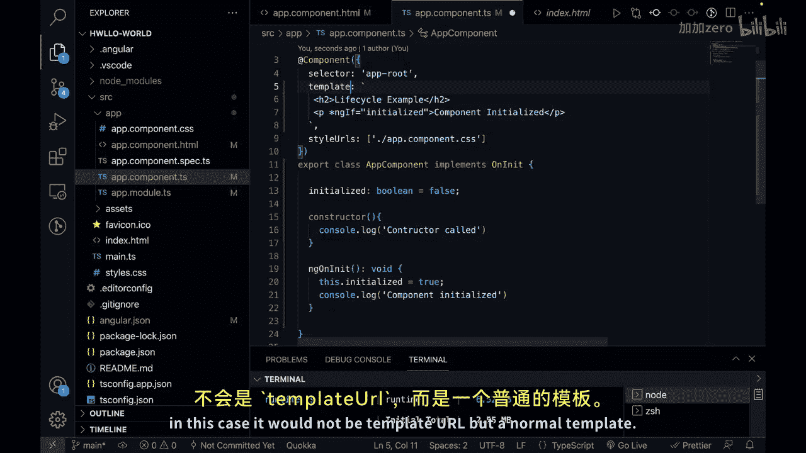
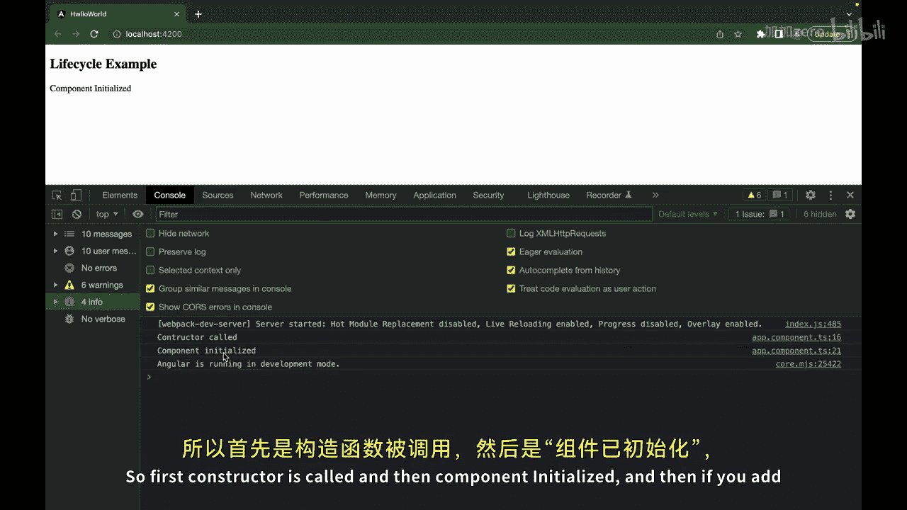
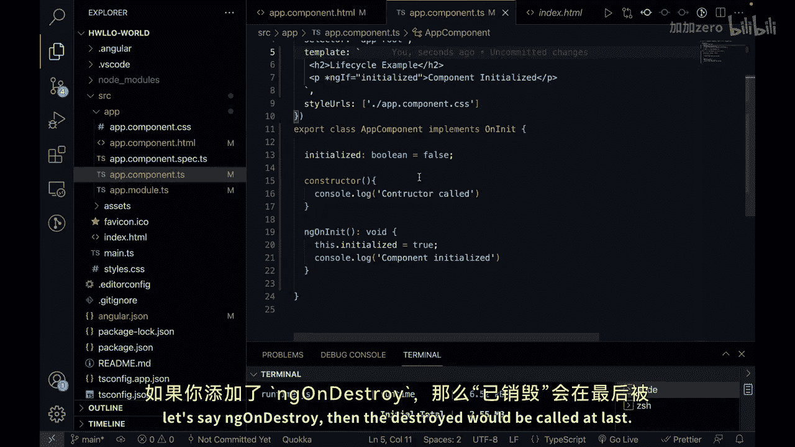

# 145：Angular 组件生命周期 🔄

在本节课中，我们将学习 Angular 组件的生命周期。理解生命周期对于开发 Angular 应用至关重要。

Angular 生命周期由一系列预定义的阶段组成，也可以称为钩子。这些钩子允许你在组件生命周期的不同时间点执行特定的操作。

为了帮助你形象化理解，我们可以把组件想象成一个生命体，经历从诞生到消亡的不同阶段。

---

## 生命周期阶段详解

上一节我们介绍了生命周期的概念，本节中我们来看看其具体的阶段和钩子。

以下是 Angular 组件生命周期的重要阶段：

1.  **创建阶段**
    *   **构造函数**：这是组件被创建时调用的第一个方法，用于初始化组件及其依赖项。此时，组件的模板和输入属性尚不可用。

2.  **初始化阶段**
    *   **`ngOnChanges`**：当组件的输入属性发生变化时调用此钩子。它提供有关已更改属性的信息。
    *   **`ngOnInit`**：在首次 `ngOnChanges` 之后调用一次。用于初始化组件、发起 API 调用和执行其他设置任务。

3.  **内容投影阶段**
    *   **`ngAfterContentInit`**：在内容子项（即投影内容）初始化后被调用。

4.  **视图初始化阶段**
    *   **`ngAfterViewInit`**：在内容子项初始化并可在组件视图中使用后被调用。



5.  **视图更新阶段**
    *   **`ngAfterViewChecked`**：在组件的视图和子视图初始化后被调用。用于执行需要访问组件视图的额外设置任务。

6.  **运行时阶段**
    *   **`ngDoCheck`**：在每个变更检测周期中被调用。用于执行自定义的变更检测并对组件状态的变化做出反应。

7.  **销毁阶段**
    *   **`ngOnDestroy`**：在组件即将被销毁时调用。用于取消订阅、清除计时器以及释放组件持有的任何资源。

---

## 代码示例与实践

理解了各个阶段后，我们通过一个简单的例子来看看这些钩子是如何工作的。

以下是演示 `constructor`、`ngOnInit` 和 `ngOnDestroy` 钩子的基本组件代码：

```typescript
import { Component, OnInit, OnDestroy } from '@angular/core';

@Component({
  selector: 'app-root',
  template: `
    <h2>生命周期示例</h2>
    <p *ngIf="initialized">组件已初始化</p>
    <p *ngIf="destroyed">组件已销毁</p>
  `,
})
export class AppComponent implements OnInit, OnDestroy {
  initialized: boolean = false;
  destroyed: boolean = false;

  constructor() {
    console.log('构造函数被调用');
  }

  ngOnInit() {
    this.initialized = true;
    console.log('组件已初始化');
  }

  ngOnDestroy() {
    this.destroyed = true;
    console.log('组件已销毁');
  }
}
```

运行此代码，在浏览器控制台中你将看到以下输出顺序：
1.  `构造函数被调用`
2.  `组件已初始化`

这演示了生命周期钩子的调用流程：首先是创建阶段（构造函数），然后是初始化阶段（`ngOnInit`）。如果组件被销毁，`ngOnDestroy` 将在最后被调用。



---





## 重要注意事项

了解钩子的调用顺序后，还需要注意以下几点。

以下是关于 Angular 生命周期钩子的关键点：

*   并非所有钩子都会在每个组件中使用。
*   生命周期钩子是可选的，你可以根据组件的行为或用例选择实现必要的钩子。
*   理解 Angular 组件生命周期有助于你管理组件初始化、执行清理操作，并通过在生命周期的每个阶段使用适当的钩子来优化性能。

---


本节课中我们一起学习了 Angular 组件的生命周期，包括其各个阶段、对应的钩子函数以及一个简单的实践示例。理解这些概念是构建健壮、高效 Angular 应用的基础。在下一节课中，我们将了解 Angular 装饰器。