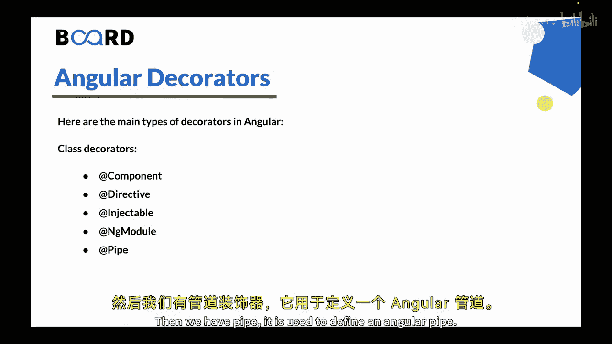
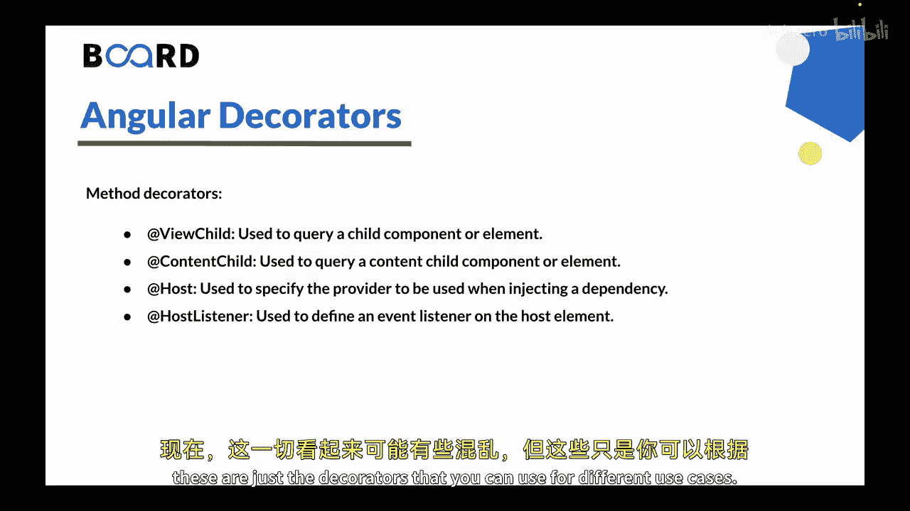
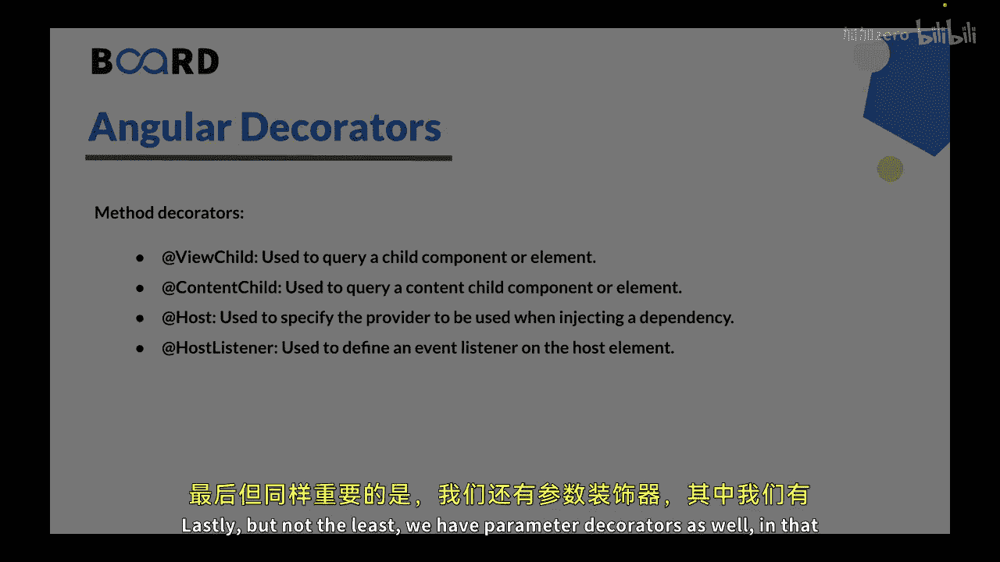
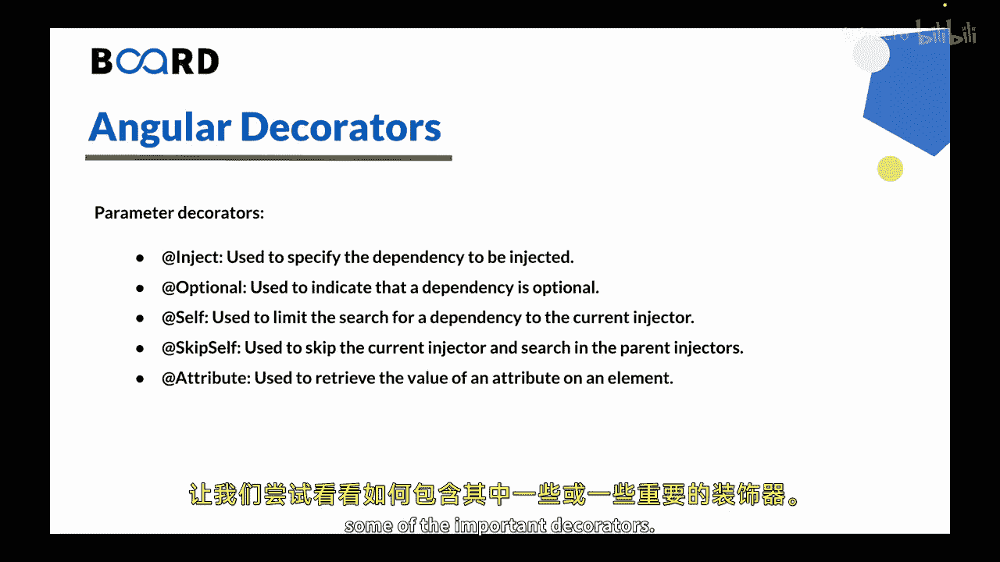
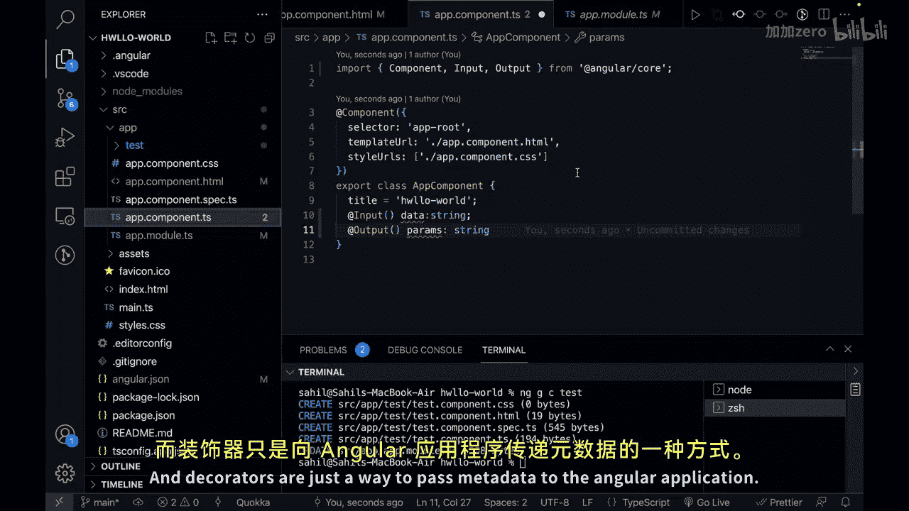
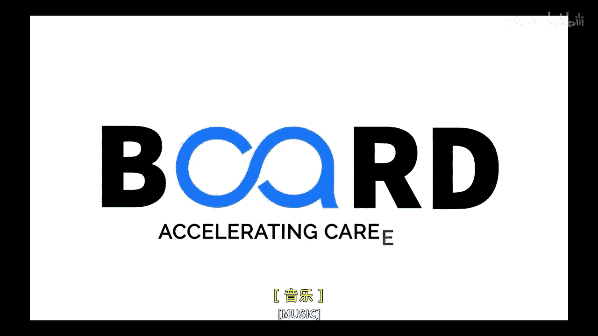

# 146：Angular装饰器详解 🎯


在本节课中，我们将要学习Angular框架中的装饰器。装饰器是Angular中用于增强和修改类、方法、属性及参数行为的重要特性。它们通过提供元数据，帮助Angular理解如何创建、配置和运行应用程序的各个部分。

---

在上一节我们介绍了Angular的生命周期，本节中我们来看看Angular中不同类型的装饰器。

Angular中有多种类型的装饰器，用于增强和修改类、方法、属性及参数的行为。以下是Angular中一些主要的装饰器类型。

### 类装饰器

以下是Angular中主要的类装饰器：

*   **`@Component`**：用于定义一个Angular组件。
*   **`@Directive`**：用于定义一个Angular指令。
*   **`@Injectable`**：用于将一个类声明为可注入的，以便进行依赖注入。
*   **`@NgModule`**：用于定义一个Angular模块。
*   **`@Pipe`**：用于定义一个Angular管道。




对于以上所有功能，我们都有不同类型的类装饰器。

---

接下来，我们来看一种叫做属性装饰器的类型。

### 属性装饰器

以下是一些重要的属性装饰器：

*   **`@Input`**：用于在组件或指令上定义一个输入属性。
*   **`@Output`**：用于在组件或指令上定义一个输出属性。
*   **`@HostBinding`**：用于将宿主元素的属性绑定到指令的属性上。
*   **`@HostListener`**：用于在宿主元素上定义一个事件监听器。

---

除了属性装饰器，我们还有方法装饰器。

### 方法装饰器



以下是方法装饰器的例子：



*   **`@ViewChild`**：用于查询子组件或元素。
*   **`@ContentChild`**：用于查询内容子组件或元素。
*   **`@Host`**：用于指定注入依赖时要使用的提供者。
*   **`@HostListener`**：同样可用于在宿主元素上定义事件监听器。

以上这些装饰器可能看起来令人困惑，但它们只是针对不同使用场景的工具。

---

最后，我们还有参数装饰器。

### 参数装饰器



以下是参数装饰器的类型：

*   **`@Inject`**：用于指定需要注入的依赖项。
*   **`@Optional`**：用于表明某个依赖项是可选的。
*   **`@Self`**：用于将依赖项的搜索范围限制在当前注入器中。
*   **`@SkipSelf`**：用于跳过当前注入器，在父级注入器中搜索依赖项。
*   **`@Attribute`**：用于获取元素上某个属性的值。

---

现在，让我们通过代码示例来看看如何在实践中使用一些重要的装饰器。

### 装饰器使用示例

在Visual Studio Code中，我们有一个基础的Angular模板。当前位于 `app.component.ts` 文件。

```typescript
import { Component, Input, Output } from '@angular/core';

@Component({
  selector: 'app-root',
  templateUrl: './app.component.html',
  styleUrls: ['./app.component.css']
})
export class AppComponent {
  @Input() inputData: string;
  @Output() outputEvent = new EventEmitter<string>();
}
```

如你所见，我们使用了 `@Component` 装饰器，这是一个类装饰器。在类内部，我们还可以添加更多装饰器，例如 `@Input` 和 `@Output`。这就是你根据不同的用例来包含装饰器的方式。

如果你查看 `app.module.ts` 文件，你会看到我们也使用了 `@NgModule` 装饰器，它也可以接收自己的元数据。

分析这里的模式，所有Angular中的装饰器都以 `@` 符号表示，例如 `@Component`、`@NgModule`、`@Input` 和 `@Output`。我们可以定义类装饰器、输入装饰器等，具体取决于使用场景。此外，还有许多事件装饰器，如 `@HostListener` 等。



装饰器本质上是向Angular应用程序传递元数据的一种方式。

---

### 总结

本节课中我们一起学习了Angular装饰器。所有这些装饰器可以组合使用，以定制Angular元素的行为、提供元数据、配置依赖注入等。它们在构建Angular应用程序和启用框架强大功能方面扮演着至关重要的角色。




在下一节视频中，我们将学习Angular组件。