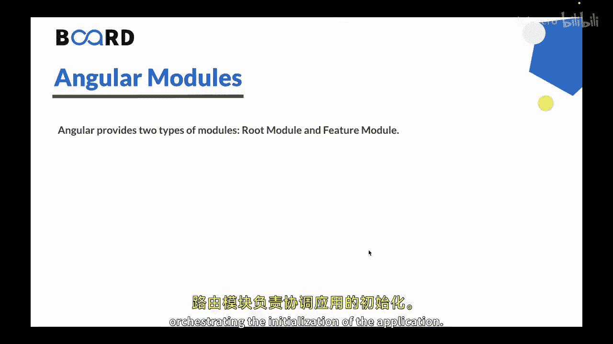
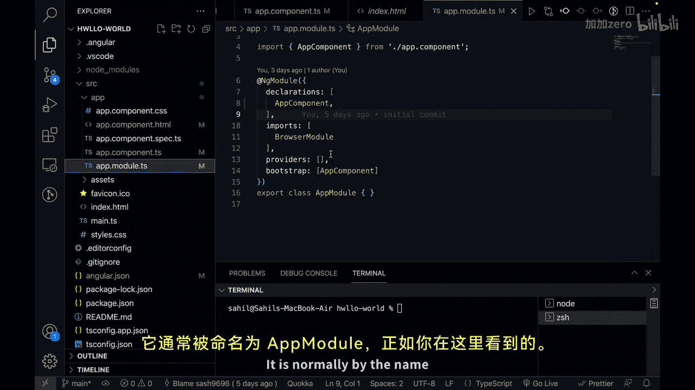
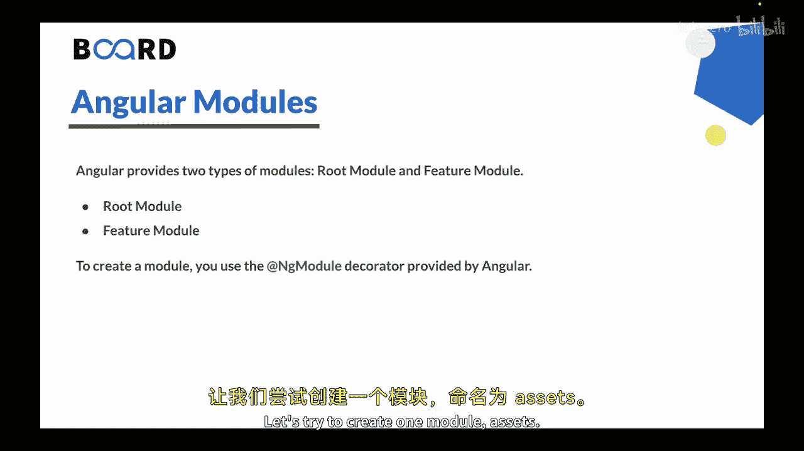
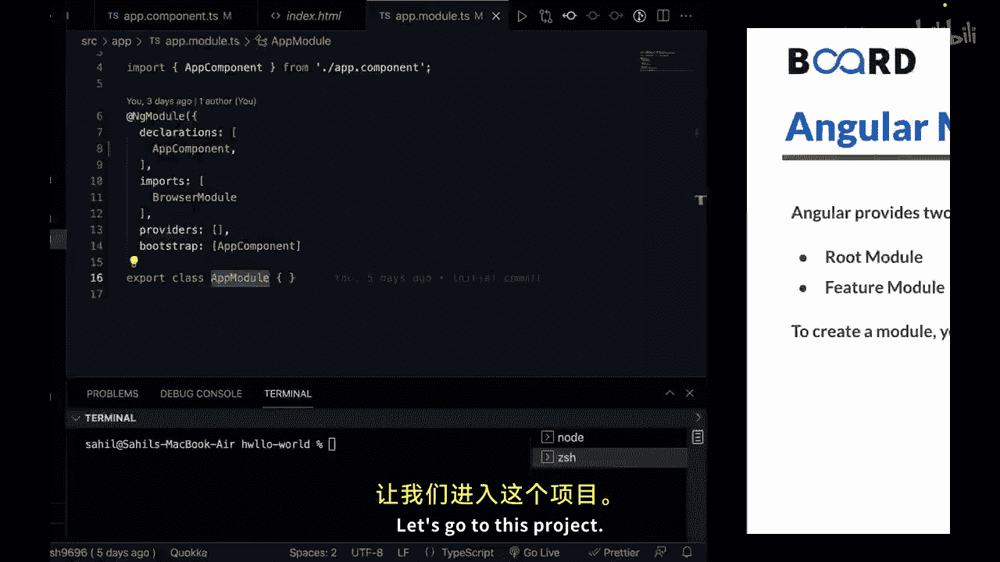
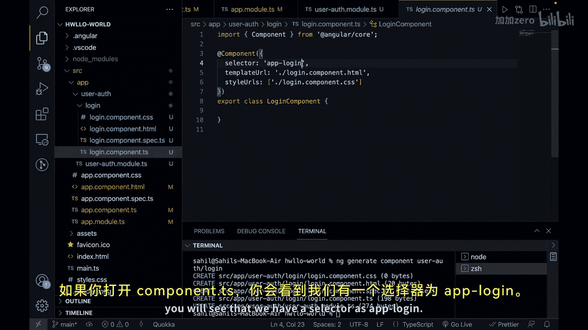
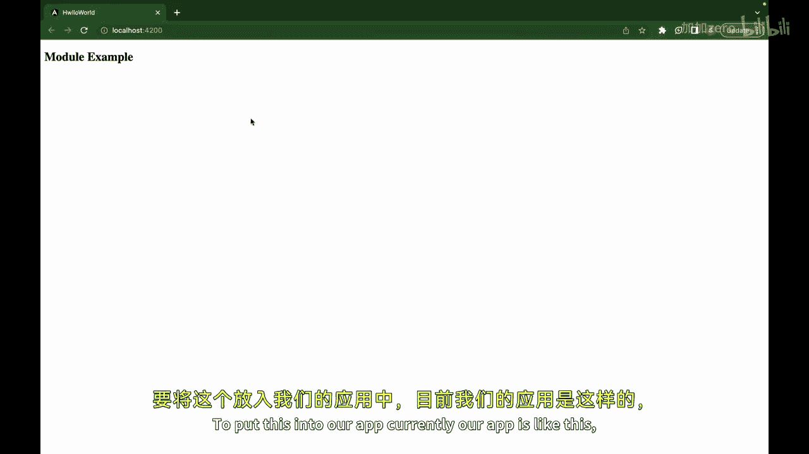
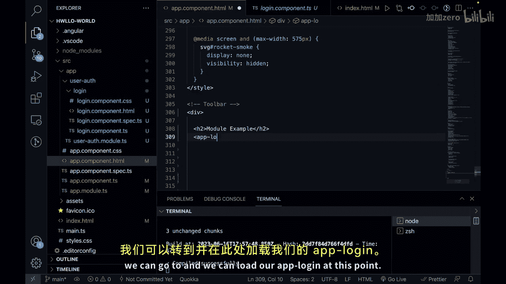

# 148：Angular模块 🧩

在本节课中，我们将要学习Angular模块。模块是Angular应用组织代码的核心方式，它帮助我们将应用划分为清晰、可管理的功能块。

上一节我们介绍了Angular组件，本节中我们来看看如何将组件和其他功能组织到模块中。

## 什么是Angular模块？

在Angular中，模块是一种组织和打包相关组件、服务、指令及其他应用构建块的方式。它就像一个容器，将实现特定功能或一组紧密相关功能所需的代码组织在一起。



## 模块的类型

Angular主要有两种类型的模块：根模块和特性模块。



### 根模块

根模块通常命名为 `AppModule`，是应用的入口点。它负责引导启动主组件，并导入其他特性模块和Angular库。根模块协调着应用的初始化过程。

在Angular项目中，根模块通常位于 `app.module.ts` 文件中。

### 特性模块

特性模块封装了用于特定功能或特性的一组相关组件、服务和其他代码。特性模块可以独立开发、测试，并在应用的不同部分复用。



## 创建模块的优势



创建Angular模块能带来诸多好处，包括：
*   **模块化**：将应用分解为独立的功能单元。
*   **封装性**：隐藏模块内部的实现细节。
*   **依赖管理**：清晰地声明模块间的依赖关系。
*   **惰性加载**：提升大型应用的初始加载速度。
*   **代码组织**：使代码结构更清晰，易于维护。

## 如何创建模块

要创建模块，可以使用Angular提供的 `@NgModule` 装饰器。这个装饰器用于定义模块的元数据，例如其声明（组件、指令、管道）、导入、导出和提供者。

以下是创建一个模块的基本代码结构：

```typescript
import { NgModule } from ‘@angular/core’;
import { CommonModule } from ‘@angular/common’;

@NgModule({
  declarations: [
    // 在此声明属于本模块的组件、指令、管道
  ],
  imports: [
    // 在此导入本模块所需的其他模块
    CommonModule
  ],
  exports: [
    // 在此导出希望其他模块能使用的组件、指令、管道
  ],
  providers: [
    // 在此提供本模块的服务
  ]
})
export class YourModuleName { }
```

## 实践：创建模块与组件

让我们通过一个简单的例子来实践。假设我们要创建一个用户认证相关的特性模块。

1.  **生成模块**：使用Angular CLI命令生成一个名为 `user-auth` 的特性模块。
    ```
    ng generate module user-auth
    ```
    这将在项目中创建 `user-auth.module.ts` 文件。

2.  **在模块内生成组件**：接下来，我们在 `user-auth` 模块内创建一个登录组件。
    ```
    ng generate component user-auth/login
    ```
    执行后，CLI会自动在 `user-auth` 模块的 `declarations` 数组中声明这个新创建的 `LoginComponent`。



3.  **导出组件**：如果希望其他模块（如根模块）能使用这个登录组件，需要在 `user-auth` 模块的 `exports` 数组中将其导出。
    ```typescript
    // user-auth.module.ts
    @NgModule({
      declarations: [LoginComponent],
      imports: [CommonModule],
      exports: [LoginComponent] // 导出组件
    })
    export class UserAuthModule { }
    ```

4.  **导入特性模块**：在根模块 `AppModule` 中导入我们创建的 `UserAuthModule`。
    ```typescript
    // app.module.ts
    import { UserAuthModule } from ‘./user-auth/user-auth.module’;

    @NgModule({
      imports: [
        BrowserModule,
        UserAuthModule // 导入特性模块
      ],
      ...
    })
    export class AppModule { }
    ```





5.  **使用组件**：现在，我们可以在根模块的组件模板（如 `app.component.html`）中使用导出的登录组件了。
    ```html
    <!-- app.component.html -->
    <app-login></app-login>
    ```
    页面上将显示 “login works!”。

## 总结

本节课中我们一起学习了Angular模块。我们了解了模块是组织Angular应用的基础，区分了根模块和特性模块的作用，并通过实践步骤创建了一个特性模块及其内部的组件，最后将其集成到主应用中。


通过利用Angular模块的概念，你可以构建出模块化、可扩展且易于维护的应用程序，这有助于促进代码复用、关注点分离和高效的依赖管理。