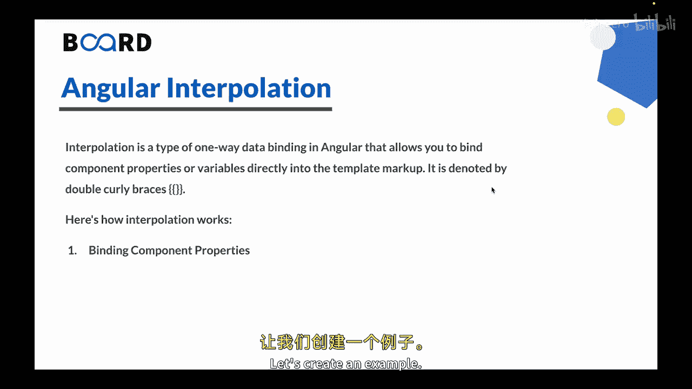
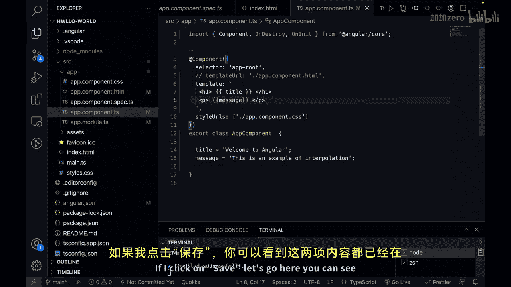
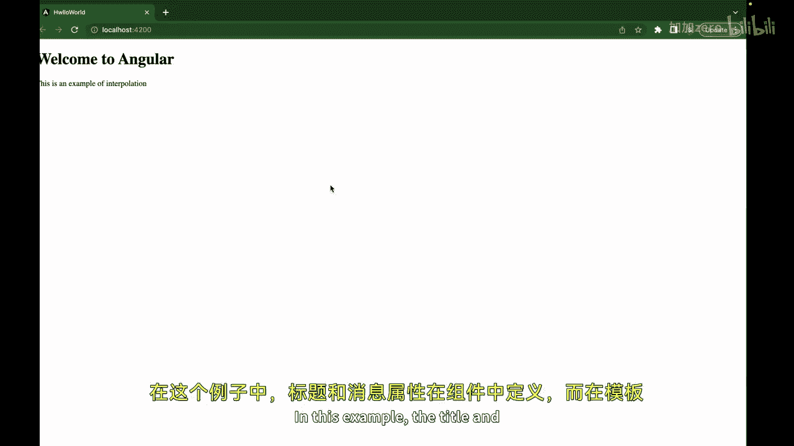
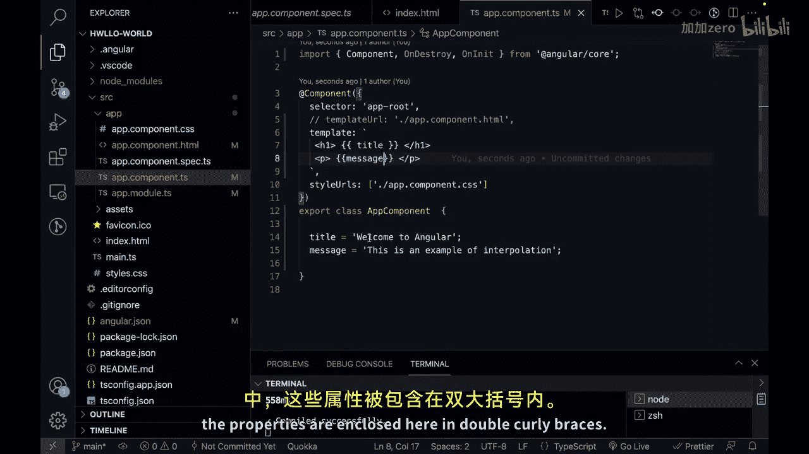
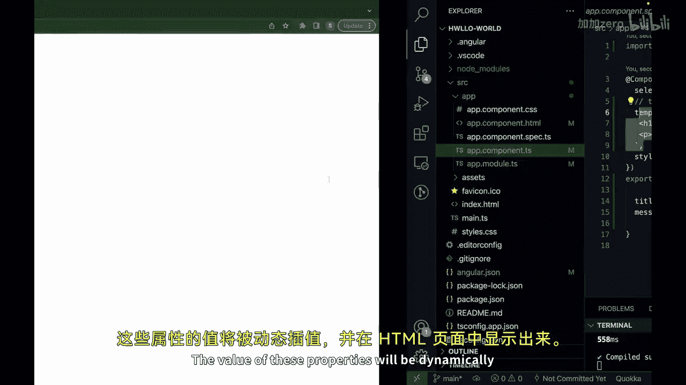
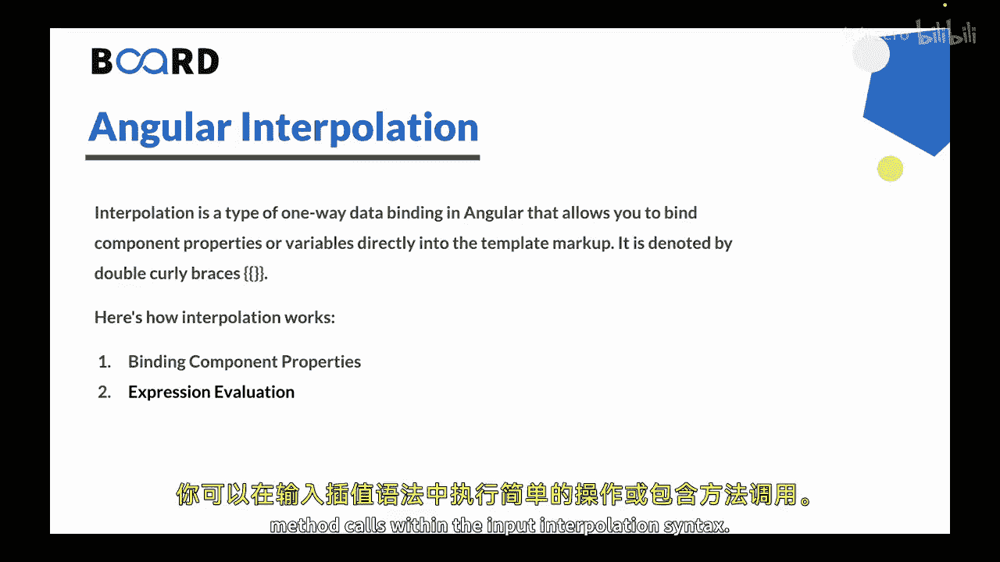
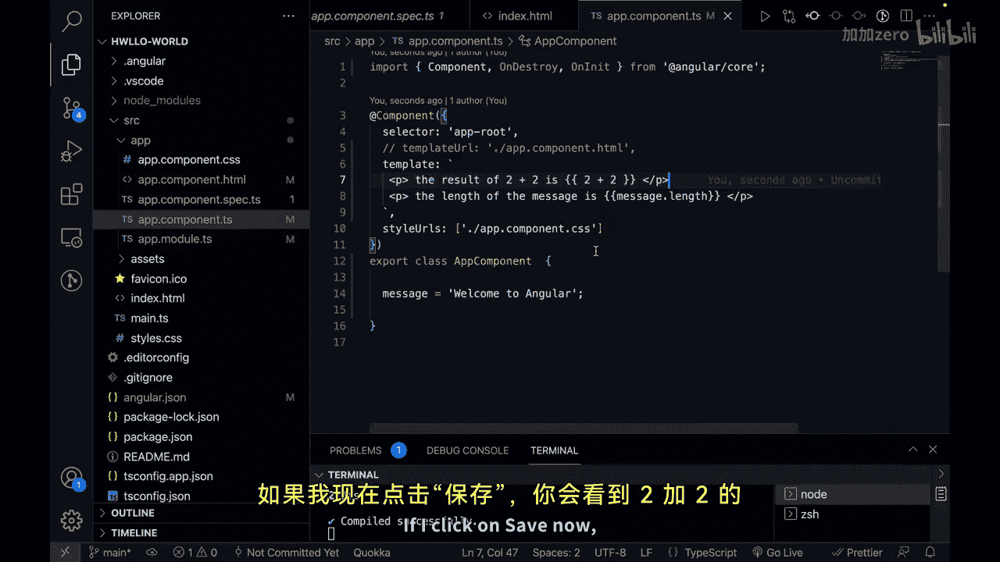
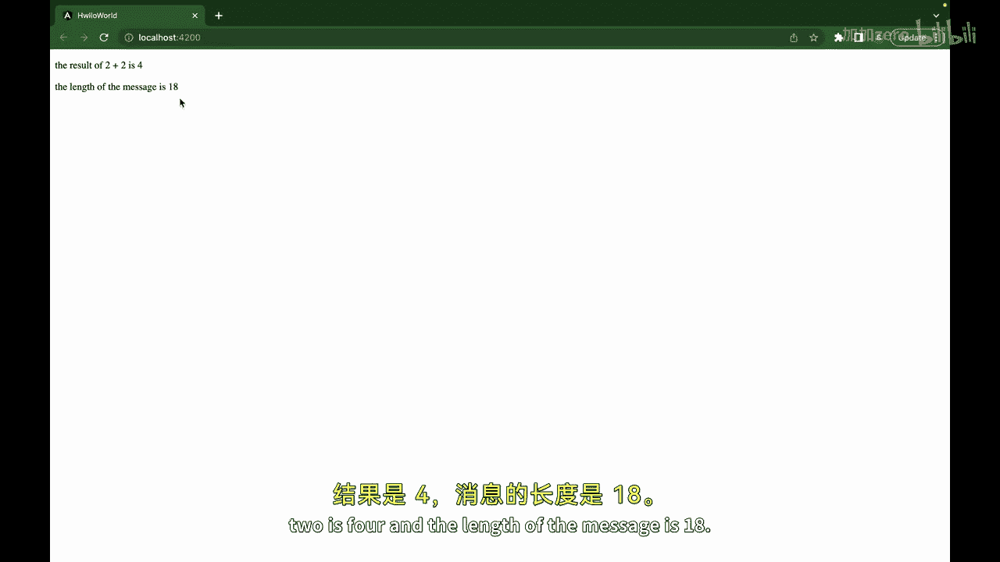
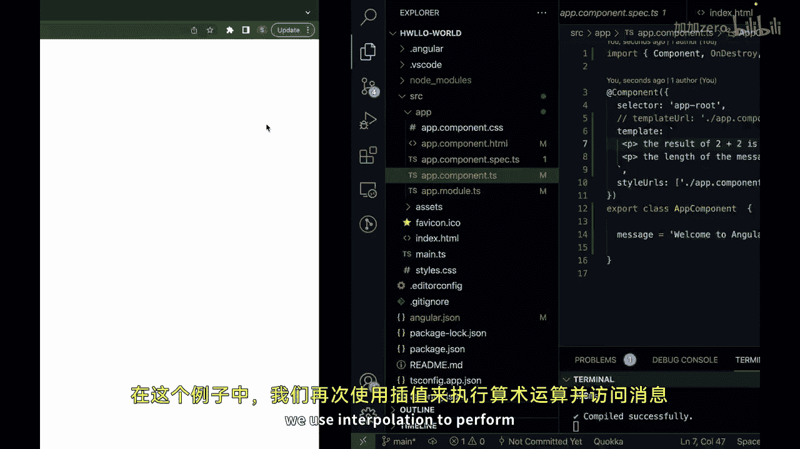
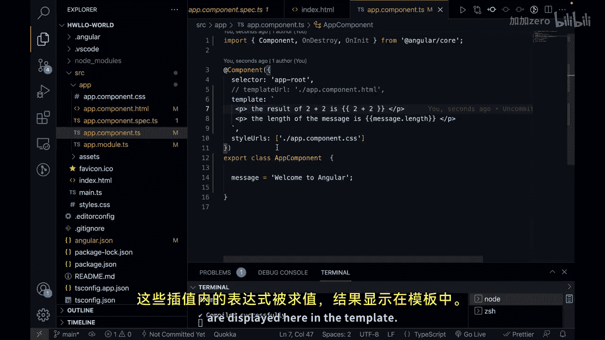

# 151：Angular 插值

在本节课中，我们将要学习 Angular 中的插值。这是一种单向数据绑定技术，允许你将组件属性或变量直接嵌入到模板标记中。

上一节我们介绍了 Angular 的数据绑定，特别是单向和双向数据绑定。本节中我们来看看其中一种单向绑定的具体实现：插值。

插值是 Angular 中的一种单向数据绑定，它允许你将组件属性或变量直接绑定到模板标记中。其语法由双花括号 `{{ }}` 表示。



插值可以通过多种方式工作。

以下是插值的第一种工作方式：绑定组件属性。

在这种情况下，你可以使用插值将组件属性直接绑定到模板中。属性值将被求值并显示在模板中。

让我们创建一个示例。

```typescript
// app.component.ts
import { Component } from '@angular/core';



@Component({
  selector: 'app-root',
  template: `
    <h1>{{ title }}</h1>
    <p>{{ message }}</p>
  `,
  styleUrls: ['./app.component.css']
})
export class AppComponent {
  title = 'Welcome to Angular';
  message = 'This is an example of interpolation.';
}
```





在这个例子中，`title` 和 `message` 属性在组件中定义。在模板中，这些属性被包裹在双花括号 `{{ }}` 中。这些属性的值将被动态地插值并显示在 HTML 页面上。



接下来，我们看看插值的第二种类型：表达式求值。



在这种情况下，插值允许你在模板中对表达式进行求值。你可以在插值语法中执行简单的操作或包含方法调用。

例如：

```typescript
// app.component.ts
import { Component } from '@angular/core';



@Component({
  selector: 'app-root',
  template: `
    <p>The length of the message is: {{ message.length }}</p>
    <p>The result of 2 + 2 is: {{ 2 + 2 }}</p>
  `,
  styleUrls: ['./app.component.css']
})
export class AppComponent {
  message = 'Welcome to Angular';
}
```





在这个例子中，我们再次使用插值来执行算术运算和访问 `message` 字符串的长度。插值内的这些表达式会被求值，结果将显示在模板中。



插值是在模板中显示动态数据的一种便捷方式。它允许你将组件属性、变量和表达式无缝地整合到用户界面中，使你的应用程序更具交互性和响应性。

需要记住的是，插值是一种单向数据绑定。这意味着它只会在用户界面中显示组件的数据。如果用户在界面上做出更改，它不会更新组件中的数据。

本节课中我们一起学习了 Angular 插值的概念、语法和两种主要应用方式：绑定组件属性和进行表达式求值。这是一种强大的单向数据绑定工具，用于动态渲染内容。


在下一节视频中，我们将学习 Angular 的属性绑定。