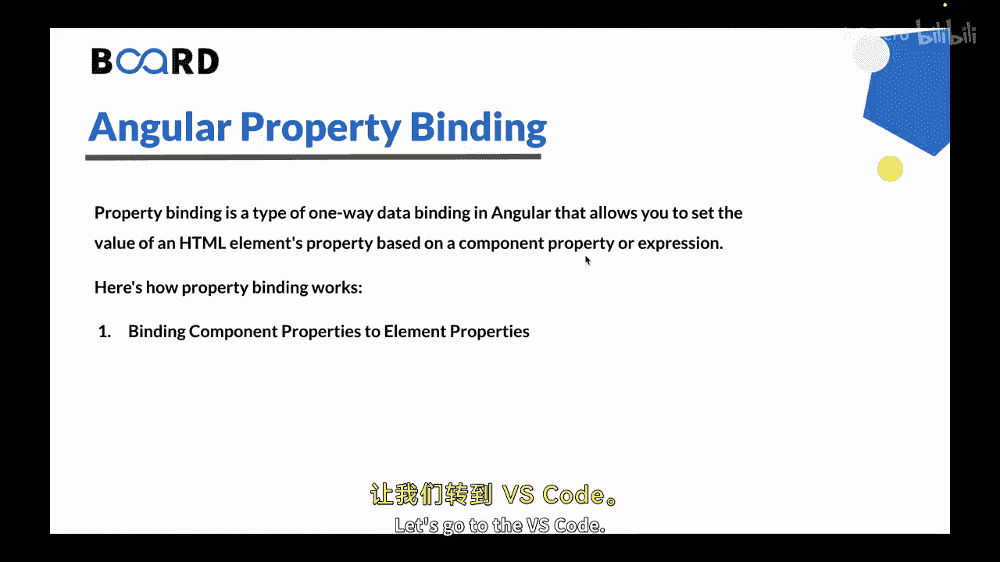
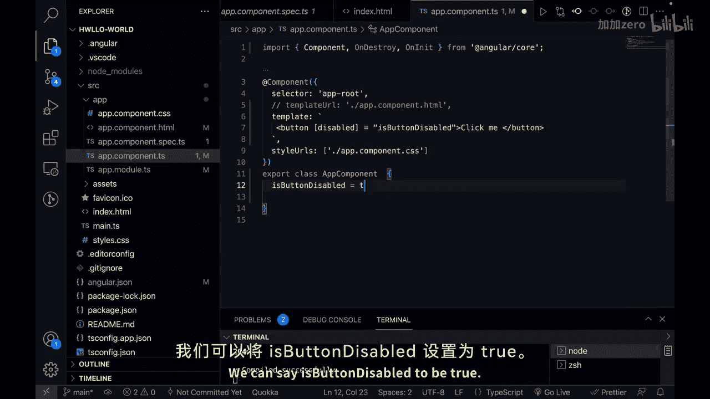
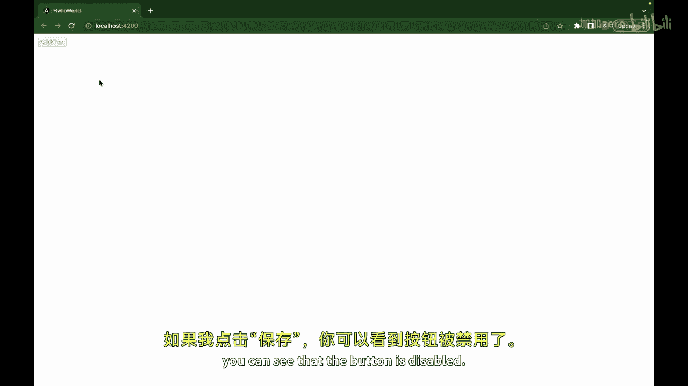
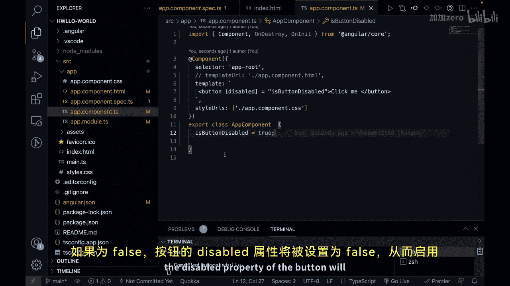
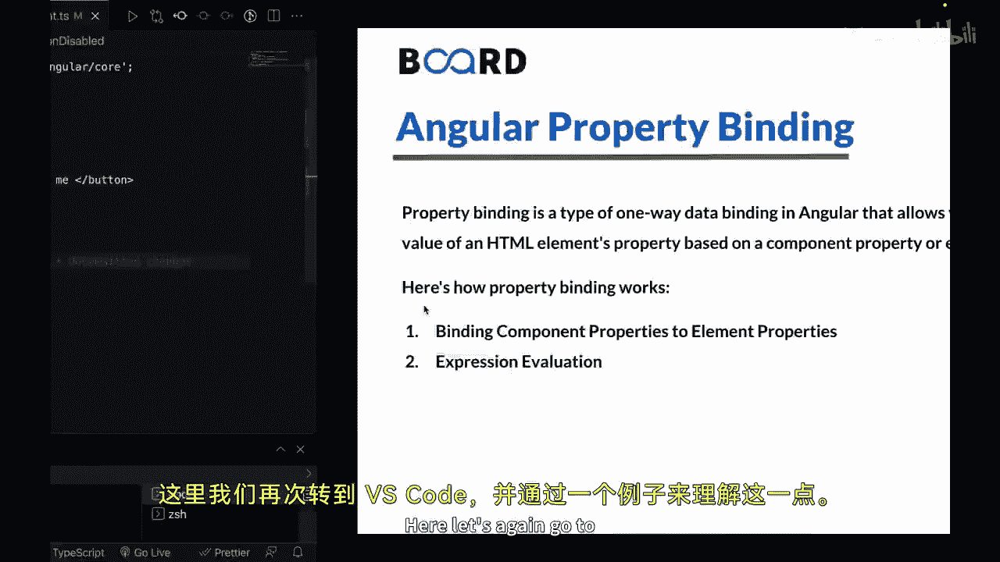
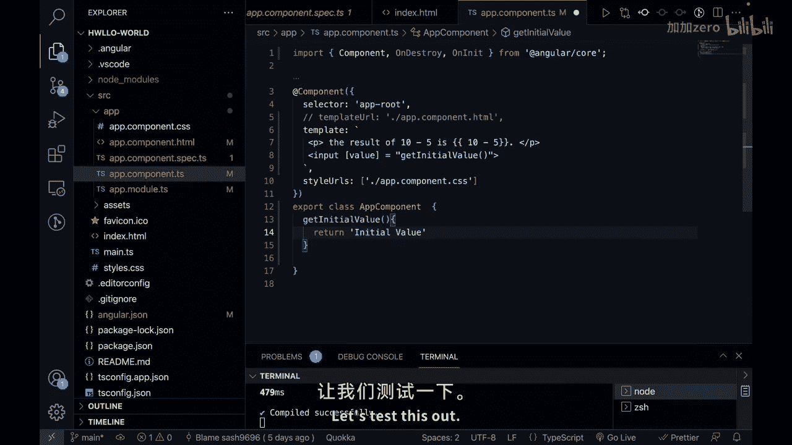
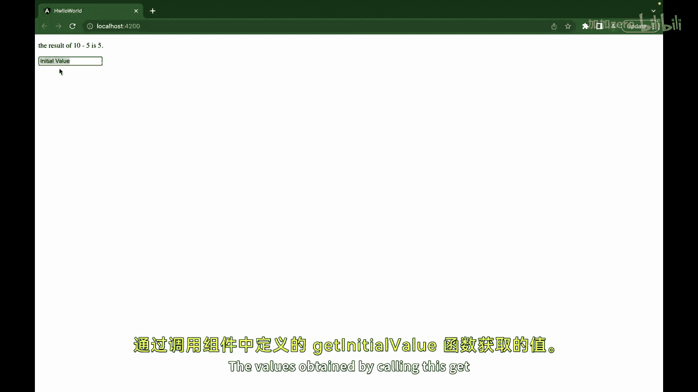
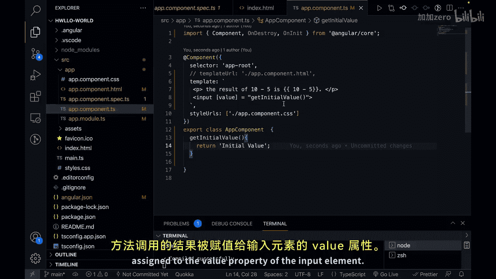

# 152：Angular 属性绑定 🎯

在本节课中，我们将要学习 Angular 中的属性绑定。这是一种单向数据绑定技术，允许你根据组件属性或表达式来动态设置 HTML 元素属性的值。

上一节我们介绍了 Angular 插值，本节中我们来看看属性绑定。

## 什么是属性绑定？



属性绑定是 Angular 中一种单向数据绑定，它允许你基于组件属性或某个表达式来设置 HTML 元素属性的值。它使用方括号 `[]` 将组件属性绑定到元素属性。

以下是属性绑定的几种主要工作方式。

### 1. 绑定组件属性到元素属性



在这种情况下，你可以使用属性绑定直接将组件属性绑定到 HTML 元素的属性。组件属性的值将被赋给元素的属性。



让我们通过一个例子来理解。

```html
<!-- app.component.html -->
<button [disabled]="isButtonDisabled">Click me</button>
```



```typescript
// app.component.ts
export class AppComponent {
  isButtonDisabled = true;
}
```

在这个例子中，我们将按钮元素的 `disabled` 属性绑定到了组件中的 `isButtonDisabled` 属性。组件属性决定了按钮是否被禁用。如果 `isButtonDisabled` 为 `true`，按钮的 `disabled` 属性将被设置为 `true`，从而禁用按钮；如果为 `false`，按钮将被启用。



### 2. 表达式求值

属性绑定也允许你在模板中对表达式进行求值。你可以在属性绑定语法中执行逻辑运算或包含方法。

让我们看另一个例子。



```html
<!-- app.component.html -->
<p>The result of 10 - 5 is: {{ 10 - 5 }}</p>
<input [value]="getInitialValue()" />
```

```typescript
// app.component.ts
export class AppComponent {
  getInitialValue() {
    return 'Initial Value';
  }
}
```

在这个例子中，我们再次使用属性绑定来设置输入框的 `value` 属性。其值是通过调用组件中定义的 `getInitialValue()` 方法获得的。方法调用的结果被赋给了输入框元素的 `value` 属性。





## 属性绑定的特点

属性绑定允许你基于组件数据或表达式动态设置和更新 HTML 元素的属性，为你的应用提供了灵活性和交互性。

需要注意的一点是，属性绑定是**单向数据绑定**。这意味着它只根据组件属性或表达式来设置元素属性的值。如果用户界面发生变化，它**不会**更新组件属性。


本节课中我们一起学习了 Angular 的属性绑定，包括如何将组件属性绑定到元素属性，以及如何在绑定中使用表达式和方法。在下一节视频中，我们将学习 Angular 的事件绑定。