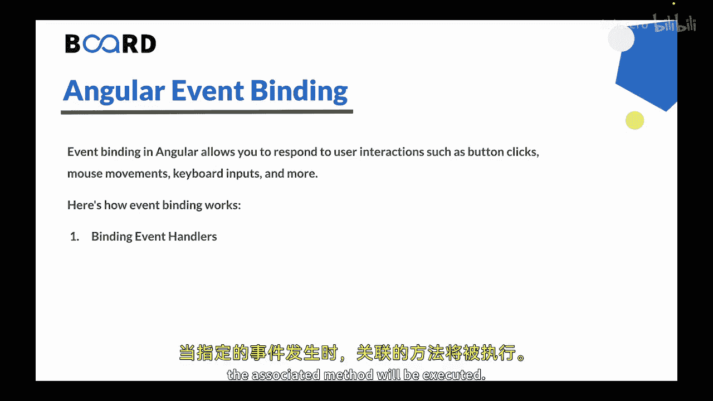
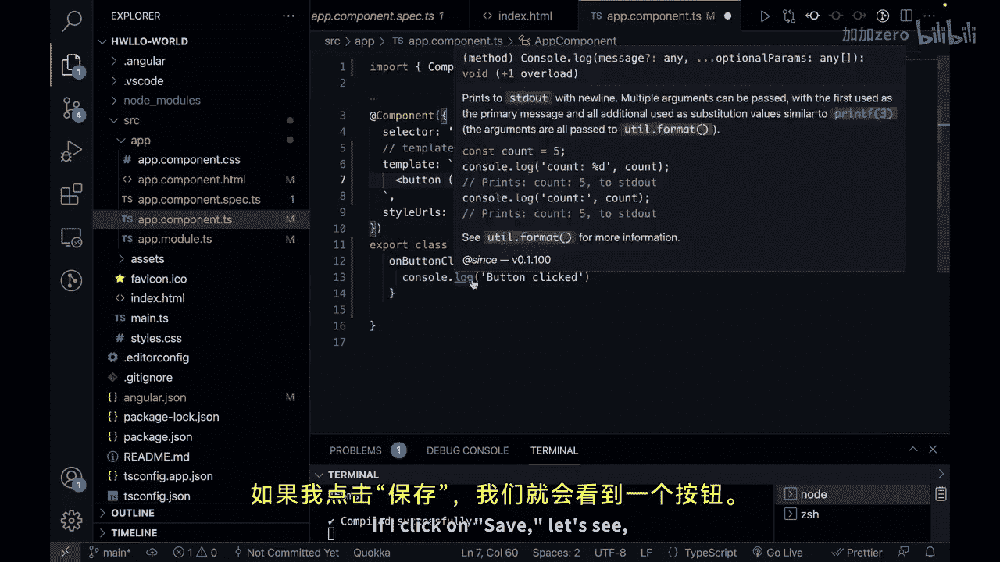
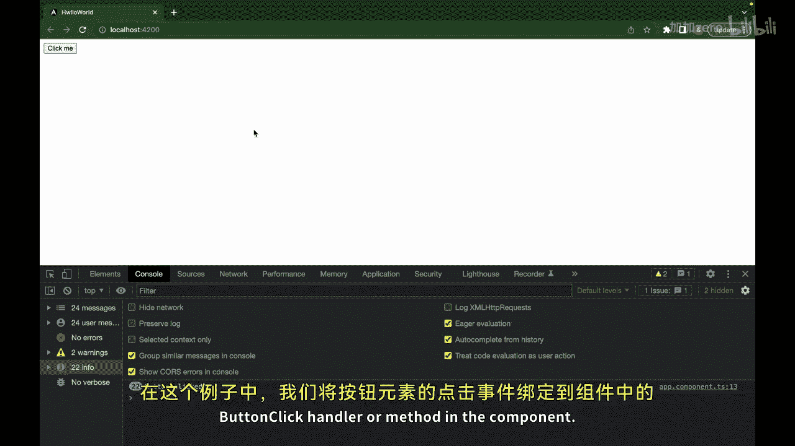
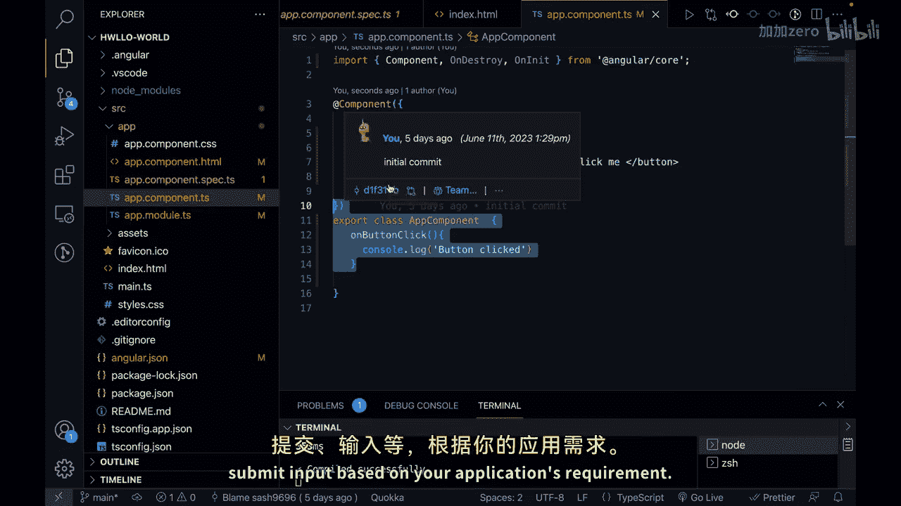
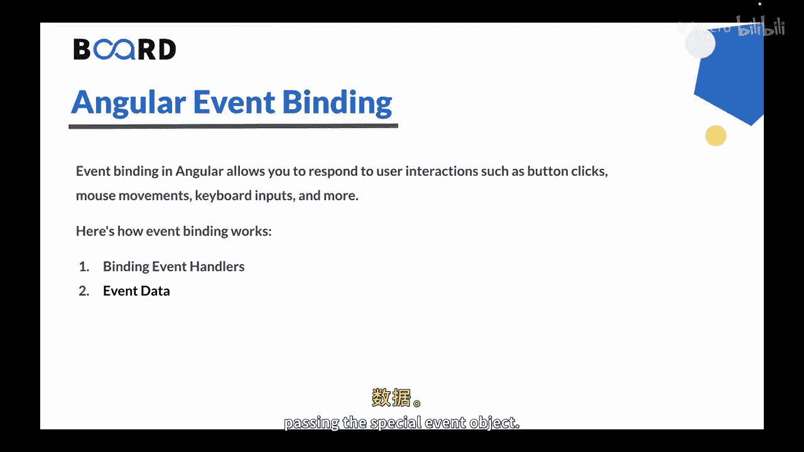
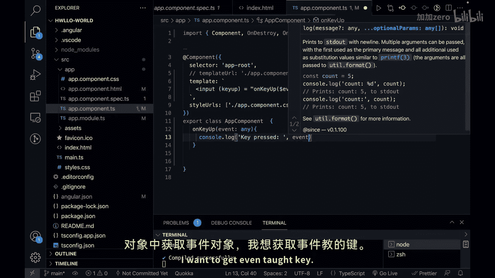
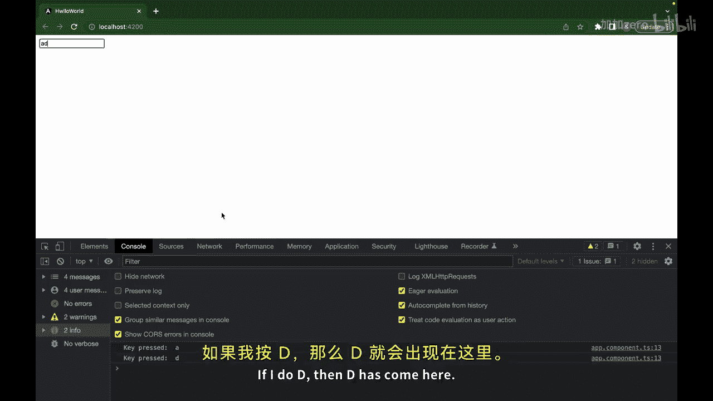
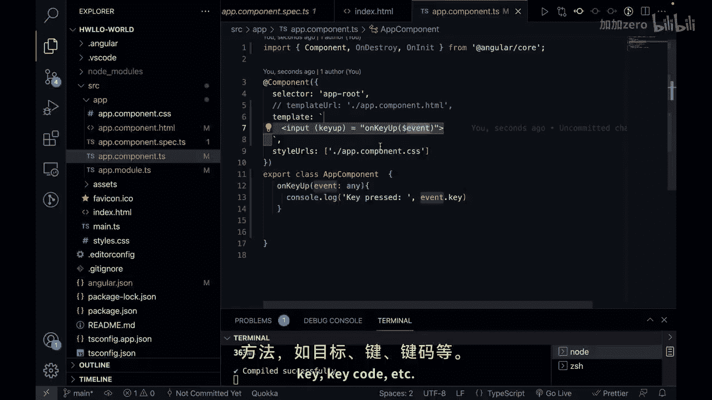

# 153：Angular 事件绑定

在本节课中，我们将要学习 Angular 中的事件绑定。事件绑定允许你的应用响应用户的交互操作，例如点击按钮、移动鼠标或键盘输入。

上一节我们介绍了属性绑定，本节中我们来看看如何通过事件绑定来处理用户交互。

## 什么是事件绑定？ 🤔

事件绑定在 Angular 中用于响应用户交互，例如按钮点击、鼠标移动、键盘输入等。它建立了用户操作与组件类中一个方法之间的连接，使你能够处理并响应这些事件。



## 如何使用事件绑定

以下是使用事件绑定的几种主要方式。

### 1. 绑定事件处理器

你可以使用事件绑定，直接将一个事件绑定到组件类中的一个方法。当指定的事件发生时，相关联的方法就会被执行。



**语法格式**：
```html
<button (click)="onButtonClick()">点击我</button>
```

让我们通过一个例子来理解。

首先，在组件类中创建一个方法：
```typescript
onButtonClick() {
  console.log('按钮被点击了');
}
```



然后，在模板中创建一个按钮并绑定点击事件：
```html
<button (click)="onButtonClick()">点击我</button>
```



当按钮被点击时，`onButtonClick` 方法将被执行，并在控制台输出信息。

你可以根据应用需求，绑定各种事件，例如 `mouseover`、`keydown`、`submit`、`input` 等。



### 2. 访问事件数据

事件绑定还可以提供关于所发生事件的额外信息。你可以在事件处理器方法中，通过传递特殊的 `$event` 对象来访问这些数据。

**语法格式**：
```html
<input (keyup)="onKeyUp($event)">
```

让我们看一个访问键盘事件的例子。

在组件类中创建方法：
```typescript
onKeyUp(event: any) {
  console.log('按下的键是：', event.key);
}
```



在模板中绑定 `keyup` 事件：
```html
<input (keyup)="onKeyUp($event)">
```



当在输入框中释放一个按键时，`onKeyUp` 方法会被执行，并通过 `event.key` 将按下的键名输出到控制台。`$event` 对象提供了与事件相关的各种属性和方法，例如 `target`、`key`、`keyCode` 等。

## 事件绑定的作用

事件绑定通过响应用户操作，使你的应用变得具有交互性。你可以执行各种操作、更新组件数据、调用方法，并基于事件触发应用逻辑。



通过将事件绑定与其他类型的数据绑定（如属性绑定）结合使用，你可以在 Angular 应用中创建动态且响应迅速的用户界面。

## 总结

本节课中我们一起学习了 Angular 的事件绑定。我们了解了如何将用户界面事件（如点击和按键）绑定到组件类中的方法，以及如何通过 `$event` 对象访问事件的详细信息。掌握事件绑定是构建交互式 Web 应用的关键一步。

在下一节视频中，我们将理解 Angular 的数据绑定，特别是双向数据绑定。


🎼 我们下节课再见。谢谢。