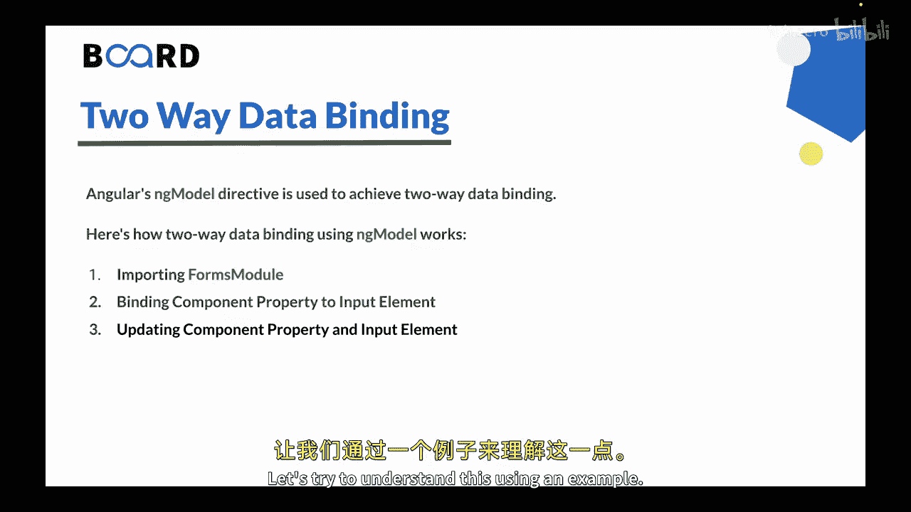
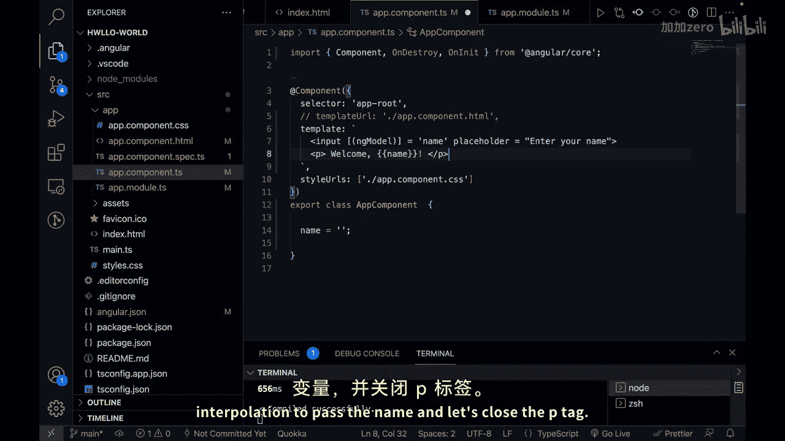
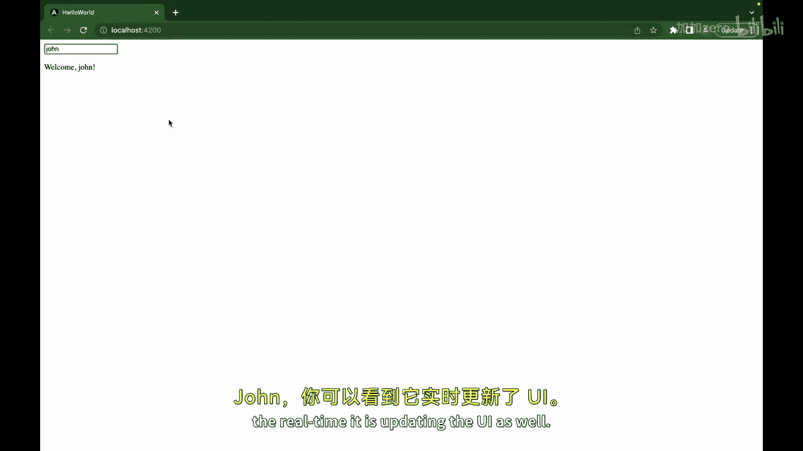
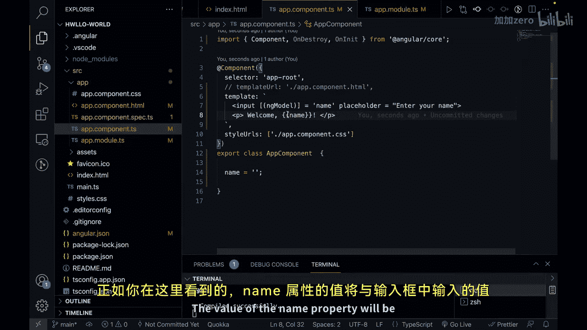
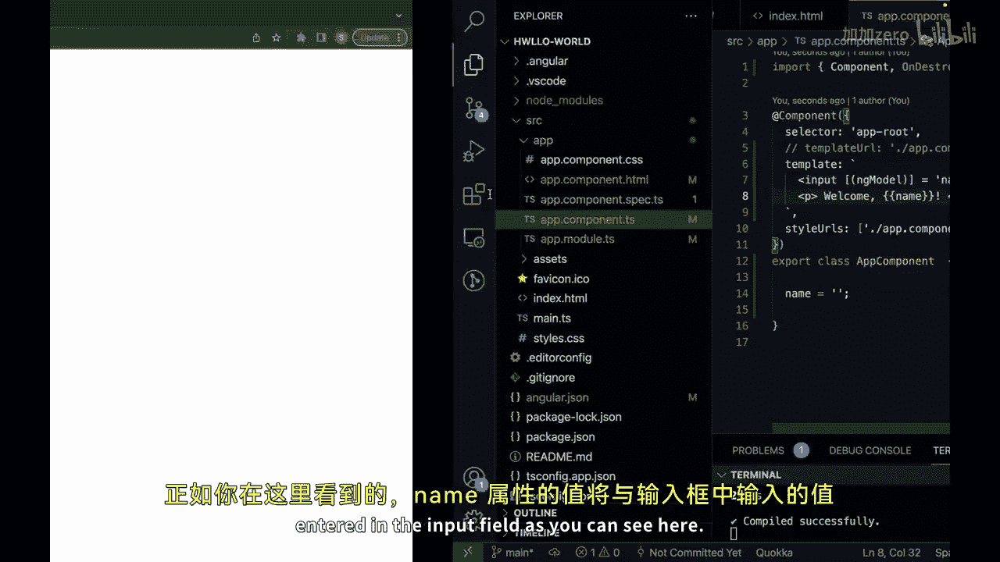
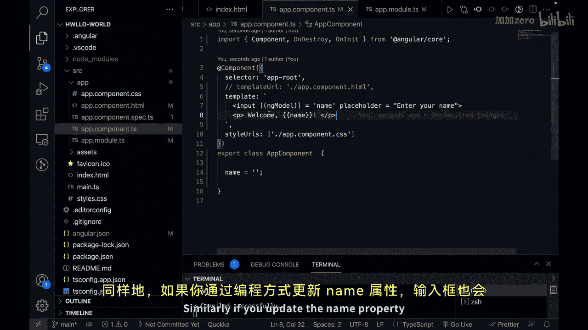

# 154：Angular 双向数据绑定 - ngModel 🔄

在本节课中，我们将要学习 Angular 中的双向数据绑定，特别是如何使用 `ngModel` 指令来实现组件属性与用户界面输入元素之间的双向同步。

上一节我们介绍了事件绑定，本节中我们来看看如何将数据绑定从单向扩展到双向，从而更高效地处理用户输入。

## 概述

双向数据绑定是 Angular 的一项强大功能，它允许你在组件属性和用户界面的输入元素之间建立双向同步。这确保了无论在组件中还是在用户界面中做出的更改，都会自动反映到另一方。你可以使用 `ngModel` 指令来实现双向数据绑定。它结合了属性绑定和事件绑定，将组件属性绑定到输入元素并使它们保持同步。

## 实现步骤

以下是使用 `ngModel` 实现双向数据绑定的关键步骤。

### 1. 导入 FormsModule

在使用 `ngModel` 之前，你需要在你的 Angular 模块中从 `@angular/forms` 导入 `FormsModule`。这个模块提供了处理表单和数据绑定所需的指令和服务。



**代码示例：**
```typescript
// 在 app.module.ts 中
import { FormsModule } from '@angular/forms';

@NgModule({
  imports: [
    // ... 其他模块
    FormsModule // 导入 FormsModule
  ],
  // ...
})
export class AppModule { }
```

### 2. 将组件属性绑定到输入元素

要建立双向数据绑定，你可以在输入元素内部使用 `ngModel` 指令，并将其绑定到一个组件属性。

**代码示例：**
```html
<!-- 在组件模板中 -->
<input type="text" [(ngModel)]="userName" placeholder="请输入您的名字">
<p>欢迎，{{ userName }}！</p>
```

### 3. 更新组件属性与输入元素



在双向数据绑定中，无论是在组件中还是在输入元素中做出的更改，都会自动反映在两个地方。当用户在输入框中键入时，组件属性会更新；反之，如果通过编程方式更新组件属性，输入框也会显示更新后的值。



## 实践示例

让我们通过一个具体的例子来理解这个过程。



假设我们有一个 Angular 项目，在 `AppComponent` 中：



1.  在 `app.module.ts` 中导入 `FormsModule`。
2.  在 `app.component.ts` 中定义一个属性（例如 `name`），并初始化为空字符串。
3.  在 `app.component.html` 模板中，创建一个输入框，使用 `[(ngModel)]` 将其与 `name` 属性绑定，同时使用插值表达式 `{{ name }}` 来实时显示该属性的值。

当用户在输入框中输入“John”时，下方的文本会实时更新为“欢迎，John！”。这演示了 `ngModel` 如何同步组件数据和用户界面。



## 总结

本节课中我们一起学习了 Angular 的双向数据绑定。我们了解到，使用 `ngModel` 指令可以简化用户输入处理和组件数据同步，减少保持组件与用户界面同步所需的样板代码。关键点是记住在你的 Angular 模块中导入 `FormsModule` 以有效使用 `ngModel`。


通过掌握双向数据绑定，你将能更流畅地构建交互式的 Angular 应用。下一节课我们将继续探索 Angular 的其他核心功能。