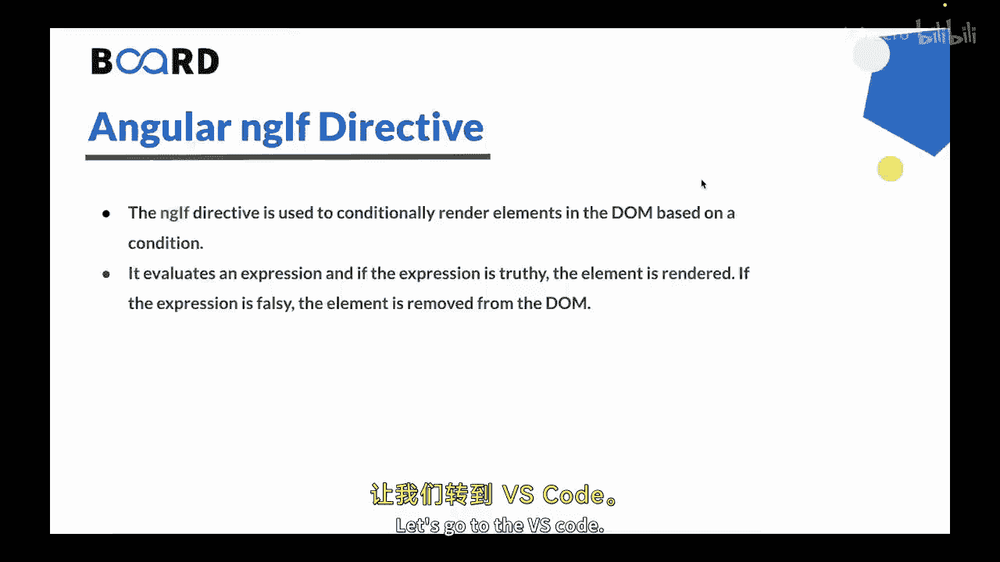
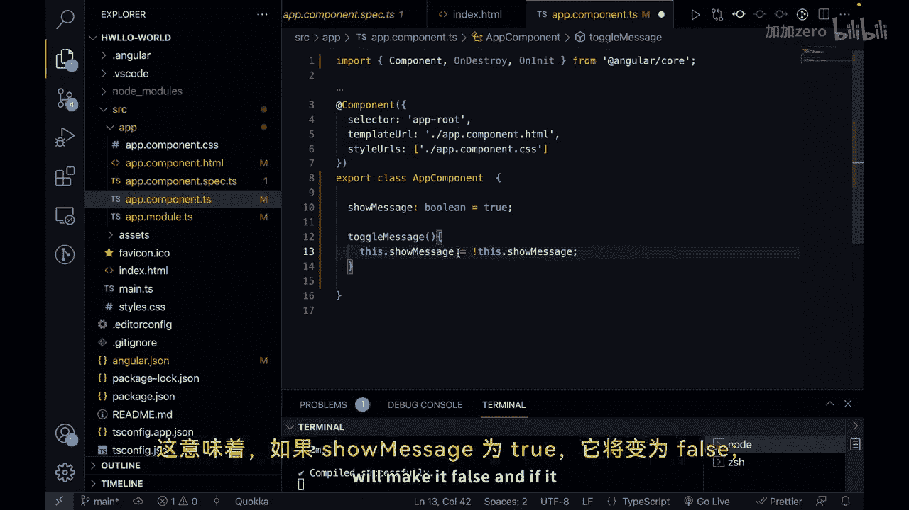
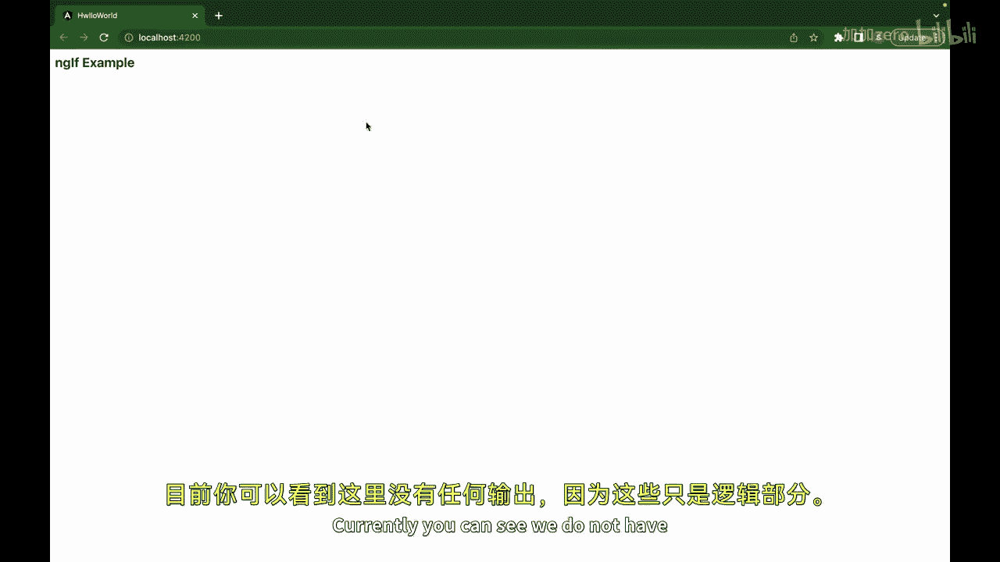
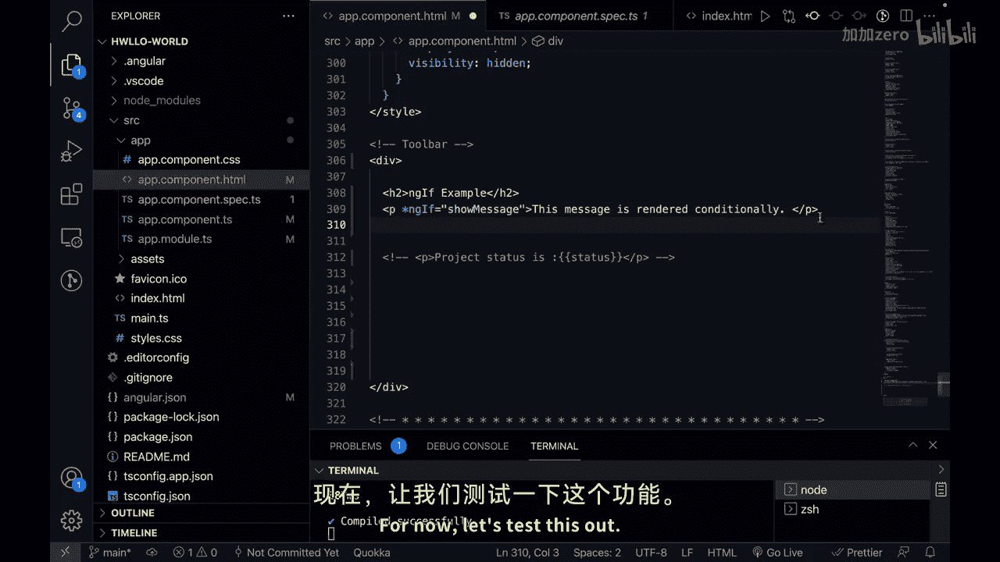
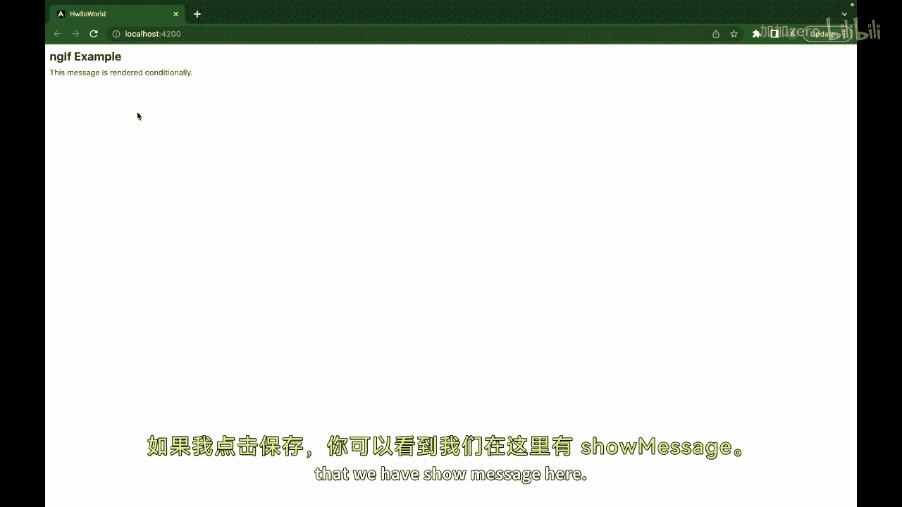
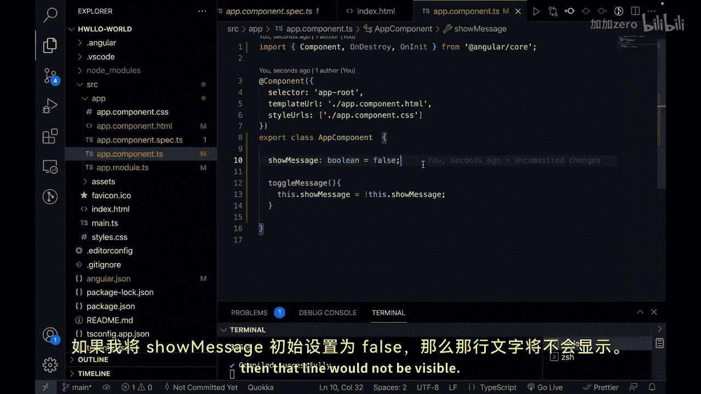
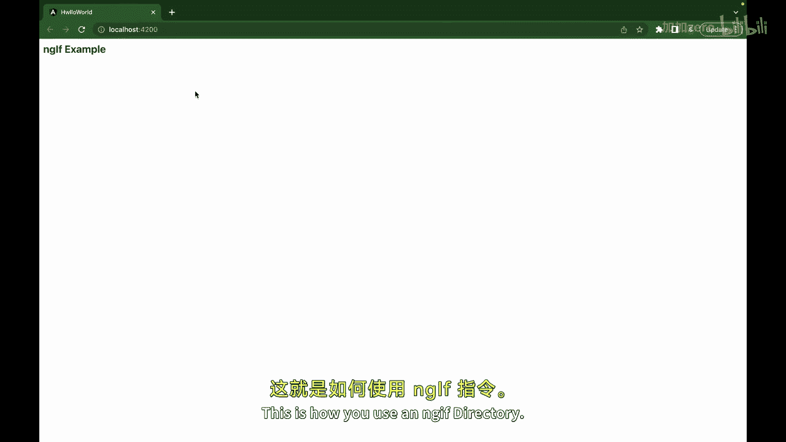
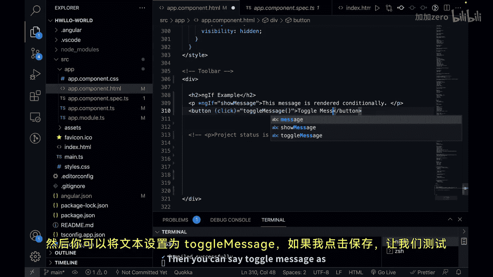
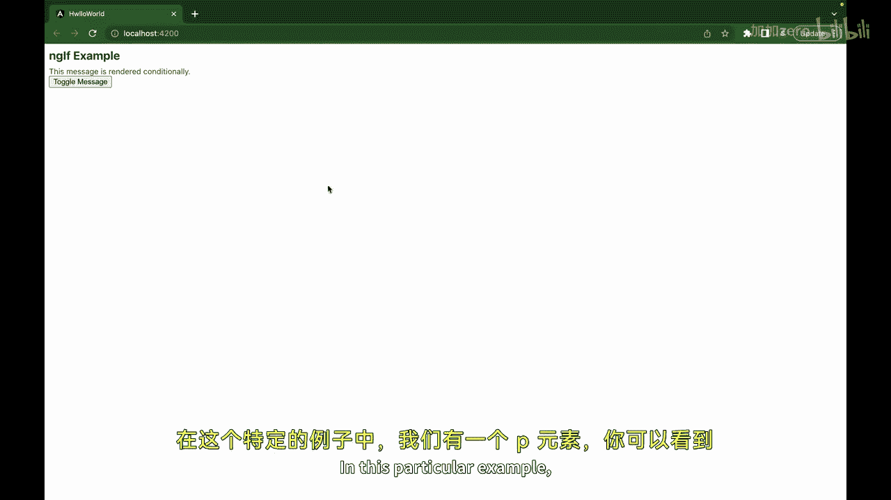
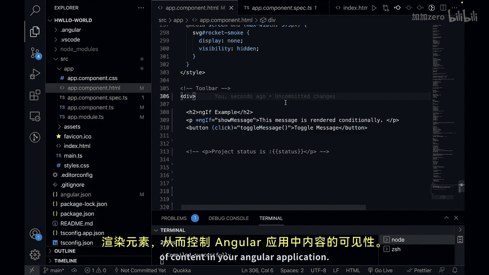

# 158：条件渲染指令 *ngIf 🎬

在本节课中，我们将要学习 Angular 中的一个核心结构指令：`*ngIf`。我们将了解它的作用、语法，并通过一个简单的例子来演示如何使用它动态控制页面元素的显示与隐藏。

---

## 概述



上一节我们介绍了 Angular 的结构指令。本节中，我们来看看 `*ngIf` 指令。`*ngIf` 用于根据特定条件，有条件地在 DOM 中渲染或移除元素。

## *ngIf 指令详解

`*ngIf` 指令会计算一个表达式。如果表达式的值为 **真值**，则对应的元素会被渲染到 DOM 中；如果表达式的值为 **假值**，则该元素会从 DOM 中被移除。

其核心逻辑可以用以下伪代码描述：
```typescript
if (condition) {
    // 渲染元素
} else {
    // 从DOM中移除元素
}
```



接下来，我们通过一个实例来理解它的用法。



## 实战：创建条件渲染示例

首先，我们需要在组件类中定义控制变量和方法。

### 1. 定义组件逻辑

打开 `app.component.ts` 文件，进行如下设置：
1.  创建一个布尔类型的变量 `showMessage`，并初始化为 `true`。
2.  创建一个方法 `toggleMessage()`，用于切换 `showMessage` 的值。

具体代码如下：
```typescript
export class AppComponent {
  showMessage: boolean = true;

  toggleMessage() {
    this.showMessage = !this.showMessage;
  }
}
```







### 2. 编写组件模板



接下来，在 `app.component.html` 模板文件中使用 `*ngIf` 指令。

以下是模板内容：
```html
<h2>*ngIf 指令示例</h2>

<!-- 使用 *ngIf 根据 showMessage 的值决定是否渲染此段落 -->
<p *ngIf="showMessage">
  这段信息会根据条件渲染。
</p>



<!-- 点击按钮触发 toggleMessage 方法 -->
<button (click)="toggleMessage()">切换信息显示</button>
```



## 示例运行原理

在这个例子中：
*   **`<p>` 元素**：其显示与否由 `*ngIf="showMessage"` 控制。初始时 `showMessage` 为 `true`，因此段落会显示。
*   **按钮**：绑定了 `(click)` 事件到 `toggleMessage()` 方法。点击按钮会调用该方法，将 `showMessage` 的值在 `true` 和 `false` 之间切换。
*   **动态效果**：每次点击按钮，`showMessage` 的值改变，`*ngIf` 指令会重新评估条件，从而立即显示或隐藏段落内容。

通过这种方式，`*ngIf` 指令让你能够基于动态条件来控制内容的可见性，为 Angular 应用提供了强大的视图控制能力。

---

## 总结



本节课我们一起学习了 `*ngIf` 指令。我们了解到它是一个用于条件渲染的结构指令，能够根据表达式的结果动态地向 DOM 中添加或移除元素。我们通过一个包含按钮切换的完整示例，实践了如何定义控制变量、编写切换逻辑，并在模板中应用 `*ngIf` 来实现交互式的显示/隐藏功能。


在下一节视频中，我们将学习另一个实用的指令：`*ngStyle` 指令。敬请期待，我们下节课再见！