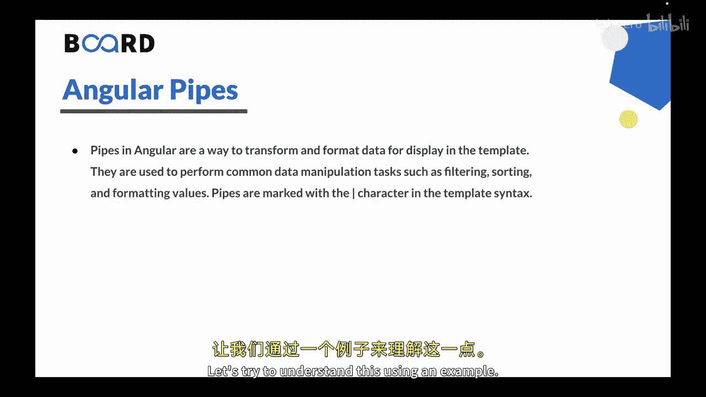
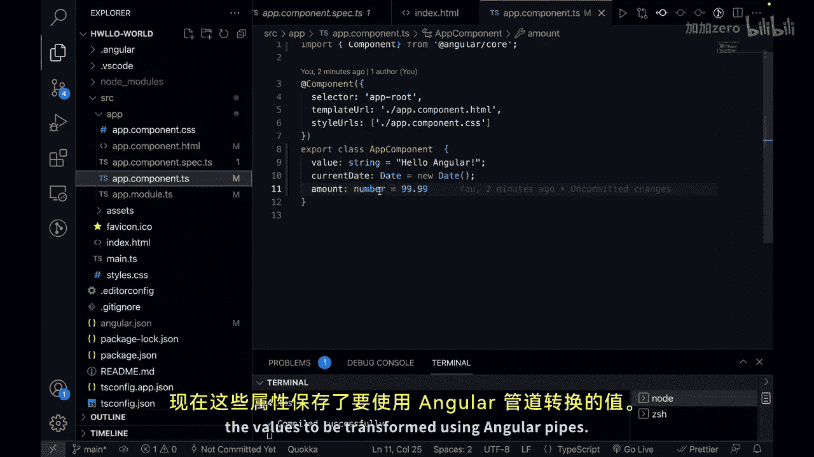
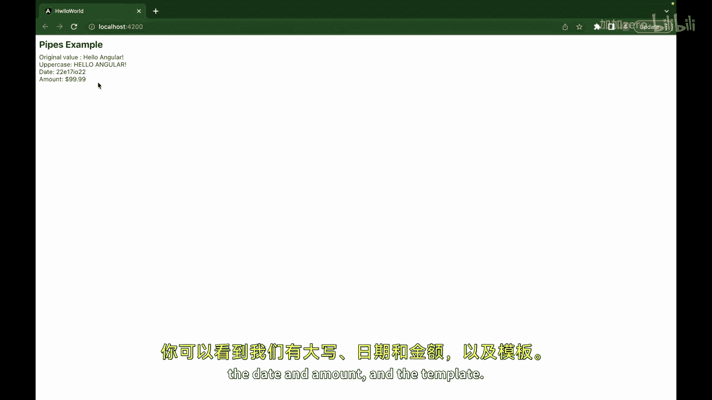
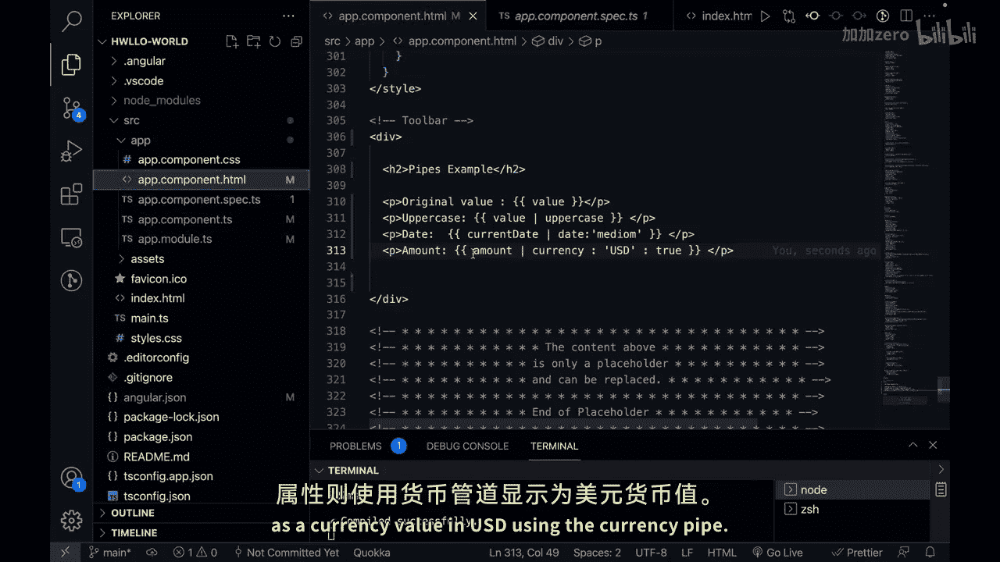

# 161：Angular管道（Pipes）🚀

在本节课中，我们将学习Angular中的管道（Pipes）。管道是Angular中用于在模板中转换和格式化数据的一种方式，常用于执行过滤、排序和格式化值等常见的数据处理任务。

## 概述



Angular管道通过在模板语法中使用 `|` 字符来标记，能够轻松地将原始数据转换为更友好的显示格式。接下来，我们将通过一个具体的例子来理解管道的使用方法。

## 创建示例项目

首先，我们进入一个基础的Angular项目。当前位于 `app.component.ts` 文件中。我们将在这个组件中创建几个变量。

```typescript
// app.component.ts
export class AppComponent {
  value = 'hello Angular';
  currentDate = new Date();
  amount = 99.99;
}
```

在上面的代码中，我们创建了三个属性：
- `value`：一个字符串。
- `currentDate`：一个日期对象。
- `amount`：一个数字。

## 在模板中使用管道

接下来，我们需要修改对应的HTML模板文件 `app.component.html`，以展示这些数据并应用管道进行转换。

```html
<!-- app.component.html -->
<p>原始值：{{ value }}</p>
<p>大写转换：{{ value | uppercase }}</p>
<p>日期格式化：{{ currentDate | date:'medium' }}</p>
<p>货币格式化：{{ amount | currency:'USD':true }}</p>
```

在上面的模板中：
- 第一行展示了原始的 `value` 值。
- 第二行使用 `uppercase` 管道将 `value` 转换为大写。
- 第三行使用 `date` 管道，并指定 `'medium'` 格式来格式化 `currentDate`。
- 第四行使用 `currency` 管道，将 `amount` 格式化为美元货币格式，并显示货币符号。

## 查看运行结果



保存更改后，我们可以在浏览器中看到以下输出结果：



- **原始值**：hello Angular
- **大写转换**：HELLO ANGULAR
- **日期格式化**：（显示为中等格式的日期，例如：Jun 15, 2023, 10:30:00 AM）
- **货币格式化**：$99.99

通过这个例子，我们可以看到：
- `value` 属性通过 `uppercase` 管道被转换成了大写。
- `currentDate` 属性通过 `date` 管道以中等格式显示。
- `amount` 属性通过 `currency` 管道以美元货币形式显示。



## 总结

本节课我们一起学习了Angular管道的基本概念和使用方法。管道是Angular中一个强大的工具，能够帮助我们在模板中轻松地转换和格式化数据，提升用户体验。在下一节课中，我们将学习Angular表单的相关知识。


感谢学习，我们下节课再见！