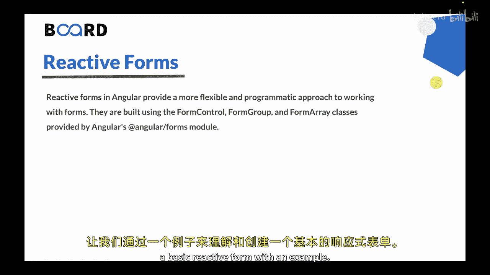
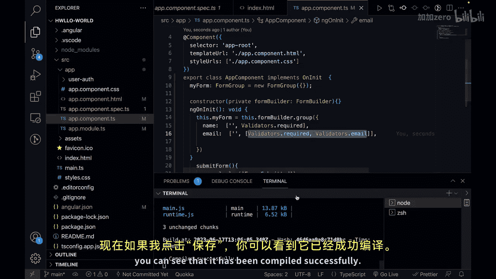
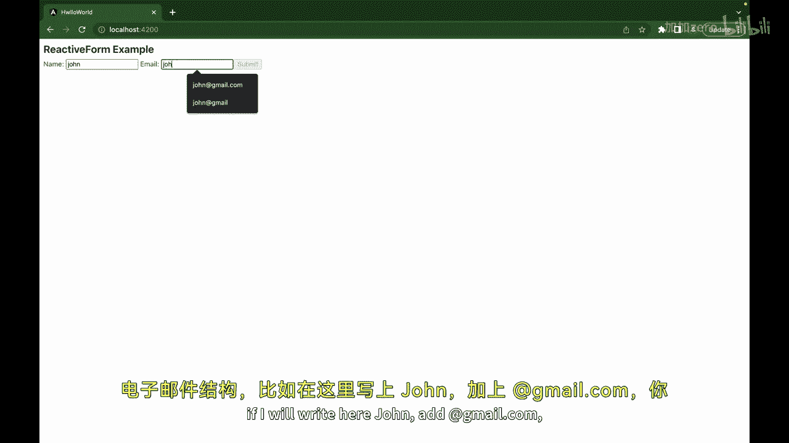
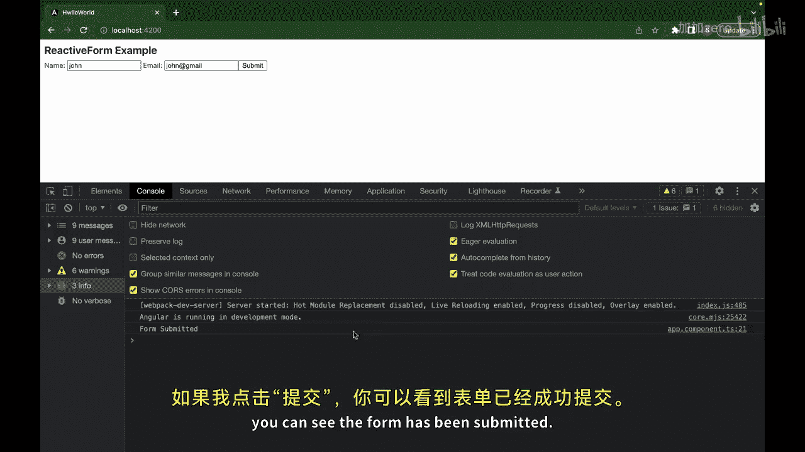
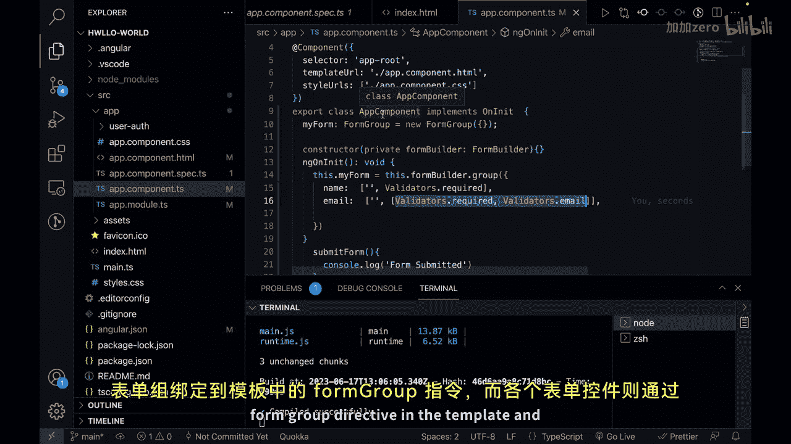

# 164：Angular响应式表单 🚀

在本节课中，我们将要学习Angular中的响应式表单。上一节我们介绍了模板驱动表单，本节中我们来看看响应式表单，它提供了一种更灵活、更程序化的方式来构建和管理表单。

## 概述



响应式表单使用Angular Forms模块提供的 `FormControl`、`FormGroup` 和 `FormArray` 类来构建。它们特别适合处理复杂的表单场景，例如动态控件、条件验证或自定义验证规则。

## 创建基本响应式表单

让我们通过一个例子来理解和创建一个基本的响应式表单。

首先，我们需要在项目中设置好基础环境。以下是创建表单的步骤：

### 1. 模板设置

在组件的HTML模板中，我们构建一个表单结构。表单使用 `[formGroup]` 指令绑定到组件中的一个 `FormGroup` 实例，并使用 `(ngSubmit)` 事件绑定提交方法。

```html
<form [formGroup]="myForm" (ngSubmit)="submitForm()">
  <label for="name">Name</label>
  <input type="text" id="name" formControlName="name" required>

  <label for="email">Email</label>
  <input type="email" id="email" formControlName="email" required>

  <button type="submit" [disabled]="!myForm.valid">Submit</button>
</form>
```

### 2. 组件逻辑设置

在组件的TypeScript文件中，我们需要导入必要的模块，并在 `ngOnInit` 生命周期钩子中初始化表单。

首先，在 `AppModule` 中导入 `ReactiveFormsModule`：

```typescript
import { ReactiveFormsModule } from '@angular/forms';

@NgModule({
  imports: [
    ReactiveFormsModule
  ]
})
export class AppModule { }
```

接着，在组件类中创建表单：

```typescript
import { Component, OnInit } from '@angular/core';
import { FormBuilder, FormGroup, Validators } from '@angular/forms';

@Component({
  selector: 'app-root',
  templateUrl: './app.component.html',
  styleUrls: ['./app.component.css']
})
export class AppComponent implements OnInit {
  myForm: FormGroup;

  constructor(private formBuilder: FormBuilder) {}

  ngOnInit() {
    this.myForm = this.formBuilder.group({
      name: ['', Validators.required],
      email: ['', [Validators.required, Validators.email]]
    });
  }

  submitForm() {
    console.log('Form submitted');
    // 这里可以添加表单提交的逻辑，例如发送数据到服务器
  }
}
```

### 3. 表单验证与提交



在模板中，提交按钮通过 `[disabled]="!myForm.valid"` 绑定到表单的有效性状态。只有当表单所有控件都通过验证时，按钮才会启用。

当用户点击提交按钮时，会触发 `submitForm()` 方法，执行表单提交逻辑。

## 核心概念解析





以下是响应式表单中的几个核心概念：

*   **`FormControl`**：代表表单中的一个单独输入控件，用于跟踪其值、验证状态和用户交互。
*   **`FormGroup`**：代表一组 `FormControl` 实例的集合，用于管理多个相关控件的值和状态。
*   **`FormBuilder`**：一个服务，用于简化 `FormGroup` 和 `FormControl` 的创建过程。
*   **`Validators`**：提供了一系列内置的验证器函数，如 `required`、`email` 等，用于验证表单控件的输入。



## 总结

本节课中我们一起学习了Angular的响应式表单。我们了解了如何通过 `FormBuilder` 服务创建 `FormGroup` 和 `FormControl`，如何在模板中绑定表单和控件，以及如何实现表单验证和提交。


响应式表单通过其程序化的方式，为处理复杂表单逻辑提供了强大的控制和灵活性。掌握响应式表单是构建现代Angular应用的重要一步。